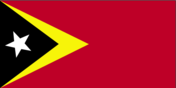
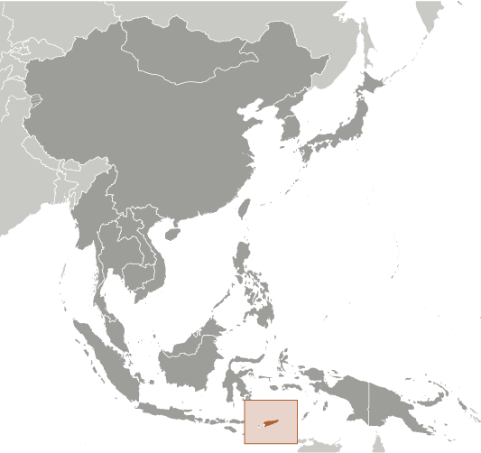
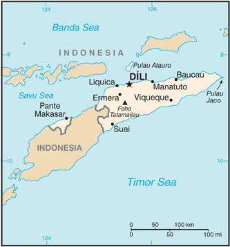

# Timor-Leste

## Introduction

**_Background:_**   
The Portuguese began to trade with the island of Timor in the early 16th century and colonized it in mid-century. Skirmishing with the Dutch in the region eventually resulted in an 1859 treaty in which Portugal ceded the western portion of the island. Imperial Japan occupied Portuguese Timor from 1942 to 1945, but Portugal resumed colonial authority after the Japanese defeat in World War II. East Timor declared itself independent from Portugal on 28 November 1975 and was invaded and occupied by Indonesian forces nine days later. It was incorporated into Indonesia in July 1976 as the province of Timor Timur (East Timor). An unsuccessful campaign of pacification followed over the next two decades, during which an estimated 100,000 to 250,000 individuals lost their lives. On 30 August 1999, in a UN-supervised popular referendum, an overwhelming majority of the people of Timor-Leste voted for independence from Indonesia. However, in the next three weeks, anti-independence Timorese militias - organized and supported by the Indonesian military - commenced a large-scale, scorched-earth campaign of retribution. The militias killed approximately 1,400 Timorese and forcibly pushed 300,000 people into western Timor as refugees. Most of the country's infrastructure, including homes, irrigation systems, water supply systems, and schools, and nearly 100% of the country's electrical grid were destroyed. On 20 September 1999, Australian-led peacekeeping troops deployed to the country and brought the violence to an end. On 20 May 2002, Timor-Leste was internationally recognized as an independent state. In 2006, internal tensions threatened the new nation's security when a military strike led to violence and a breakdown of law and order. At Dili's request, an Australian-led International Stabilization Force (ISF) deployed to Timor-Leste, and the UN Security Council established the UN Integrated Mission in Timor-Leste (UNMIT), which included an authorized police presence of over 1,600 personnel. The ISF and UNMIT restored stability, allowing for presidential and parliamentary elections in 2007 in a largely peaceful atmosphere. In February 2008, a rebel group staged an unsuccessful attack against the president and prime minister. The ringleader was killed in the attack, and most of the rebels surrendered in April 2008. Since the attack, the government has enjoyed one of its longest periods of post-independence stability, including successful 2012 elections for both the parliament and president. In late 2012, the UN Security Council voted to end its peacekeeping mission in Timor-Leste and both the ISF and UNMIT departed the country by the end of the year.

## Geography

**_Location:_**   
Southeastern Asia, northwest of Australia in the Lesser Sunda Islands at the eastern end of the Indonesian archipelago; note - Timor-Leste includes the eastern half of the island of Timor, the Oecussi (Ambeno) region on the northwest portion of the island of Timor, and the islands of Pulau Atauro and Pulau Jaco

**_Geographic coordinates:_**   
8 50 S, 125 55 E

**_Map references:_**   
Southeast Asia

**_Area:_**   
**total:** 14,874 sq km   
**land:** 14,874 sq km   
**water:** 0 sq km

**_Area - comparative:_**   
slightly larger than Connecticut

**_Land boundaries:_**   
**total:** 228 km   
**border countries:** Indonesia 228 km

**_Coastline:_**   
706 km

**_Maritime claims:_**   
**territorial sea:** 12 nm   
**contiguous zone:** 24 nm   
**exclusive fishing zone:** 200 nm

**_Climate:_**   
tropical; hot, humid; distinct rainy and dry seasons

**_Terrain:_**   
mountainous

**_Elevation extremes:_**   
**lowest point:** Timor Sea, Savu Sea, and Banda Sea 0 m   
**highest point:** Foho Tatamailau 2,963 m

**_Natural resources:_**   
gold, petroleum, natural gas, manganese, marble

**_Land use:_**   
**arable land:** 10.09%   
**permanent crops:** 4.03%   
**other:** 85.88% (2011)

**_Irrigated land:_**   
346.5 sq km (2003)

**_Natural hazards:_**   
floods and landslides are common; earthquakes; tsunamis; tropical cyclones

**_Environment - current issues:_**   
widespread use of slash and burn agriculture has led to deforestation and soil erosion

**_Environment - international agreements:_**   
**party to:** Biodiversity, Climate Change, Climate Change-Kyoto Protocol, Desertification   
**signed, but not ratified:** none of the selected agreements

**_Geography - note:_**   
Timor comes from the Malay word for "East"; the island of Timor is part of the Malay Archipelago and is the largest and easternmost of the Lesser Sunda Islands

## People and Society

**_Nationality:_**   
**noun:** Timorese   
**adjective:** Timorese

**_Ethnic groups:_**   
Austronesian (Malayo-Polynesian), Papuan, small Chinese minority

**_Languages:_**   
Tetum (official), Portuguese (official), Indonesian, English   
**note:** there are about 16 indigenous languages; Tetum, Galole, Mambae, and Kemak are spoken by a significant portion of the population

**_Religions:_**   
Roman Catholic 96.9%, Protestant / Evangelical 2.2%, Muslim 0.3%, other 0.6% (2005)

**_Population:_**   
1,201,542   
**note:** other estimates range as low as 800,000 (July 2014 est.)

**_Age structure:_**   
**0-14 years:** 42.4% (male 261,794/female 247,486)   
**15-24 years:** 19.8% (male 120,256/female 117,268)   
**25-54 years:** 29.3% (male 170,179/female 182,278)   
**55-64 years:** 4.8% (male 29,867/female 28,156)   
**65 years and over:** 3.6% (male 21,214/female 23,044) (2014 est.)

**_Dependency ratios:_**   
**total dependency ratio:** 94.3 %   
**youth dependency ratio:** 87.8 %   
**elderly dependency ratio:** 6.5 %   
**potential support ratio:** 15.4 (2014 est.)

**_Median age:_**   
**total:** 18.5 years   
**male:** 17.9 years   
**female:** 19.1 years (2014 est.)

**_Population growth rate:_**   
2.44% (2014 est.)

**_Birth rate:_**   
34.48 births/1,000 population (2014 est.)

**_Death rate:_**   
6.18 deaths/1,000 population (2014 est.)

**_Net migration rate:_**   
-3.87 migrant(s)/1,000 population (2014 est.)

**_Urbanization:_**   
**urban population:** 28.3% of total population (2011)   
**rate of urbanization:** 4.25% annual rate of change (2010-15 est.)

**_Major urban areas - population:_**   
DILI (capital) 180,000 (2011)

**_Sex ratio:_**   
**at birth:** 1.07 male(s)/female   
**0-14 years:** 1.06 male(s)/female   
**15-24 years:** 1.03 male(s)/female   
**25-54 years:** 0.93 male(s)/female   
**55-64 years:** 1.01 male(s)/female   
**65 years and over:** 0.96 male(s)/female   
**total population:** 1.01 male(s)/female (2014 est.)

**_Mother's mean age at first birth:_**   
22.1   
**note:** median age at first birth among women 25-29 (2009-10 est.)

**_Maternal mortality rate:_**   
300 deaths/100,000 live births (2010)

**_Infant mortality rate:_**   
**total:** 38.79 deaths/1,000 live births   
**male:** 41.84 deaths/1,000 live births   
**female:** 35.54 deaths/1,000 live births (2014 est.)

**_Life expectancy at birth:_**   
**total population:** 67.39 years   
**male:** 65.87 years   
**female:** 69.01 years (2014 est.)

**_Total fertility rate:_**   
5.11 children born/woman (2014 est.)

**_Contraceptive prevalence rate:_**   
22.3% (2009/10)

**_Health expenditures:_**   
5.1% of GDP (2011)

**_Physicians density:_**   
0.1 physicians/1,000 population (2004)

**_Hospital bed density:_**   
5.9 beds/1,000 population (2010)

**_Drinking water source:_**   
**improved:** urban: 95.2% of population; rural: 60.5% of population; total: 70.5% of population   
**unimproved:** urban: 4.8% of population; rural: 39.5% of population; total: 29.5% of population (2012 est.)

**_Sanitation facility access:_**   
**improved:** urban: 69% of population; rural: 26.8% of population; total: 38.9% of population   
**unimproved:** urban: 31% of population; rural: 73.2% of population; total: 61.1% of population (2012 est.)

**_HIV/AIDS - adult prevalence rate:_**   
NA

**_HIV/AIDS - people living with HIV/AIDS:_**   
NA

**_HIV/AIDS - deaths:_**   
NA

**_Major infectious diseases:_**   
**degree of risk:** very high   
**food or waterborne diseases:** bacterial diarrhea, hepatitis A, and typhoid fever   
**vectorborne diseases:** dengue fever and malaria (2013)

**_Obesity - adult prevalence rate:_**   
2.7% (2008)

**_Children under the age of 5 years underweight:_**   
45.3% (2010)

**_Education expenditures:_**   
9.4% of GDP (2011)

**_Literacy:_**   
**definition:** age 15 and over can read and write   
**total population:** 58.3%   
**male:** 63.6%   
**female:** 53% (2010 est.)

**_School life expectancy (primary to tertiary education):_**   
**total:** 12 years   
**male:** 12 years   
**female:** 11 years (2010)

**_Child labor - children ages 5-14:_**   
**total number:** 10,510   
**percentage:** 4 % (2002 est.)

**_Unemployment, youth ages 15-24:_**   
**total:** 14.8%   
**male:** 10.4%   
**female:** 22.7% (2010)

## Government

**_Country name:_**   
**conventional long form:** Democratic Republic of Timor-Leste   
**conventional short form:** Timor-Leste   
**note:** pronounced TEE-mor LESS-tay   
**local long form:** Republika Demokratika Timor Lorosa'e [Tetum]; Republica Democratica de Timor-Leste [Portuguese]   
**local short form:** Timor Lorosa'e [Tetum]; Timor-Leste [Portuguese]   
**former:** East Timor, Portuguese Timor

**_Government type:_**   
republic

**_Capital:_**   
**name:** Dili   
**geographic coordinates:** 8 35 S, 125 36 E   
**time difference:** UTC+9 (14 hours ahead of Washington, DC, during Standard Time)

**_Administrative divisions:_**   
13 administrative districts; Aileu, Ainaro, Baucau, Bobonaro (Maliana), Cova-Lima (Suai), Dili, Ermera (Gleno), Lautem (Los Palos), Liquica, Manatuto, Manufahi (Same), Oecussi (Ambeno), Viqueque   
**note:** administrative divisions have the same names as their administrative centers (exceptions have the administrative center name following in parentheses)

**_Independence:_**   
28 November 1975 (independence proclaimed from Portugal); note - 20 May 2002 is the official date of international recognition of Timor-Leste's independence

**_National holiday:_**   
Proclamation of Independence Day, 28 November (1975)

**_Constitution:_**   
drafted 2001, approved 22 March 2002, entered into force 20 May 2002 (2013)

**_Legal system:_**   
civil law system based on the Portuguese model; note - penal and civil law codes to replace the Indonesian codes were passed by Parliament and promulgated in 2009 and 2011, respectively

**_International law organization participation:_**   
has not submitted an ICJ jurisdiction declaration; accepts ICCt jurisdiction

**_Suffrage:_**   
17 years of age; universal

**_Executive branch:_**   
**chief of state:** President Taur Matan RUAK (Jose Maria de VASCONCELOS) (since 20 May 2012); note - the president plays a largely symbolic role but is the commander in chief of the military and is able to veto legislation, dissolve parliament, and call national elections   
**head of government:** Prime Minister Kay Rala Xanana GUSMAO (since 8 August 2007); note - he formerly used the name Jose Alexandre GUSMAO; Vice Prime Minister Fernando "Lasama" de ARAUJO (since 8 August 2012)   
**cabinet:** Council of Ministers   
**elections:** the president is elected by popular vote for a five-year term (eligible for a second term); last election was held on 17 March 2012 with a run-off on 16 April 2012; following parliamentary elections, the president appoints the leader of the majority party or majority coalition as the prime minister   
**election results:** Taur Matan RUAK elected president; percent of second-round vote - Taur Matan RUAK 61.2%, Francisco GUTTERES 38.8%

**_Legislative branch:_**   
unicameral National Parliament (the number of seats can vary from 52 to 65; members are elected by popular vote to serve five-year terms in a modified proportional representation system)   
**elections:** elections were held on 7 July 2012 (next to be held in July 2017)   
**election results:** percent of vote by party - CNRT 36%, FRETILIN 30%, PD 10%, Frenti-Mudanca 3%, others 21%; seats by party - CNRT 30, FRETILIN 25, PD 8, Frenti-Mudanca 2

**_Judicial branch:_**   
**highest court(s):** Supreme Court of Justice (consists of the court president and NA judges)   
**judge selection and term of office:** Supreme Court president appointed by the president of the republic from among the other court judges to serve a 4-year term; other Supreme Court judges appointed - 1 by the Parliament, and the others by the Supreme Council for the Judiciary, a body presided by the Supreme Court president and includes mostly presidential and parliamentary appointees; other Supreme Court judge tenure NA   
**subordinate courts:** Court of Appeal; district courts; magistrates' courts; note - the UN Justice System Programme, launched in 2003 and in 2008, is helping strengthen the country's justice system

**_Political parties and leaders:_**   
Democratic Party or PD [Fernando "Lasama" de ARAUJO]   
Frenti-Mudanca [Jose Luis GUTERRES]   
National Congress for Timorese Reconstruction or CNRT [Kay Rala Xanana GUSMAO]   
Revolutionary Front of Independent Timor-Leste or FRETILIN [Mari ALKATIRI]   
(only parties in Parliament are listed)

**_Political pressure groups and leaders:_**   
NA

**_International organization participation:_**   
ACP, ADB, AOSIS, ARF, ASEAN (observer), CPLP, EITI (compliant country), FAO, G-77, IBRD, ICAO, ICRM, IDA, IFAD, IFC, IFRCS, ILO, IMF, IMO, Interpol, IOC, IOM, IPU, ITU, MIGA, NAM, OPCW, PIF (observer), UN, UNCTAD, UNESCO, UNIDO, Union Latina, UNMISS, UNWTO, UPU, WCO, WHO, WMO

**_Diplomatic representation in the US:_**   
**chief of mission:** Ambassador Domingos Sarmento ALVES (since 21 May 2014)   
**chancery:** 4201 Connecticut Avenue NW, Suite 504,Washington, DC 20008   
**telephone:** [1] (202) 966-3202   
**FAX:** [1] (202) 966-3205

**_Diplomatic representation from the US:_**   
**chief of mission:** Ambassador (vacant); Charge d'Affaires Scott TICKNOR   
**embassy:** Avenida de Portugal, Praia dos Coqueiros, Dili   
**mailing address:** US Department of State, 8250 Dili Place, Washington, DC 20521-8250   
**telephone:** (670) 332-4684   
**FAX:** (670) 331-3206

**_Flag description:_**   
red, with a black isosceles triangle (based on the hoist side) superimposed on a slightly longer yellow arrowhead that extends to the center of the flag; a white star - pointing to the upper hoist-side corner of the flag - is in the center of the black triangle; yellow denotes the colonialism in Timor-Leste's past; black represents the obscurantism that needs to be overcome; red stands for the national liberation struggle; the white star symbolizes peace and serves as a guiding light

**_National anthem:_**   
**name:** "Patria" (Fatherland)   
**lyrics/music:** Fransisco Borja DA COSTA/Afonso DE ARAUJO   
**note:** adopted 2002; the song was first used as an anthem when Timor-Leste declared its independence from Portugal in 1975; the lyricist, Fransisco Borja DA COSTA, was killed in the Indonesian invasion just days after independence was declared

## Economy

**_Economy - overview:_**   
Since its 1999 independence, Timor-Leste has faced great challenges in rebuilding its infrastructure, strengthening the civil administration, and generating jobs for young people entering the work force. The development of oil and gas resources in offshore waters has greatly supplemented government revenues. This technology-intensive industry, however, has done little to create jobs for the unemployed in part because there are no production facilities in Timor-Leste. Gas is piped to Australia. In June 2005, the National Parliament unanimously approved the creation of a Petroleum Fund to serve as a repository for all petroleum revenues and to preserve the value of Timor-Leste's petroleum wealth for future generations. The Fund held assets of US$9.3 billion as of December 2011. The economy continues to recover from the mid-2006 outbreak of violence and civil unrest, which disrupted both private and public sector economic activity. Government spending increased markedly from 2009 through 2012, primarily on basic infrastructure, including electricity and roads. Limited experience in procurement and infrastructure building has hampered these projects. The underlying economic policy challenge the country faces remains how best to use oil-and-gas wealth to lift the non-oil economy onto a higher growth path and to reduce poverty. On the strength of its oil-wealth, the economy has achieved real growth between 8-12% per year for the last several years, among the highest sustained growth rates in the world.

**_GDP (purchasing power parity):_**   
$25.41 billion (2013 est.)   
$23.51 billion (2012 est.)   
$21.72 billion (2011 est.)   
**note:** data are in 2013 US dollars

**_GDP (official exchange rate):_**   
$6.129 billion   
**note:** non-oil GDP (2013 est.)

**_GDP - real growth rate:_**   
8.1% (2013 est.)   
8.3% (2012 est.)   
12% (2011 est.)

**_GDP - per capita (PPP):_**   
$21,400 (2013 est.)   
$20,400 (2012 est.)   
$19,400 (2011 est.)   
**note:** data are in 2013 US dollars

**_GDP - composition, by end use:_**   
**household consumption:** 16.7%   
**government consumption:** 22.3%   
**investment in fixed capital:** 16.5%   
**investment in inventories:** 0%   
**exports of goods and services:** 74%   
**imports of goods and services:** -29.5%; (2013 est.)

**_GDP - composition, by sector of origin:_**   
**agriculture:** 2.6%   
**industry:** 81.6%   
**services:** 15.8% (2013 est.)

**_Agriculture - products:_**   
coffee, rice, corn, cassava (manioc, tapioca), sweet potatoes, soybeans, cabbage, mangoes, bananas, vanilla

**_Industries:_**   
printing, soap manufacturing, handicrafts, woven cloth

**_Industrial production growth rate:_**   
6.2% (2013 est.)

**_Labor force:_**   
418,200 (2009)

**_Labor force - by occupation:_**   
**agriculture:** 64%   
**industry:** 10%   
**services:** 26% (2010)

**_Unemployment rate:_**   
18.4% (2010 est.)   
20% (2006 est.)

**_Population below poverty line:_**   
41% (2009 est.)

**_Household income or consumption by percentage share:_**   
**lowest 10%:** 4%   
**highest 10%:** 27% (2007)

**_Distribution of family income - Gini index:_**   
31.9 (2007 est.)   
38 (2002 est.)

**_Budget:_**   
**revenues:** $1.6 billion   
**expenditures:** $1.7 billion (2013 est.)

**_Taxes and other revenues:_**   
26.1% of GDP (2013 est.)

**_Budget surplus (+) or deficit (-):_**   
-1.6% of GDP (2013 est.)

**_Fiscal year:_**   
calendar year

**_Inflation rate (consumer prices):_**   
4.5% (2013 est.)   
11.8% (2012 est.)

**_Commercial bank prime lending rate:_**   
12.3% (31 December 2013 est.)   
12.21% (31 December 2012 est.)

**_Stock of narrow money:_**   
$203.2 million (31 December 2013 est.)   
$205.8 million (31 December 2012 est.)

**_Stock of broad money:_**   
$433.4 million (31 December 2013 est.)   
$407 million (31 December 2012 est.)

**_Stock of domestic credit:_**   
$-300 million (31 December 2013 est.)   
$-681 million (31 December 2012 est.)

**_Market value of publicly traded shares:_**   
$NA

**_Current account balance:_**   
$2.375 billion (2011 est.)   
$1.161 billion (2007 est.)

**_Exports:_**   
$34.1 million (2011 est.)   
$17.8 million (2010 est.)   
**note:** excludes oil

**_Exports - commodities:_**   
oil, coffee, sandalwood, marble   
**note:** potential for vanilla exports

**_Imports:_**   
$689 million (2011 est.)   
$378 million (2010 est.)

**_Imports - commodities:_**   
food, gasoline, kerosene, machinery

**_Exchange rates:_**   
the US dollar is used

## Energy

**_Electricity - production:_**   
131.7 million kWh (2012 est.)

**_Electricity - consumption:_**   
67.59 million kWh (2012 est.)

**_Electricity - exports:_**   
0 kWh (2011 est.)

**_Electricity - imports:_**   
0 kWh (2011 est.)

**_Crude oil - production:_**   
79,490 bbl/day (2012 est.)

**_Crude oil - exports:_**   
87,000 bbl/day (2010 est.)

**_Crude oil - imports:_**   
0 bbl/day (2010 est.)

**_Crude oil - proved reserves:_**   
0 bbl (1 January 2013 est.)

**_Refined petroleum products - production:_**   
0 bbl/day (2010 est.)

**_Refined petroleum products - consumption:_**   
2,755 bbl/day (2011 est.)

**_Refined petroleum products - exports:_**   
0 bbl/day (2010 est.)

**_Refined petroleum products - imports:_**   
1,264 bbl/day (2010 est.)

**_Natural gas - production:_**   
0 cu m (2011 est.)

**_Natural gas - consumption:_**   
0 cu m (2010 est.)

**_Natural gas - exports:_**   
0 cu m (2011 est.)

**_Natural gas - imports:_**   
0 cu m (2011 est.)

**_Natural gas - proved reserves:_**   
200 billion cu m (1 January 2006 est.)

**_Carbon dioxide emissions from consumption of energy:_**   
211,100 Mt (2011 est.)

## Communications

**_Telephones - main lines in use:_**   
3,000 (2012)

**_Telephones - mobile cellular:_**   
621,000 (2012)

**_Telephone system:_**   
**general assessment:** rudimentary service in urban and some rural areas, which is expanding with the entrance of new competitors   
**domestic:** system suffered significant damage during the violence associated with independence; limited fixed-line services; mobile-cellular services have been expanding and are now available in urban and most rural areas   
**international:** country code - 670; international service is available (2012)

**_Broadcast media:_**   
1 public TV broadcast station broadcasting nationally and 1 public radio broadcaster with stations in each of the 13 administrative districts; 1 commercial TV broadcast station, 3 commercial radio stations, and roughly 20 community radio stations (2012)

**_Internet country code:_**   
.tl

**_Internet hosts:_**   
252 (2012)

**_Internet users:_**   
2,100 (2009)

## Transportation

**_Airports:_**   
6 (2013)

**_Airports - with paved runways:_**   
**total:** 2   
**2,438 to 3,047 m:** 1   
**1,524 to 2,437 m:** 1 (2013)

**_Airports - with unpaved runways:_**   
**total:** 4   
**914 to 1,523 m:** 2   
**under 914 m:** 2 (2013)

**_Heliports:_**   
8 (2013)

**_Roadways:_**   
**total:** 6,040 km   
**paved:** 2,600 km   
**unpaved:** 3,440 km (2005)

**_Merchant marine:_**   
**total:** 1   
**by type:** passenger/cargo 1 (2010)

**_Ports and terminals:_**   
**major seaport(s):** Dili

## Military

**_Military branches:_**   
Timor-Leste Defense Force (Falintil-Forcas de Defesa de Timor-L'este, Falintil (F-FDTL)): Army, Navy (Armada) (2013)

**_Military service age and obligation:_**   
18 years of age for voluntary military service; 18-month service obligation; no conscription but, as of May 2013, introduction of conscription was under discussion (2013)

**_Manpower available for military service:_**   
**males age 16-49:** 305,643   
**females age 16-49:** 293,052 (2010 est.)

**_Manpower fit for military service:_**   
**males age 16-49:** 243,120   
**females age 16-49:** 251,061 (2010 est.)

**_Manpower reaching militarily significant age annually:_**   
**male:** 12,737   
**female:** 12,389 (2010 est.)

**_Military expenditures:_**   
2.92% of GDP (2012)   
2.6% of GDP (2011)   
2.92% of GDP (2010)

## Transnational Issues

**_Disputes - international:_**   
three stretches of land borders with Timor-Leste have yet to be delimited, two of which are in the Oecussi exclave area, and no maritime or Economic Exclusion Zone boundaries have been established between the countries; maritime boundaries with Indonesia remain unresolved; in 2007, Australia and Timor-Leste signed a 50-year development zone and revenue sharing agreement in lieu of a maritime boundary

**_Illicit drugs:_**   
NA

............................................................   
_Page last updated on June 20, 2014_
