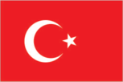
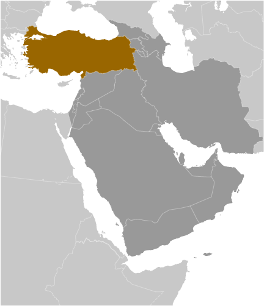
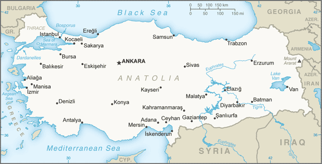

# Turkey

## Introduction

**_Background:_**   
Modern Turkey was founded in 1923 from the Anatolian remnants of the defeated Ottoman Empire by national hero Mustafa KEMAL, who was later honored with the title Ataturk or "Father of the Turks." Under his leadership, the country adopted wide-ranging social, legal, and political reforms. After a period of one-party rule, an experiment with multi-party politics led to the 1950 election victory of the opposition Democratic Party and the peaceful transfer of power. Since then, Turkish political parties have multiplied, but democracy has been fractured by periods of instability and intermittent military coups (1960, 1971, 1980), which in each case eventually resulted in a return of political power to civilians. In 1997, the military again helped engineer the ouster - popularly dubbed a "post-modern coup" - of the then Islamic-oriented government. Turkey intervened militarily on Cyprus in 1974 to prevent a Greek takeover of the island and has since acted as patron state to the "Turkish Republic of Northern Cyprus," which only Turkey recognizes. A separatist insurgency begun in 1984 by the Kurdistan Workers' Party (PKK) - now known as the Kurdistan People's Congress or Kongra-Gel (KGK) - has dominated the Turkish military's attention and claimed more than 30,000 lives. After the capture of the group's leader in 1999, the insurgents largely withdrew from Turkey mainly to northern Iraq. In 2013, KGK and the Turkish Government agreed to a ceasefire that continues despite slow progress in ongoing peace talks. Turkey joined the UN in 1945 and in 1952 it became a member of NATO. In 1964, Turkey became an associate member of the European Community. Over the past decade, it has undertaken many reforms to strengthen its democracy and economy; it began accession membership talks with the European Union in 2005.

## Geography

**_Location:_**   
Southeastern Europe and Southwestern Asia (that portion of Turkey west of the Bosporus is geographically part of Europe), bordering the Black Sea, between Bulgaria and Georgia, and bordering the Aegean Sea and the Mediterranean Sea, between Greece and Syria

**_Geographic coordinates:_**   
39 00 N, 35 00 E

**_Map references:_**   
Middle East

**_Area:_**   
**total:** 783,562 sq km   
**land:** 769,632 sq km   
**water:** 13,930 sq km

**_Area - comparative:_**   
slightly larger than Texas

**_Land boundaries:_**   
**total:** 2,656 km   
**border countries:** Armenia 268 km, Azerbaijan 17 km, Bulgaria 240 km, Georgia 252 km, Greece 206 km, Iran 499 km, Iraq 352 km, Syria 822 km

**_Coastline:_**   
7,200 km

**_Maritime claims:_**   
**territorial sea:** 6 nm in the Aegean Sea; 12 nm in Black Sea and in Mediterranean Sea   
**exclusive economic zone:** in Black Sea only: to the maritime boundary agreed upon with the former USSR

**_Climate:_**   
temperate; hot, dry summers with mild, wet winters; harsher in interior

**_Terrain:_**   
high central plateau (Anatolia); narrow coastal plain; several mountain ranges

**_Elevation extremes:_**   
**lowest point:** Mediterranean Sea 0 m   
**highest point:** Mount Ararat 5,166 m

**_Natural resources:_**   
coal, iron ore, copper, chromium, antimony, mercury, gold, barite, borate, celestite (strontium), emery, feldspar, limestone, magnesite, marble, perlite, pumice, pyrites (sulfur), clay, arable land, hydropower

**_Land use:_**   
**arable land:** 26.21%   
**permanent crops:** 3.94%   
**other:** 69.84% (2011)

**_Irrigated land:_**   
53,400 sq km (2012)

**_Total renewable water resources:_**   
211.6 cu km (2011)

**_Freshwater withdrawal (domestic/industrial/agricultural):_**   
**total:** 40.1 cu km/yr (14%/10%/76%)   
**per capita:** 572.9 cu m/yr (2008)

**_Natural hazards:_**   
severe earthquakes, especially in northern Turkey, along an arc extending from the Sea of Marmara to Lake Van   
**volcanism:** limited volcanic activity; its three historically active volcanoes; Ararat, Nemrut Dagi, and Tendurek Dagi have not erupted since the 19th century or earlier

**_Environment - current issues:_**   
water pollution from dumping of chemicals and detergents; air pollution, particularly in urban areas; deforestation; concern for oil spills from increasing Bosporus ship traffic

**_Environment - international agreements:_**   
**party to:** Air Pollution, Antarctic Treaty, Biodiversity, Climate Change, Desertification, Endangered Species, Hazardous Wastes, Ozone Layer Protection, Ship Pollution, Wetlands   
**signed, but not ratified:** Environmental Modification

**_Geography - note:_**   
strategic location controlling the Turkish Straits (Bosporus, Sea of Marmara, Dardanelles) that link Black and Aegean Seas; Mount Ararat, the legendary landing place of Noah's ark, is in the far eastern portion of the country

## People and Society

**_Nationality:_**   
**noun:** Turk(s)   
**adjective:** Turkish

**_Ethnic groups:_**   
Turkish 70-75%, Kurdish 18%, other minorities 7-12% (2008 est.)

**_Languages:_**   
Turkish (official), Kurdish, other minority languages

**_Religions:_**   
Muslim 99.8% (mostly Sunni), other 0.2% (mostly Christians and Jews)

**_Population:_**   
81,619,392 (July 2014 est.)

**_Age structure:_**   
**0-14 years:** 25.5% (male 10,660,110/female 10,179,850)   
**15-24 years:** 16.8% (male 6,989,099/female 6,709,480)   
**25-54 years:** 42.9% (male 17,650,790/female 17,358,730)   
**55-64 years:** 8.1% (male 3,289,605/female 3,291,199)   
**65 years and over:** 6.6% (male 2,517,219/female 2,973,310) (2014 est.)

**_Dependency ratios:_**   
**total dependency ratio:** 48.9 %   
**youth dependency ratio:** 37.7 %   
**elderly dependency ratio:** 11.2 %   
**potential support ratio:** 8.9 (2014 est.)

**_Median age:_**   
**total:** 29.6 years   
**male:** 29.2 years   
**female:** 30 years (2014 est.)

**_Population growth rate:_**   
1.12% (2014 est.)

**_Birth rate:_**   
16.86 births/1,000 population (2014 est.)

**_Death rate:_**   
6.12 deaths/1,000 population (2014 est.)

**_Net migration rate:_**   
0.46 migrant(s)/1,000 population (2014 est.)

**_Urbanization:_**   
**urban population:** 71.5% of total population (2011)   
**rate of urbanization:** 2.4% annual rate of change (2010-15 est.)

**_Major urban areas - population:_**   
Istanbul 11.253 million; ANKARA (capital) 4.194 million; Izmir 2.927 million; Bursa 1.713 million; Adana 1.468 million; Gaziantep 1.198 million (2011)

**_Sex ratio:_**   
**at birth:** 1.05 male(s)/female   
**0-14 years:** 1.05 male(s)/female   
**15-24 years:** 1.04 male(s)/female   
**25-54 years:** 1.02 male(s)/female   
**55-64 years:** 1.02 male(s)/female   
**65 years and over:** 0.84 male(s)/female   
**total population:** 1.02 male(s)/female (2014 est.)

**_Mother's mean age at first birth:_**   
22.3 (2010 est.)

**_Maternal mortality rate:_**   
20 deaths/100,000 live births (2010)

**_Infant mortality rate:_**   
**total:** 21.43 deaths/1,000 live births   
**male:** 22.48 deaths/1,000 live births   
**female:** 20.32 deaths/1,000 live births (2014 est.)

**_Life expectancy at birth:_**   
**total population:** 73.29 years   
**male:** 71.33 years   
**female:** 75.35 years (2014 est.)

**_Total fertility rate:_**   
2.08 children born/woman (2014 est.)

**_Contraceptive prevalence rate:_**   
73% (2008)

**_Health expenditures:_**   
6.7% of GDP (2011)

**_Physicians density:_**   
1.71 physicians/1,000 population (2011)

**_Hospital bed density:_**   
2.5 beds/1,000 population (2010)

**_Drinking water source:_**   
**improved:** urban: 100% of population; rural: 98.8% of population; total: 99.7% of population   
**unimproved:** urban: 0% of population; rural: 1.2% of population; total: 0.3% of population (2012 est.)

**_Sanitation facility access:_**   
**improved:** urban: 97.2% of population; rural: 75.5% of population; total: 91.2% of population   
**unimproved:** urban: 2.8% of population; rural: 24.5% of population; total: 8.8% of population (2012 est.)

**_HIV/AIDS - adult prevalence rate:_**   
less than 0.1%; note - no country specific models provided (2009 est.)

**_HIV/AIDS - people living with HIV/AIDS:_**   
4,600 (2009 est.)

**_HIV/AIDS - deaths:_**   
fewer than 200 (2009 est.)

**_Obesity - adult prevalence rate:_**   
27.8% (2008)

**_Children under the age of 5 years underweight:_**   
3.5% (2004)

**_Education expenditures:_**   
2.9% of GDP (2006)

**_Literacy:_**   
**definition:** age 15 and over can read and write   
**total population:** 94.1%   
**male:** 97.9%   
**female:** 90.3% (2011 est.)

**_School life expectancy (primary to tertiary education):_**   
**total:** 14 years   
**male:** 15 years   
**female:** 14 years (2011)

**_Child labor - children ages 5-14:_**   
**total number:** 321,866   
**percentage:** 3 %   
**note:** data represents children ages 6-14 (2006 est.)

**_Unemployment, youth ages 15-24:_**   
**total:** 17.5%   
**male:** 16.3%   
**female:** 19.9% (2012)

## Government

**_Country name:_**   
**conventional long form:** Republic of Turkey   
**conventional short form:** Turkey   
**local long form:** Turkiye Cumhuriyeti   
**local short form:** Turkiye

**_Government type:_**   
republican parliamentary democracy

**_Capital:_**   
**name:** Ankara   
**geographic coordinates:** 39 56 N, 32 52 E   
**time difference:** UTC+2 (7 hours ahead of Washington, DC, during Standard Time)   
**daylight saving time:** +1hr, begins last Sunday in March; ends last Sunday in October

**_Administrative divisions:_**   
81 provinces (iller, singular - ili); Adana, Adiyaman, Afyonkarahisar, Agri, Aksaray, Amasya, Ankara, Antalya, Ardahan, Artvin, Aydin, Balikesir, Bartin, Batman, Bayburt, Bilecik, Bingol, Bitlis, Bolu, Burdur, Bursa, Canakkale, Cankiri, Corum, Denizli, Diyarbakir, Duzce, Edirne, Elazig, Erzincan, Erzurum, Eskisehir, Gaziantep, Giresun, Gumushane, Hakkari, Hatay, Igdir, Isparta, Istanbul, Izmir (Smyrna), Kahramanmaras, Karabuk, Karaman, Kars, Kastamonu, Kayseri, Kilis, Kirikkale, Kirklareli, Kirsehir, Kocaeli, Konya, Kutahya, Malatya, Manisa, Mardin, Mersin, Mugla, Mus, Nevsehir, Nigde, Ordu, Osmaniye, Rize, Sakarya, Samsun, Sanliurfa, Siirt, Sinop, Sirnak, Sivas, Tekirdag, Tokat, Trabzon (Trebizond), Tunceli, Usak, Van, Yalova, Yozgat, Zonguldak

**_Independence:_**   
29 October 1923 (successor state to the Ottoman Empire)

**_National holiday:_**   
Republic Day, 29 October (1923)

**_Constitution:_**   
several previous; latest ratified 9 November 1982; amended 2001, 2007, 2010 (2010)

**_Legal system:_**   
civil law system based on various European legal systems notably the Swiss civil code

**_International law organization participation:_**   
has not submitted an ICJ jurisdiction declaration; non-party state to the ICCt

**_Suffrage:_**   
18 years of age; universal

**_Executive branch:_**   
**chief of state:** President Abdullah GUL (since 28 August 2007)   
**head of government:** Prime Minister Recep Tayyip ERDOGAN (since 14 March 2003)   
**cabinet:** Council of Ministers appointed by the president upon the nomination of the prime minister   
**elections:** president elected directly for a five-year term (eligible for a second term); prime minister appointed by the president from among members of parliament   
**election results:** Abdullah GUL elected president on the third ballot; National Assembly vote - 339   
**note:** in October 2007 Turkish voters approved a referendum package of constitutional amendments including a provision for direct presidential elections

**_Legislative branch:_**   
unicameral Grand National Assembly of Turkey or Turkiye Buyuk Millet Meclisi (550 seats; members elected by popular vote to serve four-year terms)   
**elections:** last held on 12 June 2011 (next likely to be held by June 2015)   
**election results:** percent of vote by party - AKP 49.8%, CHP 25.9%, MHP 13%, independents 6.6%, other 4.7%; seats by party - AKP 326, CHP 135, MHP 53, independents 36; note - only parties surpassing the 10% threshold are entitled to parliamentary seats

**_Judicial branch:_**   
**highest court(s):** Constitutional Court (consists of 17 members); Supreme Court of Appeals organized into 15 divisions with 38 civil and criminal chambers and consisting of 250 high judges and 440 rapporteur judges)   
**judge selection and term of office:** Constitutional Court judges appointed by the president from among candidates submitted by plenary assemblies of other courts, the Higher Education Council, senior government administrators, and lawyers; judges appointed for 12-year, non-renewable terms and with mandatory retirement at age 65; Supreme Court of Appeals judges appointed by the Supreme Council of Judges and Public Prosecutors; judge tenure NA   
**subordinate courts:** Council of State (Danistay); Court of Accounts (Sayistay); Military High Court of Appeals; Military High Administrative Court

**_Political parties and leaders:_**   
Democratic Left Party or DSP [Masum TURKER]   
Democratic Party or DP [Gultekin UYSAL]   
Felicity Party or SP [Mustafa KAMALAK] (sometimes translated as Contentment Party)   
Freedom and Solidarity Party or ODP [Alper TAS]   
Grand Unity Party or BBP [Mustafa DESTICI]   
Independent Turkey Party or BTP [Haydar BAS]   
Justice and Development Party or AKP [Recep Tayyip ERDOGAN]   
Nationalist Movement Party or MHP [Devlet BAHCELI]   
Peace and Democracy Party or BDP [Selahattin DEMIRTAS]   
People's Democracy Party or HDP [Sebahat TUNCEL]   
Republican People's Party or CHP [Kemal KILICDAROGLU]   
**note:** the parties listed above are some of the more significant of the 61 parties that Turkey had according to the Ministry of Interior statistics current as of May 2009

**_Political pressure groups and leaders:_**   
Confederation of Businessmen and Industrialists of Turkey or TUSKON [Rizanur MERAL]   
Confederation of Public Sector Unions or KESK [Lami OZGEN]   
Confederation of Revolutionary Workers Unions or DISK [Tayfun GORGUN]   
Independent Industrialists' and Businessmen's Association or MUSIAD [Omer Cihad VARDAN]   
Moral Rights Workers Union or Hak-Is [Mahmut ARSLAN]   
Turkish Confederation of Employers' Unions or TISK [Tugrul KUDATGOBILIK]   
Turkish Confederation of Labor or Turk-Is [Mustafa KUMLU]   
Turkish Confederation of Tradesmen and Craftsmen or TESK [Bendevi PALANDOKEN]   
Turkish Industrialists' and Businessmen's Association or TUSIAD [Muharrem YILMAZ]   
Turkish Union of Chambers of Commerce and Commodity Exchanges or TOBB [M. Rifat HISARCIKLIOGLU]

**_International organization participation:_**   
ADB (nonregional member), Australia Group, BIS, BSEC, CD, CE, CERN (observer), CICA, D-8, EAPC, EBRD, ECO, EU (candidate country), FAO, FATF, G-20, IAEA, IBRD, ICAO, ICC (national committees), ICRM, IDA, IDB, IEA, IFAD, IFC, IFRCS, IHO, ILO, IMF, IMO, IMSO, Interpol, IOC, IOM, IPU, ISO, ITSO, ITU, ITUC (NGOs), MIGA, NATO, NEA, NSG, OAS (observer), OECD, OIC, OPCW, OSCE, Pacific Alliance (observer), Paris Club (associate), PCA, SELEC, UN, UNCTAD, UNESCO, UNHCR, UNIDO, UNIFIL, UNRWA, UNWTO, UPU, WCO, WFTU (NGOs), WHO, WIPO, WMO, WTO, ZC

**_Diplomatic representation in the US:_**   
**chief of mission:** Ambassador Sedar KILIC (since 21 May 1014)   
**chancery:** 2525 Massachusetts Avenue NW, Washington, DC 20008   
**telephone:** [1] (202) 612-6700   
**FAX:** [1] (202) 612-6744   
**consulate(s) general:** Chicago, Houston, New York, Newton (MA)

**_Diplomatic representation from the US:_**   
**chief of mission:** Ambassador Francis J. RICCIARDONE, Jr. (since 3 January 2011)   
**embassy:** 110 Ataturk Boulevard, Kavaklidere, 06100 Ankara   
**mailing address:** PSC 93, Box 5000, APO AE 09823   
**telephone:** [90] (312) 455-5555   
**FAX:** [90] (312) 467-0019   
**consulate(s) general:** Istanbul   
**consulate(s):** Adana; note - there is a Consular Agent in Izmir

**_Flag description:_**   
red with a vertical white crescent moon (the closed portion is toward the hoist side) and white five-pointed star centered just outside the crescent opening; the flag colors and designs closely resemble those on the banner of the Ottoman Empire, which preceded modern-day Turkey; the crescent moon and star serve as insignia for the Turks, as well as being traditional symbols of Islam; according to legend, the flag represents the reflection of the moon and a star in a pool of blood of Turkish warriors

**_National symbol(s):_**   
star and crescent

**_National anthem:_**   
**name:** "Istiklal Marsi" (Independence March)   
**lyrics/music:** Mehmet Akif ERSOY/Zeki UNGOR   
**note:** lyrics adopted 1921, music adopted 1932; the anthem's original music was adopted in 1924; a new composition was agreed upon in 1932

## Economy

**_Economy - overview:_**   
Turkey's largely free-market economy is increasingly driven by its industry and service sectors, although its traditional agriculture sector still accounts for about 25% of employment. An aggressive privatization program has reduced state involvement in basic industry, banking, transport, and communication, and an emerging cadre of middle-class entrepreneurs is adding dynamism to the economy and expanding production beyond the traditional textiles and clothing sectors. The automotive, construction, and electronics industries are rising in importance and have surpassed textiles within Turkey's export mix. Oil began to flow through the Baku-Tbilisi-Ceyhan pipeline in May 2006, marking a major milestone that will bring up to 1 million barrels per day from the Caspian to market. Several gas pipelines projects also are moving forward to help transport Central Asian gas to Europe through Turkey, which over the long term will help address Turkey's dependence on imported oil and gas to meet 97% of its energy needs. After Turkey experienced a severe financial crisis in 2001, Ankara adopted financial and fiscal reforms as part of an IMF program. The reforms strengthened the country's economic fundamentals and ushered in an era of strong growth averaging more than 6% annually until 2008. Global economic conditions and tighter fiscal policy caused GDP to contract in 2009, but Turkey's well-regulated financial markets and banking system helped the country weather the global financial crisis and GDP rebounded strongly to around 9% in 2010-11, as exports returned to normal levels following the recession. Growth dropped to roughly 3-4% in 2012-13. Turkey's public sector debt to GDP ratio has fallen below 40%, and two rating agencies upgraded Turkey's debt to investment grade in 2012 and 2013. Turkey remains dependent on often volatile, short-term investment to finance its large current account deficit. The stock value of FDI reached nearly $195 billion at year-end 2013, reflecting Turkey's robust growth even in the face of economic turmoil in Europe, the source of much of Turkey's FDI. Turkey's relatively high current account deficit, domestic political uncertainty, and turmoil within Turkey's neighborhood leave the economy vulnerable to destabilizing shifts in investor confidence.

**_GDP (purchasing power parity):_**   
$1.167 trillion (2013 est.)   
$1.124 trillion (2012 est.)   
$1.101 trillion (2011 est.)   
**note:** data are in 2013 US dollars

**_GDP (official exchange rate):_**   
$821.8 billion (2013 est.)

**_GDP - real growth rate:_**   
3.8% (2013 est.)   
2.2% (2012 est.)   
8.8% (2011 est.)

**_GDP - per capita (PPP):_**   
$15,300 (2013 est.)   
$15,000 (2012 est.)   
$14,900 (2011 est.)   
**note:** data are in 2013 US dollars

**_Gross national saving:_**   
19.4% of GDP (2013 est.)   
20.2% of GDP (2012 est.)   
23.6% of GDP (2011 est.)

**_GDP - composition, by end use:_**   
**household consumption:** 71%   
**government consumption:** 15.4%   
**investment in fixed capital:** 19.4%   
**investment in inventories:** 0%   
**exports of goods and services:** 26.6%   
**imports of goods and services:** -32.5%; (2013 est.)

**_GDP - composition, by sector of origin:_**   
**agriculture:** 8.9%   
**industry:** 27.3%   
**services:** 63.8% (2013 est.)

**_Agriculture - products:_**   
tobacco, cotton, grain, olives, sugar beets, hazelnuts, pulses, citrus; livestock

**_Industries:_**   
textiles, food processing, automobiles, electronics, mining (coal, chromate, copper, boron), steel, petroleum, construction, lumber, paper

**_Industrial production growth rate:_**   
3.5% (2013 est.)

**_Labor force:_**   
27.91 million   
**note:** about 1.2 million Turks work abroad (2013 est.)

**_Labor force - by occupation:_**   
**agriculture:** 25.5%   
**industry:** 26.2%   
**services:** 48.4% (2010)

**_Unemployment rate:_**   
9.3% (2013 est.)   
9.2% (2012 est.)

**_Population below poverty line:_**   
16.9% (2010)

**_Household income or consumption by percentage share:_**   
**lowest 10%:** 2.1%   
**highest 10%:** 30.3% (2008)

**_Distribution of family income - Gini index:_**   
40.2 (2010)   
43.6 (2003)

**_Budget:_**   
**revenues:** $190.4 billion   
**expenditures:** $207.9 billion (2013 est.)

**_Taxes and other revenues:_**   
23.2% of GDP (2013 est.)

**_Budget surplus (+) or deficit (-):_**   
-2.1% of GDP (2013 est.)

**_Public debt:_**   
36.6% of GDP (2013 est.)   
37.6% of GDP (2012 est.)   
**note:** data cover central government debt, and excludes debt instruments issued (or owned) by government entities other than the treasury; the data include treasury debt held by foreign entities; the data exclude debt issued by subnational entities, as well as intra-governmental debt; intra-governmental debt consists of treasury borrowings from surpluses in the social funds, such as for retirement, medical care, and unemployment; debt instruments for the social funds are sold at public auctions

**_Fiscal year:_**   
calendar year

**_Inflation rate (consumer prices):_**   
7.6% (2013 est.)   
8.9% (2012 est.)

**_Central bank discount rate:_**   
5.25% (31 December 2011)   
15% (22 December 2009)

**_Commercial bank prime lending rate:_**   
18.5% (31 December 2013 est.)   
19% (31 December 2012 est.)

**_Stock of narrow money:_**   
$80.72 billion (31 December 2013 est.)   
$85.23 billion (31 December 2012 est.)

**_Stock of broad money:_**   
$383.5 billion (31 December 2013 est.)   
$405.6 billion (31 December 2012 est.)

**_Stock of domestic credit:_**   
$549.5 billion (31 December 2013 est.)   
$552.3 billion (31 December 2012 est.)

**_Market value of publicly traded shares:_**   
$308.8 billion (31 December 2012 est.)   
$201.8 billion (31 December 2011)   
$306.7 billion (31 December 2010 est.)

**_Current account balance:_**   
-$58.35 billion (2013 est.)   
-$47.75 billion (2012 est.)

**_Exports:_**   
$167.6 billion (2013 est.)   
$163.3 billion (2012 est.)

**_Exports - commodities:_**   
apparel, foodstuffs, textiles, metal manufactures, transport equipment

**_Exports - partners:_**   
Germany 8.6%, Iraq 7.1%, Iran 6.5%, UK 5.7%, UAE 5.4%, Russia 4.4%, Italy 4.2%, France 4.1% (2012)

**_Imports:_**   
$242.9 billion (2013 est.)   
$228.6 billion (2012 est.)

**_Imports - commodities:_**   
machinery, chemicals, semi-finished goods, fuels, transport equipment

**_Imports - partners:_**   
Russia 11.3%, Germany 9%, China 9%, US 6%, Italy 5.6%, Iran 5.1% (2012)

**_Reserves of foreign exchange and gold:_**   
$117.6 billion (31 December 2013 est.)   
$119.2 billion (31 December 2012 est.)

**_Debt - external:_**   
$359.5 billion (31 December 2013 est.)   
$336.7 billion (31 December 2012 est.)

**_Stock of direct foreign investment - at home:_**   
$194.2 billion (31 December 2013 est.)   
$181.7 billion (31 December 2012 est.)

**_Stock of direct foreign investment - abroad:_**   
$33.44 billion (31 December 2013 est.)   
$30.94 billion (31 December 2012 est.)

**_Exchange rates:_**   
Turkish liras (TRY) per US dollar -   
1.899 (2013 est.)   
1.796 (2012 est.)   
1.5028 (2010 est.)   
1.55 (2009)   
1.3179 (2008)

## Energy

**_Electricity - production:_**   
217.7 billion kWh (2011 est.)

**_Electricity - consumption:_**   
170.4 billion kWh (2010 est.)

**_Electricity - exports:_**   
1.49 billion kWh (2012 est.)

**_Electricity - imports:_**   
4.362 billion kWh (2012 est.)

**_Electricity - installed generating capacity:_**   
49.52 million kW (2010 est.)

**_Electricity - from fossil fuels:_**   
64.9% of total installed capacity (2010 est.)

**_Electricity - from nuclear fuels:_**   
0% of total installed capacity (2010 est.)

**_Electricity - from hydroelectric plants:_**   
32% of total installed capacity (2010 est.)

**_Electricity - from other renewable sources:_**   
3.1% of total installed capacity (2010 est.)

**_Crude oil - production:_**   
56,650 bbl/day (2012 est.)

**_Crude oil - exports:_**   
0 bbl/day (2010 est.)

**_Crude oil - imports:_**   
338,900 bbl/day (2010 est.)

**_Crude oil - proved reserves:_**   
270.4 million bbl (1 January 2013 est.)

**_Refined petroleum products - production:_**   
418,200 bbl/day (2010 est.)

**_Refined petroleum products - consumption:_**   
706,100 bbl/day (2011 est.)

**_Refined petroleum products - exports:_**   
107,800 bbl/day (2010 est.)

**_Refined petroleum products - imports:_**   
301,300 bbl/day (2010 est.)

**_Natural gas - production:_**   
632 million cu m (2012 est.)

**_Natural gas - consumption:_**   
38.13 billion cu m (2010 est.)

**_Natural gas - exports:_**   
600 million cu m (2012 est.)

**_Natural gas - imports:_**   
45.92 billion cu m (2012 est.)

**_Natural gas - proved reserves:_**   
6.173 billion cu m (1 January 2013 est.)

**_Carbon dioxide emissions from consumption of energy:_**   
296.3 million Mt (2011 est.)

## Communications

**_Telephones - main lines in use:_**   
13.86 million (2012)

**_Telephones - mobile cellular:_**   
67.68 million (2012)

**_Telephone system:_**   
**general assessment:** comprehensive telecommunications network undergoing rapid modernization and expansion, especially in mobile-cellular services   
**domestic:** additional digital exchanges are permitting a rapid increase in subscribers; the construction of a network of technologically advanced intercity trunk lines, using both fiber-optic cable and digital microwave radio relay, is facilitating communication between urban centers; remote areas are reached by a domestic satellite system; combined fixed-line and mobile-cellular teledensity is roughly 100 telephones per 100 persons   
**international:** country code - 90; international service is provided by the SEA-ME-WE-3 submarine cable and by submarine fiber-optic cables in the Mediterranean and Black Seas that link Turkey with Italy, Greece, Israel, Bulgaria, Romania, and Russia; satellite earth stations - 12 Intelsat; mobile satellite terminals - 328 in the Inmarsat and Eutelsat systems (2010)

**_Broadcast media:_**   
Turkish Radio and Television Corporation (TRT) operates multiple TV and radio networks and stations; multiple privately owned national television stations and up to 300 private regional and local television stations; multi-channel cable TV subscriptions available; more than 1,000 private radio broadcast stations (2009)

**_Internet country code:_**   
.tr

**_Internet hosts:_**   
7.093 million (2012)

**_Internet users:_**   
27.233 million (2009)

## Transportation

**_Airports:_**   
98 (2013)

**_Airports - with paved runways:_**   
**total:** 91   
**over 3,047 m:** 16   
**2,438 to 3,047 m:** 38   
**1,524 to 2,437 m:** 17   
**914 to 1,523 m:** 16   
**under 914 m:** 4 (2013)

**_Airports - with unpaved runways:_**   
**total:** 7   
**1,524 to 2,437 m:** 1   
**914 to 1,523 m:** 4   
**under 914 m:** 2 (2013)

**_Heliports:_**   
20 (2013)

**_Pipelines:_**   
gas 12,603 km; oil 3,038 km (2013)

**_Railways:_**   
**total:** 12,008 km   
**standard gauge:** 12,008 km 1.435-m gauge (3,216 km electrified) (2012)

**_Roadways:_**   
**total:** 385,748 km   
**paved:** 352,268 km (includes 2,127 km of expressways)   
**unpaved:** 33,486 km (2012)

**_Waterways:_**   
1,200 km (2010)

**_Merchant marine:_**   
**total:** 629   
**by type:** bulk carrier 102, cargo 281, chemical tanker 80, container 42, liquefied gas 6, passenger 2, passenger/cargo 60, petroleum tanker 25, refrigerated cargo 1, roll on/roll off 29, specialized tanker 1   
**foreign-owned:** 1 (Italy 1)   
**registered in other countries:** 645 (Albania 1, Antigua and Barbuda 7, Azerbaijan 1, Bahamas 3, Barbados 1, Belize 16, Brazil 1, Cambodia 15, Comoros 8, Cook Islands 4, Curacao 5, Cyprus 1, Dominica 1, Georgia 14, Italy 4, Kazakhstan 1, Liberia 16, Malta 233, Marshall Islands 70, Moldova 18, Panama 62, Russia 101, Saint Kitts and Nevis 18, Saint Vincent and the Grenadines 13, Sierra Leone 9, Slovakia 1, Tanzania 13, Togo 4, Tuvalu 1, unknown 3) (2010)

**_Ports and terminals:_**   
**major seaport(s):** Aliaga, Ambarli, Diliskelesi, Eregli, Izmir, Kocaeli (Izmit), Mersin (Icel), Limani, Yarimca   
**container port(s) (TEUs):** Ambarli (2,121,549), Mersin (Icel) (1,126,866)

## Military

**_Military branches:_**   
Turkish Armed Forces (TSK): Turkish Land Forces (Turk Kara Kuvvetleri), Turkish Naval Forces (Turk Deniz Kuvvetleri; includes naval air and naval infantry), Turkish Air Forces (Turk Hava Kuvvetleri) (2013)

**_Military service age and obligation:_**   
21-41 years of age for male compulsory military service; 18 years of age for voluntary service; 15 months conscript obligation for non-university graduates, 6-12 months for university graduates; conscripts are called to register at age 20, for service at 21; women serve in the Turkish Armed Forces only as officers; reserve obligation to age 41; under a law passed in November 2011, men aged 30 and older, or who have worked 3 years in foreign countries, may pay $16,200 in lieu of mandatory military service (2013)

**_Manpower available for military service:_**   
**males age 16-49:** 21,079,077   
**females age 16-49:** 20,558,696 (2010 est.)

**_Manpower fit for military service:_**   
**males age 16-49:** 17,664,510   
**females age 16-49:** 17,340,816 (2010 est.)

**_Manpower reaching militarily significant age annually:_**   
**male:** 700,079   
**female:** 670,328 (2010 est.)

**_Military expenditures:_**   
2.31% of GDP (2012)   
2.28% of GDP (2011)   
2.31% of GDP (2010)

**_Military - note:_**   
the ruling Justice and Development Party (AKP) has actively pursued the goal of asserting civilian control over the military since first taking power in 2002; the Turkish Armed Forces (TSK) role in internal security has been significantly reduced; the TSK leadership continues to be an influential institution within Turkey, but plays a much smaller role in politics; the Turkish military remains focused on the threats emanating from the Syrian civil war, Russia's actions in Ukraine, and the PKK insurgency; primary domestic threats are listed as fundamentalism (with the definition in some dispute with the civilian government), separatism (Kurdish discontent), and the extreme left wing; Ankara strongly opposed establishment of an autonomous Kurdish region in Iraq; an overhaul of the Turkish Land Forces Command (TLFC) taking place under the "Force 2014" program is to produce 20-30% smaller, more highly trained forces characterized by greater mobility and firepower and capable of joint and combined operations; the TLFC has taken on increasing international peacekeeping responsibilities including in Afghanistan; the Turkish Navy is a regional naval power that wants to develop the capability to project power beyond Turkey's coastal waters; the Navy is heavily involved in NATO, multinational, and UN operations; its roles include control of territorial waters and security for sea lines of communications; the Turkish Air Force adopted an "Aerospace and Missile Defense Concept" in 2002 and has initiated project work on an integrated missile defense system; Air Force priorities include attaining a modern deployable, survivable, and sustainable force structure, and establishing a sustainable command and control system; Turkey is a NATO ally and hosts NATO's Land Forces Command in Izmir, as well as the AN/TPY-2 radar as part of NATO Missile Defense (2014)

## Transnational Issues

**_Disputes - international:_**   
complex maritime, air, and territorial disputes with Greece in the Aegean Sea; status of north Cyprus question remains; Syria and Iraq protest Turkish hydrological projects to control upper Euphrates waters; Turkey has expressed concern over the status of Kurds in Iraq; in 2009, Swiss mediators facilitated an accord reestablishing diplomatic ties between Armenia and Turkey, but neither side has ratified the agreement and the rapprochement effort has faltered; Turkish authorities have complained that blasting from quarries in Armenia might be damaging the medieval ruins of Ani, on the other side of the Arpacay valley

**_Refugees and internally displaced persons:_**   
**refugees (country of origin):** 13,467 (Iraq) (2013); 783,065 (Syria) (2014)   
**IDPs:** 954,000-1.2 million (displaced from 1984-2005 because of fighting between Kurdish PKK and Turkish military; most IDPs are Kurds from eastern and southeastern provinces; no information available on persons displaced by development projects) (2012)   
**stateless persons:** 780 (2012)

**_Illicit drugs:_**   
key transit route for Southwest Asian heroin to Western Europe and, to a lesser extent, the US - via air, land, and sea routes; major Turkish and other international trafficking organizations operate out of Istanbul; laboratories to convert imported morphine base into heroin exist in remote regions of Turkey and near Istanbul; government maintains strict controls over areas of legal opium poppy cultivation and over output of poppy straw concentrate; lax enforcement of money-laundering controls

............................................................   
_Page last updated on June 20, 2014_
