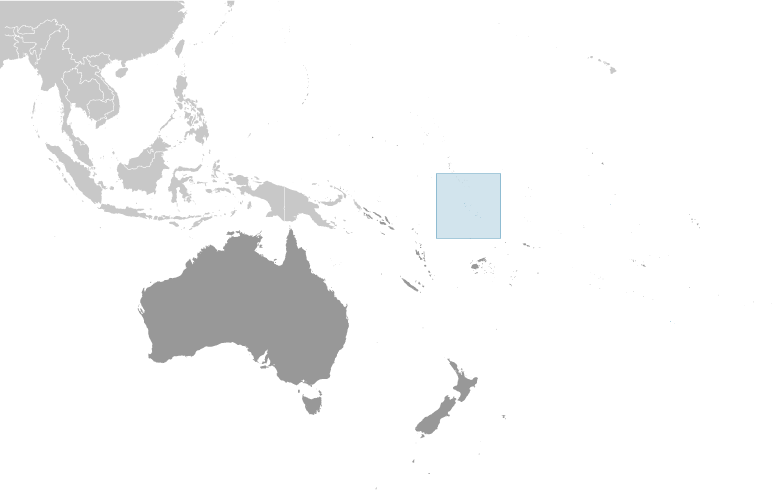
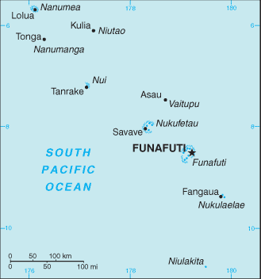

# Tuvalu

## Introduction

**_Background:_**   
In 1974, ethnic differences within the British colony of the Gilbert and Ellice Islands caused the Polynesians of the Ellice Islands to vote for separation from the Micronesians of the Gilbert Islands. The following year, the Ellice Islands became the separate British colony of Tuvalu. Independence was granted in 1978. In 2000, Tuvalu negotiated a contract leasing its Internet domain name ".tv" for $50 million in royalties over a 12-year period.

## Geography

**_Location:_**   
Oceania, island group consisting of nine coral atolls in the South Pacific Ocean, about one-half of the way from Hawaii to Australia

**_Geographic coordinates:_**   
8 00 S, 178 00 E

**_Map references:_**   
Oceania

**_Area:_**   
**total:** 26 sq km   
**land:** 26 sq km   
**water:** 0 sq km

**_Area - comparative:_**   
0.1 times the size of Washington, DC

**_Land boundaries:_**   
0 km

**_Coastline:_**   
24 km

**_Maritime claims:_**   
**territorial sea:** 12 nm   
**contiguous zone:** 24 nm   
**exclusive economic zone:** 200 nm

**_Climate:_**   
tropical; moderated by easterly trade winds (March to November); westerly gales and heavy rain (November to March)

**_Terrain:_**   
low-lying and narrow coral atolls

**_Elevation extremes:_**   
**lowest point:** Pacific Ocean 0 m   
**highest point:** unnamed location 5 m

**_Natural resources:_**   
fish

**_Land use:_**   
**arable land:** 0%   
**permanent crops:** 60%   
**other:** 40% (2011)

**_Irrigated land:_**   
NA

**_Natural hazards:_**   
severe tropical storms are usually rare, but in 1997 there were three cyclones; low levels of islands make them sensitive to changes in sea level

**_Environment - current issues:_**   
since there are no streams or rivers and groundwater is not potable, most water needs must be met by catchment systems with storage facilities (the Japanese Government has built one desalination plant and plans to build one other); beachhead erosion because of the use of sand for building materials; excessive clearance of forest undergrowth for use as fuel; damage to coral reefs from the spread of the Crown of Thorns starfish; Tuvalu is concerned about global increases in greenhouse gas emissions and their effect on rising sea levels, which threaten the country's underground water table; in 2000, the government appealed to Australia and New Zealand to take in Tuvaluans if rising sea levels should make evacuation necessary

**_Environment - international agreements:_**   
**party to:** Biodiversity, Climate Change, Climate Change-Kyoto Protocol, Desertification, Law of the Sea, Ozone Layer Protection, Ship Pollution, Whaling   
**signed, but not ratified:** none of the selected agreements

**_Geography - note:_**   
one of the smallest and most remote countries on Earth; six of the nine coral atolls - Nanumea, Nui, Vaitupu, Nukufetau, Funafuti, and Nukulaelae - have lagoons open to the ocean; Nanumaya and Niutao have landlocked lagoons; Niulakita does not have a lagoon

## People and Society

**_Nationality:_**   
**noun:** Tuvaluan(s)   
**adjective:** Tuvaluan

**_Ethnic groups:_**   
Polynesian 96%, Micronesian 4%

**_Languages:_**   
Tuvaluan (official), English (official), Samoan, Kiribati (on the island of Nui)

**_Religions:_**   
Protestant 98.4% (Church of Tuvalu (Congregationalist) 97%, Seventh-Day Adventist 1.4%), Baha'i 1%, other 0.6%

**_Population:_**   
10,782 (July 2014 est.)

**_Age structure:_**   
**0-14 years:** 29.6% (male 1,636/female 1,553)   
**15-24 years:** 20.6% (male 1,176/female 1,048)   
**25-54 years:** 36.2% (male 1,901/female 1,999)   
**55-64 years:** 8.2% (male 360/female 525)   
**65 years and over:** 5.3% (male 242/female 342) (2014 est.)

**_Median age:_**   
**total:** 24.9 years   
**male:** 23.7 years   
**female:** 26.4 years (2014 est.)

**_Population growth rate:_**   
0.8% (2014 est.)

**_Birth rate:_**   
23.74 births/1,000 population (2014 est.)

**_Death rate:_**   
8.9 deaths/1,000 population (2014 est.)

**_Net migration rate:_**   
-6.86 migrant(s)/1,000 population (2014 est.)

**_Urbanization:_**   
**urban population:** 50% of total population (2011)   
**rate of urbanization:** 1.04% annual rate of change (2010-15 est.)

**_Major urban areas - population:_**   
FUNAFUTI (capital) 5,000 (2011)

**_Sex ratio:_**   
**at birth:** 1.05 male(s)/female   
**0-14 years:** 1.05 male(s)/female   
**15-24 years:** 1.12 male(s)/female   
**25-54 years:** 0.95 male(s)/female   
**55-64 years:** 0.97 male(s)/female   
**65 years and over:** 0.73 male(s)/female   
**total population:** 0.97 male(s)/female (2014 est.)

**_Mother's mean age at first birth:_**   
23.5   
**note:** median age at first birth among women 25-29 (2007 est.)

**_Infant mortality rate:_**   
**total:** 31.69 deaths/1,000 live births   
**male:** 34.44 deaths/1,000 live births   
**female:** 28.81 deaths/1,000 live births (2014 est.)

**_Life expectancy at birth:_**   
**total population:** 65.81 years   
**male:** 63.69 years   
**female:** 68.05 years (2014 est.)

**_Total fertility rate:_**   
3.03 children born/woman (2014 est.)

**_Contraceptive prevalence rate:_**   
30.5% (2007)

**_Health expenditures:_**   
17.3% of GDP (2011)

**_Physicians density:_**   
1.09 physicians/1,000 population (2009)

**_Hospital bed density:_**   
5.6 beds/1,000 population (2001)

**_Drinking water source:_**   
**improved:** urban: 98.3% of population; rural: 97% of population; total: 97.7% of population   
**unimproved:** urban: 1.7% of population; rural: 3% of population; total: 2.3% of population (2012 est.)

**_Sanitation facility access:_**   
**improved:** urban: 86.3% of population; rural: 80.2% of population; total: 83.3% of population   
**unimproved:** urban: 13.7% of population; rural: 19.8% of population; total: 16.7% of population (2012 est.)

**_HIV/AIDS - adult prevalence rate:_**   
NA

**_HIV/AIDS - people living with HIV/AIDS:_**   
NA

**_HIV/AIDS - deaths:_**   
NA

**_Children under the age of 5 years underweight:_**   
1.6% (2007)

**_Education expenditures:_**   
NA

**_Literacy:_**   
NA

**_School life expectancy (primary to tertiary education):_**   
**total:** 11 years   
**male:** 10 years   
**female:** 11 years (2001)

## Government

**_Country name:_**   
**conventional long form:** none   
**conventional short form:** Tuvalu   
**local long form:** none   
**local short form:** Tuvalu   
**former:** Ellice Islands   
**note:** "Tuvalu" means "group of eight" referring to the country's eight traditionally inhabited islands

**_Government type:_**   
parliamentary democracy and a Commonwealth realm

**_Capital:_**   
**name:** Funafuti; note - administrative offices are in Vaiaku Village on Fongafale Islet   
**geographic coordinates:** 8 31 S, 179 13 E   
**time difference:** UTC+12 (17 hours ahead of Washington, DC, during Standard Time)

**_Administrative divisions:_**   
7 island councils and 1 town council\*; Funafuti\*, Nanumaga, Nanumea, Niutao, Nui, Nukufetau, Nukulaelae, Vaitupu

**_Independence:_**   
1 October 1978 (from the UK)

**_National holiday:_**   
Independence Day, 1 October (1978)

**_Constitution:_**   
previous 1978 (at independence); latest effective 1 October 1986; amended 2007, 2010 (2010)

**_Legal system:_**   
mixed legal system of English common law and local customary law

**_International law organization participation:_**   
has not submitted an ICJ jurisdiction declaration; non-party state to the ICCt

**_Suffrage:_**   
18 years of age; universal

**_Executive branch:_**   
**chief of state:** Queen ELIZABETH II (since 6 February 1952); represented by Governor General Iakoba TAEIA Italeli (since May 2010)   
**head of government:** Prime Minister Enele SOPOAGA (since 5 August 2013)   
**cabinet:** Cabinet appointed by the governor general on recommendation of the prime minister   
**elections:** the monarchy is hereditary; governor general appointed by the monarch on recommendation of the prime minister; prime minister and deputy prime minister elected by and from members of parliament following parliamentary elections   
**election results:** Willie TELAVI removed as prime minister by the governor-general on 1 August 2013; Enele SOPOAGA elected 4 August 2013 in a 8 to 5 vote by the House of Assembly

**_Legislative branch:_**   
unicameral Parliament or Fale I Fono, also called House of Assembly (15 seats; members elected by popular vote to serve four-year terms)   
**elections:** last held on 16 September 2010 (next to be held in 2014)   
**election results:** percent of vote - NA; seats - independents 15; 10 members reelected

**_Judicial branch:_**   
**highest court(s):** Court of Appeal is the Fiji Court of Appeal on Fiji Island (consists of the chief justice who visits twice a year); High Court, located on Fiji, consists of the chief justice of Fiji who presides over its sessions   
**judge selection and term of office:** chief justice appointed by the president of Fiji on the advice of the prime minister following consultation with the parliamentary leader of the opposition; justices of the Court of Appeal, and puisne judges of the High Court are appointed by the president of Fiji, upon the nomination of the Judicial Service Commission, after consulting with the Cabinet Minister and the committee of the House of Representatives responsible for the administration of justice; the chief justice and justices of Appeal generally required to retire at age 70; puisine judges appointed for not less than 4 years nor more than 7 years with mandatory retirement at age 65   
**subordinate courts:** magistrates' courts; island courts; lands courts

**_Political parties and leaders:_**   
there are no political parties but members of parliament usually align themselves in informal groupings

**_Political pressure groups and leaders:_**   
none

**_International organization participation:_**   
ACP, ADB, AOSIS, C, FAO, IBRD, IDA, IFRCS (observer), ILO, IMF, IMO, IOC, ITU, OPCW, PIF, Sparteca, SPC, UN, UNCTAD, UNESCO, UNIDO, UPU, WHO

**_Diplomatic representation in the US:_**   
**chief of mission:** Ambassador Aunese Makoi SIMATI (since 11 January 2013)   
**chancery:** Note - Tuvalu does not have an embassy in Washington, D.C.; UN office located at 800 2nd Avenue, Suite 400D, New York, NY 10017   
**telephone:** [1] (212) 490-0534   
**FAX:** [1] (212) 937-0692

**_Diplomatic representation from the US:_**   
the US does not have an embassy in Tuvalu; the US ambassador to Fiji, currently Ambassador Frankie A. REED, is accredited to Tuvalu

**_Flag description:_**   
light blue with the flag of the UK in the upper hoist-side quadrant; the outer half of the flag represents a map of the country with nine yellow, five-pointed stars on a blue field symbolizing the nine atolls in the ocean

**_National anthem:_**   
**name:** "Tuvalu mo te Atua" (Tuvalu for the Almighty)   
**lyrics/music:** Afaese MANOA   
**note:** adopted 1978; the anthem's name is also the nation's motto

## Economy

**_Economy - overview:_**   
Tuvalu consists of a densely populated, scattered group of nine coral atolls with poor soil. Only eight of the atolls are inhabited. The country has no known mineral resources and few exports and is almost entirely dependent upon imported food and fuel. Subsistence farming and fishing are the primary economic activities. Fewer than 1,000 tourists, on average, visit Tuvalu annually. Job opportunities are scarce and public sector workers make up most of those employed. About 15% of the adult male population work as seamen on merchant ships abroad, and remittances are a vital source of income contributing around $2 million in 2007. Substantial income is received annually from the Tuvalu Trust Fund (TTF) an international trust fund established in 1987 by Australia, NZ, and the UK and supported also by Japan and South Korea. Thanks to wise investments and conservative withdrawals, this fund grew from an initial $17 million to an estimated value of $77 million in 2006. The TTF contributed nearly $9 million towards the government budget in 2006 and is an important cushion for meeting shortfalls in the government's budget. The US Government is also a major revenue source for Tuvalu because of payments from a 1988 treaty on fisheries. In an effort to ensure financial stability and sustainability, the government is pursuing public sector reforms, including privatization of some government functions and personnel cuts. Tuvalu also derives royalties from the lease of its ".tv" Internet domain name with revenue of more than $2 million in 2006. A minor source of government revenue comes from the sale of stamps and coins. With merchandise exports only a fraction of merchandise imports, continued reliance must be placed on fishing and telecommunications license fees, remittances from overseas workers, official transfers, and income from overseas investments. Growing income disparities and the vulnerability of the country to climatic change are among leading concerns for the nation.

**_GDP (purchasing power parity):_**   
$40 million (2013 est.)   
$39.53 million (2012 est.)   
$39.19 million (2011 est.)   
**note:** data are in 2013 US dollars

**_GDP (official exchange rate):_**   
$38 million (2013 est.)

**_GDP - real growth rate:_**   
1.1% (2013 est.)   
0.2% (2012 est.)   
8.5% (2011 est.)

**_GDP - per capita (PPP):_**   
$3,500 (2013 est.)   
$3,500 (2012 est.)   
$3,500 (2011 est.)   
**note:** data are in 2013 US dollars

**_GDP - composition, by sector of origin:_**   
**agriculture:** 16.6%   
**industry:** 27.2%   
**services:** 56.2% (2002)

**_Agriculture - products:_**   
coconuts; fish

**_Industries:_**   
fishing, tourism, copra

**_Industrial production growth rate:_**   
NA%

**_Labor force:_**   
3,615 (2004 est.)

**_Labor force - by occupation:_**   
**note:** people make a living mainly through exploitation of the sea, reefs, and atolls and through overseas remittances (mostly from workers in the phosphate industry and sailors)

**_Unemployment rate:_**   
NA%

**_Population below poverty line:_**   
NA%

**_Household income or consumption by percentage share:_**   
**lowest 10%:** NA%   
**highest 10%:** NA%

**_Budget:_**   
**revenues:** $21.54 million   
**expenditures:** $23.05 million (2006)

**_Taxes and other revenues:_**   
56.7% of GDP (2006)

**_Budget surplus (+) or deficit (-):_**   
-4% of GDP (2006)

**_Fiscal year:_**   
calendar year

**_Inflation rate (consumer prices):_**   
3.8% (2006 est.)

**_Current account balance:_**   
-$7.7 million (2010 est.)   
-$11.68 million (2003)

**_Exports:_**   
$600,000 (2010 est.)   
$1 million (2004 est.)

**_Exports - commodities:_**   
copra, fish

**_Imports:_**   
$16.5 million (2010 est.)   
$12.91 million (2005)

**_Imports - commodities:_**   
food, animals, mineral fuels, machinery, manufactured goods

**_Debt - external:_**   
$NA

**_Exchange rates:_**   
Tuvaluan dollars or Australian dollars (AUD) per US dollar -   
1.031 (2011)   
1.67 (2011 est.)   
1.67 (2010)   
1.2822 (2009)   
1.2059 (2008)

## Communications

**_Telephones - main lines in use:_**   
1,450 (2012)

**_Telephones - mobile cellular:_**   
2,800 (2012)

**_Telephone system:_**   
**general assessment:** serves particular needs for internal communications   
**domestic:** radiotelephone communications between islands   
**international:** country code - 688; international calls can be made by satellite (2007)

**_Broadcast media:_**   
no TV stations; many households use satellite dishes to watch foreign TV stations; 1 government-owned radio station, Radio Tuvalu, includes relays of programming from international broadcasters (2009)

**_Internet country code:_**   
.tv

**_Internet hosts:_**   
145,158 (2012)

**_Internet users:_**   
4,200 (2008)

## Transportation

**_Airports:_**   
1 (2013)

**_Airports - with unpaved runways:_**   
**total:** 1   
**1,524 to 2,437 m:** 1 (2013)

**_Roadways:_**   
**total:** 8 km   
**paved:** 8 km (2011)

**_Merchant marine:_**   
**total:** 58   
**by type:** bulk carrier 4, cargo 24, chemical tanker 15, container 1, passenger 2, passenger/cargo 1, petroleum tanker 10, refrigerated cargo 1   
**foreign-owned:** 33 (China 4, Indonesia 1, Maldives 1, Singapore 19, South Korea 1, Turkey 1, Vietnam 6) (2010)

**_Ports and terminals:_**   
**major seaport(s):** Funafuti

## Military

**_Military branches:_**   
no regular military forces; Tuvalu Police Force (2012)

**_Manpower fit for military service:_**   
**males age 16-49:** 2,021   
**females age 16-49:** 2,026 (2010 est.)

**_Manpower reaching militarily significant age annually:_**   
**male:** 119   
**female:** 111 (2010 est.)

## Transnational Issues

**_Disputes - international:_**   
none

............................................................   
_Page last updated on June 20, 2014_
