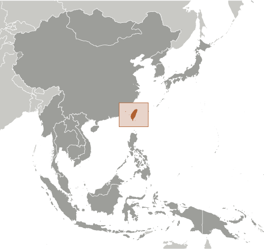
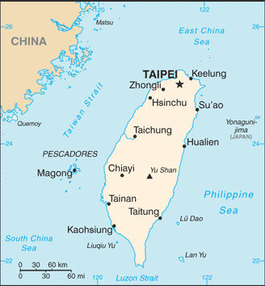

# Taiwan

## Introduction

**_Background:_**   
In 1895, military defeat forced China's Qing Dynasty to cede Taiwan to Japan. Taiwan came under Chinese Nationalist control after World War II. Following the communist victory on the mainland in 1949, 2 million Nationalists fled to Taiwan and established a government using the 1947 constitution drawn up for all of China. Beginning in the 1950s, the ruling authorities gradually democratized and incorporated the local population within the governing structure. This process expanded rapidly in the 1980s. In 2000, Taiwan underwent its first peaceful transfer of power from the Nationalist (Kuomintang or KMT) to the Democratic Progressive Party. Throughout this period, the island prospered and became one of East Asia's economic "Tigers." The dominant political issues continue to be management of sensitive relations between Taiwan and China - specifically the question of Taiwan's eventual status - as well as domestic priorities for economic reform and growth.

## Geography

**_Location:_**   
Eastern Asia, islands bordering the East China Sea, Philippine Sea, South China Sea, and Taiwan Strait, north of the Philippines, off the southeastern coast of China

**_Geographic coordinates:_**   
23 30 N, 121 00 E

**_Map references:_**   
Southeast Asia

**_Area:_**   
**total:** 35,980 sq km   
**land:** 32,260 sq km   
**water:** 3,720 sq km   
**note:** includes the Pescadores, Matsu, and Quemoy islands

**_Area - comparative:_**   
slightly smaller than Maryland and Delaware combined

**_Land boundaries:_**   
0 km

**_Coastline:_**   
1,566.3 km

**_Maritime claims:_**   
**territorial sea:** 12 nm   
**exclusive economic zone:** 200 nm

**_Climate:_**   
tropical; marine; rainy season during southwest monsoon (June to August); cloudiness is persistent and extensive all year

**_Terrain:_**   
eastern two-thirds mostly rugged mountains; flat to gently rolling plains in west

**_Elevation extremes:_**   
**lowest point:** South China Sea 0 m   
**highest point:** Yu Shan 3,952 m

**_Natural resources:_**   
small deposits of coal, natural gas, limestone, marble, and asbestos

**_Land use:_**   
**arable land:** 24%   
**permanent crops:** 1%   
**other:** 75% (2011)

**_Irrigated land:_**   
NA

**_Total renewable water resources:_**   
67 cu km (2011)

**_Natural hazards:_**   
earthquakes; typhoons   
**volcanism:** Kueishantao Island (elev. 401 m), east of Taiwan, is its only historically active volcano, although it has not erupted in centuries

**_Environment - current issues:_**   
air pollution; water pollution from industrial emissions, raw sewage; contamination of drinking water supplies; trade in endangered species; low-level radioactive waste disposal

**_Environment - international agreements:_**   
**party to:** none of the selected agreements because of Taiwan's international status

**_Geography - note:_**   
strategic location adjacent to both the Taiwan Strait and the Luzon Strait

## People and Society

**_Nationality:_**   
**noun:** Taiwan (singular and plural)   
**note:** example - he or she is from Taiwan; they are from Taiwan   
**adjective:** Taiwan (or Taiwanese)

**_Ethnic groups:_**   
Taiwanese (including Hakka) 84%, mainland Chinese 14%, indigenous 2%

**_Languages:_**   
Mandarin Chinese (official), Taiwanese (Min), Hakka dialects

**_Religions:_**   
mixture of Buddhist and Taoist 93%, Christian 4.5%, other 2.5%

**_Population:_**   
23,359,928 (July 2014 est.)

**_Age structure:_**   
**0-14 years:** 14% (male 1,683,381/female 1,575,789)   
**15-24 years:** 13.4% (male 1,613,197/female 1,526,344)   
**25-54 years:** 47.4% (male 5,539,606/female 5,539,654)   
**55-64 years:** 13.2% (male 1,506,657/female 1,571,208)   
**65 years and over:** 11.6% (male 1,301,420/female 1,502,672) (2014 est.)

**_Median age:_**   
**total:** 39.2 years   
**male:** 38.5 years   
**female:** 39.9 years (2014 est.)

**_Population growth rate:_**   
0.25% (2014 est.)

**_Birth rate:_**   
8.55 births/1,000 population (2014 est.)

**_Death rate:_**   
6.97 deaths/1,000 population (2014 est.)

**_Net migration rate:_**   
0.9 migrant(s)/1,000 population (2014 est.)

**_Sex ratio:_**   
**at birth:** 1.07 male(s)/female   
**0-14 years:** 1.07 male(s)/female   
**15-24 years:** 1.06 male(s)/female   
**25-54 years:** 1 male(s)/female   
**55-64 years:** 0.99 male(s)/female   
**65 years and over:** 0.89 male(s)/female   
**total population:** 1 male(s)/female (2014 est.)

**_Infant mortality rate:_**   
**total:** 4.49 deaths/1,000 live births   
**male:** 4.9 deaths/1,000 live births   
**female:** 4.06 deaths/1,000 live births (2014 est.)

**_Life expectancy at birth:_**   
**total population:** 79.84 years   
**male:** 76.72 years   
**female:** 83.2 years (2014 est.)

**_Total fertility rate:_**   
1.11 children born/woman (2014 est.)

**_HIV/AIDS - adult prevalence rate:_**   
NA

**_HIV/AIDS - people living with HIV/AIDS:_**   
NA

**_HIV/AIDS - deaths:_**   
NA

**_Literacy:_**   
**definition:** age 15 and over can read and write   
**total population:** 96.1%   
**male:** NA   
**female:** NA (2003)

## Government

**_Country name:_**   
**conventional long form:** none   
**conventional short form:** Taiwan   
**local long form:** none   
**local short form:** Taiwan   
**former:** Formosa

**_Government type:_**   
multiparty democracy

**_Capital:_**   
**name:** Taipei   
**geographic coordinates:** 25 02 N, 121 31 E   
**time difference:** UTC+8 (13 hours ahead of Washington, DC, during Standard Time)

**_Administrative divisions:_**   
includes main island of Taiwan plus smaller islands nearby and off coast of China's Fujian Province; Taiwan is divided into 14 counties (hsien, singular and plural), 3 municipalities (shih, singular and plural), and 5 special municipalities (chih-hsia-shih, singular and plural)   
**counties:** Changhua, Chiayi, Hsinchu, Hualien, Kinmen, Lienchiang, Miaoli, Nantou, Penghu, Pingtung, Taitung, Taoyuan, Yilan, Yunlin   
**municipalities:** Chiayi, Hsinchu, Keelung   
**special municipalities:** Kaohsiung (city), New Taipei (city), Taichung (city), Tainan (city), Taipei (city)   
**note:** Taiwan uses a variety of romanization systems; while a modified Wade-Giles system still dominates, the city of Taipei has adopted a Pinyin romanization for street and place names within its boundaries; other local authorities use different romanization systems; names for administrative divisions that follow are taken from the Taiwan Yearbook 2007 published by the Government Information Office in Taipei.

**_National holiday:_**   
Republic Day (Anniversary of the Chinese Revolution), 10 October (1911)

**_Constitution:_**   
previous 1912, 1931; latest adopted 25 December 1946, promulgated 1 January 1947, effective 25 December 1947; revised several times, last in 2005 (2013)

**_Legal system:_**   
civil law system

**_International law organization participation:_**   
has not submitted an ICJ jurisdiction declaration; non-party state to the ICCt

**_Suffrage:_**   
20 years of age; universal

**_Executive branch:_**   
**chief of state:** President MA Ying-jeou (since 20 May 2008); Vice President WU Den-yih (since 20 May 2012)   
**head of government:** Premier JIANG Yi-huah (President of the Executive Yuan) (since 18 February 2013); Vice Premier MAO Chi-kuo (Vice President of the Executive Yuan) (since 18 February 2013)   
**cabinet:** Executive Yuan - ministers appointed by president on recommendation of premier   
**elections:** president and vice president elected on the same ticket by popular vote for four-year terms (eligible for a second term); election last held on 14 January 2012 (next to be held in January 2016); premier appointed by the president; vice premiers appointed by the president on the recommendation of the premier   
**election results:** MA Ying-jeou elected president; percent of vote - MA Ying-jeou 51.6%, TSAI Ing-wen 45.6%, James SOONG Chu-ye 2.8%

**_Legislative branch:_**   
unicameral Legislative Yuan (113 seats - 73 district members elected by popular vote, 34 at-large members elected on basis of proportion of islandwide votes received by participating political parties, 6 elected by popular vote among aboriginal populations; members to serve four-year terms); parties must receive 5% of vote to qualify for at-large seats   
**elections:** Legislative Yuan - last held on 14 January 2012 (next to be held in January 2016)   
**election results:** Legislative Yuan - percent of vote by party - KMT 44.6%, DPP 34.6%, TSU 9.0%, PFP 5.5%, others 6.3%; seats by party - KMT 64, DPP 40, PFP 3, TSU 3, NPSU 2, independent 1

**_Judicial branch:_**   
**highest court(s):** Supreme Court (consists of the court president, vice president, and approximately 100 judges organized into 8 civil and 12 criminal divisions, each with a division chief justice and 4 associate justices); Constitutional Court (consists of the court president, vice president, and 13 justices)   
**judge selection and term of office:** both Supreme Court and Constitutional Court justices appointed by the president of the republic with the approval of the Legislative Yuan; Supreme Court justices appointed for life; Constitutional Court president, vice-president, and 8 grand justices serve 4-year terms and remaining justices serve 8-year terms   
**subordinate courts:** high courts; district courts; hierarchy of administrative courts

**_Political parties and leaders:_**   
Democratic Progressive Party or DPP [SU Tseng-chang]   
Kuomintang or KMT (Nationalist Party) [MA Ying-jeou]   
New Party [YOK Mu-ming]   
Non-Partisan Solidarity Union or NPSU [LIN Pin-kuan]   
People First Party or PFP [James SOONG Chu-ye]   
Taiwan Solidarity Union or TSU [HUANG Kun-huei]

**_Political pressure groups and leaders:_**   
environmental groups   
independence movement   
various business groups   
**note:** debate on Taiwan independence has become acceptable within the mainstream of domestic politics on Taiwan; public opinion polls consistently show a substantial majority of Taiwan people supports maintaining Taiwan's status quo for the foreseeable future; advocates of Taiwan independence oppose the stand that the island will eventually unify with mainland China; advocates of eventual unification predicate their goal on the democratic transformation of the mainland

**_International organization participation:_**   
ADB, APEC, BCIE, ICC (national committees), IOC, ITUC (NGOs), WTO

**_Diplomatic representation in the US:_**   
none; commercial and cultural relations with the people in the United States are maintained through an unofficial instrumentality, the Taipei Economic and Cultural Representative Office in the United States (TECRO), a private nonprofit corporation that performs citizen and consular services similar to those at diplomatic posts   
**representative:** SHEN Lyu-shin (since 1 April 2014)   
**office:** 4201 Wisconsin Avenue NW, Washington, DC 20016   
**telephone:** [1] 202 895-1800   
**Taipei Economic and Cultural Offices (branch offices):** Atlanta, Boston, Chicago, Guam, Houston, Honolulu, Kansas City, Los Angeles, Miami, New York, San Francisco, Seattle

**_Diplomatic representation from the US:_**   
none; commercial and cultural relations with the people on Taiwan are maintained through an unofficial instrumentality, the American Institute in Taiwan (AIT), a private nonprofit corporation that performs citizen and consular services similar to those at diplomatic posts   
**director:** Christopher J. MARUT   
**office:** #7 Lane 134, Hsin Yi Road, Section 3, Taipei 106, Taiwan   
**telephone:** [1] [886] (02) 2162-2000   
**FAX:** [1] [886] (02) 2162-2251   
**other offices:** Kaohsiung

**_Flag description:_**   
red field with a dark blue rectangle in the upper hoist-side corner bearing a white sun with 12 triangular rays; the blue and white design of the canton (symbolizing the sun of progress) dates to 1895; it was later adopted as the flag of the Kuomintang Party; blue signifies liberty, justice, and democracy; red stands for fraternity, sacrifice, and nationalism, white represents equality, frankness, and the people's livelihood; the 12 rays of the sun are those of the months and the twelve traditional Chinese hours (each ray equals two hours)

**_National symbol(s):_**   
white, 12-rayed sun on blue field

**_National anthem:_**   
**name:** "Zhonghua Minguo guoge" (National Anthem of the Republic of China)   
**lyrics/music:** HU Han-min, TAI Chi-t'ao, and LIAO Chung-k'ai/CHENG Mao-Yun   
**note:** adopted 1930; the anthem is also the song of the Kuomintang Party; it is informally known as "San Min Chu I" or "San Min Zhu Yi" (Three Principles of the People); because of political pressure from China, "Guo Qi Ge" (National Banner Song) is used at international events rather than the official anthem of Taiwan; the "National Banner Song" has gained popularity in Taiwan and is commonly used during flag raisings

## Economy

**_Economy - overview:_**   
Taiwan has a dynamic capitalist economy with gradually decreasing government guidance of investment and foreign trade. Exports, led by electronics, machinery, and petrochemicals have provided the primary impetus for economic development. This heavy dependence on exports exposes the economy to fluctuations in world demand. Taiwan's diplomatic isolation, low birth rate, and rapidly aging population are other major long-term challenges. Free trade agreements have proliferated in East Asia over the past several years, and following the landmark Economic Cooperation Framework Agreement (ECFA) signed with China in June 2010, Taiwan in July 2013 signed a free trade deal with New Zealand—Taipei’s first-ever with a country with which it does not maintain diplomatic relations—and in November inked a trade pact with Singapore. Negotiations continue on follow-on components of ECFA regarding trade in goods and a dispute resolution mechanism; a trade in services agreement is under review in the legislature. Taiwan's Total Fertility rate of just over one child per woman is among the lowest in the world, raising the prospect of future labor shortages, falling domestic demand, and declining tax revenues. Taiwan's population is aging quickly, with the number of people over 65 accounting for 11.2% of the island's total population as of 2012. The island runs a large overall trade surplus largely because of its surplus with China, and its foreign reserves are the world's sixth largest, behind China, Japan, Saudi Arabia, Russia, and Switzerland. In 2006 China overtook the US to become Taiwan's second-largest source of imports after Japan. China is also the island's number one destination for foreign direct investment. Taiwan since 2009 has gradually loosened rules governing Chinese investment on the island, and has also secured greater market access for its investors in the mainland. In August 2012, Taiwan Central Bank signed a memorandum of understanding on cross-Strait currency settlement with its Chinese counterpart. The MOU allows for the direct settlement of Chinese RMB and the New Taiwan dollar across the Strait, which could help develop Taiwan into a local RMB hub. Closer economic links with the mainland bring greater opportunities for the Taiwan economy, but also poses new challenges as the island becomes more economically dependent on China while political differences remain unresolved.

**_GDP (purchasing power parity):_**   
$926.4 billion (2013 est.)   
$906.6 billion (2012 est.)   
$894.7 billion (2011 est.)   
**note:** data are in 2013 US dollars

**_GDP (official exchange rate):_**   
$484.7 billion (2013 est.)

**_GDP - real growth rate:_**   
2.2% (2013 est.)   
1.3% (2012 est.)   
4.1% (2011 est.)

**_GDP - per capita (PPP):_**   
$39,600 (2013 est.)   
$38,900 (2012 est.)   
$38,500 (2011 est.)   
**note:** data are in 2013 US dollars

**_Gross national saving:_**   
31.3% of GDP (2013 est.)   
30.3% of GDP (2012 est.)   
29.6% of GDP (2011 est.)

**_GDP - composition, by end use:_**   
**household consumption:** 59.5%   
**government consumption:** 12.2%   
**investment in fixed capital:** 19.4%   
**investment in inventories:** 0.3%   
**exports of goods and services:** 73.1%   
**imports of goods and services:** -64.5%; (2013 est.)

**_GDP - composition, by sector of origin:_**   
**agriculture:** 2%   
**industry:** 29.4%   
**services:** 68.6% (2013 est.)

**_Agriculture - products:_**   
rice, vegetables, fruit, tea, flowers; pigs, poultry; fish

**_Industries:_**   
electronics, communications and information technology products, petroleum refining, chemicals, textiles, iron and steel, machinery, cement, food processing, vehicles, consumer products, pharmaceuticals

**_Industrial production growth rate:_**   
1.8% (2013 est.)

**_Labor force:_**   
11.55 million (2013 est.)

**_Labor force - by occupation:_**   
**agriculture:** 5%   
**industry:** 36.2%   
**services:** 58.8% (2012 est.)

**_Unemployment rate:_**   
4.1% (2013 est.)   
4.2% (2012 est.)

**_Population below poverty line:_**   
1.5% (2012 est.)

**_Household income or consumption by percentage share:_**   
**lowest 10%:** 6.4%   
**highest 10%:** 40.3% (2010)

**_Distribution of family income - Gini index:_**   
34.2 (2011)   
32.6 (2000)

**_Budget:_**   
**revenues:** $78.24 billion   
**expenditures:** $90.38 billion (2013 est.)

**_Taxes and other revenues:_**   
16.1% of GDP (2013 est.)

**_Budget surplus (+) or deficit (-):_**   
-2.5% of GDP (2013 est.)

**_Public debt:_**   
38.9% of GDP (2013 est.)   
35.8% of GDP (2012 est.)   
**note:** data for central government

**_Fiscal year:_**   
calendar year

**_Inflation rate (consumer prices):_**   
1.1% (2013 est.)   
1.9% (2012 est.)

**_Central bank discount rate:_**   
1.88% (31 December 2012)   
1.88% (31 December 2011)

**_Commercial bank prime lending rate:_**   
2.9% (31 December 2013 est.)   
2.88% (31 December 2012 est.)

**_Stock of narrow money:_**   
$450.1 billion (31 December 2013 est.)   
$426.2 billion (31 December 2012 est.)

**_Stock of broad money:_**   
$1.189 trillion (31 December 2013 est.)   
$1.152 trillion (31 December 2012 est.)

**_Stock of domestic credit:_**   
$753.5 billion (31 December 2013 est.)   
$743.1 billion (31 December 2012 est.)

**_Market value of publicly traded shares:_**   
$831.9 billion (31 December 2012)   
$784.1 billion (31 December 2011)   
$738.3 billion (31 December 2010)

**_Current account balance:_**   
$56.66 billion (2013 est.)   
$49.92 billion (2012 est.)

**_Exports:_**   
$305.8 billion (2013 est.)   
$299.8 billion (2012 est.)

**_Exports - commodities:_**   
electronics, flat panels, machinery; metals; textiles, plastics, chemicals; optical, photographic, measuring, and medical instruments

**_Exports - partners:_**   
China 27.1%, Hong Kong 13.2%, US 10.3%, Japan 6.4%, Singapore 4.4% (2012 est.)

**_Imports:_**   
$268.5 billion (2013 est.)   
$268.8 billion (2012 est.)

**_Imports - commodities:_**   
electronics, machinery, crude petroleum, precision instruments, organic chemicals, metals

**_Imports - partners:_**   
Japan 17.6%, China 16.1%, US 9.5% (2012 est.)

**_Reserves of foreign exchange and gold:_**   
$414.5 billion (31 December 2013 est.)   
$408.5 billion (31 December 2012 est.)

**_Debt - external:_**   
$146.8 billion (31 December 2013 est.)   
$130.8 billion (31 December 2012 est.)

**_Stock of direct foreign investment - at home:_**   
$62.94 billion (31 December 2013 est.)   
$59.36 billion (31 December 2012 est.)

**_Stock of direct foreign investment - abroad:_**   
$240.3 billion (31 December 2013 est.)   
$226.1 billion (31 December 2012 est.)

**_Exchange rates:_**   
New Taiwan dollars (TWD) per US dollar -   
29.77 (2013 est.)   
29.616 (2012 est.)   
31.648 (2010 est.)   
33.061 (2009)   
31.53 (2008)

## Energy

**_Electricity - production:_**   
252.2 billion kWh (2011 est.)

**_Electricity - consumption:_**   
242.2 billion kWh (2011 est.)

**_Electricity - exports:_**   
0 kWh (2011 est.)

**_Electricity - imports:_**   
0 kWh (2011 est.)

**_Electricity - installed generating capacity:_**   
48.75 million kW (2011 est.)

**_Electricity - from fossil fuels:_**   
77.2% of total installed capacity (2011 est.)

**_Electricity - from nuclear fuels:_**   
10.6% of total installed capacity (2011 est.)

**_Electricity - from hydroelectric plants:_**   
5.3% of total installed capacity (2011 est.)

**_Electricity - from other renewable sources:_**   
6.9% of total installed capacity (2011 est.)

**_Crude oil - production:_**   
21,680 bbl/day (2012 est.)

**_Crude oil - exports:_**   
0 bbl/day (2011 est.)

**_Crude oil - imports:_**   
885,900 bbl/day (2010 est.)

**_Crude oil - proved reserves:_**   
2.38 million bbl (1 January 2013 est.)

**_Refined petroleum products - production:_**   
920,200 bbl/day (2011 est.)

**_Refined petroleum products - consumption:_**   
786,100 bbl/day (2011 est.)

**_Refined petroleum products - exports:_**   
255,000 bbl/day (2011 est.)

**_Refined petroleum products - imports:_**   
304,700 bbl/day (2011 est.)

**_Natural gas - production:_**   
330.2 million cu m (2011 est.)

**_Natural gas - consumption:_**   
16.37 billion cu m (2011 est.)

**_Natural gas - exports:_**   
0 cu m (2011 est.)

**_Natural gas - imports:_**   
15.9 billion cu m (2011 est.)

**_Natural gas - proved reserves:_**   
6.229 billion cu m (1 January 2013 est.)

**_Carbon dioxide emissions from consumption of energy:_**   
293.3 million Mt (2011 est.)

## Communications

**_Telephones - main lines in use:_**   
15.998 million (2012)

**_Telephones - mobile cellular:_**   
29.455 million (2012)

**_Telephone system:_**   
**general assessment:** provides telecommunications service for every business and private need   
**domestic:** thoroughly modern; completely digitalized   
**international:** country code - 886; roughly 15 submarine fiber cables provide links throughout Asia, Australia, the Middle East, Europe, and the US; satellite earth stations - 2 (2011)

**_Broadcast media:_**   
5 nationwide television networks operating roughly 75 TV stations; about 85% of households utilize multi-channel cable TV; national and regional radio networks with about 170 radio stations (2008)

**_Internet country code:_**   
.tw

**_Internet hosts:_**   
6.272 million (2012)

**_Internet users:_**   
16.147 million (2009)

## Transportation

**_Airports:_**   
37 (2013)

**_Airports - with paved runways:_**   
**total:** 35   
**over 3,047 m:** 8   
**2,438 to 3,047 m:** 7   
**1,524 to 2,437 m:** 10   
**914 to 1,523 m:** 8   
**under 914 m:** 2 (2013)

**_Airports - with unpaved runways:_**   
**total:** 2   
**1,524 to 2,437 m:** 1   
**under 914 m:** 1 (2013)

**_Heliports:_**   
31 (2013)

**_Pipelines:_**   
condensate 25 km; gas 802 km; oil 241 km (2013)

**_Railways:_**   
**total:** 1,580 km   
**standard gauge:** 345 km 1.435-m gauge (345 km electrified)   
**narrow gauge:** 1,085 km 1.067-m gauge (685 km electrified); 150 km 0.762-m gauge   
**note:** the 0.762 gauge track belongs to three entities, the Forestry Bureau, Taiwan Cement, and TaiPower (2009)

**_Roadways:_**   
**total:** 41,475 km   
**paved:** 41,033 km (includes 720 km of expressways)   
**unpaved:** 442 km (2009)

**_Merchant marine:_**   
**total:** 112   
**by type:** bulk carrier 35, cargo 20, chemical tanker 1, container 31, passenger/cargo 4, petroleum tanker 12, refrigerated cargo 7, roll on/roll off 2   
**foreign-owned:** 3 (France 2, Vietnam 1)   
**registered in other countries:** 579 (Argentina 2, Cambodia 1, Honduras 1, Hong Kong 25, Indonesia 1, Italy 10, Kiribati 2, Liberia 94, Marshall Islands 8, Panama 328, Philippines 1, Sierra Leone 7, Singapore 77, South Korea 1, Thailand 1, UK 11, Vanuatu 1, unknown 8) (2010)

**_Ports and terminals:_**   
**major seaport(s):** Chilung (Keelung), Kaohsiung, Hualian, Taichung   
**container port(s) (TEUs):** Chilung (Keelung) (1,749,388), Kaohsiung (9,363,289), Taichung (1,383,578)

## Military

**_Military branches:_**   
Army, Navy (includes Marine Corps), Air Force, Coast Guard Administration, Armed Forces Reserve Command, Combined Service Forces Command, Armed Forces Police Command

**_Military service age and obligation:_**   
18-35 years of age for compulsory and voluntary military service; service obligation is 2 years; women may enlist; women in Air Force service are restricted to noncombat roles; reserve obligation to age 30 (Army); the Ministry of Defense is in the process of implementing a voluntary enlistment system over the period 2010-2015, although nonvolunteers will still be required to perform alternative service or go through 4 months of military training (2012)

**_Manpower available for military service:_**   
**males age 16-49:** 6,183,567   
**females age 16-49:** 6,006,676 (2010 est.)

**_Manpower fit for military service:_**   
**males age 16-49:** 5,074,173   
**females age 16-49:** 4,951,088 (2010 est.)

**_Manpower reaching militarily significant age annually:_**   
**male:** 166,190   
**female:** 155,306 (2010 est.)

## Transnational Issues

**_Disputes - international:_**   
involved in complex dispute with Brunei, China, Malaysia, the Philippines, and Vietnam over the Spratly Islands, and with China and the Philippines over Scarborough Reef; the 2002 "Declaration on the Conduct of Parties in the South China Sea" has eased tensions but falls short of a legally binding "code of conduct" desired by several of the disputants; Paracel Islands are occupied by China, but claimed by Taiwan and Vietnam; in 2003, China and Taiwan became more vocal in rejecting both Japan's claims to the uninhabited islands of the Senkaku-shoto (Diaoyu Tai) and Japan's unilaterally declared exclusive economic zone in the East China Sea where all parties engage in hydrocarbon prospecting

**_Illicit drugs:_**   
regional transit point for heroin, methamphetamine, and precursor chemicals; transshipment point for drugs to Japan; major problem with domestic consumption of methamphetamine and heroin; rising problems with use of ketamine and club drugs

............................................................   
_Page last updated on June 19, 2014_
