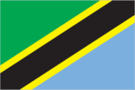
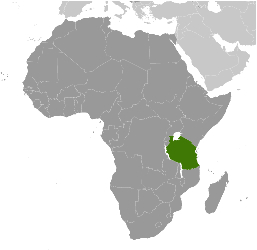
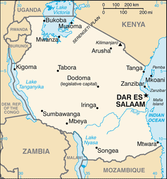

# Tanzania

## Introduction

**_Background:_**   
Shortly after achieving independence from Britain in the early 1960s, Tanganyika and Zanzibar merged to form the nation of Tanzania in 1964. One-party rule ended in 1995 with the first democratic elections held in the country since the 1970s. Zanzibar's semi-autonomous status and popular opposition led to two contentious elections since 1995, which the ruling party won despite international observers' claims of voting irregularities. The formation of a government of national unity between Zanzibar's two leading parties succeeded in minimizing electoral tension in 2010.

## Geography

**_Location:_**   
Eastern Africa, bordering the Indian Ocean, between Kenya and Mozambique

**_Geographic coordinates:_**   
6 00 S, 35 00 E

**_Map references:_**   
Africa

**_Area:_**   
**total:** 947,300 sq km   
**land:** 885,800 sq km   
**water:** 61,500 sq km   
**note:** includes the islands of Mafia, Pemba, and Zanzibar

**_Area - comparative:_**   
slightly larger than twice the size of California

**_Land boundaries:_**   
**total:** 3,861 km   
**border countries:** Burundi 451 km, Democratic Republic of the Congo 459 km, Kenya 769 km, Malawi 475 km, Mozambique 756 km, Rwanda 217 km, Uganda 396 km, Zambia 338 km

**_Coastline:_**   
1,424 km

**_Maritime claims:_**   
**territorial sea:** 12 nm   
**exclusive economic zone:** 200 nm

**_Climate:_**   
varies from tropical along coast to temperate in highlands

**_Terrain:_**   
plains along coast; central plateau; highlands in north, south

**_Elevation extremes:_**   
**lowest point:** Indian Ocean 0 m   
**highest point:** Kilimanjaro 5,895 m (highest point in Africa)

**_Natural resources:_**   
hydropower, tin, phosphates, iron ore, coal, diamonds, gemstones, gold, natural gas, nickel

**_Land use:_**   
**arable land:** 12.25%   
**permanent crops:** 1.79%   
**other:** 85.96% (2011)

**_Irrigated land:_**   
1,843 sq km (2003)

**_Total renewable water resources:_**   
96.27 cu km (2011)

**_Freshwater withdrawal (domestic/industrial/agricultural):_**   
**total:** 5.18 cu km/yr (10%/0%/89%)   
**per capita:** 144.7 cu m/yr (2002)

**_Natural hazards:_**   
flooding on the central plateau during the rainy season; drought   
**volcanism:** limited volcanic activity; Ol Doinyo Lengai (elev. 2,962 m) has emitted lava in recent years; other historically active volcanoes include Kieyo and Meru

**_Environment - current issues:_**   
soil degradation; deforestation; desertification; destruction of coral reefs threatens marine habitats; recent droughts affected marginal agriculture; wildlife threatened by illegal hunting and trade, especially for ivory

**_Environment - international agreements:_**   
**party to:** Biodiversity, Climate Change, Climate Change-Kyoto Protocol, Desertification, Endangered Species, Hazardous Wastes, Law of the Sea, Ozone Layer Protection, Wetlands   
**signed, but not ratified:** none of the selected agreements

**_Geography - note:_**   
Kilimanjaro is the highest point in Africa and one of only two mountains on the continent that has glaciers (the other is Mount Kenya); bordered by three of the largest lakes on the continent: Lake Victoria (the world's second-largest freshwater lake) in the north, Lake Tanganyika (the world's second deepest) in the west, and Lake Nyasa (Lake Malawi) in the southwest

## People and Society

**_Nationality:_**   
**noun:** Tanzanian(s)   
**adjective:** Tanzanian

**_Ethnic groups:_**   
mainland - African 99% (of which 95% are Bantu consisting of more than 130 tribes), other 1% (consisting of Asian, European, and Arab); Zanzibar - Arab, African, mixed Arab and African

**_Languages:_**   
Kiswahili or Swahili (official), Kiunguja (name for Swahili in Zanzibar), English (official, primary language of commerce, administration, and higher education), Arabic (widely spoken in Zanzibar), many local languages   
**note:** Kiswahili (Swahili) is the mother tongue of the Bantu people living in Zanzibar and nearby coastal Tanzania; although Kiswahili is Bantu in structure and origin, its vocabulary draws on a variety of sources including Arabic and English; it has become the lingua franca of central and eastern Africa; the first language of most people is one of the local languages

**_Religions:_**   
mainland - Christian 30%, Muslim 35%, indigenous beliefs 35%; Zanzibar - more than 99% Muslim

**_Population:_**   
49,639,138   
**note:** estimates for this country explicitly take into account the effects of excess mortality due to AIDS; this can result in lower life expectancy, higher infant mortality, higher death rates, lower population growth rates, and changes in the distribution of population by age and sex than would otherwise be expected (July 2014 est.)

**_Age structure:_**   
**0-14 years:** 44.6% (male 11,173,655/female 10,962,186)   
**15-24 years:** 19.5% (male 4,838,216/female 4,841,338)   
**25-54 years:** 29.5% (male 7,340,129/female 7,289,483)   
**55-64 years:** 3.5% (male 745,214/female 985,524)   
**65 years and over:** 2.9% (male 629,483/female 833,910) (2014 est.)

**_Dependency ratios:_**   
**total dependency ratio:** 92.4 %   
**youth dependency ratio:** 86.1 %   
**elderly dependency ratio:** 6.2 %   
**potential support ratio:** 16.1 (2014 est.)

**_Median age:_**   
**total:** 17.4 years   
**male:** 17.1 years   
**female:** 17.7 years (2014 est.)

**_Population growth rate:_**   
2.8% (2014 est.)

**_Birth rate:_**   
36.82 births/1,000 population (2014 est.)

**_Death rate:_**   
8.2 deaths/1,000 population (2014 est.)

**_Net migration rate:_**   
-0.57 migrant(s)/1,000 population (2014 est.)

**_Urbanization:_**   
**urban population:** 26.7% of total population (2011)   
**rate of urbanization:** 4.77% annual rate of change (2010-15 est.)

**_Major urban areas - population:_**   
DAR ES SALAAM (capital) 3.588 million (2011)

**_Sex ratio:_**   
**at birth:** 1.03 male(s)/female   
**0-14 years:** 1.02 male(s)/female   
**15-24 years:** 1 male(s)/female   
**25-54 years:** 1.01 male(s)/female   
**55-64 years:** 0.99 male(s)/female   
**65 years and over:** 0.76 male(s)/female   
**total population:** 0.99 male(s)/female (2014 est.)

**_Mother's mean age at first birth:_**   
19.6   
**note:** median age at first birth among women 25-29 (2010 est.)

**_Maternal mortality rate:_**   
460 deaths/100,000 live births (2010)

**_Infant mortality rate:_**   
**total:** 43.74 deaths/1,000 live births   
**male:** 45.78 deaths/1,000 live births   
**female:** 41.64 deaths/1,000 live births (2014 est.)

**_Life expectancy at birth:_**   
**total population:** 61.24 years   
**male:** 59.91 years   
**female:** 62.62 years (2014 est.)

**_Total fertility rate:_**   
4.95 children born/woman (2014 est.)

**_Contraceptive prevalence rate:_**   
34.4% (2009/10)

**_Health expenditures:_**   
7.3% of GDP (2011)

**_Physicians density:_**   
0.01 physicians/1,000 population (2006)

**_Hospital bed density:_**   
0.7 beds/1,000 population (2010)

**_Drinking water source:_**   
**improved:** urban: 77.9% of population; rural: 44% of population; total: 53.2% of population   
**unimproved:** urban: 22.1% of population; rural: 56% of population; total: 46.8% of population (2012 est.)

**_Sanitation facility access:_**   
**improved:** urban: 24.9% of population; rural: 7.5% of population; total: 12.2% of population   
**unimproved:** urban: 75.1% of population; rural: 92.5% of population; total: 87.8% of population (2012 est.)

**_HIV/AIDS - adult prevalence rate:_**   
5.1% (2012 est.)

**_HIV/AIDS - people living with HIV/AIDS:_**   
1,472,400 (2012 est.)

**_HIV/AIDS - deaths:_**   
80,000 (2012 est.)

**_Major infectious diseases:_**   
**degree of risk:** very high   
**food or waterborne diseases:** bacterial diarrhea, hepatitis A, and typhoid fever   
**vectorborne diseases:** malaria, dengue fever, and Rift Valley fever   
**water contact diseases:** schistosomiasis and leptospirosis   
**animal contact disease:** rabies (2013)

**_Obesity - adult prevalence rate:_**   
5% (2008)

**_Children under the age of 5 years underweight:_**   
16.2% (2010)

**_Education expenditures:_**   
6.2% of GDP (2010)

**_Literacy:_**   
**definition:** age 15 and over can read and write Kiswahili (Swahili), English, or Arabic   
**total population:** 67.8%   
**male:** 75.5%   
**female:** 60.8% (2010 est.)

**_School life expectancy (primary to tertiary education):_**   
**total:** 9 years   
**male:** 9 years   
**female:** 9 years (2012)

**_Child labor - children ages 5-14:_**   
**total number:** 2,815,085   
**percentage:** 21 %   
**note:** data represents children ages 5-17 and does not in (2006 est.)

**_Unemployment, youth ages 15-24:_**   
**total:** 7.1% (2011)

## Government

**_Country name:_**   
**conventional long form:** United Republic of Tanzania   
**conventional short form:** Tanzania   
**local long form:** Jamhuri ya Muungano wa Tanzania   
**local short form:** Tanzania   
**former:** United Republic of Tanganyika and Zanzibar

**_Government type:_**   
republic

**_Capital:_**   
**name:** Dar es Salaam; note - legislative offices have been transferred to Dodoma, which is planned as the new national capital, and the National Assembly now meets there on a regular basis; the executive branch with all ministries and diplomatic representation remains in Dar es Salaam   
**geographic coordinates:** 6 48 S, 39 17 E   
**time difference:** UTC+3 (8 hours ahead of Washington, DC, during Standard Time)

**_Administrative divisions:_**   
30 regions; Arusha, Dar es Salaam, Dodoma, Geita, Iringa, Kagera, Kaskazini Pemba (Pemba North), Kaskazini Unguja (Zanzibar North), Katavi, Kigoma, Kilimanjaro, Kusini Pemba (Pemba South), Kusini Unguja (Zanzibar Central/South), Lindi, Manyara, Mara, Mbeya, Mjini Magharibi (Zanzibar Urban/West), Morogoro, Mtwara, Mwanza, Njombe, Pwani (Coast), Rukwa, Ruvuma, Shinyanga, Simiyu, Singida, Tabora, Tanga

**_Independence:_**   
26 April 1964; Tanganyika became independent on 9 December 1961 (from UK-administered UN trusteeship); Zanzibar became independent on 10 December 1963 (from UK); Tanganyika united with Zanzibar on 26 April 1964 to form the United Republic of Tanganyika and Zanzibar; renamed United Republic of Tanzania on 29 October 1964

**_National holiday:_**   
Union Day (Tanganyika and Zanzibar), 26 April (1964)

**_Constitution:_**   
several previous; latest adopted 25 April 1977; amended many times, last in 2012; note - in 2012, the Tanzania Constitutional Review Commission was formed, and in June 2013, completed the first draft of a new constitution (2013)

**_Legal system:_**   
English common law; judicial review of legislative acts limited to matters of interpretation

**_International law organization participation:_**   
has not submitted an ICJ jurisdiction declaration; accepts ICCt jurisdiction

**_Suffrage:_**   
18 years of age; universal

**_Executive branch:_**   
**chief of state:** President Jakaya KIKWETE (since 21 December 2005); Vice President Mohammed Gharib BILAL (since 6 November 2010); note - the president is both chief of state and head of government   
**head of government:** President Jakaya KIKWETE (since 21 December 2005); Vice President Mohammed Gharib BILAL (since 6 November 2010)   
**note:** Zanzibar elects a president who is head of government for matters internal to Zanzibar; Ali Mohamed SHEIN elected to that office on 31 October 2010, sworn in 3 November 2010   
**cabinet:** Cabinet appointed by the president from among the members of the National Assembly   
**elections:** president and vice president elected on the same ballot by popular vote for five-year terms (eligible for a second term); election last held on 31 October 2010 (next to be held in 2015); prime minister appointed by the president   
**election results:** Jakaya KIKWETE elected president; percent of vote - Jakaya KIKWETE 61.2%, Willibrod SLAA 26.3%, Ibrahim LIPUMBA 8.1%, other 4.4%

**_Legislative branch:_**   
unicameral National Assembly or Bunge (357 seats; 239 members elected by popular vote, 102 allocated to women nominated by the president, 5 to members of the Zanzibar House of Representatives; members serve five-year terms, up to 10 additional members appointed by the president, 1 seat reserved for the Attorney General); note - in addition to enacting laws that apply to the entire United Republic of Tanzania, the Assembly enacts laws that apply only to the mainland; Zanzibar has its own House of Representatives with jurisdiction exclusive to Zanzibar (the Zanzibar House of Representatives has 50 seats; members elected by universal suffrage to serve five-year terms)   
**elections:** last held on 31 October 2010 (next to be held in 2015)   
**election results:** National Assembly - percent of vote by party - NA; seats by party - CCM 259, CHADEMA 48, CUF 34, NCCR-M 4, other 7, Zanzibar representatives 5; Zanzibar House of Representatives - percent of vote by party - NA; seats by party - CCM 28, CUF 22

**_Judicial branch:_**   
**highest court(s):** Court of Appeal of the United Republic of Tanzania (consists of the chief justice and 14 justices); High Court of the United Republic for Mainland Tanzania (consists of the principal judge and 30 judges organized into commercial, land, and labor courts); High Court of Zanzibar (consists of the chief justice and NA judges)   
**judge selection and term of office:** Court of Appeal and High Court justices appointed by the national president after consultation with the Judicial Service Commission for Tanzania, a judicial body of high level judges and 2 members appointed by the national president; Court of Appeal and High Court judges appointed until mandatory retirement at age 60 but can extended; High Court of Zanzibar judges appointed by the national president after consultation with the Judicial Commission of Zanzibar; judge tenure NA   
**subordinate courts:** Resident Magistrates Courts; Kadhi courts (for Islamic family matters); district and primary courts

**_Political parties and leaders:_**   
Chama Cha Demokrasia na Maendeleo (Party of Democracy and Development) or CHADEMA [Willibrod SLAA]   
Chama Cha Mapinduzi or CCM (Revolutionary Party) [Jakaya Mrisho KIKWETE]   
Civic United Front or CUF [Ibrahim LIPUMBA]   
Democratic Party or DP [Christopher MTIKLA] (unregistered)   
National Convention for Construction and Reform - Mageuzi or NCCR-M [Hashim RUNGWE]   
Tanzania Labor Party or TLP [Mutamwega MUGAHWYA]   
United Democratic Party or UDP [Fahma DOVUTWA]

**_Political pressure groups and leaders:_**   
Economic and Social Research Foundation or ESRF   
Free Zanzibar   
Tanzania Media Women's Association or TAMWA

**_International organization participation:_**   
ACP, AfDB, AU, C, CD, EAC, EADB, EITI (candidate country), FAO, G-77, IAEA, IBRD, ICAO, ICC (NGOs), ICRM, IDA, IFAD, IFC, IFRCS, ILO, IMF, IMO, IMSO, Interpol, IOC, IOM, IPU, ISO, ITSO, ITU, ITUC (NGOs), MIGA, MONUSCO, NAM, OPCW, SADC, UN, UNAMID, UNCTAD, UNESCO, UNHCR, UNIDO, UNIFIL, UNISFA, UNMISS, UNOCI, UNWTO, UPU, WCO, WFTU (NGOs), WHO, WIPO, WMO, WTO

**_Diplomatic representation in the US:_**   
**chief of mission:** Ambassador Liberata Rutageruka MULAMULA (since 17 July 2013)   
**chancery:** 1232 22nd Street NW, Washington, DC 20037   
**telephone:** [1] (202) 939-6125   
**FAX:** [1] (202) 797-7408

**_Diplomatic representation from the US:_**   
**chief of mission:** Ambassador Mark Bradley CHILDRESS (since 7 April 2014)   
**embassy:** 686 Old Bagamoyo Road, Msasani, Dar es Salaam   
**mailing address:** P. O. Box 9123, Dar es Salaam   
**telephone:** [255] (22) 229-4000   
**FAX:** [255] (22) 229-4970 or 4971

**_Flag description:_**   
divided diagonally by a yellow-edged black band from the lower hoist-side corner; the upper triangle (hoist side) is green and the lower triangle is blue; the banner combines colors found on the flags of Tanganyika and Zanzibar; green represents the natural vegetation of the country, gold its rich mineral deposits, black the native Swahili people, and blue the country's many lakes and rivers, as well as the Indian Ocean

**_National symbol(s):_**   
Uhuru (Freedom) torch

**_National anthem:_**   
**name:** "Mungu ibariki Afrika" (God Bless Africa)   
**lyrics/music:** collective/Enoch Mankayi SONTONGA   
**note:** adopted 1961; the anthem, which is also a popular song in Africa, shares the same melody with that of Zambia, but has different lyrics; the melody is also incorporated into South Africa's anthem

## Economy

**_Economy - overview:_**   
Tanzania is one of the world's poorest economies in terms of per capita income, however, it has achieved high overall growth rates based on gold production and tourism. Tanzania has largely completed its transition to a liberalized market economy, though the government retains a presence in sectors such as telecommunications, banking, energy, and mining. The economy depends on agriculture, which accounts for more than one-quarter of GDP, provides 85% of exports, and employs about 80% of the work force. The World Bank, the IMF, and bilateral donors have provided funds to rehabilitate Tanzania's aging economic infrastructure, including rail and port infrastructure that are important trade links for inland countries. Recent banking reforms have helped increase private-sector growth and investment, and the government has increased spending on agriculture to 7% of its budget. The financial sector in Tanzania has expanded in recent years and foreign-owned banks account for about 48% of the banking industry's total assets. Competition among foreign commercial banks has resulted in significant improvements in the efficiency and quality of financial services, though interest rates are still relatively high, reflecting high fraud risk. All land in Tanzania is owned by the government, which can lease land for up to 99 years. Proposed reforms to allow for land ownership, particularly foreign land ownership, remain unpopular. Continued donor assistance and solid macroeconomic policies supported a positive growth rate, despite the world recession. In 2008, Tanzania received the world's largest Millennium Challenge Compact grant, worth $698 million, and in December 2012 the Millennium Challenge Corporation selected Tanzania for a second Compact. Dar es Salaam used fiscal stimulus and loosened monetary policy to ease the impact of the global recession. GDP growth in 2009-13 was a respectable 6-7% per year due to high gold prices and increased production.

**_GDP (purchasing power parity):_**   
$79.29 billion (2013 est.)   
$74.12 billion (2012 est.)   
$69.31 billion (2011 est.)   
**note:** data are in 2013 US dollars

**_GDP (official exchange rate):_**   
$31.94 billion (2013 est.)

**_GDP - real growth rate:_**   
7% (2013 est.)   
6.9% (2012 est.)   
6.4% (2011 est.)

**_GDP - per capita (PPP):_**   
$1,700 (2013 est.)   
$1,600 (2012 est.)   
$1,600 (2011 est.)   
**note:** data are in 2013 US dollars

**_Gross national saving:_**   
25.7% of GDP (2013 est.)   
25.2% of GDP (2012 est.)   
17.4% of GDP (2011 est.)

**_GDP - composition, by end use:_**   
**household consumption:** 60.3%   
**government consumption:** 17.2%   
**investment in fixed capital:** 40.2%   
**investment in inventories:** 0.6%   
**exports of goods and services:** 30.1%   
**imports of goods and services:** -48.5%; (2013 est.)

**_GDP - composition, by sector of origin:_**   
**agriculture:** 27.6%   
**industry:** 25%   
**services:** 47.4% (2013 est.)

**_Agriculture - products:_**   
coffee, sisal, tea, cotton, pyrethrum (insecticide made from chrysanthemums), cashew nuts, tobacco, cloves, corn, wheat, cassava (manioc, tapioca), bananas, fruits, vegetables; cattle, sheep, goats

**_Industries:_**   
agricultural processing (sugar, beer, cigarettes, sisal twine); mining (diamonds, gold, and iron), salt, soda ash; cement, oil refining, shoes, apparel, wood products, fertilizer

**_Industrial production growth rate:_**   
7.4% (2013 est.)

**_Labor force:_**   
25.59 million (2013 est.)

**_Labor force - by occupation:_**   
**agriculture:** 80%   
**industry and services:** 20% (2002 est.)

**_Unemployment rate:_**   
NA%

**_Population below poverty line:_**   
36% (2002 est.)

**_Household income or consumption by percentage share:_**   
**lowest 10%:** 2.8%   
**highest 10%:** 29.6% (2007)

**_Distribution of family income - Gini index:_**   
37.6 (2007)   
34.6 (2000)

**_Budget:_**   
**revenues:** $7.117 billion   
**expenditures:** $8.917 billion (2013 est.)

**_Taxes and other revenues:_**   
22.3% of GDP (2013 est.)

**_Budget surplus (+) or deficit (-):_**   
-5.6% of GDP (2013 est.)

**_Public debt:_**   
42.7% of GDP (2013 est.)   
41.7% of GDP (2012 est.)

**_Fiscal year:_**   
1 July - 30 June

**_Inflation rate (consumer prices):_**   
7.8% (2013 est.)   
16% (2012 est.)

**_Central bank discount rate:_**   
8.25% (31 December 2010 est.)   
3.7% (31 December 2009 est.)

**_Commercial bank prime lending rate:_**   
13.6% (31 December 2013 est.)   
15.46% (31 December 2012 est.)

**_Stock of narrow money:_**   
$4.594 billion (31 December 2013 est.)   
$4.16 billion (31 December 2012 est.)

**_Stock of broad money:_**   
$7.702 billion (31 December 2013 est.)   
$6.824 billion (31 December 2012 est.)

**_Stock of domestic credit:_**   
$7.326 billion (31 December 2013 est.)   
$7.061 billion (31 December 2012 est.)

**_Market value of publicly traded shares:_**   
$1.803 billion (31 December 2012 est.)   
$1.539 billion (31 December 2011)   
$1.264 billion (31 December 2010 est.)

**_Current account balance:_**   
-$4.857 billion (2013 est.)   
-$4.195 billion (2012 est.)

**_Exports:_**   
$5.92 billion (2013 est.)   
$5.912 billion (2012 est.)

**_Exports - commodities:_**   
gold, coffee, cashew nuts, manufactures, cotton

**_Exports - partners:_**   
India 15.2%, China 11.1%, Japan 6.2%, Germany 5.1%, UAE 4.8% (2012)

**_Imports:_**   
$11.16 billion (2013 est.)   
$10.32 billion (2012 est.)

**_Imports - commodities:_**   
consumer goods, machinery and transportation equipment, industrial raw materials, crude oil

**_Imports - partners:_**   
China 21.3%, India 16.3%, South Africa 6.4%, Kenya 6%, UAE 5% (2012)

**_Reserves of foreign exchange and gold:_**   
$4.343 billion (31 December 2013 est.)   
$4.053 billion (31 December 2012 est.)   
**note:** excludes gold

**_Debt - external:_**   
$13.82 billion (31 December 2013 est.)   
$11.82 billion (31 December 2012 est.)

**_Stock of direct foreign investment - at home:_**   
$NA

**_Stock of direct foreign investment - abroad:_**   
$NA

**_Exchange rates:_**   
Tanzanian shillings (TZS) per US dollar -   
1,609.2 (2013 est.)   
1,583 (2012 est.)   
1,409.3 (2010 est.)   
1,320.3 (2009)   
1,178.1 (2008)

## Energy

**_Electricity - production:_**   
4.302 billion kWh (2010 est.)

**_Electricity - consumption:_**   
3.403 billion kWh (2010 est.)

**_Electricity - exports:_**   
0 kWh (2012 est.)

**_Electricity - imports:_**   
50 million kWh (2010 est.)

**_Electricity - installed generating capacity:_**   
841,000 kW (2010 est.)

**_Electricity - from fossil fuels:_**   
33.2% of total installed capacity (2010 est.)

**_Electricity - from nuclear fuels:_**   
0% of total installed capacity (2010 est.)

**_Electricity - from hydroelectric plants:_**   
66.8% of total installed capacity (2010 est.)

**_Electricity - from other renewable sources:_**   
0% of total installed capacity (2010 est.)

**_Crude oil - production:_**   
10 bbl/day (2012 est.)

**_Crude oil - exports:_**   
0 bbl/day (2010 est.)

**_Crude oil - imports:_**   
0 bbl/day (2010 est.)

**_Crude oil - proved reserves:_**   
0 bbl

**_Refined petroleum products - production:_**   
0 bbl/day (2010 est.)

**_Refined petroleum products - consumption:_**   
43,310 bbl/day (2011 est.)

**_Refined petroleum products - exports:_**   
0 bbl/day (2010 est.)

**_Refined petroleum products - imports:_**   
30,750 bbl/day (2010 est.)

**_Natural gas - production:_**   
860 million cu m (2011 est.)

**_Natural gas - consumption:_**   
780 million cu m (2010 est.)

**_Natural gas - exports:_**   
0 cu m (2011 est.)

**_Natural gas - imports:_**   
0 cu m (2011 est.)

**_Natural gas - proved reserves:_**   
6.513 billion cu m (1 January 2013 est.)

**_Carbon dioxide emissions from consumption of energy:_**   
7.228 million Mt (2011 est.)

## Communications

**_Telephones - main lines in use:_**   
161,100 (2011)

**_Telephones - mobile cellular:_**   
27.22 million (2012)

**_Telephone system:_**   
**general assessment:** telecommunications services are marginal; system operating below capacity and being modernized for better service; small aperture terminal (VSAT) system under construction   
**domestic:** fixed-line telephone network inadequate with less than 1 connection per 100 persons; mobile-cellular service, aided by multiple providers, is increasing rapidly and in 2011 exceeded a subscriber base of 50 telephones per 100 persons; trunk service provided by open-wire, microwave radio relay, tropospheric scatter, and fiber-optic cable; some links being made digital   
**international:** country code - 255; landing point for the EASSy fiber-optic submarine cable system linking East Africa with Europe and North America; satellite earth stations - 2 Intelsat (1 Indian Ocean, 1 Atlantic Ocean) (2010)

**_Broadcast media:_**   
a state-owned TV station and multiple privately owned TV stations; state-owned national radio station supplemented by more than 40 privately owned radio stations; transmissions of several international broadcasters are available (2007)

**_Internet country code:_**   
.tz

**_Internet hosts:_**   
26,074 (2012)

**_Internet users:_**   
678,000 (2009)

## Transportation

**_Airports:_**   
166 (2013)

**_Airports - with paved runways:_**   
**total:** 10   
**over 3,047 m:** 2   
**2,438 to 3,047 m:** 2   
**1,524 to 2,437 m:** 4   
**914 to 1,523 m:** 2 (2013)

**_Airports - with unpaved runways:_**   
**total:** 156   
**over 3,047 m:** 1   
**1,524 to 2,437 m:** 24   
**914 to 1,523 m:** 98   
**under 914 m:** 33 (2013)

**_Pipelines:_**   
gas 311 km; oil 891 km; refined products 8 km (2013)

**_Railways:_**   
**total:** 3,689 km   
**narrow gauge:** 969 km 1.067-m gauge; 2,720 km 1.000-m gauge (2008)

**_Roadways:_**   
**total:** 86,472 km   
**paved:** 7,092 km   
**unpaved:** 79,380 km (2010)

**_Waterways:_**   
(Lake Tanganyika, Lake Victoria, and Lake Nyasa (Lake Malawi) are the principal avenues of commerce with neighboring countries; the rivers are not navigable) (2011)

**_Merchant marine:_**   
**total:** 94   
**by type:** bulk carrier 6, cargo 66, carrier 4, chemical tanker 1, container 1, passenger/cargo 2, petroleum tanker 10, refrigerated cargo 1, roll on/roll off 3   
**foreign-owned:** 42 (Japan 1, Romania 1, Saudi Arabia 1, Syria 23, Turkey 13, UAE 3)   
**registered in other countries:** 3 (Panama 2, UK 1) (2010)

**_Ports and terminals:_**   
**major seaport(s):** Dar es Salaam, Zanzibar

**_Transportation - note:_**   
the International Maritime Bureau reports that shipping in territorial and offshore waters in the Indian Ocean remain at risk for piracy and armed robbery against ships, especially as Somali-based pirates extend their activities south; numerous commercial vessels have been attacked and hijacked both at anchor and while underway; crews have been robbed and stores or cargoes stolen

## Military

**_Military branches:_**   
Tanzania People's Defense Force (Jeshi la Wananchi la Tanzania, JWTZ): Army, Naval Wing (includes Coast Guard), Air Defense Command (includes Air Wing), National Service (2007)

**_Military service age and obligation:_**   
18 years of age for voluntary military service; no conscription (2012)

**_Manpower available for military service:_**   
**males age 16-49:** 9,985,445 (2010 est.)

**_Manpower fit for military service:_**   
**males age 16-49:** 5,860,339   
**females age 16-49:** 5,882,279 (2010 est.)

**_Manpower reaching militarily significant age annually:_**   
**male:** 512,294   
**female:** 514,164 (2010 est.)

**_Military expenditures:_**   
1.13% of GDP (2012)   
1.12% of GDP (2011)   
1.13% of GDP (2010)

## Transnational Issues

**_Disputes - international:_**   
dispute with Tanzania over the boundary in Lake Nyasa (Lake Malawi) and the meandering Songwe River; Malawi contends that the entire lake up to the Tanzanian shoreline is its territory, while Tanzania claims the border is in the center of the lake; the conflict was reignited in 2012 when Malawi awarded a license to a British company for oil exploration in the lake

**_Refugees and internally displaced persons:_**   
**refugees (country of origin):** 64,569 (Democratic Republic of the Congo); 35,183 (Burundi) (2013)

**_Trafficking in persons:_**   
**current situation:** Tanzania is a source, transit, and destination country for men, women, and children subjected to forced labor and sex trafficking; the exploitation of young girls in domestic servitude continues to be Tanzania's largest human trafficking problem; Tanzanian boys are subject to forced labor mainly on farms but also in mines, in the commercial service sector, in the sex trade, and possibly on small fishing boats; internal trafficking is more prevalent than transnational trafficking and is usually facilitated by friends, family members, or intermediaries offering education or legitimate job opportunities; trafficking victims from Burundi, Kenya, Bangladesh, Nepal, Yemen, and India are to work in Tanzania's agricultural, mining, and domestic service sectors or may be sex trafficked   
**tier rating:** Tier 2 Watch List - Tanzania does not fully comply with the minimum standards for the elimination of trafficking; however, it is making significant efforts to do so; law enforcement made modest anti-trafficking efforts but imposed punishments on offenders that were inadequate for the seriousness of the crimes committed; key victim protection provisions of the 2008 anti-trafficking act remain unimplemented; the government continues to refer child trafficking victims to NGOs for care but has no procedure for the referral of adult victims; the national anti-trafficking action plan has not been implemented; no public awareness campaigns about the dangers of trafficking are conducted (2013)

**_Illicit drugs:_**   
targeted by traffickers moving hashish, Afghan heroin, and South American cocaine transported down the East African coastline, through airports, or overland through Central Africa; Zanzibar likely used by traffickers for drug smuggling; traffickers in the past have recruited Tanzanian couriers to move drugs through Iran into East Asia

............................................................   
_Page last updated on June 20, 2014_
