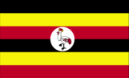
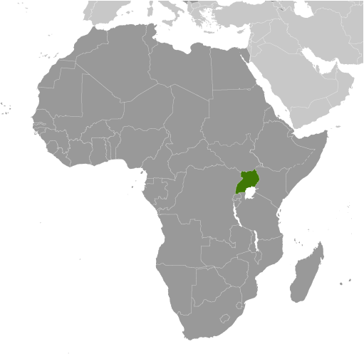
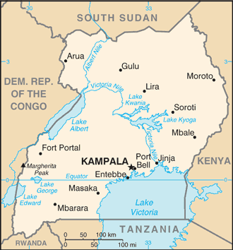

# Uganda

## Introduction

**_Background:_**   
The colonial boundaries created by Britain to delimit Uganda grouped together a wide range of ethnic groups with different political systems and cultures. These differences prevented the establishment of a working political community after independence was achieved in 1962. The dictatorial regime of Idi AMIN (1971-79) was responsible for the deaths of some 300,000 opponents; guerrilla war and human rights abuses under Milton OBOTE (1980-85) claimed at least another 100,000 lives. The rule of Yoweri MUSEVENI since 1986 has brought relative stability and economic growth to Uganda. A constitutional referendum in 2005 cancelled a 19-year ban on multi-party politics.

## Geography

**_Location:_**   
East-Central Africa, west of Kenya, east of the Democratic Republic of the Congo

**_Geographic coordinates:_**   
1 00 N, 32 00 E

**_Map references:_**   
Africa

**_Area:_**   
**total:** 241,038 sq km   
**land:** 197,100 sq km   
**water:** 43,938 sq km

**_Area - comparative:_**   
slightly smaller than Oregon

**_Land boundaries:_**   
**total:** 2,698 km   
**border countries:** Democratic Republic of the Congo 765 km, Kenya 933 km, Rwanda 169 km, South Sudan 435 km, Tanzania 396 km

**_Coastline:_**   
0 km (landlocked)

**_Maritime claims:_**   
none (landlocked)

**_Climate:_**   
tropical; generally rainy with two dry seasons (December to February, June to August); semiarid in northeast

**_Terrain:_**   
mostly plateau with rim of mountains

**_Elevation extremes:_**   
**lowest point:** Lake Albert 621 m   
**highest point:** Margherita Peak on Mount Stanley 5,110 m

**_Natural resources:_**   
copper, cobalt, hydropower, limestone, salt, arable land, gold

**_Land use:_**   
**arable land:** 27.94%   
**permanent crops:** 9.11%   
**other:** 62.95% (2011)

**_Irrigated land:_**   
144.2 sq km (2010)

**_Total renewable water resources:_**   
66 cu km (2011)

**_Freshwater withdrawal (domestic/industrial/agricultural):_**   
**total:** 0.32 cu km/yr (41%/16%/43%)   
**per capita:** 12.31 cu m/yr (2005)

**_Natural hazards:_**   
NA

**_Environment - current issues:_**   
draining of wetlands for agricultural use; deforestation; overgrazing; soil erosion; water hyacinth infestation in Lake Victoria; widespread poaching

**_Environment - international agreements:_**   
**party to:** Biodiversity, Climate Change, Climate Change-Kyoto Protocol, Desertification, Endangered Species, Hazardous Wastes, Law of the Sea, Marine Life Conservation, Ozone Layer Protection, Wetlands   
**signed, but not ratified:** Environmental Modification

**_Geography - note:_**   
landlocked; fertile, well-watered country with many lakes and rivers

## People and Society

**_Nationality:_**   
**noun:** Ugandan(s)   
**adjective:** Ugandan

**_Ethnic groups:_**   
Baganda 16.9%, Banyankole 9.5%, Basoga 8.4%, Bakiga 6.9%, Iteso 6.4%, Langi 6.1%, Acholi 4.7%, Bagisu 4.6%, Lugbara 4.2%, Bunyoro 2.7%, other 29.6% (2002 census)

**_Languages:_**   
English (official national language, taught in grade schools, used in courts of law and by most newspapers and some radio broadcasts), Ganda or Luganda (most widely used of the Niger-Congo languages, preferred for native language publications in the capital and may be taught in school), other Niger-Congo languages, Nilo-Saharan languages, Swahili, Arabic

**_Religions:_**   
Roman Catholic 41.9%, Protestant 42% (Anglican 35.9%, Pentecostal 4.6%, Seventh-Day Adventist 1.5%), Muslim 12.1%, other 3.1%, none 0.9% (2002 census)

**_Population:_**   
35,918,915   
**note:** estimates for this country explicitly take into account the effects of excess mortality due to AIDS; this can result in lower life expectancy, higher infant mortality, higher death rates, lower population growth rates, and changes in the distribution of population by age and sex than would otherwise be expected (July 2014 est.)

**_Age structure:_**   
**0-14 years:** 48.7% (male 8,714,354/female 8,765,900)   
**15-24 years:** 21.2% (male 3,775,679/female 3,833,574)   
**25-54 years:** 25.7% (male 4,618,088/female 4,615,616)   
**55-64 years:** 2.4% (male 405,740/female 447,118)   
**65 years and over:** 2.1% (male 327,771/female 415,075) (2014 est.)

**_Dependency ratios:_**   
**total dependency ratio:** 102.4 %   
**youth dependency ratio:** 97.5 %   
**elderly dependency ratio:** 4.9 %   
**potential support ratio:** 20.5 (2014 est.)

**_Median age:_**   
**total:** 15.5 years   
**male:** 15.5 years   
**female:** 15.6 years (2014 est.)

**_Population growth rate:_**   
3.24% (2014 est.)

**_Birth rate:_**   
44.17 births/1,000 population (2014 est.)

**_Death rate:_**   
10.97 deaths/1,000 population (2014 est.)

**_Net migration rate:_**   
-0.76 migrant(s)/1,000 population (2014 est.)

**_Urbanization:_**   
**urban population:** 15.6% of total population (2011)   
**rate of urbanization:** 5.74% annual rate of change (2010-15 est.)

**_Major urban areas - population:_**   
KAMPALA (capital) 1.659 million (2011)

**_Sex ratio:_**   
**at birth:** 1.03 male(s)/female   
**0-14 years:** 0.99 male(s)/female   
**15-24 years:** 0.99 male(s)/female   
**25-54 years:** 1 male(s)/female   
**55-64 years:** 0.99 male(s)/female   
**65 years and over:** 0.8 male(s)/female   
**total population:** 0.99 male(s)/female (2014 est.)

**_Mother's mean age at first birth:_**   
18.9   
**note:** median age at first birth among women 25-29 (2011 est.)

**_Maternal mortality rate:_**   
310 deaths/100,000 live births (2010)

**_Infant mortality rate:_**   
**total:** 60.82 deaths/1,000 live births   
**male:** 70.17 deaths/1,000 live births   
**female:** 51.18 deaths/1,000 live births (2014 est.)

**_Life expectancy at birth:_**   
**total population:** 54.46 years   
**male:** 53.1 years   
**female:** 55.86 years (2014 est.)

**_Total fertility rate:_**   
5.97 children born/woman (2014 est.)

**_Contraceptive prevalence rate:_**   
30% (2011)

**_Health expenditures:_**   
9.5% of GDP (2011)

**_Physicians density:_**   
0.12 physicians/1,000 population (2005)

**_Hospital bed density:_**   
0.5 beds/1,000 population (2010)

**_Drinking water source:_**   
**improved:** urban: 94.8% of population; rural: 71% of population; total: 74.8% of population   
**unimproved:** urban: 5.2% of population; rural: 29% of population; total: 25.2% of population (2012 est.)

**_Sanitation facility access:_**   
**improved:** urban: 32.8% of population; rural: 34.1% of population; total: 33.9% of population   
**unimproved:** urban: 67.2% of population; rural: 65.9% of population; total: 66.1% of population (2012 est.)

**_HIV/AIDS - adult prevalence rate:_**   
7.2% (2012 est.)

**_HIV/AIDS - people living with HIV/AIDS:_**   
1,549,200 (2012 est.)

**_HIV/AIDS - deaths:_**   
63,300 (2012 est.)

**_Major infectious diseases:_**   
**degree of risk:** very high   
**food or waterborne diseases:** bacterial diarrhea, hepatitis A and E, and typhoid fever   
**vectorborne diseases:** malaria, dengue fever, and trypanosomiasis-Gambiense (African sleeping sickness)   
**water contact disease:** schistosomiasis   
**animal contact disease:** rabies (2013)

**_Obesity - adult prevalence rate:_**   
4.3% (2008)

**_Children under the age of 5 years underweight:_**   
14.1% (2011)

**_Education expenditures:_**   
3.3% of GDP (2012)

**_Literacy:_**   
**definition:** age 15 and over can read and write   
**total population:** 73.2%   
**male:** 82.6%   
**female:** 64.6% (2010 est.)

**_School life expectancy (primary to tertiary education):_**   
**total:** 11 years   
**male:** 11 years   
**female:** 11 years (2009)

**_Child labor - children ages 5-14:_**   
**total number:** 117,266   
**percentage:** 25 %   
**note:** data represents children ages 5-17 working in the (2010 est.)

**_Unemployment, youth ages 15-24:_**   
**total:** 5.4% (2009)

## Government

**_Country name:_**   
**conventional long form:** Republic of Uganda   
**conventional short form:** Uganda

**_Government type:_**   
republic

**_Capital:_**   
**name:** Kampala   
**geographic coordinates:** 0 19 N, 32 33 E   
**time difference:** UTC+3 (8 hours ahead of Washington, DC, during Standard Time)

**_Administrative divisions:_**   
111 districts and 1 capital city\*; Abim, Adjumani, Agago, Alebtong, Amolatar, Amudat, Amuria, Amuru, Apac, Arua, Budaka, Bududa, Bugiri, Buhweju, Buikwe, Bukedea, Bukomansimbi, Bukwa, Bulambuli, Buliisa, Bundibugyo, Bushenyi, Busia, Butaleja, Butambala, Buvuma, Buyende, Dokolo, Gomba, Gulu, Hoima, Ibanda, Iganga, Isingiro, Jinja, Kaabong, Kabale, Kabarole, Kaberamaido, Kalangala, Kaliro, Kalungu, Kampala\*, Kamuli, Kamwenge, Kanungu, Kapchorwa, Kasese, Katakwi, Kayunga, Kibaale, Kiboga, Kibuku, Kiruhura, Kiryandongo, Kisoro, Kitgum, Koboko, Kole, Kotido, Kumi, Kween, Kyankwanzi, Kyegegwa, Kyenjojo, Lamwo, Lira, Luuka, Luwero, Lwengo, Lyantonde, Manafwa, Maracha, Masaka, Masindi, Mayuge, Mbale, Mbarara, Mitooma, Mityana, Moroto, Moyo, Mpigi, Mubende, Mukono, Nakapiripirit, Nakaseke, Nakasongola, Namayingo, Namutumba, Napak, Nebbi, Ngora, Ntoroko, Ntungamo, Nwoya, Otuke, Oyam, Pader, Pallisa, Rakai, Rubirizi, Rukungiri, Sembabule, Serere, Sheema, Sironko, Soroti, Tororo, Wakiso, Yumbe, Zombo

**_Independence:_**   
9 October 1962 (from the UK)

**_National holiday:_**   
Independence Day, 9 October (1962)

**_Constitution:_**   
several previous; latest adopted 27 September 1995, promulgated 8 October 1995; amended many times, last in 2005 (2011)

**_Legal system:_**   
mixed legal system of English common law and customary law

**_International law organization participation:_**   
accepts compulsory ICJ jurisdiction with reservations; accepts ICCt jurisdiction

**_Suffrage:_**   
18 years of age; universal

**_Executive branch:_**   
**chief of state:** President Lt. Gen. Yoweri Kaguta MUSEVENI (since seizing power on 26 January 1986); Vice President Edward SSEKANDI (since 24 May 2011) note - the president is both chief of state and head of government   
**head of government:** President Lt. Gen. Yoweri Kaguta MUSEVENI (since seizing power on 26 January 1986); Prime Minister Amama MBABAZI (since 24 May 2011); note - the prime minister assists the president in supervising the cabinet   
**cabinet:** Cabinet appointed by the president from among elected legislators   
**elections:** president elected by popular vote for a five-year term; election last held on 18 February 2011 (next to be held in 2016)   
**election results:** Lt. Gen. Yoweri Kaguta MUSEVENI re-elected president; percent of vote - Lt. Gen. Yoweri Kaguta MUSEVENI 68.4%, Kizza BESIGYE 26.0%, other 5.6%

**_Legislative branch:_**   
unicameral National Assembly (375 seats; 238 members elected by popular vote, 112 women directly elected, 25 nominated by legally established special interest groups [army 10, disabled 5, youth 5, labor 5], additional ex-officio members may be nominated by the president; members serve five-year terms)   
**elections:** last held on 18 February 2011 (next to be held in 2016)   
**election results:** percent of vote by party - NA; seats by party - NRM 263, FDC 34, DP 12, UPC 10, UPDF 10, CP 1, JEEMA 1, independents 43, vacant 1; note - UPDF is the Uganda People's Defense Force

**_Judicial branch:_**   
**highest court(s):** Supreme Court of Uganda (consists of the chief justice and 5 justices)   
**judge selection and term of office:** justices appointed by the president in consultation with the Judicial Service Commission (a 9-member independent advisory body) and with approval of the National Assembly; justices serve until mandatory retirement at age 70   
**subordinate courts:** Court of Appeal (also sits as the Constitutional Court); High Court (includes 10 High Court Circuits and 7 High Court Divisions); Chief Magistrate Grade One and Grade Two Courts

**_Political parties and leaders:_**   
Conservative Party or CP [Ken LUKYAMUZI]   
Democratic Party or DP [Norbert MAO]   
Forum for Democratic Change or FDC [Muntu MUGISHA]   
Inter-Party Co-operation or IPC (a coalition of opposition groups)   
Justice Forum or JEEMA [Asuman BASALIRWA]   
National Resistance Movement or NRM [Yoweri MUSEVENI]   
Peoples Progressive Party or PPP [Bidandi SSALI]   
Ugandan People's Congress or UPC [Olara OTUNNU]   
**note:** a national referendum in July 2005 opened the way for Uganda's transition to a multi-party political system

**_Political pressure groups and leaders:_**   
Lord's Resistance Army or LRA [Joseph KONY]   
Parliamentary Advocacy Forum or PAFO   
National Association of Women Organizations in Uganda or NAWOU [Florence NEKYON]   
The Ugandan Coalition for Political Accountability to Women or COPAW

**_International organization participation:_**   
ACP, AfDB, AU, C, COMESA, EAC, EADB, FAO, G-77, IAEA, IBRD, ICAO, ICC (NGOs), ICRM, IDA, IDB, IFAD, IFC, IFRCS, IGAD, ILO, IMF, Interpol, IOC, IOM, IPU, ISO (correspondent), ITSO, ITU, ITUC (NGOs), MIGA, NAM, OIC, OPCW, PCA, UN, UNAMID, UNCTAD, UNESCO, UNHCR, UNIDO, UNOCI, UNWTO, UPU, WCO, WFTU (NGOs), WHO, WIPO, WMO, WTO

**_Diplomatic representation in the US:_**   
**chief of mission:** Ambassador Oliver WONEKHA (since 6 June 2013)   
**chancery:** 5911 16th Street NW, Washington, DC 20011   
**telephone:** [1] (202) 726-7100 through 7102, 0416   
**FAX:** [1] (202) 726-1727

**_Diplomatic representation from the US:_**   
**chief of mission:** Ambassador Scott H. DELISI (since 18 July 2012)   
**embassy:** 1577 Ggaba Road, Kampala   
**mailing address:** P. O. Box 7007, Kampala   
**telephone:** [256] (414) 259 791 through 93, 95   
**FAX:** [256] (414) 259-794

**_Flag description:_**   
six equal horizontal bands of black (top), yellow, red, black, yellow, and red; a white disk is superimposed at the center and depicts a grey crowned crane (the national symbol) facing the hoist side; black symbolizes the African people, yellow sunshine and vitality, red African brotherhood; the crane was the military badge of Ugandan soldiers under the UK

**_National symbol(s):_**   
grey crowned crane

**_National anthem:_**   
**name:** "Oh Uganda, Land of Beauty!"   
**lyrics/music:** George Wilberforce KAKOMOA   
**note:** adopted 1962

## Economy

**_Economy - overview:_**   
Uganda has substantial natural resources, including fertile soils, regular rainfall, small deposits of copper, gold, and other minerals, and recently discovered oil. Uganda has never conducted a national minerals survey. Agriculture is the most important sector of the economy, employing over 80% of the work force. Coffee accounts for the bulk of export revenues. Since 1986, the government - with the support of foreign countries and international agencies - has acted to rehabilitate and stabilize the economy by undertaking currency reform, raising producer prices on export crops, increasing prices of petroleum products, and improving civil service wages. The policy changes are especially aimed at dampening inflation and boosting production and export earnings. Since 1990 economic reforms ushered in an era of solid economic growth based on continued investment in infrastructure, improved incentives for production and exports, lower inflation, better domestic security, and the return of exiled Indian-Ugandan entrepreneurs. The global economic downturn hurt Uganda's exports; however, Uganda's GDP growth has largely recovered due to past reforms and sound management of the downturn. Oil revenues and taxes will become a larger source of government funding as oil comes on line in the next few years. Instability in South Sudan is a risk for the Ugandan economy because Uganda's main export partner is Sudan, and Uganda is a key destination for Sudanese refugees. Unreliable power, high energy costs, inadequate transportation infrastructure, and corruption inhibit economic development and investor confidence.

**_GDP (purchasing power parity):_**   
$54.37 billion (2013 est.)   
$51.47 billion (2012 est.)   
$50.08 billion (2011 est.)   
**note:** data are in 2013 US dollars

**_GDP (official exchange rate):_**   
$22.6 billion (2013 est.)

**_GDP - real growth rate:_**   
5.6% (2013 est.)   
2.8% (2012 est.)   
6.2% (2011 est.)

**_GDP - per capita (PPP):_**   
$1,500 (2013 est.)   
$1,400 (2012 est.)   
$1,500 (2011 est.)   
**note:** data are in 2013 US dollars

**_Gross national saving:_**   
17.4% of GDP (2013 est.)   
14.7% of GDP (2012 est.)   
13.1% of GDP (2011 est.)

**_GDP - composition, by end use:_**   
**household consumption:** 82.3%   
**government consumption:** 7.6%   
**investment in fixed capital:** 25.5%   
**investment in inventories:** 0.2%   
**exports of goods and services:** 22.8%   
**imports of goods and services:** -38.3%; (2013 est.)

**_GDP - composition, by sector of origin:_**   
**agriculture:** 23.1%   
**industry:** 26.9%   
**services:** 50% (2013 est.)

**_Agriculture - products:_**   
coffee, tea, cotton, tobacco, cassava (manioc, tapioca), potatoes, corn, millet, pulses, cut flowers; beef, goat meat, milk, poultry

**_Industries:_**   
sugar, brewing, tobacco, cotton textiles; cement, steel production

**_Industrial production growth rate:_**   
3.8% (2013 est.)

**_Labor force:_**   
17.4 million (2013 est.)

**_Labor force - by occupation:_**   
**agriculture:** 82%   
**industry:** 5%   
**services:** 13% (1999 est.)

**_Unemployment rate:_**   
NA%

**_Population below poverty line:_**   
24.5% (2009 est.)

**_Household income or consumption by percentage share:_**   
**lowest 10%:** 2.4%   
**highest 10%:** 36.1% (2009 est.)

**_Distribution of family income - Gini index:_**   
44.3 (2009)   
45.7 (2002)

**_Budget:_**   
**revenues:** $3.2 billion   
**expenditures:** $3.803 billion (2013 est.)

**_Taxes and other revenues:_**   
14.2% of GDP (2013 est.)

**_Budget surplus (+) or deficit (-):_**   
-2.7% of GDP (2013 est.)

**_Public debt:_**   
30.7% of GDP (2013 est.)   
26.3% of GDP (2012 est.)

**_Fiscal year:_**   
1 July - 30 June

**_Inflation rate (consumer prices):_**   
6.2% (2013 est.)   
14% (2012 est.)

**_Central bank discount rate:_**   
14% (31 December 2010 est.)   
9.65% (31 December 2009 est.)

**_Commercial bank prime lending rate:_**   
23.7% (31 December 2013 est.)   
26.31% (31 December 2012 est.)

**_Stock of narrow money:_**   
$2.455 billion (31 December 2013 est.)   
$2.015 billion (31 December 2012 est.)

**_Stock of broad money:_**   
$4.049 billion (31 December 2013 est.)   
$3.293 billion (31 December 2012 est.)

**_Stock of domestic credit:_**   
$3.67 billion (31 December 2013 est.)   
$3.042 billion (31 December 2012 est.)

**_Market value of publicly traded shares:_**   
$7.294 billion (31 December 2012 est.)   
$7.727 billion (31 December 2011)   
$1.788 billion (31 December 2011 est.)

**_Current account balance:_**   
-$1.908 billion (2013 est.)   
-$2.232 billion (2012 est.)

**_Exports:_**   
$3.156 billion (2013 est.)   
$2.811 billion (2012 est.)

**_Exports - commodities:_**   
coffee, fish and fish products, tea, cotton, flowers, horticultural products; gold

**_Exports - partners:_**   
Kenya 12.3%, Rwanda 10.3%, UAE 10.2%, Democratic Republic of the Congo 9.4%, Netherlands 6.1%, Germany 5.6%, Italy 4.4% (2012)

**_Imports:_**   
$4.858 billion (2013 est.)   
$5.187 billion (2012 est.)

**_Imports - commodities:_**   
capital equipment, vehicles, petroleum, medical supplies; cereals

**_Imports - partners:_**   
Kenya 15.6%, UAE 15.4%, China 12.8%, India 11.7%, South Africa 4.1%, Japan 4% (2012)

**_Reserves of foreign exchange and gold:_**   
$3.579 billion (31 December 2013 est.)   
$3.167 billion (31 December 2012 est.)   
**note:** excludes gold

**_Debt - external:_**   
$5.223 billion (31 December 2013 est.)   
$4.461 billion (31 December 2012 est.)

**_Stock of direct foreign investment - at home:_**   
$NA

**_Stock of direct foreign investment - abroad:_**   
$NA

**_Exchange rates:_**   
Ugandan shillings (UGX) per US dollar -   
2,604.6 (2013 est.)   
2,505.6 (2012 est.)   
2,177.6 (2010 est.)   
2,030 (2009)   
1,658.1 (2008)

## Energy

**_Electricity - production:_**   
2.406 billion kWh (2010 est.)

**_Electricity - consumption:_**   
2.192 billion kWh (2010 est.)

**_Electricity - exports:_**   
75 million kWh (2010)

**_Electricity - imports:_**   
29 million kWh (2011 est.)

**_Electricity - installed generating capacity:_**   
539,000 kW (2010 est.)

**_Electricity - from fossil fuels:_**   
31.5% of total installed capacity (2010 est.)

**_Electricity - from nuclear fuels:_**   
0% of total installed capacity (2010 est.)

**_Electricity - from hydroelectric plants:_**   
65.3% of total installed capacity (2010 est.)

**_Electricity - from other renewable sources:_**   
3.2% of total installed capacity (2010 est.)

**_Crude oil - production:_**   
0 bbl/day (2012 est.)

**_Crude oil - exports:_**   
0 bbl/day (2010 est.)

**_Crude oil - imports:_**   
0 bbl/day (2010 est.)

**_Crude oil - proved reserves:_**   
2.5 billion bbl (1 January 2010 est.)

**_Refined petroleum products - production:_**   
0 bbl/day (2010 est.)

**_Refined petroleum products - consumption:_**   
16,930 bbl/day (2011 est.)

**_Refined petroleum products - exports:_**   
0 bbl/day (2010 est.)

**_Refined petroleum products - imports:_**   
22,990 bbl/day (2010 est.)

**_Natural gas - production:_**   
0 cu m (2011 est.)

**_Natural gas - consumption:_**   
0 cu m (2010 est.)

**_Natural gas - exports:_**   
0 cu m (2011 est.)

**_Natural gas - imports:_**   
0 cu m (2011 est.)

**_Natural gas - proved reserves:_**   
14.16 billion cu m (1 January 2013 est.)

**_Carbon dioxide emissions from consumption of energy:_**   
3.244 million Mt (2011 est.)

## Communications

**_Telephones - main lines in use:_**   
315,000 (2012)

**_Telephones - mobile cellular:_**   
16.355 million (2012)

**_Telephone system:_**   
**general assessment:** mobile cellular service is increasing rapidly, but the number of main lines is still deficient; work underway on a national backbone information and communications technology infrastructure; international phone networks and Internet connectivity provided through satellite and VSAT applications   
**domestic:** intercity traffic by wire, microwave radio relay, and radiotelephone communication stations, fixed and mobile-cellular systems for short-range traffic; mobile-cellular teledensity about 50 per 100 persons in 2010   
**international:** country code - 256; satellite earth stations - 1 Intelsat (Atlantic Ocean) and 1 Inmarsat; analog links to Kenya and Tanzania (2011)

**_Broadcast media:_**   
public broadcaster, Uganda Broadcasting Corporation (UBC), operates radio and TV networks; Uganda first began licensing privately owned stations in the 1990s; by 2007 there were nearly 150 radio and 35 TV stations, mostly based in and around Kampala; transmissions of multiple international broadcasters are available in Kampala (2007)

**_Internet country code:_**   
.ug

**_Internet hosts:_**   
32,683 (2012)

**_Internet users:_**   
3.2 million (2009)

## Transportation

**_Airports:_**   
47 (2013)

**_Airports - with paved runways:_**   
**total:** 5   
**over 3,047 m:** 3   
**1,524 to 2,437 m:** 1   
**914 to 1,523 m:** 1 (2013)

**_Airports - with unpaved runways:_**   
**total:** 42   
**over 3,047 m:** 1   
**1,524 to 2,437 m:** 8   
**914 to 1,523 m:** 26   
**under 914 m:** 7 (2013)

**_Railways:_**   
**total:** 1,244 km   
**narrow gauge:** 1,244 km 1.000-m gauge (2008)

**_Roadways:_**   
**total:** 20,000 km (does not include local roads)   
**paved:** 3,264 km   
**unpaved:** 16,736 km (2011)

**_Waterways:_**   
(there are no long navigable stretches of river in Uganda; parts of the Albert Nile that flow out of Lake Albert in the northwestern part of the country are navigable; several lakes including Lake Victoria and Lake Kyoga have substantial traffic; Lake Albert is navigable along a 200-km stretch from its northern tip to its southern shores) (2011)

**_Ports and terminals:_**   
**lake port(s):** Entebbe, Jinja, Port Bell (Lake Victoria)

## Military

**_Military branches:_**   
Uganda People's Defense Force (UPDF): Land Forces (includes Marine Unit), Uganda Air Force (2013)

**_Military service age and obligation:_**   
18-26 years of age for voluntary military duty; 18-30 years of age for professionals; no conscription; 9-year service obligation; the government has stated that while recruitment under 18 years of age could occur with proper consent, "no person under the apparent age of 18 years shall be enrolled in the armed forces"; Ugandan citizenship and secondary education required (2012)

**_Manpower available for military service:_**   
**males age 16-49:** 7,249,271   
**females age 16-49:** 7,025,439 (2010 est.)

**_Manpower fit for military service:_**   
**males age 16-49:** 4,313,068   
**females age 16-49:** 4,200,901 (2010 est.)

**_Manpower reaching militarily significant age annually:_**   
**male:** 423,923   
**female:** 420,236 (2010 est.)

**_Military expenditures:_**   
1.45% of GDP (2012)   
3.73% of GDP (2011)   
1.45% of GDP (2010)

## Transnational Issues

**_Disputes - international:_**   
Uganda is subject to armed fighting among hostile ethnic groups, rebels, armed gangs, militias, and various government forces that extend across its borders; Ugandan refugees as well as members of the Lord's Resistance Army (LRA) seek shelter in southern Sudan and the Democratic Republic of the Congo's Garamba National Park; LRA forces have also attacked Kenyan villages across the border

**_Refugees and internally displaced persons:_**   
**refugees (country of origin):** 155,742 (Democratic Republic of Congo); 13,376 (Rwanda); 10,578 (Burundi) (2013); 137,844 (South Sudan); 18,534 (Somalia) (2014)

............................................................   
_Page last updated on June 20, 2014_
