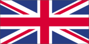
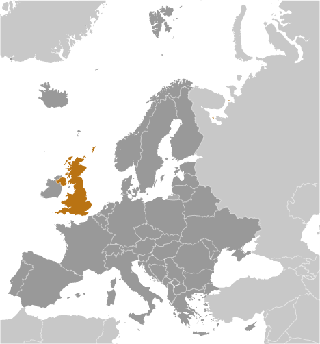
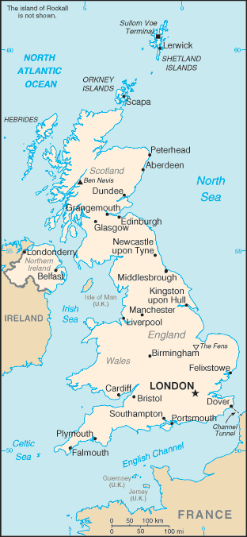

# United Kingdom

## Introduction

**_Background:_**   
The United Kingdom has historically played a leading role in developing parliamentary democracy and in advancing literature and science. At its zenith in the 19th century, the British Empire stretched over one-fourth of the earth's surface. The first half of the 20th century saw the UK's strength seriously depleted in two world wars and the Irish Republic's withdrawal from the union. The second half witnessed the dismantling of the Empire and the UK rebuilding itself into a modern and prosperous European nation. As one of five permanent members of the UN Security Council and a founding member of NATO and the Commonwealth, the UK pursues a global approach to foreign policy. The UK is also an active member of the EU, although it chose to remain outside the Economic and Monetary Union. The Scottish Parliament, the National Assembly for Wales, and the Northern Ireland Assembly were established in 1999. The latter was suspended until May 2007 due to wrangling over the peace process, but devolution was fully completed in March 2010.

## Geography

**_Location:_**   
Western Europe, islands - including the northern one-sixth of the island of Ireland - between the North Atlantic Ocean and the North Sea; northwest of France

**_Geographic coordinates:_**   
54 00 N, 2 00 W

**_Map references:_**   
Europe

**_Area:_**   
**total:** 243,610 sq km   
**land:** 241,930 sq km   
**water:** 1,680 sq km   
**note:** includes Rockall and Shetland Islands

**_Area - comparative:_**   
twice the size of Pennsylvania; slightly smaller than Oregon

**_Land boundaries:_**   
**total:** 360 km   
**border countries:** Ireland 360 km

**_Coastline:_**   
12,429 km

**_Maritime claims:_**   
**territorial sea:** 12 nm   
**exclusive fishing zone:** 200 nm   
**continental shelf:** as defined in continental shelf orders or in accordance with agreed upon boundaries

**_Climate:_**   
temperate; moderated by prevailing southwest winds over the North Atlantic Current; more than one-half of the days are overcast

**_Terrain:_**   
mostly rugged hills and low mountains; level to rolling plains in east and southeast

**_Elevation extremes:_**   
**lowest point:** The Fens -4 m   
**highest point:** Ben Nevis 1,343 m

**_Natural resources:_**   
coal, petroleum, natural gas, iron ore, lead, zinc, gold, tin, limestone, salt, clay, chalk, gypsum, potash, silica sand, slate, arable land

**_Land use:_**   
**arable land:** 24.88%   
**permanent crops:** 0.18%   
**other:** 74.93% (2011)

**_Irrigated land:_**   
2,280 sq km (2005)

**_Total renewable water resources:_**   
147 cu km (2011)

**_Freshwater withdrawal (domestic/industrial/agricultural):_**   
**total:** 13.03 cu km/yr (58%/33%/9%)   
**per capita:** 213.2 cu m/yr (2008)

**_Natural hazards:_**   
winter windstorms; floods

**_Environment - current issues:_**   
continues to reduce greenhouse gas emissions (has met Kyoto Protocol target of a 12.5% reduction from 1990 levels and intends to meet the legally binding target and move toward a domestic goal of a 20% cut in emissions by 2010); by 2005 the government reduced the amount of industrial and commercial waste disposed of in landfill sites to 85% of 1998 levels and recycled or composted at least 25% of household waste, increasing to 33% by 2015

**_Environment - international agreements:_**   
**party to:** Air Pollution, Air Pollution-Nitrogen Oxides, Air Pollution-Persistent Organic Pollutants, Air Pollution-Sulfur 94, Air Pollution-Volatile Organic Compounds, Antarctic-Environmental Protocol, Antarctic-Marine Living Resources, Antarctic Seals, Antarctic Treaty, Biodiversity, Climate Change, Climate Change-Kyoto Protocol, Desertification, Endangered Species, Environmental Modification, Hazardous Wastes, Law of the Sea, Marine Dumping, Marine Life Conservation, Ozone Layer Protection, Ship Pollution, Tropical Timber 83, Tropical Timber 94, Wetlands, Whaling   
**signed, but not ratified:** none of the selected agreements

**_Geography - note:_**   
lies near vital North Atlantic sea lanes; only 35 km from France and linked by tunnel under the English Channel; because of heavily indented coastline, no location is more than 125 km from tidal waters

## People and Society

**_Nationality:_**   
**noun:** Briton(s), British (collective plural)   
**adjective:** British

**_Ethnic groups:_**   
white 87.2%, black/African/Caribbean/black British 3%, Asian/Asian British: Indian 2.3%, Asian/Asian British: Pakistani 1.9%, mixed 2%, other 3.7% (2011 est.)

**_Languages:_**   
English   
**note:** the following are recognized regional languages: Scots (about 30% of the population of Scotland), Scottish Gaelic (about 60,000 in Scotland), Welsh (about 20% of the population of Wales), Irish (about 10% of the population of Northern Ireland), Cornish (some 2,000 to 3,000 in Cornwall) (2012)

**_Religions:_**   
Christian (includes Anglican, Roman Catholic, Presbyterian, Methodist) 59.5%, Muslim 4.4%, Hindu 1.3%, other 2%, none 25.7%, unspecified 7.2% (2011 est.)

**_Population:_**   
63,742,977 (July 2014 est.)

**_Age structure:_**   
**0-14 years:** 17.3% (male 5,660,891/female 5,380,448)   
**15-24 years:** 12.6% (male 4,116,859/female 3,945,146)   
**25-54 years:** 41% (male 13,299,731/female 12,843,937)   
**55-64 years:** 11.5% (male 3,621,110/female 3,702,717)   
**65 years and over:** 17.3% (male 4,990,024/female 6,182,114) (2014 est.)

**_Dependency ratios:_**   
**total dependency ratio:** 54.8 %   
**youth dependency ratio:** 27.2 %   
**elderly dependency ratio:** 27.6 %   
**potential support ratio:** 3.6 (2014 est.)

**_Median age:_**   
**total:** 40.4 years   
**male:** 39.2 years   
**female:** 41.6 years (2014 est.)

**_Population growth rate:_**   
0.54% (2014 est.)

**_Birth rate:_**   
12.22 births/1,000 population (2014 est.)

**_Death rate:_**   
9.34 deaths/1,000 population (2014 est.)

**_Net migration rate:_**   
2.56 migrant(s)/1,000 population (2014 est.)

**_Urbanization:_**   
**urban population:** 79.6% of total population (2011)   
**rate of urbanization:** 0.76% annual rate of change (2010-15 est.)

**_Major urban areas - population:_**   
LONDON (capital) 9.005 million; Birmingham 2.272 million; Manchester 2.213 million; West Yorkshire 1.625 million; Glasgow 1.137 million; Newcastle upon Tyne 874,000 (2011)

**_Sex ratio:_**   
**at birth:** 1.05 male(s)/female   
**0-14 years:** 1.05 male(s)/female   
**15-24 years:** 1.04 male(s)/female   
**25-54 years:** 1.04 male(s)/female   
**55-64 years:** 0.99 male(s)/female   
**65 years and over:** 0.8 male(s)/female   
**total population:** 0.99 male(s)/female (2014 est.)

**_Mother's mean age at first birth:_**   
27.8   
**note:** data refer to England and Wales (2010 est.)

**_Maternal mortality rate:_**   
12 deaths/100,000 live births (2010)

**_Infant mortality rate:_**   
**total:** 4.44 deaths/1,000 live births   
**male:** 4.86 deaths/1,000 live births   
**female:** 4 deaths/1,000 live births (2014 est.)

**_Life expectancy at birth:_**   
**total population:** 80.42 years   
**male:** 78.26 years   
**female:** 82.69 years (2014 est.)

**_Total fertility rate:_**   
1.9 children born/woman (2014 est.)

**_Contraceptive prevalence rate:_**   
84%   
**note:** percent of women aged 16-49 (2008/09)

**_Health expenditures:_**   
9.3% of GDP (2011)

**_Physicians density:_**   
2.77 physicians/1,000 population (2011)

**_Hospital bed density:_**   
3 beds/1,000 population (2010)

**_Drinking water source:_**   
**improved:** urban: 100% of population; rural: 100% of population; total: 100% of population   
**unimproved:** urban: 0% of population; rural: 0% of population; total: 0% of population (2012 est.)

**_Sanitation facility access:_**   
**improved:** urban: 100% of population; rural: 100% of population; total: 100% of population   
**unimproved:** urban: 0% of population; rural: 0% of population; total: 0% of population (2012 est.)

**_HIV/AIDS - adult prevalence rate:_**   
0.2% (2009 est.)

**_HIV/AIDS - people living with HIV/AIDS:_**   
85,000 (2009 est.)

**_HIV/AIDS - deaths:_**   
fewer than 1,000 (2009 est.)

**_Obesity - adult prevalence rate:_**   
26.9% (2008)

**_Education expenditures:_**   
6.2% of GDP (2010)

**_Literacy:_**   
**definition:** age 15 and over has completed five or more years of schooling   
**total population:** 99%   
**male:** 99%   
**female:** 99% (2003 est.)

**_School life expectancy (primary to tertiary education):_**   
**total:** 16 years   
**male:** 16 years   
**female:** 17 years (2011)

**_Unemployment, youth ages 15-24:_**   
**total:** 21%   
**male:** 23.8%   
**female:** 17.9% (2012)

## Government

**_Country name:_**   
**conventional long form:** United Kingdom of Great Britain and Northern Ireland; note - Great Britain includes England, Scotland, and Wales   
**conventional short form:** United Kingdom   
**abbreviation:** UK

**_Government type:_**   
constitutional monarchy and Commonwealth realm

**_Capital:_**   
**name:** London   
**geographic coordinates:** 51 30 N, 0 05 W   
**time difference:** UTC 0 (5 hours ahead of Washington, DC, during Standard Time)   
**daylight saving time:** +1hr, begins last Sunday in March; ends last Sunday in October   
**note:** applies to the United Kingdom proper, not to its overseas dependencies or territories

**_Administrative divisions:_**   
**England:** 27 two-tier counties, 32 London boroughs and 1 City of London or Greater London, 36 metropolitan districts, 56 unitary authorities (including 4 single-tier counties\*)   
**two-tier counties:** Buckinghamshire, Cambridgeshire, Cumbria, Derbyshire, Devon, Dorset, East Sussex, Essex, Gloucestershire, Hampshire, Hertfordshire, Kent, Lancashire, Leicestershire, Lincolnshire, Norfolk, North Yorkshire, Northamptonshire, Nottinghamshire, Oxfordshire, Somerset, Staffordshire, Suffolk, Surrey, Warwickshire, West Sussex, Worcestershire   
**London boroughs and City of London or Greater London:** Barking and Dagenham, Barnet, Bexley, Brent, Bromley, Camden, Croydon, Ealing, Enfield, Greenwich, Hackney, Hammersmith and Fulham, Haringey, Harrow, Havering, Hillingdon, Hounslow, Islington, Kensington and Chelsea, Kingston upon Thames, Lambeth, Lewisham, City of London, Merton, Newham, Redbridge, Richmond upon Thames, Southwark, Sutton, Tower Hamlets, Waltham Forest, Wandsworth, Westminster   
**metropolitan districts:** Barnsley, Birmingham, Bolton, Bradford, Bury, Calderdale, Coventry, Doncaster, Dudley, Gateshead, Kirklees, Knowlsey, Leeds, Liverpool, Manchester, Newcastle upon Tyne, North Tyneside, Oldham, Rochdale, Rotherham, Salford, Sandwell, Sefton, Sheffield, Solihull, South Tyneside, St. Helens, Stockport, Sunderland, Tameside, Trafford, Wakefield, Walsall, Wigan, Wirral, Wolverhampton   
**unitary authorities:** Bath and North East Somerset, Blackburn with Darwen, Bedford, Blackpool, Bournemouth, Bracknell Forest, Brighton and Hove, City of Bristol, Central Bedfordshire, Cheshire East, Cheshire West and Chester, Cornwall, Darlington, Derby, Durham County\*, East Riding of Yorkshire, Halton, Hartlepool, Herefordshire\*, Isle of Wight\*, Isles of Scilly, City of Kingston upon Hull, Leicester, Luton, Medway, Middlesbrough, Milton Keynes, North East Lincolnshire, North Lincolnshire, North Somerset, Northumberland\*, Nottingham, Peterborough, Plymouth, Poole, Portsmouth, Reading, Redcar and Cleveland, Rutland, Shropshire, Slough, South Gloucestershire, Southampton, Southend-on-Sea, Stockton-on-Tees, Stoke-on-Trent, Swindon, Telford and Wrekin, Thurrock, Torbay, Warrington, West Berkshire, Wiltshire, Windsor and Maidenhead, Wokingham, York   
**Northern Ireland:** 13 borough councils, 11 district council areas, 1 city and district council, 1 city council   
**borough councils:** Antrim, Ards, Ballymena, Ballymoney, Carrickfergus, Castlereagh, Coleraine, Craigavon, Dungannon and South Tyrone, Larne, Limavady, Newtownabbey, North Down   
**city and district councils:** Armagh   
**city councils:** Lisburn   
**district council areas:** Belfast, Banbridge, Cookstown, Derry, Down, Fermanagh, Magherafelt, Moyle, Newry and Mourne, Omagh, Strabane   
**Scotland:** 32 council areas   
**council areas:** Aberdeen City, Aberdeenshire, Angus, Argyll and Bute, Clackmannanshire, Dumfries and Galloway, Dundee City, East Ayrshire, East Dunbartonshire, East Lothian, East Renfrewshire, City of Edinburgh, Eilean Siar (Western Isles), Falkirk, Fife, Glasgow City, Highland, Inverclyde, Midlothian, Moray, North Ayrshire, North Lanarkshire, Orkney Islands, Perth and Kinross, Renfrewshire, Shetland Islands, South Ayrshire, South Lanarkshire, Stirling, The Scottish Borders, West Dunbartonshire, West Lothian   
**Wales:** 22 unitary authorities   
**unitary authorities:** Blaenau Gwent, Bridgend, Caerphilly, Cardiff, Carmarthenshire, Ceredigion, Conwy, Denbighshire, Flintshire, Gwynedd, Isle of Anglesey, Merthyr Tydfil, Monmouthshire, Neath Port Talbot, Newport, Pembrokeshire, Powys, Rhondda Cynon Taff, Swansea, The Vale of Glamorgan, Torfaen, Wrexham

**_Dependent areas:_**   
Anguilla, Bermuda, British Indian Ocean Territory, British Virgin Islands, Cayman Islands, Falkland Islands, Gibraltar, Montserrat, Pitcairn Islands, Saint Helena, Ascension, and Tristan da Cunha, South Georgia and the South Sandwich Islands, Turks and Caicos Islands

**_Independence:_**   
12 April 1927 (Royal and Parliamentary Titles Act establishes current name of the United Kingdom of Great Britain and Northern Ireland); notable earlier dates: 927 (minor English kingdoms united); 3 March 1284 (enactment of the Statute of Rhuddlan uniting England and Wales); 1536 (Act of Union formally incorporates England and Wales); 1 May 1707 (Acts of Union formally unite England and Scotland as Great Britain); 1 January 1801 (Acts of Union formally unite Great Britain and Ireland as the United Kingdom of Great Britain and Ireland); 6 December 1921 (Anglo-Irish Treaty formalizes partition of Ireland; six counties remain part of the United Kingdom and Northern Ireland)

**_National holiday:_**   
the UK does not celebrate one particular national holiday

**_Constitution:_**   
unwritten; partly statutes, partly common law and practice; note - recent additions include the Human Rights Act of 1998, the Constitutional Reform and Governance Act 2010, the Parliamentary Voting System and Constituencies Act 2011, and the Fixed-term Parliaments Act 2011 (2011)

**_Legal system:_**   
common law system; has nonbinding judicial review of Acts of Parliament under the Human Rights Act of 1998

**_International law organization participation:_**   
accepts compulsory ICJ jurisdiction with reservations; accepts ICCt jurisdiction

**_Suffrage:_**   
18 years of age; universal

**_Executive branch:_**   
**chief of state:** Queen ELIZABETH II (since 6 February 1952); Heir Apparent Prince CHARLES (son of the queen, born 14 November 1948)   
**head of government:** Prime Minister David CAMERON (since 11 May 2010)   
**cabinet:** Cabinet of Ministers appointed by the prime minister   
**elections:** the monarchy is hereditary; following legislative elections, the leader of the majority party or the leader of the majority coalition usually becomes the prime minister

**_Legislative branch:_**   
bicameral Parliament consists of House of Lords; note - membership is not fixed (780 seats; consisting of approximately 667 life peers, 88 hereditary peers, and 25 clergy - as of 13 January 2014) and House of Commons (650 seats since 2010 elections; members elected by popular vote to serve five-year terms unless the House is dissolved earlier)   
**elections:** House of Lords - no elections (note - in 1999, as provided by the House of Lords Act, elections were held in the House of Lords to determine the 92 hereditary peers who would remain there; elections are held only as vacancies in the hereditary peerage arise); House of Commons - last held on 6 May 2010 (next to be held by June 2015)   
**election results:** House of Commons - percent of vote by party - Conservative 36.1%, Labor 29%, Liberal Democrats 23%, other 11.9%; seats by party - Conservative 305, Labor 258, Liberal Democrat 57, other 30   
**note:** in 1998 elections were held for a Northern Ireland Assembly (because of unresolved disputes among existing parties, the transfer of power from London to Northern Ireland came only at the end of 1999 and has been suspended four times, the latest occurring in October 2002 and lasting until 8 May 2007); in 1999, the UK held the first elections for a Scottish Parliament and a Welsh Assembly; the most recent elections for the Northern Ireland Assembly, the Scottish Parliament, and the Welsh Assembly took place in May 2011

**_Judicial branch:_**   
**highest court(s):** Supreme Court (consists of 12 justices including the court president and deputy president); note - the Supreme Court was established by the Constitutional Reform Act 2005 and implemented in October 2009, replacing the Appellate Committee of the House of Lords as the highest court in the United Kingdom   
**judge selection and term of office:** judge candidates selected by an independent committee of several judicial commissions, followed by their recommendations to the prime minister, and appointed by Her Majesty The Queen; justices appointed during period of good behavior   
**subordinate courts:** England and Wales - Court of Appeal (civil and criminal divisions); High Court; Crown Court; County Courts; Magistrates' Courts; Scotland - Court of Sessions; Sherrif Courts; High Court of Justiciary; tribunals; Northern Ireland - Court of Appeal in Northern Ireland; High Court; county courts; magistrates' courts; specialized tribunals

**_Political parties and leaders:_**   
Conservative [David CAMERON]   
Alliance Party (Northerm Ireland) [David FORD]   
Democratic Unionist Party or DUP (Northern Ireland) [Peter ROBINSON]   
Labor Party [Ed MILIBAND]   
Liberal Democrats (Lib Dems) [Nick CLEGG]   
Party of Wales (Plaid Cymru) [Leanne WOOD]   
Scottish National Party or SNP [Alex SALMOND]   
Sinn Fein (Northern Ireland) [Gerry ADAMS]   
Social Democratic and Labor Party or SDLP (Northern Ireland) [Alasdair MCDONNELL]   
Ulster Unionist Party (Northern Ireland) [Mike NESBITT]   
United Kingdom Independent Party or UKIP [Nigel FARAGE]

**_Political pressure groups and leaders:_**   
Campaign for Nuclear Disarmament   
Confederation of British Industry   
National Farmers' Union   
Trades Union Congress

**_International organization participation:_**   
ADB (nonregional member), AfDB (nonregional member), Arctic Council (observer), Australia Group, BIS, C, CBSS (observer), CD, CDB, CE, CERN, EAPC, EBRD, EIB, EITI (implementing country), ESA, EU, FAO, FATF, G-20, G-5, G-7, G-8, G-10, IADB, IAEA, IBRD, ICAO, ICC (national committees), ICRM, IDA, IEA, IFAD, IFC, IFRCS, IGAD (partners), IHO, ILO, IMF, IMO, IMSO, Interpol, IOC, IOM, IPU, ISO, ITSO, ITU, ITUC (NGOs), MIGA, MINUSMA, MONUSCO, NATO, NEA, NSG, OAS (observer), OECD, OPCW, OSCE, Pacific Alliance (observer), Paris Club, PCA, PIF (partner), SELEC (observer), UN, UNCTAD, UNESCO, UNFICYP, UNHCR, UNIDO, UNISFA, UNMISS, UNRWA, UNSC (permanent), UPU, WCO, WHO, WIPO, WMO, WTO, ZC

**_Diplomatic representation in the US:_**   
**chief of mission:** Ambassador Peter John WESTMACOTT (since 17 January 2012)   
**chancery:** 3100 Massachusetts Avenue NW, Washington, DC 20008   
**telephone:** [1] (202) 588-6500   
**FAX:** [1] (202) 588-7850   
**consulate(s) general:** Atlanta, Boston, Chicago, Denver, Houston, Los Angeles, Miami, New York, San Francisco   
**consulate(s):** Dallas, Orlando (FL)

**_Diplomatic representation from the US:_**   
**chief of mission:** Ambassador Matthew W. BARZUN (since 15 August 2013)   
**embassy:** 24 Grosvenor Square, London, W1K 6AH note - a new embassy is scheduled to open by the end of 2017 in the Nine Elms area of Wandsworth   
**mailing address:** PSC 801, Box 40, FPO AE 09498-4040   
**telephone:** [44] (0) 20 7499-9000   
**FAX:** [44] (0) 20 7629-9124   
**consulate(s) general:** Belfast, Edinburgh

**_Flag description:_**   
blue field with the red cross of Saint George (patron saint of England) edged in white superimposed on the diagonal red cross of Saint Patrick (patron saint of Ireland), which is superimposed on the diagonal white cross of Saint Andrew (patron saint of Scotland); properly known as the Union Flag, but commonly called the Union Jack; the design and colors (especially the Blue Ensign) have been the basis for a number of other flags including other Commonwealth countries and their constituent states or provinces, and British overseas territories

**_National symbol(s):_**   
lion (Britain in general); lion, Tudor rose (England); lion, unicorn, thistle (Scotland); dragon, daffodil, leek (Wales); harp, flax (Northern Ireland)

**_National anthem:_**   
**name:** "God Save the Queen"   
**lyrics/music:** unknown   
**note:** in use since 1745; by tradition, the song serves as both the national and royal anthem of the United Kingdom; it is known as either "God Save the Queen" or "God Save the King," depending on the gender of the reigning monarch; it also serves as the royal anthem of many Commonwealth nations

## Economy

**_Economy - overview:_**   
The UK, a leading trading power and financial center, is the third largest economy in Europe after Germany and France. Over the past two decades, the government has greatly reduced public ownership. Agriculture is intensive, highly mechanized, and efficient by European standards, producing about 60% of food needs with less than 2% of the labor force. The UK has large coal, natural gas, and oil resources, but its oil and natural gas reserves are declining and the UK became a net importer of energy in 2005. Services, particularly banking, insurance, and business services, are key drivers of British GDP growth. Manufacturing, meanwhile, has declined in importance but still accounts for about 10% of economic output. After emerging from recession in 1992, Britain's economy enjoyed the longest period of expansion on record during which time growth outpaced most of Western Europe. In 2008, however, the global financial crisis hit the economy particularly hard, due to the importance of its financial sector. Falling home prices, high consumer debt, and the global economic slowdown compounded Britain's economic problems, pushing the economy into recession in the latter half of 2008 and prompting the then BROWN (Labour) government to implement a number of measures to stimulate the economy and stabilize the financial markets; these included nationalizing parts of the banking system, temporarily cutting taxes, suspending public sector borrowing rules, and moving forward public spending on capital projects. Facing burgeoning public deficits and debt levels, in 2010 the CAMERON-led coalition government (between Conservatives and Liberal Democrats) initiated a five-year austerity program, which aimed to lower London's budget deficit from about 11% of GDP in 2010 to nearly 1% by 2015. In November 2011, Chancellor of the Exchequer George OSBORNE announced additional austerity measures through 2017 largely due to the euro-zone debt crisis. The CAMERON government raised the value added tax from 17.5% to 20% in 2011. It has pledged to reduce the corporation tax rate to 21% by 2014. The Bank of England (BoE) implemented an asset purchase program of £375 billion (approximately $605 billion) as of December 2013. During times of economic crisis, the BoE coordinates interest rate moves with the European Central Bank, but Britain remains outside the European Economic and Monetary Union (EMU). In 2012, weak consumer spending and subdued business investment weighed on the economy, however, in 2013 GDP grew 1.4%, accelerating unexpectedly in the second half of the year because of greater consumer spending and a recovering housing market. The budget deficit is falling but remains high at nearly 7% and public debt has continued to increase.

**_GDP (purchasing power parity):_**   
$2.387 trillion (2013 est.)   
$2.343 trillion (2012 est.)   
$2.341 trillion (2011 est.)   
**note:** data are in 2013 US dollars

**_GDP (official exchange rate):_**   
$2.49 trillion (2013 est.)

**_GDP - real growth rate:_**   
1.8% (2013 est.)   
0.1% (2012 est.)   
0.9% (2011 est.)

**_GDP - per capita (PPP):_**   
$37,300 (2013 est.)   
$37,100 (2012 est.)   
$37,300 (2011 est.)   
**note:** data are in 2013 US dollars

**_Gross national saving:_**   
10.5% of GDP (2013 est.)   
11% of GDP (2012 est.)   
13.7% of GDP (2011 est.)

**_GDP - composition, by end use:_**   
**household consumption:** 66.5%   
**government consumption:** 21.4%   
**investment in fixed capital:** 13.8%   
**investment in inventories:** 0.4%   
**exports of goods and services:** 31.1%   
**imports of goods and services:** -33.2%; (2013 est.)

**_GDP - composition, by sector of origin:_**   
**agriculture:** 0.7%   
**industry:** 20.5%   
**services:** 78.9% (2013 est.)

**_Agriculture - products:_**   
cereals, oilseed, potatoes, vegetables; cattle, sheep, poultry; fish

**_Industries:_**   
machine tools, electric power equipment, automation equipment, railroad equipment, shipbuilding, aircraft, motor vehicles and parts, electronics and communications equipment, metals, chemicals, coal, petroleum, paper and paper products, food processing, textiles, clothing, other consumer goods

**_Industrial production growth rate:_**   
-0.3% (2013 est.)

**_Labor force:_**   
30.15 million (2013 est.)

**_Labor force - by occupation:_**   
**agriculture:** 1.4%   
**industry:** 18.2%   
**services:** 80.4% (2006 est.)

**_Unemployment rate:_**   
7.2% (2013 est.)   
7.8% (2012 est.)

**_Population below poverty line:_**   
16.2% (2011 est.)

**_Household income or consumption by percentage share:_**   
**lowest 10%:** 1.7%   
**highest 10%:** 31.1% (2012)

**_Distribution of family income - Gini index:_**   
32.3 (2012)   
34 (2005)

**_Budget:_**   
**revenues:** $1.023 trillion   
**expenditures:** $1.112 trillion (2013 est.)

**_Taxes and other revenues:_**   
41.1% of GDP (2013 est.)

**_Budget surplus (+) or deficit (-):_**   
-3.6% of GDP (2013 est.)

**_Public debt:_**   
91.1% of GDP (2013 est.)   
88.7% of GDP (2012 est.)   
**note:** data cover general government debt, and include debt instruments issued (or owned) by government entities other than the treasury; the data include treasury debt held by foreign entities; the data include debt issued by subnational entities, as well as intra-governmental debt; intra-governmental debt consists of treasury borrowings from surpluses in the social funds, such as for retirement, medical care, and unemployment; debt instruments for the social funds are not sold at public auctions

**_Fiscal year:_**   
6 April - 5 April

**_Inflation rate (consumer prices):_**   
2% (2013 est.)   
2.7% (2012 est.)

**_Central bank discount rate:_**   
0.5% (31 December 2013 est.)   
0.5% (2012 est.)

**_Commercial bank prime lending rate:_**   
4.4% (31 December 2013 est.)   
4.22% (31 December 2012 est.)

**_Stock of narrow money:_**   
$111.6 billion (28 February 2014 est.)   
$101.8 billion (31 December 2012 est.)

**_Stock of broad money:_**   
$2.881 trillion (28 February 2014 est.)   
$3.401 trillion (31 December 2012 est.)

**_Stock of domestic credit:_**   
$3.636 trillion (31 December 2013 est.)   
$3.756 trillion (31 December 2012 est.)

**_Market value of publicly traded shares:_**   
$3.019 trillion   
$2.903 trillion (31 December 2011)   
$3.107 trillion (31 December 2010 est.)

**_Current account balance:_**   
-$93.6 billion (2013 est.)   
-$93.6 billion (2012 est.)

**_Exports:_**   
$813.2 billion (2013 est.)   
$801.7 billion (2012 est.)

**_Exports - commodities:_**   
manufactured goods, fuels, chemicals; food, beverages, tobacco

**_Exports - partners:_**   
Germany 11.3%, US 10.5%, Netherlands 8.8%, France 7.4%, Ireland 6.2%, Belgium 5.1% (2012)

**_Imports:_**   
$782.5 billion (2013 est.)   
$777.6 billion (2012 est.)

**_Imports - commodities:_**   
manufactured goods, machinery, fuels; foodstuffs

**_Imports - partners:_**   
Germany 12.6%, China 8%, Netherlands 7.5%, US 6.7%, France 5.4%, Belgium 4.4%, Norway 4% (2012)

**_Reserves of foreign exchange and gold:_**   
$87.48 billion (31 December 2013 est.)   
$105.1 billion (31 December 2012 est.)

**_Debt - external:_**   
$9.577 trillion (31 December 2013 est.)   
$9.457 trillion (31 December 2012 est.)

**_Stock of direct foreign investment - at home:_**   
$1.557 trillion (31 December 2013 est.)   
$1.321 trillion (31 December 2012 est.)

**_Stock of direct foreign investment - abroad:_**   
$1.884 trillion (31 December 2013 est.)   
$1.81 trillion (31 December 2012 est.)

**_Exchange rates:_**   
British pounds (GBP) per US dollar -   
0.6391 (2013 est.)   
0.6307 (2012 est.)   
0.6472 (2010 est.)   
0.6175 (2009)   
0.5302 (2008)

## Energy

**_Electricity - production:_**   
365.7 billion kWh (2013 est.)

**_Electricity - consumption:_**   
323.3 billion kWh (2013 est.)

**_Electricity - exports:_**   
3.103 billion kWh (2013 est.)

**_Electricity - imports:_**   
17.53 billion kWh (2013 est.)

**_Electricity - installed generating capacity:_**   
89.24 million kW (31 December 2012 )

**_Electricity - from fossil fuels:_**   
76% of total installed capacity (2012 est.)

**_Electricity - from nuclear fuels:_**   
11.2% of total installed capacity (2012 est.)

**_Electricity - from hydroelectric plants:_**   
4.8% of total installed capacity (2012 est.)

**_Electricity - from other renewable sources:_**   
8% of total installed capacity (2012 est.)

**_Crude oil - production:_**   
771,800 bbl/day (2013 est.)

**_Crude oil - exports:_**   
637,800 bbl/day (2013 est.)

**_Crude oil - imports:_**   
1.053 million bbl/day (2013 est.)

**_Crude oil - proved reserves:_**   
3.122 billion bbl (1 January 2013 est.)

**_Refined petroleum products - production:_**   
1.343 million bbl/day (2013 est.)

**_Refined petroleum products - consumption:_**   
1.217 million bbl/day (2013 est.)

**_Refined petroleum products - exports:_**   
526,400 bbl/day (2013 est.)

**_Refined petroleum products - imports:_**   
566,700 bbl/day (2013 est.)

**_Natural gas - production:_**   
38.48 billion cu m (2013 est.)

**_Natural gas - consumption:_**   
51.63 billion cu m (2013 est.)

**_Natural gas - exports:_**   
8.949 billion cu m (2013 est.)

**_Natural gas - imports:_**   
48.26 billion cu m (2013 est.)

**_Natural gas - proved reserves:_**   
244 billion cu m (1 January 2013 est.)

**_Carbon dioxide emissions from consumption of energy:_**   
178.5 million Mt (2013 est.)

## Communications

**_Telephones - main lines in use:_**   
33.01 million (2012)

**_Telephones - mobile cellular:_**   
82.109 million (2012)

**_Telephone system:_**   
**general assessment:** technologically advanced domestic and international system   
**domestic:** equal mix of buried cables, microwave radio relay, and fiber-optic systems   
**international:** country code - 44; numerous submarine cables provide links throughout Europe, Asia, Australia, the Middle East, and US; satellite earth stations - 10 Intelsat (7 Atlantic Ocean and 3 Indian Ocean), 1 Inmarsat (Atlantic Ocean region), and 1 Eutelsat; at least 8 large international switching centers (2011)

**_Broadcast media:_**   
public service broadcaster, British Broadcasting Corporation (BBC), is the largest broadcasting corporation in the world; BBC operates multiple TV networks with regional and local TV service; a mixed system of public and commercial TV broadcasters along with satellite and cable systems provide access to hundreds of TV stations throughout the world; BBC operates multiple national, regional, and local radio networks with multiple transmission sites; a large number of commercial radio stations as well as satellite radio services are available (2008)

**_Internet country code:_**   
.uk

**_Internet hosts:_**   
8.107 million (2012)

**_Internet users:_**   
51.444 million (2009)

## Transportation

**_Airports:_**   
460 (2013)

**_Airports - with paved runways:_**   
**total:** 271   
**over 3,047 m:** 7   
**2,438 to 3,047 m:** 29   
**1,524 to 2,437 m:** 89   
**914 to 1,523 m:** 80   
**under 914 m:** 66 (2013)

**_Airports - with unpaved runways:_**   
**total:** 189   
**1,524 to 2,437 m:** 3   
**914 to 1,523 m:** 26   
**under 914 m:** 160 (2013)

**_Heliports:_**   
9 (2013)

**_Pipelines:_**   
condensate 502 km; condensate/gas 9 km; gas 28,603 km; liquid petroleum gas 59 km; oil 5,256 km; oil/gas/water 175 km; refined products 4,919 km; water 255 km (2013)

**_Railways:_**   
**total:** 16,454 km   
**broad gauge:** 303 km 1.600-m gauge (in Northern Ireland)   
**standard gauge:** 16,151 km 1.435-m gauge (5,248 km electrified) (2008)

**_Roadways:_**   
**total:** 394,428 km   
**paved:** 394,428 km (includes 3,519 km of expressways) (2009)

**_Waterways:_**   
3,200 km (620 km used for commerce) (2009)

**_Merchant marine:_**   
**total:** 504   
**by type:** bulk carrier 33, cargo 76, carrier 4, chemical tanker 58, container 178, liquefied gas 6, passenger 7, passenger/cargo 66, petroleum tanker 18, refrigerated cargo 2, roll on/roll off 31, vehicle carrier 25   
**foreign-owned:** 271 (Australia 1, Bermuda 6, China 7, Denmark 43, France 39, Germany 59, Hong Kong 12, Ireland 1, Italy 3, Japan 5, Netherlands 1, Norway 32, Sweden 28, Taiwan 11, Tanzania 1, UAE 8, US 14)   
**registered in other countries:** 308 (Algeria 15, Antigua and Barbuda 1, Argentina 2, Australia 5, Bahamas 18, Barbados 6, Belgium 2, Belize 4, Bermuda 14, Bolivia 1, Brunei 2, Cabo Verde 1, Cambodia 1, Cayman Islands 2, Comoros 1, Cook Islands 2, Cyprus 7, Georgia 5, Gibraltar 6, Greece 6, Honduras 1, Hong Kong 33, Indonesia 2, Italy 2, Liberia 22, Liberia 32, Luxembourg 5, Malta 21, Marshall Islands 12, Marshall Islands 3, Moldova 3, Nigeria 2, NZ 1, Panama 37, Panama 5, Saint Kitts and Nevis 1, Saint Vincent and the Grenadines 6, Sierra Leone 1, Singapore 6, Thailand 6, Tonga 1, US 4, unknown 1) (2010)

**_Ports and terminals:_**   
**major seaport(s):** Dover, Felixstowe, Immingham, Liverpool, London, Southampton, Teesport (England); Forth Ports (Scotland); Milford Haven (Wales)   
**oil terminals:** Fawley Marine terminal, Liverpool Bay terminal (England); Braefoot Bay terminal, Finnart oil terminal, Hound Point terminal (Scotland)   
**container port(s) (TEUs):** Felixstowe (3,248,592), London (1,932,000), Southampton (1,324,581)

## Military

**_Military branches:_**   
Army, Royal Navy (includes Royal Marines), Royal Air Force (2013)

**_Military service age and obligation:_**   
16-33 years of age (officers 17-28) for voluntary military service (with parental consent under 18); no conscription; women serve in military services, but are excluded from ground combat positions and some naval postings; as of October 2009, women comprised 12.1% of officers and 9% of enlisted personnel in the regular forces; must be citizen of the UK, Commonwealth, or Republic of Ireland; reservists serve a minimum of 3 years, to age 45 or 55; 17 years 6 months of age for voluntary military service by Nepalese citizens in the Brigade of Gurkhas; 16-34 years of age for voluntary military service by Papua New Guinean citizens (2012)

**_Manpower available for military service:_**   
**males age 16-49:** 14,856,917   
**females age 16-49:** 14,307,316 (2010 est.)

**_Manpower fit for military service:_**   
**males age 16-49:** 12,255,452   
**females age 16-49:** 11,779,679 (2010 est.)

**_Manpower reaching militarily significant age annually:_**   
**male:** 383,989   
**female:** 365,491 (2010 est.)

**_Military expenditures:_**   
2.49% of GDP (2012)   
2.48% of GDP (2011)   
2.49% of GDP (2010)

## Transnational Issues

**_Disputes - international:_**   
in 2002, Gibraltar residents voted overwhelmingly by referendum to reject any "shared sovereignty" arrangement between the UK and Spain; the Government of Gibraltar insisted on equal participation in talks between the two countries; Spain disapproved of UK plans to grant Gibraltar greater autonomy; Mauritius and Seychelles claim the Chagos Archipelago (British Indian Ocean Territory); in 2001, the former inhabitants of the archipelago, evicted 1967 - 1973, were granted U.K. citizenship and the right of return, followed by Orders in Council in 2004 that banned rehabitation, a High Court ruling reversed the ban, a Court of Appeal refusal to hear the case, and a Law Lords' decision in 2008 denied the right of return; in addition, the United Kingdom created the world's largest marine protection area around the Chagos islands prohibiting the extraction of any natural resources therein; UK rejects sovereignty talks requested by Argentina, which still claims the Falkland Islands (Islas Malvinas) and South Georgia and the South Sandwich Islands; territorial claim in Antarctica (British Antarctic Territory) overlaps Argentine claim and partially overlaps Chilean claim; Iceland, the UK, and Ireland dispute Denmark's claim that the Faroe Islands' continental shelf extends beyond 200 nm

**_Refugees and internally displaced persons:_**   
**refugees (country of origin):** 11,249 (Somalia); 10,302 (Zimbabwe); 11,368 (Iran); 10,010 (Eritrea); 9,166 (Afghanistan) (2013)   
**stateless persons:** 205 (2012)

**_Illicit drugs:_**   
producer of limited amounts of synthetic drugs and synthetic precursor chemicals; major consumer of Southwest Asian heroin, Latin American cocaine, and synthetic drugs; money-laundering center

............................................................   
_Page last updated on June 20, 2014_
