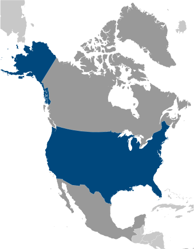
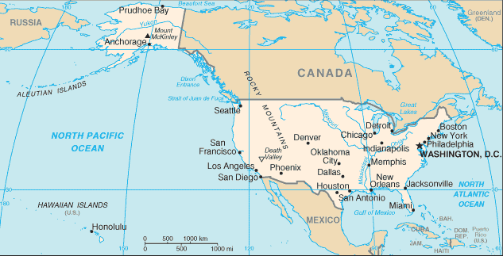

# United States

## Introduction

**_Background:_**   
Britain's American colonies broke with the mother country in 1776 and were recognized as the new nation of the United States of America following the Treaty of Paris in 1783. During the 19th and 20th centuries, 37 new states were added to the original 13 as the nation expanded across the North American continent and acquired a number of overseas possessions. The two most traumatic experiences in the nation's history were the Civil War (1861-65), in which a northern Union of states defeated a secessionist Confederacy of 11 southern slave states, and the Great Depression of the 1930s, an economic downturn during which about a quarter of the labor force lost its jobs. Buoyed by victories in World Wars I and II and the end of the Cold War in 1991, the US remains the world's most powerful nation state. Since the end of World War II, the economy has achieved relatively steady growth, low unemployment and inflation, and rapid advances in technology.

## Geography

**_Location:_**   
North America, bordering both the North Atlantic Ocean and the North Pacific Ocean, between Canada and Mexico

**_Geographic coordinates:_**   
38 00 N, 97 00 W

**_Map references:_**   
North America

**_Area:_**   
**total:** 9,826,675 sq km   
**land:** 9,161,966 sq km   
**water:** 664,709 sq km   
**note:** includes only the 50 states and District of Columbia, no overseas territories

**_Area - comparative:_**   
about half the size of Russia; about three-tenths the size of Africa; about half the size of South America (or slightly larger than Brazil); slightly larger than China; more than twice the size of the European Union

**_Land boundaries:_**   
**total:** 12,034 km   
**border countries:** Canada 8,893 km (including 2,477 km with Alaska), Mexico 3,141 km   
**note:** US Naval Base at Guantanamo Bay, Cuba is leased by the US and is part of Cuba; the base boundary is 28 km

**_Coastline:_**   
19,924 km

**_Maritime claims:_**   
**territorial sea:** 12 nm   
**contiguous zone:** 24 nm   
**exclusive economic zone:** 200 nm   
**continental shelf:** not specified

**_Climate:_**   
mostly temperate, but tropical in Hawaii and Florida, arctic in Alaska, semiarid in the great plains west of the Mississippi River, and arid in the Great Basin of the southwest; low winter temperatures in the northwest are ameliorated occasionally in January and February by warm chinook winds from the eastern slopes of the Rocky Mountains

**_Terrain:_**   
vast central plain, mountains in west, hills and low mountains in east; rugged mountains and broad river valleys in Alaska; rugged, volcanic topography in Hawaii

**_Elevation extremes:_**   
**lowest point:** Death Valley -86 m   
**highest point:** Mount McKinley (Denali) 6,194 m (highest point in North America)   
**note:** the peak of Mauna Kea (4,207 m above sea level) on the island of Hawaii rises about 10,200 m above the Pacific Ocean floor; by this measurement, it is the world's tallest mountain - higher than Mount Everest (8,850 m), which is recognized as the tallest mountain above sea level

**_Natural resources:_**   
coal, copper, lead, molybdenum, phosphates, rare earth elements, uranium, bauxite, gold, iron, mercury, nickel, potash, silver, tungsten, zinc, petroleum, natural gas, timber   
**note:** the US has the world's largest coal reserves with 491 billion short tons accounting for 27% of the world's total

**_Land use:_**   
**arable land:** 16.29%   
**permanent crops:** 0.26%   
**other:** 83.44% (2011)

**_Irrigated land:_**   
266,440 sq km (2007)

**_Total renewable water resources:_**   
3,069 cu km (2011)

**_Freshwater withdrawal (domestic/industrial/agricultural):_**   
**total:** 478.4 cu km/yr (14%/46%/40%)   
**per capita:** 1,583 cu m/yr (2005)

**_Natural hazards:_**   
tsunamis; volcanoes; earthquake activity around Pacific Basin; hurricanes along the Atlantic and Gulf of Mexico coasts; tornadoes in the Midwest and Southeast; mud slides in California; forest fires in the west; flooding; permafrost in northern Alaska, a major impediment to development   
**volcanism:** volcanic activity in the Hawaiian Islands, Western Alaska, the Pacific Northwest, and in the Northern Mariana Islands; both Mauna Loa (elev. 4,170 m) in Hawaii and Mount Rainier (elev. 4,392 m) in Washington have been deemed Decade Volcanoes by the International Association of Volcanology and Chemistry of the Earth's Interior, worthy of study due to their explosive history and close proximity to human populations; Pavlof (elev. 2,519 m) is the most active volcano in Alaska's Aleutian Arc and poses a significant threat to air travel since the area constitutes a major flight path between North America and East Asia; St. Helens (elev. 2,549 m), famous for the devastating 1980 eruption, remains active today; numerous other historically active volcanoes exist, mostly concentrated in the Aleutian arc and Hawaii; they include: in Alaska: Aniakchak, Augustine, Chiginagak, Fourpeaked, Iliamna, Katmai, Kupreanof, Martin, Novarupta, Redoubt, Spurr, Wrangell; in Hawaii: Trident, Ugashik-Peulik, Ukinrek Maars, Veniaminof; in the Northern Mariana Islands: Anatahan; and in the Pacific Northwest: Mount Baker, Mount Hood

**_Environment - current issues:_**   
air pollution resulting in acid rain in both the US and Canada; large emitter of carbon dioxide from the burning of fossil fuels; water pollution from runoff of pesticides and fertilizers; limited natural freshwater resources in much of the western part of the country require careful management; desertification

**_Environment - international agreements:_**   
**party to:** Air Pollution, Air Pollution-Nitrogen Oxides, Antarctic-Environmental Protocol, Antarctic-Marine Living Resources, Antarctic Seals, Antarctic Treaty, Climate Change, Desertification, Endangered Species, Environmental Modification, Marine Dumping, Marine Life Conservation, Ozone Layer Protection, Ship Pollution, Tropical Timber 83, Tropical Timber 94, Wetlands, Whaling   
**signed, but not ratified:** Air Pollution-Persistent Organic Pollutants, Air Pollution-Volatile Organic Compounds, Biodiversity, Climate Change-Kyoto Protocol, Hazardous Wastes

**_Geography - note:_**   
world's third-largest country by size (after Russia and Canada) and by population (after China and India); Mt. McKinley is highest point in North America and Death Valley the lowest point on the continent

## People and Society

**_Nationality:_**   
**noun:** American(s)   
**adjective:** American

**_Ethnic groups:_**   
white 79.96%, black 12.85%, Asian 4.43%, Amerindian and Alaska native 0.97%, native Hawaiian and other Pacific islander 0.18%, two or more races 1.61% (July 2007 estimate)   
**note:** a separate listing for Hispanic is not included because the US Census Bureau considers Hispanic to mean persons of Spanish/Hispanic/Latino origin including those of Mexican, Cuban, Puerto Rican, Dominican Republic, Spanish, and Central or South American origin living in the US who may be of any race or ethnic group (white, black, Asian, etc.); about 15.1% of the total US population is Hispanic

**_Languages:_**   
English 82.1%, Spanish 10.7%, other Indo-European 3.8%, Asian and Pacific island 2.7%, other 0.7% (2000 census)   
**note:** the US has no official national language, but English has acquired official status in 28 of the 50 states; Hawaiian is an official language in the state of Hawaii

**_Religions:_**   
Protestant 51.3%, Roman Catholic 23.9%, Mormon 1.7%, other Christian 1.6%, Jewish 1.7%, Buddhist 0.7%, Muslim 0.6%, other or unspecified 2.5%, unaffiliated 12.1%, none 4% (2007 est.)

**_Population:_**   
318,892,103 (July 2014 est.)

**_Age structure:_**   
**0-14 years:** 19.4% (male 31,580,349/female 30,221,106)   
**15-24 years:** 13.7% (male 22,436,057/female 21,321,861)   
**25-54 years:** 39.9% (male 63,452,792/female 63,671,631)   
**55-64 years:** 12.6% (male 19,309,019/female 20,720,284)   
**65 years and over:** 13.9% (male 20,304,644/female 25,874,360) (2014 est.)

**_Dependency ratios:_**   
**total dependency ratio:** 51 %   
**youth dependency ratio:** 29.4 %   
**elderly dependency ratio:** 21.6 %   
**potential support ratio:** 4.6 (2014 est.)

**_Median age:_**   
**total:** 37.6 years   
**male:** 36.3 years   
**female:** 39 years (2014 est.)

**_Population growth rate:_**   
0.77% (2014 est.)

**_Birth rate:_**   
13.42 births/1,000 population (2014 est.)

**_Death rate:_**   
8.15 deaths/1,000 population (2014 est.)

**_Net migration rate:_**   
2.45 migrant(s)/1,000 population (2014 est.)

**_Urbanization:_**   
**urban population:** 82.4% of total population (2011)   
**rate of urbanization:** 1.14% annual rate of change (2010-15 est.)

**_Major urban areas - population:_**   
New York-Newark 20.352 million; Los Angeles-Long Beach-Santa Ana 13.395 million; Chicago 9.676 million; Miami 6.061 million; Philadelphia 5.927 million; WASHINGTON, D.C. (capital) 4.705 million (2011)

**_Sex ratio:_**   
**at birth:** 1.05 male(s)/female   
**0-14 years:** 1.05 male(s)/female   
**15-24 years:** 1.05 male(s)/female   
**25-54 years:** 1 male(s)/female   
**55-64 years:** 0.97 male(s)/female   
**65 years and over:** 0.77 male(s)/female   
**total population:** 0.97 male(s)/female (2014 est.)

**_Mother's mean age at first birth:_**   
25.4 (2009 est.)

**_Maternal mortality rate:_**   
21 deaths/100,000 live births (2010)

**_Infant mortality rate:_**   
**total:** 6.17 deaths/1,000 live births   
**male:** 6.75 deaths/1,000 live births   
**female:** 5.56 deaths/1,000 live births (2014 est.)

**_Life expectancy at birth:_**   
**total population:** 79.56 years   
**male:** 77.11 years   
**female:** 81.94 years (2014 est.)

**_Total fertility rate:_**   
2.01 children born/woman (2014 est.)

**_Contraceptive prevalence rate:_**   
76.4%   
**note:** percent of women aged 15-44 (2010)

**_Health expenditures:_**   
17.9% of GDP (2011)

**_Physicians density:_**   
2.42 physicians/1,000 population (2009)

**_Hospital bed density:_**   
3 beds/1,000 population (2010)

**_Drinking water source:_**   
**improved:** urban: 99.4% of population; rural: 98% of population; total: 99.2% of population   
**unimproved:** urban: 0.6% of population; rural: 2% of population; total: 0.8% of population (2012 est.)

**_Sanitation facility access:_**   
**improved:** urban: 100% of population; rural: 100% of population; total: 100% of population   
**unimproved:** urban: 0% of population; rural: 0% of population; total: 0% of population (2012 est.)

**_HIV/AIDS - adult prevalence rate:_**   
0.6% (2009 est.)

**_HIV/AIDS - people living with HIV/AIDS:_**   
1.2 million (2009 est.)

**_HIV/AIDS - deaths:_**   
17,000 (2012 est.)

**_Obesity - adult prevalence rate:_**   
33% (2008)

**_Children under the age of 5 years underweight:_**   
1.3% (2004)

**_Education expenditures:_**   
5.4% of GDP (2010)

**_Literacy:_**   
**definition:** age 15 and over can read and write   
**total population:** 99%   
**male:** 99%   
**female:** 99% (2003 est.)

**_School life expectancy (primary to tertiary education):_**   
**total:** 17 years   
**male:** 16 years   
**female:** 17 years (2011)

**_Unemployment, youth ages 15-24:_**   
**total:** 17.3%   
**male:** 18.7%   
**female:** 15.7% (2011)

## Government

**_Country name:_**   
**conventional long form:** United States of America   
**conventional short form:** United States   
**abbreviation:** US or USA

**_Government type:_**   
constitution-based federal republic; strong democratic tradition

**_Capital:_**   
**name:** Washington, DC   
**geographic coordinates:** 38 53 N, 77 02 W   
**time difference:** UTC-5 (during Standard Time)   
**daylight saving time:** +1hr, begins second Sunday in March; ends first Sunday in November   
**note:** the 50 United States cover six time zones

**_Administrative divisions:_**   
50 states and 1 district\*; Alabama, Alaska, Arizona, Arkansas, California, Colorado, Connecticut, Delaware, District of Columbia\*, Florida, Georgia, Hawaii, Idaho, Illinois, Indiana, Iowa, Kansas, Kentucky, Louisiana, Maine, Maryland, Massachusetts, Michigan, Minnesota, Mississippi, Missouri, Montana, Nebraska, Nevada, New Hampshire, New Jersey, New Mexico, New York, North Carolina, North Dakota, Ohio, Oklahoma, Oregon, Pennsylvania, Rhode Island, South Carolina, South Dakota, Tennessee, Texas, Utah, Vermont, Virginia, Washington, West Virginia, Wisconsin, Wyoming

**_Dependent areas:_**   
American Samoa, Baker Island, Guam, Howland Island, Jarvis Island, Johnston Atoll, Kingman Reef, Midway Islands, Navassa Island, Northern Mariana Islands, Palmyra Atoll, Puerto Rico, Virgin Islands, Wake Island   
**note:** from 18 July 1947 until 1 October 1994, the US administered the Trust Territory of the Pacific Islands; it entered into a political relationship with all four political entities: the Northern Mariana Islands is a commonwealth in political union with the US (effective 3 November 1986); the Republic of the Marshall Islands signed a Compact of Free Association with the US (effective 21 October 1986); the Federated States of Micronesia signed a Compact of Free Association with the US (effective 3 November 1986); Palau concluded a Compact of Free Association with the US (effective 1 October 1994)

**_Independence:_**   
4 July 1776 (declared); 3 September 1783 (recognized by Great Britain)

**_National holiday:_**   
Independence Day, 4 July (1776)

**_Constitution:_**   
previous 1781 (Articles of Confederation and Perpetual Union); latest drafted July - September 1787, submitted to the Congress of the Confederation 20 September 1787, submitted for states' ratification 28 September 1787, ratification completed by nine states 21 June 1788, effective 4 March 1789; amended many times, last in 1992 (2014)

**_Legal system:_**   
common law system based on English common law at the federal level; state legal systems based on common law except Louisiana, which is based on Napoleonic civil code; judicial review of legislative acts

**_International law organization participation:_**   
withdrew acceptance of compulsory ICJ jurisdiction in 2005; withdrew acceptance of ICCt jurisdiction in 2002

**_Suffrage:_**   
18 years of age; universal

**_Executive branch:_**   
**chief of state:** President Barack H. OBAMA (since 20 January 2009); Vice President Joseph R. BIDEN (since 20 January 2009); note - the president is both chief of state and head of government   
**head of government:** President Barack H. OBAMA (since 20 January 2009); Vice President Joseph R. BIDEN (since 20 January 2009)   
**cabinet:** Cabinet appointed by the president with Senate approval   
**elections:** president and vice president elected on the same ticket by a college of representatives who are elected directly from each state; president and vice president serve four-year terms (eligible for a second term); election last held 6 November 2012 (next to be held on 8 November 2016)   
**election results:** Barack H. OBAMA reelected president; percent of popular vote - Barack H. OBAMA 50.6%, Mitt ROMNEY 47.9%, other 1.5%;

**_Legislative branch:_**   
bicameral Congress consists of the Senate (100 seats, 2 members elected from each state by popular vote to serve six-year terms; one-third elected every two years) and the House of Representatives (435 seats; members directly elected by popular vote to serve two-year terms)   
**elections:** Senate - last held on 6 November 2012 (next to be held on 4 November 2014); House of Representatives - last held on 6 November 2012 (next to be held on 4 November 2014)   
**election results:** Senate - percent of vote by party - NA; seats by party - Democratic Party 54, Republican Party 45, independent 1; House of Representatives - percent of vote by party - NA; seats by party - Democratic Party 201, Republican Party 234

**_Judicial branch:_**   
**highest court(s):** US Supreme Court (consists of 9 justices - the chief justice and 8 associate justices); note - The US court system consists of the federal court system and the state court systems; although each court system is responsible for hearing certain types of cases, neither is completely independent of the other, and the systems often interact   
**judge selection and term of office:** president nominates, and with the advice and consent of the Senate, appoints Supreme Court justices; justices appointed for life   
**subordinate courts:** Courts of Appeal (includes the US Court of Appeal for the Federal District and 12 regional appeals courts); 94 federal district courts in 50 states and territories

**_Political parties and leaders:_**   
Democratic Party [Debbie Wasserman SCHULTZ]   
Green Party   
Libertarian Party [Mark HINKLE]   
Republican Party [Reince PRIEBUS]

**_Political pressure groups and leaders:_**   
environmentalists; business groups; labor unions; churches; ethnic groups; political action committees or PACs; health groups; education groups; civic groups; youth groups; transportation groups; agricultural groups; veterans groups; women's groups; reform lobbies

**_International organization participation:_**   
ADB (nonregional member), AfDB (nonregional member), ANZUS, APEC, Arctic Council, ARF, ASEAN (dialogue partner), Australia Group, BIS, BSEC (observer), CBSS (observer), CD, CE (observer), CERN (observer), CICA (observer), CP, EAPC, EAS, EBRD, EITI (implementing country), FAO, FATF, G-20, G-5, G-7, G-8, G-10, IADB, IAEA, IBRD, ICAO, ICC (national committees), ICRM, IDA, IEA, IFAD, IFC, IFRCS, IGAD (partners), IHO, ILO, IMF, IMO, IMSO, Interpol, IOC, IOM, ISO, ITSO, ITU, ITUC (NGOs), MIGA, MINUSMA, MINUSTAH, MONUSCO, NAFTA, NATO, NEA, NSG, OAS, OECD, OPCW, OSCE, Pacific Alliance (observer), Paris Club, PCA, PIF (partner), SAARC (observer), SELEC (observer), SICA (observer), SPC, UN, UNCTAD, UNESCO, UNHCR, UNITAR, UNMIL, UNMISS, UNRWA, UNSC (permanent), UNTSO, UPU, WCO, WHO, WIPO, WMO, WTO, ZC

**_Flag description:_**   
13 equal horizontal stripes of red (top and bottom) alternating with white; there is a blue rectangle in the upper hoist-side corner bearing 50 small, white, five-pointed stars arranged in nine offset horizontal rows of six stars (top and bottom) alternating with rows of five stars; the 50 stars represent the 50 states, the 13 stripes represent the 13 original colonies; the blue stands for loyalty, devotion, truth, justice, and friendship; red symbolizes courage, zeal, and fervency, while white denotes purity and rectitude of conduct; commonly referred to by its nickname of Old Glory   
**note:** the design and colors have been the basis for a number of other flags, including Chile, Liberia, Malaysia, and Puerto Rico

**_National symbol(s):_**   
bald eagle

**_National anthem:_**   
**name:** "The Star-Spangled Banner"   
**lyrics/music:** Francis Scott KEY/John Stafford SMITH   
**note:** adopted 1931; during the War of 1812, after witnessing the successful American defense of Fort McHenry in Baltimore following British naval bombardment, Francis Scott KEY wrote the lyrics to what would become the national anthem; the lyrics were set to the tune of "The Anacreontic Song"; only the first verse is sung

## Economy

**_Economy - overview:_**   
The US has the largest and most technologically powerful economy in the world, with a per capita GDP of $49,800. In this market-oriented economy, private individuals and business firms make most of the decisions, and the federal and state governments buy needed goods and services predominantly in the private marketplace. US business firms enjoy greater flexibility than their counterparts in Western Europe and Japan in decisions to expand capital plant, to lay off surplus workers, and to develop new products. At the same time, they face higher barriers to enter their rivals' home markets than foreign firms face entering US markets. US firms are at or near the forefront in technological advances, especially in computers and in medical, aerospace, and military equipment; their advantage has narrowed since the end of World War II. The onrush of technology largely explains the gradual development of a "two-tier labor market" in which those at the bottom lack the education and the professional/technical skills of those at the top and, more and more, fail to get comparable pay raises, health insurance coverage, and other benefits. Since 1975, practically all the gains in household income have gone to the top 20% of households. Since 1996, dividends and capital gains have grown faster than wages or any other category of after-tax income. Imported oil accounts for nearly 55% of US consumption. Crude oil prices doubled between 2001 and 2006, the year home prices peaked; higher gasoline prices ate into consumers' budgets and many individuals fell behind in their mortgage payments. Oil prices climbed another 50% between 2006 and 2008, and bank foreclosures more than doubled in the same period. Besides dampening the housing market, soaring oil prices caused a drop in the value of the dollar and a deterioration in the US merchandise trade deficit, which peaked at $840 billion in 2008. The sub-prime mortgage crisis, falling home prices, investment bank failures, tight credit, and the global economic downturn pushed the United States into a recession by mid-2008. GDP contracted until the third quarter of 2009, making this the deepest and longest downturn since the Great Depression. To help stabilize financial markets, in October 2008 the US Congress established a $700 billion Troubled Asset Relief Program (TARP). The government used some of these funds to purchase equity in US banks and industrial corporations, much of which had been returned to the government by early 2011. In January 2009 the US Congress passed and President Barack OBAMA signed a bill providing an additional $787 billion fiscal stimulus to be used over 10 years - two-thirds on additional spending and one-third on tax cuts - to create jobs and to help the economy recover. In 2010 and 2011, the federal budget deficit reached nearly 9% of GDP. In 2012 the federal government reduced the growth of spending and the deficit shrank to 7.6% of GDP. Wars in Iraq and Afghanistan required major shifts in national resources from civilian to military purposes and contributed to the growth of the budget deficit and public debt. Through 2011, the direct costs of the wars totaled nearly $900 billion, according to US government figures. US revenues from taxes and other sources are lower, as a percentage of GDP, than those of most other countries. In March 2010, President OBAMA signed into law the Patient Protection and Affordable Care Act, a health insurance reform that was designed to extend coverage to an additional 32 million American citizens by 2016, through private health insurance for the general population and Medicaid for the impoverished. Total spending on health care - public plus private - rose from 9.0% of GDP in 1980 to 17.9% in 2010. In July 2010, the president signed the DODD-FRANK Wall Street Reform and Consumer Protection Act, a law designed to promote financial stability by protecting consumers from financial abuses, ending taxpayer bailouts of financial firms, dealing with troubled banks that are "too big to fail," and improving accountability and transparency in the financial system - in particular, by requiring certain financial derivatives to be traded in markets that are subject to government regulation and oversight. In December 2012, the Federal Reserve Board (Fed) announced plans to purchase $85 billion per month of mortgage-backed and Treasury securities in an effort to hold down long-term interest rates, and to keep short term rates near zero until unemployment drops below 6.5% or inflation rises above 2.5%. In late 2013, the Fed announced that it would begin scaling back long-term bond purchases to $75 billion per month in January 2014 and reduce them further as conditions warranted; the Fed, however, would keep short-term rates near zero so long as unemployment and inflation had not crossed the previously stated thresholds. Long-term problems include stagnation of wages for lower-income families, inadequate investment in deteriorating infrastructure, rapidly rising medical and pension costs of an aging population, energy shortages, and sizable current account and budget deficits.

**_GDP (purchasing power parity):_**   
$16.72 trillion (2013 est.)   
$16.47 trillion (2012 est.)   
$16.02 trillion (2011 est.)   
**note:** data are in 2013 US dollars

**_GDP (official exchange rate):_**   
$16.72 trillion (2013 est.)

**_GDP - real growth rate:_**   
1.6% (2013 est.)   
2.8% (2012 est.)   
1.8% (2011 est.)

**_GDP - per capita (PPP):_**   
$52,800 (2013 est.)   
$52,400 (2012 est.)   
$51,400 (2011 est.)   
**note:** data are in 2013 US dollars

**_Gross national saving:_**   
13.5% of GDP (2013 est.)   
12.5% of GDP (2012 est.)   
11.4% of GDP (2011 est.)

**_GDP - composition, by end use:_**   
**household consumption:** 68.6%   
**government consumption:** 18.6%   
**investment in fixed capital:** 15.3%   
**investment in inventories:** 0.4%   
**exports of goods and services:** 13.4%   
**imports of goods and services:** -16.3%; (2013 est.)

**_GDP - composition, by sector of origin:_**   
**agriculture:** 1.1%   
**industry:** 19.5%   
**services:** 79.4%; (2013 est.)

**_Agriculture - products:_**   
wheat, corn, other grains, fruits, vegetables, cotton; beef, pork, poultry, dairy products; fish; forest products

**_Industries:_**   
highly diversified, world leading, high-technology innovator, second largest industrial output in world; petroleum, steel, motor vehicles, aerospace, telecommunications, chemicals, electronics, food processing, consumer goods, lumber, mining

**_Industrial production growth rate:_**   
2.5% (2013 est.)

**_Labor force:_**   
155.4 million   
**note:** includes unemployed (2013 est.)

**_Labor force - by occupation:_**   
**farming, forestry, and fishing:** 0.7%   
**manufacturing, extraction, transportation, and crafts:** 20.3%   
**managerial, professional, and technical:** 37.3%   
**sales and office:** 24.2%   
**other services:** 17.6%   
**note:** figures exclude the unemployed; (2009)

**_Unemployment rate:_**   
7.3% (2013 est.)   
8.1% (2012 est.)

**_Population below poverty line:_**   
15.1% (2010 est.)

**_Household income or consumption by percentage share:_**   
**lowest 10%:** 2%   
**highest 10%:** 30% (2007 est.)

**_Distribution of family income - Gini index:_**   
45 (2007)   
40.8 (1997)

**_Budget:_**   
**revenues:** $2.849 trillion   
**expenditures:** $3.517 trillion   
**note:** for the US, revenues exclude social contributions of approximately $1.0 trillion; expenditures exclude social benefits of approximately $2.3 trillion (2013 est.)

**_Taxes and other revenues:_**   
17% of GDP   
**note:** excludes contributions for social security and other programs; if social contributions were added, taxes and other revenues would amount to approximately 22% of GDP (2013 est.)

**_Budget surplus (+) or deficit (-):_**   
-4% of GDP (2013 est.)

**_Public debt:_**   
71.8% of GDP (2013 est.)   
70% of GDP (2012 est.)   
**note:** data cover only what the United States Treasury denotes as "Debt Held by the Public," which includes all debt instruments issued by the Treasury that are owned by non-US Government entities; the data include Treasury debt held by foreign entities; the data exclude debt issued by individual US states, as well as intra-governmental debt; intra-governmental debt consists of Treasury borrowings from surpluses in the trusts for Federal Social Security, Federal Employees, Hospital Insurance (Medicare and Medicaid), Disability and Unemployment, and several other smaller trusts; if data for intra-government debt were added, "Gross Debt" would increase by about one-third of GDP

**_Fiscal year:_**   
1 October - 30 September

**_Inflation rate (consumer prices):_**   
1.5% (2013 est.)   
2.1% (2012 est.)

**_Central bank discount rate:_**   
0.5% (31 December 2010)   
0.5% (31 December 2009)

**_Commercial bank prime lending rate:_**   
3.3% (31 December 2013 est.)   
3.25% (31 December 2012 est.)

**_Stock of narrow money:_**   
$2.612 trillion (31 December 2013 est.)   
$2.311 trillion (31 December 2012 est.)

**_Stock of broad money:_**   
$12.99 trillion (31 December 2011 est.)   
$12.07 trillion (31 December 2010 est.)

**_Stock of domestic credit:_**   
$16.97 trillion (31 December 2013 est.)   
$16.17 trillion (31 December 2012 est.)

**_Market value of publicly traded shares:_**   
$18.67 trillion (31 December 2012 est.)   
$15.64 trillion (31 December 2011)   
$17.14 trillion (31 December 2010 est.)

**_Current account balance:_**   
-$360.7 billion (2013 est.)   
-$440.4 billion (2012 est.)

**_Exports:_**   
$1.575 trillion (2013 est.)   
$1.561 trillion (2012 est.)

**_Exports - commodities:_**   
agricultural products (soybeans, fruit, corn) 9.2%, industrial supplies (organic chemicals) 26.8%, capital goods (transistors, aircraft, motor vehicle parts, computers, telecommunications equipment) 49.0%, consumer goods (automobiles, medicines) 15.0%

**_Exports - partners:_**   
Canada 18.9%, Mexico 14%, China 7.2%, Japan 4.5% (2012)

**_Imports:_**   
$2.273 trillion (2013 est.)   
$2.303 trillion (2012 est.)

**_Imports - commodities:_**   
agricultural products 4.9%, industrial supplies 32.9% (crude oil 8.2%), capital goods 30.4% (computers, telecommunications equipment, motor vehicle parts, office machines, electric power machinery), consumer goods 31.8% (automobiles, clothing, medicines, furniture, toys)

**_Imports - partners:_**   
China 19%, Canada 14.1%, Mexico 12%, Japan 6.4%, Germany 4.7% (2012)

**_Reserves of foreign exchange and gold:_**   
$150.2 billion (31 December 2012 est.)   
$148 billion (31 December 2011 est.)

**_Debt - external:_**   
$15.68 trillion (31 December 2012 est.)   
$15.51 trillion (31 December 2011)   
**note:** approximately 4/5ths of US external debt is denominated in US dollars; foreign lenders have been willing to hold US dollar denominated debt instruments because they view the dollar as the world's reserve currency

**_Stock of direct foreign investment - at home:_**   
$2.815 trillion (31 December 2013 est.)   
$2.651 trillion (31 December 2012 est.)

**_Stock of direct foreign investment - abroad:_**   
$4.854 trillion (31 December 2013 est.)   
$4.453 trillion (31 December 2012 est.)

**_Exchange rates:_**   
**British pounds per US dollar:** 0.6324 (2012 est.), 0.624 (2011 est.), 0.6472 (2010), 0.6175 (2009), 0.5302 (2008)   
**Canadian dollars per US dollar:** (2013 est.), 1.001 (2012 est.), 0.9895 (2011 est), 1.0302 (2010 est.), 1.1431 (2009), 1.0364 (2008)   
**Chinese yuan per US dollar:** (2012 est.), 6.311 (2012 est.), 6.4615 (20111 est.), 6.7703 (2010 est.), 6.8314 (2009), 6.9385 (2008)   
**euros per US dollar:** 0.7838 (2012 est.), 0.7185 (2011 est.), 0.755 (2010 est.), 0.7198 (2009), 0.6827 (2008)   
**Japanese yen per US dollar:** 79.42 (2012 est.), 79.81 (2011 est.), 87.78 (2010), 93.57 (2009), 103.58 (2008)

## Energy

**_Electricity - production:_**   
4.099 trillion kWh (2011 est.)

**_Electricity - consumption:_**   
3.886 trillion kWh (2010 est.)

**_Electricity - exports:_**   
12 billion kWh (2012 est.)

**_Electricity - imports:_**   
59.26 billion kWh (2012 est.)

**_Electricity - installed generating capacity:_**   
1.039 billion kW (2010 est.)

**_Electricity - from fossil fuels:_**   
75.3% of total installed capacity (2010 est.)

**_Electricity - from nuclear fuels:_**   
9.7% of total installed capacity (2010 est.)

**_Electricity - from hydroelectric plants:_**   
7.6% of total installed capacity (2010 est.)

**_Electricity - from other renewable sources:_**   
5.3% of total installed capacity (2010 est.)

**_Crude oil - production:_**   
11.11 million bbl/day (2012 est.)

**_Crude oil - exports:_**   
41,640 bbl/day (2010 est.)

**_Crude oil - imports:_**   
9.213 million bbl/day (2010 est.)

**_Crude oil - proved reserves:_**   
20.68 billion bbl (1 January 2013 est.)

**_Refined petroleum products - production:_**   
18.45 million bbl/day (2010 est.)

**_Refined petroleum products - consumption:_**   
18.84 million bbl/day (2011 est.)

**_Refined petroleum products - exports:_**   
2.311 million bbl/day (2010 est.)

**_Refined petroleum products - imports:_**   
2.58 million bbl/day (2010 est.)

**_Natural gas - production:_**   
681.4 billion cu m (2012 est.)

**_Natural gas - consumption:_**   
689.9 billion cu m (2011 est.)

**_Natural gas - exports:_**   
45.84 billion cu m (2012 est.)

**_Natural gas - imports:_**   
88.77 billion cu m (2012 est.)

**_Natural gas - proved reserves:_**   
9.459 trillion cu m (1 January 2012 est.)

**_Carbon dioxide emissions from consumption of energy:_**   
5.491 billion Mt (2011 est.)

## Communications

**_Telephones - main lines in use:_**   
139 million (2012)

**_Telephones - mobile cellular:_**   
310 million (2012)

**_Telephone system:_**   
**general assessment:** a large, technologically advanced, multipurpose communications system   
**domestic:** a large system of fiber-optic cable, microwave radio relay, coaxial cable, and domestic satellites carries every form of telephone traffic; a rapidly growing cellular system carries mobile telephone traffic throughout the country   
**international:** country code - 1; multiple ocean cable systems provide international connectivity; satellite earth stations - 61 Intelsat (45 Atlantic Ocean and 16 Pacific Ocean), 5 Intersputnik (Atlantic Ocean region), and 4 Inmarsat (Pacific and Atlantic Ocean regions) (2011)

**_Broadcast media:_**   
4 major terrestrial TV networks with affiliate stations throughout the country, plus cable and satellite networks, independent stations, and a limited public broadcasting sector that is largely supported by private grants; overall, thousands of TV stations broadcasting; multiple national radio networks with many affiliate stations; while most stations are commercial, National Public Radio (NPR) has a network of some 600 member stations; satellite radio available; overall, nearly 15,000 radio stations operating (2008)

**_Internet country code:_**   
.us

**_Internet hosts:_**   
505 million (2012); note - the US Internet total host count includes the following top level domain host addresses: .us, .com, .edu, .gov, .mil, .net, and .org

**_Internet users:_**   
245 million (2009)

## Transportation

**_Airports:_**   
13,513 (2013)

**_Airports - with paved runways:_**   
**total:** 5,054   
**over 3,047 m:** 189   
**2,438 to 3,047 m:** 235   
**1,524 to 2,437 m:** 1,478   
**914 to 1,523 m:** 2,249   
**under 914 m:** 903 (2013)

**_Airports - with unpaved runways:_**   
**total:** 8,459   
**over 3,047 m:** 1   
**2,438 to 3,047 m:** 6   
**1,524 to 2,437 m:** 140   
**914 to 1,523 m:** 1,552   
**under 914 m:** 6,760 (2013)

**_Heliports:_**   
5,287 (2013)

**_Pipelines:_**   
natural gas 1,984,321 km; petroleum products 240,711 km (2013)

**_Railways:_**   
**total:** 224,792 km   
**standard gauge:** 224,792 km 1.435-m gauge (2007)

**_Roadways:_**   
**total:** 6,586,610 km   
**paved:** 4,304,715 km (includes 76,334 km of expressways)   
**unpaved:** 2,281,895 km (2012)

**_Waterways:_**   
41,009 km (19,312 km used for commerce; Saint Lawrence Seaway of 3,769 km, including the Saint Lawrence River of 3,058 km, is shared with Canada) (2012)

**_Merchant marine:_**   
**total:** 393   
**by type:** barge carrier 6, bulk carrier 55, cargo 51, carrier 2, chemical tanker 30, container 84, passenger 18, passenger/cargo 56, petroleum tanker 35, refrigerated cargo 3, roll on/roll off 27, vehicle carrier 26   
**foreign-owned:** 85 (Australia 1, Bermuda 5, Denmark 31, France 4, Germany 5, Malaysia 2, Norway 17, Singapore 16, UK 4)   
**registered in other countries:** 794 (Antigua and Barbuda 7, Australia 2, Bahamas 109, Belgium 1, Bermuda 26, Canada 10, Cayman Islands 57, Comoros 2, Cyprus 5, Georgia 1, Greece 8, Honduras 1, Hong Kong 44, Indonesia 2, Ireland 2, Isle of Man 1, Italy 23, Liberia 53, Malta 34, Marshall Islands 200, Netherlands 16, Norway 10, Panama 90, Portugal 4, Saint Kitts and Nevis 1, Saint Vincent and the Grenadines 18, Singapore 36, South Korea 8, Togo 1, UK 14, Vanuatu 2, unknown 6) (2010)

**_Ports and terminals:_**   
**cargo ports (tonnage):** Baton Rouge, Corpus Christi, Hampton Roads, Houston, Long Beach, Los Angeles, New Orleans, New York, Plaquemines, Tampa, Texas City   
**container port(s) (TEUs):** Hampton Roads (1,918,029), Houston (1,866,450), Long Beach (6,061,091), Los Angeles (7,940,511), New York/New Jersey (5,503,485), Oakland (2,342,504), Savannah (2,944,678), Seattle (2,033,535)(2011)   
**cruise departure ports (passengers):** Miami (2,032,000), Port Everglades (1,277,000), Port Canaveral (1,189,000), Seattle (430,000), Long Beach (415,000) (2009)   
**oil terminals:** LOOP terminal, Haymark terminal

## Military

**_Military branches:_**   
United States Armed Forces: US Army, US Navy (includes Marine Corps), US Air Force, US Coast Guard; note - Coast Guard administered in peacetime by the Department of Homeland Security, but in wartime reports to the Department of the Navy (2013)

**_Military service age and obligation:_**   
18 years of age (17 years of age with parental consent) for male and female voluntary service; no conscription; maximum enlistment age 42 (Army), 27 (Air Force), 34 (Navy), 28 (Marines); service obligation 8 years, including 2-5 years active duty (Army), 2 years active (Navy), 4 years active (Air Force, Marines); DoD is eliminating prohibitions restricting women from assignments in units smaller than brigades or near combat units (2013)

**_Manpower available for military service:_**   
**males age 16-49:** 73,270,043   
**females age 16-49:** 71,941,969 (2010 est.)

**_Manpower fit for military service:_**   
**males age 16-49:** 60,620,143   
**females age 16-49:** 59,401,941 (2010 est.)

**_Manpower reaching militarily significant age annually:_**   
**male:** 2,161,727   
**female:** 2,055,685 (2010 est.)

**_Military expenditures:_**   
4.35% of GDP (2012)   
4.75% of GDP (2011)   
4.35% of GDP (2010)

## Transnational Issues

**_Disputes - international:_**   
the US has intensified domestic security measures and is collaborating closely with its neighbors, Canada and Mexico, to monitor and control legal and illegal personnel, transport, and commodities across the international borders; abundant rainfall in recent years along much of the Mexico-US border region has ameliorated periodically strained water-sharing arrangements; 1990 Maritime Boundary Agreement in the Bering Sea still awaits Russian Duma ratification; Canada and the United States dispute how to divide the Beaufort Sea and the status of the Northwest Passage but continue to work cooperatively to survey the Arctic continental shelf; The Bahamas and US have not been able to agree on a maritime boundary; US Naval Base at Guantanamo Bay is leased from Cuba and only mutual agreement or US abandonment of the area can terminate the lease; Haiti claims US-administered Navassa Island; US has made no territorial claim in Antarctica (but has reserved the right to do so) and does not recognize the claims of any other states; Marshall Islands claims Wake Island; Tokelau included American Samoa's Swains Island among the islands listed in its 2006 draft constitution

**_Refugees and internally displaced persons:_**   
**refugees (country of origin):** the US admitted 69,926 refugees during FY2013 including: 19,488 (Iraq); 16,299 (Burma); 9,134 (Bhutan); 7,608 (Somalia); 4,205 (Cuba); 2,578 (Iran); 1,824 (Eritrea)

**_Illicit drugs:_**   
world's largest consumer of cocaine (shipped from Colombia through Mexico and the Caribbean), Colombian heroin, and Mexican heroin and marijuana; major consumer of ecstasy and Mexican methamphetamine; minor consumer of high-quality Southeast Asian heroin; illicit producer of cannabis, marijuana, depressants, stimulants, hallucinogens, and methamphetamine; money-laundering center

............................................................   
_Page last updated on June 20, 2014_
