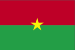
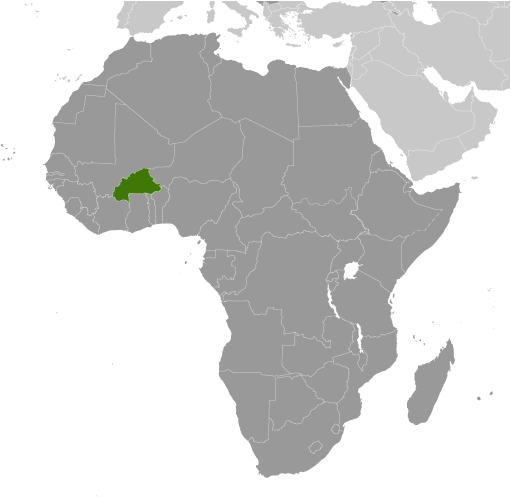
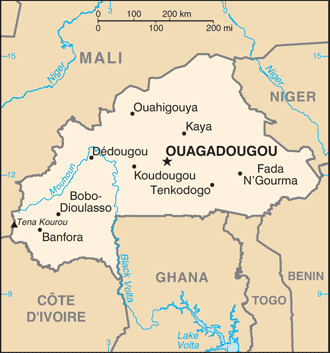

# Burkina Faso

## Introduction

**_Background:_**   
Burkina Faso (formerly Upper Volta) achieved independence from France in 1960. Repeated military coups during the 1970s and 1980s were followed by multiparty elections in the early 1990s. Current President Blaise COMPAORE came to power in a 1987 military coup and has won every election since then. There have been increasing protests over the belief that the president may try to run for a currently unconstitutional third term in the 2015 presidential elections. Burkina Faso's high population growth and limited natural resources result in poor economic prospects for the majority of its citizens.

## Geography

**_Location:_**   
Western Africa, north of Ghana

**_Geographic coordinates:_**   
13 00 N, 2 00 W

**_Map references:_**   
Africa

**_Area:_**   
**total:** 274,200 sq km   
**land:** 273,800 sq km   
**water:** 400 sq km

**_Area - comparative:_**   
slightly larger than Colorado

**_Land boundaries:_**   
**total:** 3,193 km   
**border countries:** Benin 306 km, Cote d'Ivoire 584 km, Ghana 549 km, Mali 1,000 km, Niger 628 km, Togo 126 km

**_Coastline:_**   
0 km (landlocked)

**_Maritime claims:_**   
none (landlocked)

**_Climate:_**   
tropical; warm, dry winters; hot, wet summers

**_Terrain:_**   
mostly flat to dissected, undulating plains; hills in west and southeast

**_Elevation extremes:_**   
**lowest point:** Mouhoun (Black Volta) River 200 m   
**highest point:** Tena Kourou 749 m

**_Natural resources:_**   
manganese, limestone, marble; small deposits of gold, phosphates, pumice, salt

**_Land use:_**   
**arable land:** 20.79%   
**permanent crops:** 0.24%   
**other:** 78.98% (2011)

**_Irrigated land:_**   
250 sq km (2003)

**_Total renewable water resources:_**   
12.5 cu km (2011)

**_Freshwater withdrawal (domestic/industrial/agricultural):_**   
**total:** 0.72 cu km/yr (46%/3%/51%)   
**per capita:** 54.99 cu m/yr (2005)

**_Natural hazards:_**   
recurring droughts

**_Environment - current issues:_**   
recent droughts and desertification severely affecting agricultural activities, population distribution, and the economy; overgrazing; soil degradation; deforestation

**_Environment - international agreements:_**   
**party to:** Biodiversity, Climate Change, Climate Change-Kyoto Protocol, Desertification, Endangered Species, Hazardous Wastes, Law of the Sea, Marine Life Conservation, Ozone Layer Protection, Wetlands   
**signed, but not ratified:** none of the selected agreements

**_Geography - note:_**   
landlocked savanna cut by the three principal rivers of the Black, Red, and White Voltas

## People and Society

**_Nationality:_**   
**noun:** Burkinabe (singular and plural)   
**adjective:** Burkinabe

**_Ethnic groups:_**   
Mossi over 40%, other approximately 60% (includes Gurunsi, Senufo, Lobi, Bobo, Mande, and Fulani)

**_Languages:_**   
French (official), native African languages belonging to Sudanic family spoken by 90% of the population

**_Religions:_**   
Muslim 60.5%, Catholic 19%, animist 15.3%, Protestant 4.2%, other 0.6%, none 0.4% (2006 est.)

**_Population:_**   
18,365,123   
**note:** estimates for this country explicitly take into account the effects of excess mortality due to AIDS; this can result in lower life expectancy, higher infant mortality, higher death rates, lower population growth rates, and changes in the distribution of population by age and sex than would otherwise be expected (July 2014 est.)

**_Age structure:_**   
**0-14 years:** 45.4% (male 4,173,236/female 4,156,245)   
**15-24 years:** 20.1% (male 1,851,801/female 1,833,496)   
**25-54 years:** 29% (male 2,702,573/female 2,622,603)   
**55-64 years:** 3.1% (male 240,520/female 332,421)   
**65 years and over:** 2.5% (male 171,284/female 280,944) (2014 est.)

**_Dependency ratios:_**   
**total dependency ratio:** 91.3 %   
**youth dependency ratio:** 86.6 %   
**elderly dependency ratio:** 4.7 %   
**potential support ratio:** 21.5 (2014 est.)

**_Median age:_**   
**total:** 17 years   
**male:** 16.9 years   
**female:** 17.2 years (2014 est.)

**_Population growth rate:_**   
3.05% (2014 est.)

**_Birth rate:_**   
42.42 births/1,000 population (2014 est.)

**_Death rate:_**   
11.96 deaths/1,000 population (2014 est.)

**_Net migration rate:_**   
0 migrant(s)/1,000 population (2014 est.)

**_Urbanization:_**   
**urban population:** 26.5% of total population (2011)   
**rate of urbanization:** 6.02% annual rate of change (2010-15 est.)

**_Major urban areas - population:_**   
OUAGADOUGOU (capital) 2.053 million (2011)

**_Sex ratio:_**   
**at birth:** 1.03 male(s)/female   
**0-14 years:** 1 male(s)/female   
**15-24 years:** 1.01 male(s)/female   
**25-54 years:** 1.03 male(s)/female   
**55-64 years:** 0.99 male(s)/female   
**65 years and over:** 0.62 male(s)/female   
**total population:** 0.99 male(s)/female (2014 est.)

**_Mother's mean age at first birth:_**   
19.4   
**note:** median age at first birth among women 25-29 (2010 est.)

**_Maternal mortality rate:_**   
300 deaths/100,000 live births (2010)

**_Infant mortality rate:_**   
**total:** 76.8 deaths/1,000 live births   
**male:** 84.1 deaths/1,000 live births   
**female:** 69.28 deaths/1,000 live births (2014 est.)

**_Life expectancy at birth:_**   
**total population:** 54.78 years   
**male:** 52.77 years   
**female:** 56.85 years (2014 est.)

**_Total fertility rate:_**   
5.93 children born/woman (2014 est.)

**_Contraceptive prevalence rate:_**   
16.2% (2010/11)

**_Health expenditures:_**   
6.5% of GDP (2011)

**_Physicians density:_**   
0.05 physicians/1,000 population (2010)

**_Hospital bed density:_**   
0.4 beds/1,000 population (2010)

**_Drinking water source:_**   
**improved:** urban: 97.5% of population; rural: 75.8% of population; total: 81.7% of population   
**unimproved:** urban: 2.5% of population; rural: 24.2% of population; total: 18.3% of population (2012 est.)

**_Sanitation facility access:_**   
**improved:** urban: 50.4% of population; rural: 6.7% of population; total: 18.6% of population   
**unimproved:** urban: 49.6% of population; rural: 93.3% of population; total: 81.4% of population (2012 est.)

**_HIV/AIDS - adult prevalence rate:_**   
1% (2012 est.)

**_HIV/AIDS - people living with HIV/AIDS:_**   
114,500 (2012 est.)

**_HIV/AIDS - deaths:_**   
5,500 (2012 est.)

**_Major infectious diseases:_**   
**degree of risk:** very high   
**food or waterborne diseases:** bacterial and protozoal diarrhea, hepatitis A, and typhoid fever   
**vectorborne disease:** dengue fever, malaria, and yellow fever   
**water contact disease:** schistosomiasis   
**respiratory disease:** meningococcal meningitis   
**animal contact disease:** rabies   
**note:** highly pathogenic H5N1 avian influenza has been identified in this country; it poses a negligible risk with extremely rare cases possible among US citizens who have close contact with birds (2013)

**_Obesity - adult prevalence rate:_**   
2.3% (2008)

**_Children under the age of 5 years underweight:_**   
26.2% (2010)

**_Education expenditures:_**   
3.4% of GDP (2011)

**_Literacy:_**   
**definition:** age 15 and over can read and write   
**total population:** 28.7%   
**male:** 36.7%   
**female:** 21.6% (2007 est.)

**_School life expectancy (primary to tertiary education):_**   
**total:** 8 years   
**male:** 8 years   
**female:** 7 years (2012)

**_Child labor - children ages 5-14:_**   
**total number:** 1,521,006   
**percentage:** 38 % (2006 est.)

**_Unemployment, youth ages 15-24:_**   
**total:** 3.8%   
**male:** 4.6%   
**female:** 2.9% (2006)

## Government

**_Country name:_**   
**conventional long form:** none   
**conventional short form:** Burkina Faso   
**local long form:** none   
**local short form:** Burkina Faso   
**former:** Upper Volta, Republic of Upper Volta

**_Government type:_**   
parliamentary republic

**_Capital:_**   
**name:** Ouagadougou   
**geographic coordinates:** 12 22 N, 1 31 W   
**time difference:** UTC 0 (5 hours ahead of Washington, DC, during Standard Time)

**_Administrative divisions:_**   
13 regions; Boucle du Mouhoun, Cascades, Centre, Centre-Est, Centre-Nord, Centre-Ouest, Centre-Sud, Est, Hauts-Bassins, Nord, Plateau-Central, Sahel, Sud-Ouest

**_Independence:_**   
5 August 1960 (from France)

**_National holiday:_**   
Republic Day, 11 December (1958); note - commemorates the day that Upper Volta became an autonomous republic in the French Community

**_Constitution:_**   
several previous; latest approved by referendum 2 June 1991, adopted 11 June 1991; amended several times, last in 2012 (2012)

**_Legal system:_**   
civil law based on the French model and customary law

**_International law organization participation:_**   
has not submitted an ICJ jurisdiction declaration; accepts ICCt jurisdiction

**_Suffrage:_**   
18 years of age; universal

**_Executive branch:_**   
**chief of state:** President Blaise COMPAORE (since 15 October 1987)   
**head of government:** Prime Minister Luc-Adolphe TIAO (since 18 April 2011)   
**cabinet:** Council of Ministers appointed by the president on the recommendation of the prime minister   
**elections:** president elected by popular vote for a five-year term (eligible for a second term); election last held on 21 November 2010 (next to be held in 2015); prime minister appointed by the president with the consent of the National Assembly   
**election results:** Blaise COMPAORE reelected president; percent of popular vote - Blaise COMPAORE 80.2%, Hama Arba DIALLO 8.2%, Benewende Stanislas SANKARA 6.3%, other 5.3%

**_Legislative branch:_**   
unicameral National Assembly or Assemblee Nationale (127 seats; members are elected by proportional representation in one national constituency of 16 seats, and 45 multi-member constituencies having between 2 and 9 seats with members serving five-year terms)   
**elections:** National Assembly election last held on 2 December 2012 (next to be held in 2017)   
**election results:** percent of vote by party - NA; seats by party - CDP 70, ADF-RDA 19, Union for Progress and Reform 19, UPR 4, UNIR-MS 4, CFD-B 3, PDS/Metba 2, other 6

**_Judicial branch:_**   
**highest court(s):** Supreme Court of Appeals or Cour de Cassation (consists of NA judges); Constitutional Council or Conseil Constitutionnel (consists of the council president and 3 judges)   
**judge selection and term of office:** Supreme Court judge appointments mostly controlled by the president of Burkina Faso; judge tenure NA; Constitutional Council judges appointed by the president of Burkina Faso upon the proposal of the minister of justice and the president of the National Assembly; judges appointed for 9-year terms with one-third of judges renewed every 3 years   
**subordinate courts:** Appeals Court; High Court; first instance tribunals; district courts; specialized courts relating to issues of labor, children, and juveniles; village (customary) courts

**_Political parties and leaders:_**   
African Democratic Rally-Alliance for Democracy and Federation or ADF-RDA [Gilbert OUEDRAOGO]   
Citizen's Popular Rally or RPC [Antoine QUARE]   
Coalition of Democratic Forces of Burkina or CFD-B [Zio Eric FRANCOIS]   
Congress for Democracy and Progress or CDP [Assimi KOUANDA]   
Democratic and Popular Rally or RDP [Nana THIBAUT]   
Movement for Tolerance and Progress or MTP [Nayabtigungou Congo KABORE]   
Party for African Independence or PAI [Soumane TOURE]   
Party for Democracy and Progress-Socialist Party or PDP-PS [Francois O. KABORE]   
Party for Democracy and Socialism/Metba or PDS/Metba [Hama Arba DIALLO]   
Party for National Rebirth or PAREN [Barry TAHIROU]   
People's Movement for Progress or MPP [Roch March KABORE]   
Rally for the Development of Burkina or RDB [Celestin Saidou COMPAORE]   
Rally of Ecologists of Burkina Faso or RDEB [Ram OUEDRAGO]   
Republican Party for Integration and Solidarity or PARIS   
Union for Democracy and Social Progress or UDPS [Fidele HIEN]   
Union for Progress and Change or UPC [Zephirin DIABRE]   
Union for Rebirth - Sankarist Movement or UNIR-MS [Benewende Stanislas SANKARA]   
Union for the Republic or UPR [Toussaint Abel COULIBALY]   
Union of Sankarist Parties or UPS [Ernest Nongma OUEDRAOGO]

**_Political pressure groups and leaders:_**   
Burkinabe General Confederation of Labor or CGTB [Tole SAGNON]   
Burkinabe Movement for Human Rights or MBDHP [Chrysigone ZOUGMORE]   
Citizen's Resistance Front [Luc Marius IBRIGA]   
Group of 14 February [Benewende Stanislas SANKARA]   
National Confederation of Burkinabe Workers or CNTB [Laurent OUEDRAOGO]   
National Organization of Free Unions or ONSL [Paul KABORE]   
**other:** watchdog/political action groups throughout the country in both organizations and communities

**_International organization participation:_**   
ACP, AfDB, AU, CD, ECOWAS, EITI (candidate country), Entente, FAO, FZ, G-77, IAEA, IBRD, ICAO, ICC (NGOs), ICRM, IDA, IDB, IFAD, IFC, IFRCS, ILO, IMF, Interpol, IOC, IOM, IPU, ISO (correspondent), ITSO, ITU, ITUC (NGOs), MIGA, MINUSMA, MONUSCO, NAM, OIC, OIF, OPCW, PCA, UN, UNAMID, UNCTAD, UNESCO, UNIDO, UNISFA, UNITAR, UNWTO, UPU, WADB (regional), WAEMU, WCO, WFTU (NGOs), WHO, WIPO, WMO, WTO

**_Diplomatic representation in the US:_**   
**chief of mission:** Ambassador Seydou BOUDA (since 2 September 2011)   
**chancery:** 2340 Massachusetts Avenue NW, Washington, DC 20008   
**telephone:** [1] (202) 332-5577   
**FAX:** [1] (202) 667-1882

**_Diplomatic representation from the US:_**   
**chief of mission:** Ambassador Tulinabo S. MUSHINGI (since 25 July 2013)   
**embassy:** 602 Avenue Raoul Follereau, Koulouba, Secteur 4   
**mailing address:** 01 B. P. 35, Ouagadougou 01; pouch mail - US Department of State, 2440 Ouagadougou Place, Washington, DC 20521-2440   
**telephone:** [226] 50-49-53-00   
**FAX:** [226] 50-49-56-28

**_Flag description:_**   
two equal horizontal bands of red (top) and green with a yellow five-pointed star in the center; red recalls the country's struggle for independence, green is for hope and abundance, and yellow represents the country's mineral wealth   
**note:** uses the popular Pan-African colors of Ethiopia

**_National symbol(s):_**   
white stallion

**_National anthem:_**   
**name:** "Le Ditanye" (Anthem of Victory)   
**lyrics/music:** Thomas SANKARA   
**note:** adopted 1974; also known as "Une Seule Nuit" (One Single Night), Burkina Faso's anthem was written by the country's president, an avid guitar player

## Economy

**_Economy - overview:_**   
Burkina Faso is a poor, landlocked country that depends on adequate rainfall. About 90% of the population is engaged in subsistence agriculture and cotton is the main cash crop. The country has few natural resources and a weak industrial base. Cotton and gold are key exports. Since 1998, Burkina Faso has begun to privatize state-owned enterprises and in 2004 revised its investment code to attract foreign investment. As a result, the country has seen an upswing in gold exploration, production, and export. The Burkinabe economy experienced high levels of growth over the last few years but growth is highly dependent on swings in gold and cotton prices. In 2013 Burkina Faso experienced a number of public protests over the cost of living, corruption, and other socioeconomic issues. To defuse tensions the government has offered higher housing bonuses, reduced income taxes, and price controls. Turmoil in neighboring Mali, unreliable energy supplies, and poor transportation links pose longer-term challenges.

**_GDP (purchasing power parity):_**   
$26.51 billion (2013 est.)   
$24.9 billion (2012 est.)   
$22.85 billion (2011 est.)   
**note:** data are in 2013 US dollars

**_GDP (official exchange rate):_**   
$12.13 billion (2013 est.)

**_GDP - real growth rate:_**   
6.5% (2013 est.)   
9% (2012 est.)   
5% (2011 est.)

**_GDP - per capita (PPP):_**   
$1,500 (2013 est.)   
$1,400 (2012 est.)   
$1,300 (2011 est.)   
**note:** data are in 2013 US dollars

**_Gross national saving:_**   
12.2% of GDP (2013 est.)   
14.1% of GDP (2012 est.)   
16.6% of GDP (2011 est.)

**_GDP - composition, by end use:_**   
**household consumption:** 55.2%   
**government consumption:** 16.9%   
**investment in fixed capital:** 18.3%   
**investment in inventories:** 0.2%   
**exports of goods and services:** 34.4%   
**imports of goods and services:** -25%; (2013 est.)

**_GDP - composition, by sector of origin:_**   
**agriculture:** 33.6%   
**industry:** 23.6%   
**services:** 42.8% (2013 est.)

**_Agriculture - products:_**   
cotton, peanuts, shea nuts, sesame, sorghum, millet, corn, rice; livestock

**_Industries:_**   
cotton lint, beverages, agricultural processing, soap, cigarettes, textiles, gold

**_Industrial production growth rate:_**   
6.5% (2013 est.)

**_Labor force:_**   
6.668 million   
**note:** a large part of the male labor force migrates annually to neighboring countries for seasonal employment (2007)

**_Labor force - by occupation:_**   
**agriculture:** 90%   
**industry and services:** 10% (2000 est.)

**_Unemployment rate:_**   
77% (2004)

**_Population below poverty line:_**   
46.7% (2009 est.)

**_Household income or consumption by percentage share:_**   
**lowest 10%:** 2.9%   
**highest 10%:** 32.2% (2009 est.)

**_Distribution of family income - Gini index:_**   
39.5 (2007)   
48.2 (1994)

**_Budget:_**   
**revenues:** $2.838 billion   
**expenditures:** $3.228 billion (2013 est.)

**_Taxes and other revenues:_**   
23.4% of GDP (2013 est.)

**_Budget surplus (+) or deficit (-):_**   
-3.2% of GDP (2013 est.)

**_Fiscal year:_**   
calendar year

**_Inflation rate (consumer prices):_**   
2.1% (2013 est.)   
3.8% (2012 est.)

**_Central bank discount rate:_**   
4.25% (31 December 2010 est.)   
4.25% (31 December 2009 est.)

**_Commercial bank prime lending rate:_**   
NA%

**_Stock of narrow money:_**   
$2.22 billion (31 December 2013 est.)   
$1.845 billion (31 December 2012 est.)

**_Stock of broad money:_**   
$4.211 billion (31 December 2013 est.)   
$3.343 billion (31 December 2012 est.)

**_Stock of domestic credit:_**   
$2.711 billion (31 December 2013 est.)   
$2.123 billion (31 December 2012 est.)

**_Market value of publicly traded shares:_**   
$NA

**_Current account balance:_**   
-$364.9 million (2013 est.)   
-$247.6 million (2012 est.)

**_Exports:_**   
$2.844 billion (2013 est.)   
$2.746 billion (2012 est.)

**_Exports - commodities:_**   
gold, cotton, livestock

**_Exports - partners:_**   
China 25.9%, Turkey 24.8%, Belgium 5.2% (2012)

**_Imports:_**   
$2.941 billion (2013 est.)   
$2.675 billion (2012 est.)

**_Imports - commodities:_**   
capital goods, foodstuffs, petroleum

**_Imports - partners:_**   
Cote dIvoire 17.6%, France 15.2%, Ghana 4.8%, Togo 4.4% (2012)

**_Reserves of foreign exchange and gold:_**   
$1.115 billion (31 December 2013 est.)   
$1.025 billion (31 December 2012 est.)

**_Debt - external:_**   
$2.863 billion (31 December 2013 est.)   
$2.607 billion (31 December 2012 est.)

**_Exchange rates:_**   
Communaute Financiere Africaine francs (XOF) per US dollar -   
500.7 (2013 est.)   
510.53 (2012 est.)   
495.28 (2010 est.)   
472.19 (2009)   
447.81 (2008)

## Energy

**_Electricity - production:_**   
670 million kWh (2010 est.)

**_Electricity - consumption:_**   
773.1 million kWh (2010 est.)

**_Electricity - exports:_**   
0 kWh (2012 est.)

**_Electricity - imports:_**   
150 million kWh (2010 est.)

**_Electricity - installed generating capacity:_**   
252,000 kW (2010 est.)

**_Electricity - from fossil fuels:_**   
87.3% of total installed capacity (2010 est.)

**_Electricity - from nuclear fuels:_**   
0% of total installed capacity (2010 est.)

**_Electricity - from hydroelectric plants:_**   
12.7% of total installed capacity (2010 est.)

**_Electricity - from other renewable sources:_**   
0% of total installed capacity (2010 est.)

**_Crude oil - production:_**   
0 bbl/day (2012 est.)

**_Crude oil - exports:_**   
0 bbl/day (2010 est.)

**_Crude oil - imports:_**   
0 bbl/day (2010 est.)

**_Crude oil - proved reserves:_**   
0 bbl (1 January 2013 est.)

**_Refined petroleum products - production:_**   
0 bbl/day (2010 est.)

**_Refined petroleum products - consumption:_**   
9,960 bbl/day (2011 est.)

**_Refined petroleum products - exports:_**   
0 bbl/day (2010 est.)

**_Refined petroleum products - imports:_**   
11,660 bbl/day (2010 est.)

**_Natural gas - production:_**   
0 cu m (2011 est.)

**_Natural gas - consumption:_**   
0 cu m (2010 est.)

**_Natural gas - exports:_**   
0 cu m (2011 est.)

**_Natural gas - imports:_**   
0 cu m (2011 est.)

**_Natural gas - proved reserves:_**   
0 cu m (1 January 2013 est.)

**_Carbon dioxide emissions from consumption of energy:_**   
1.454 million Mt (2011 est.)

## Communications

**_Telephones - main lines in use:_**   
141,400 (2012)

**_Telephones - mobile cellular:_**   
9.98 million (2012)

**_Telephone system:_**   
**general assessment:** system includes microwave radio relay, open-wire, and radiotelephone communication stations; in 2006 the government sold a 51 percent stake in the national telephone company and ultimately plans to retain only a 23 percent stake in the company   
**domestic:** fixed-line connections stand at less than 1 per 100 persons; mobile-cellular usage, fostered by multiple providers, is increasing rapidly from a low base   
**international:** country code - 226; satellite earth station - 1 Intelsat (Atlantic Ocean) (2011)

**_Broadcast media:_**   
2 TV stations - 1 state-owned and 1 privately owned; state-owned radio runs a national and regional network; substantial number of privately owned radio stations; transmissions of several international broadcasters available in Ouagadougou (2007)

**_Internet country code:_**   
.bf

**_Internet hosts:_**   
1,795 (2012)

**_Internet users:_**   
178,100 (2009)

## Transportation

**_Airports:_**   
23 (2013)

**_Airports - with paved runways:_**   
**total:** 2   
**over 3,047 m:** 1   
**2,438 to 3,047 m:** 1 (2013)

**_Airports - with unpaved runways:_**   
**total:** 21   
**1,524 to 2,437 m:** 3   
**914 to 1,523 m:** 13   
**under 914 m:** 5 (2013)

**_Railways:_**   
**total:** 622 km   
**narrow gauge:** 622 km 1.000-m gauge   
**note:** another 660 km of this railway extends into Cote d'Ivoire (2008)

**_Roadways:_**   
**total:** 15,272 km   
**note:** does not include urban roads (2010)

## Military

**_Military branches:_**   
Army, Air Force of Burkina Faso (Force Aerienne de Burkina Faso, FABF), National Gendarmerie (2011)

**_Military service age and obligation:_**   
18 years of age for voluntary military service; no conscription; women may serve in supporting roles (2013)

**_Manpower available for military service:_**   
**males age 16-49:** 3,735,735 (2010 est.)

**_Manpower fit for military service:_**   
**males age 16-49:** 2,366,168   
**females age 16-49:** 2,367,673 (2010 est.)

**_Manpower reaching militarily significant age annually:_**   
**male:** 193,905   
**female:** 191,662 (2010 est.)

**_Military expenditures:_**   
1.39% of GDP (2012)   
1.34% of GDP (2011)   
1.39% of GDP (2010)

## Transnational Issues

**_Disputes - international:_**   
adding to illicit cross-border activities, Burkina Faso has issues concerning unresolved boundary alignments with its neighbors; demarcation is currently underway with Mali, the dispute with Niger was referred to the ICJ in 2010, and a dispute over several villages with Benin persists; Benin retains a border dispute with Burkina Faso around the town of Koualou

............................................................   
_Page last updated on June 20, 2014_
