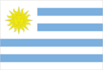
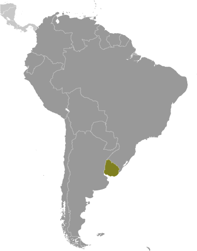
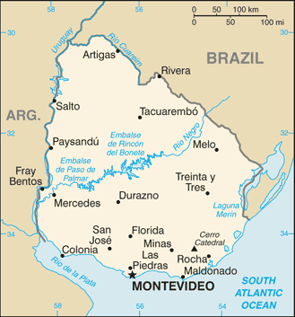

# Uruguay

## Introduction

**_Background:_**   
Montevideo, founded by the Spanish in 1726 as a military stronghold, soon took advantage of its natural harbor to become an important commercial center. Claimed by Argentina but annexed by Brazil in 1821, Uruguay declared its independence four years later and secured its freedom in 1828 after a three-year struggle. The administrations of President Jose BATLLE in the early 20th century launched widespread political, social, and economic reforms that established a statist tradition. A violent Marxist urban guerrilla movement named the Tupamaros, launched in the late 1960s, led Uruguay's president to cede control of the government to the military in 1973. By yearend, the rebels had been crushed, but the military continued to expand its hold over the government. Civilian rule was not restored until 1985. In 2004, the left-of-center Frente Amplio Coalition won national elections that effectively ended 170 years of political control previously held by the Colorado and Blanco parties. Uruguay's political and labor conditions are among the freest on the continent.

## Geography

**_Location:_**   
Southern South America, bordering the South Atlantic Ocean, between Argentina and Brazil

**_Geographic coordinates:_**   
33 00 S, 56 00 W

**_Map references:_**   
South America

**_Area:_**   
**total:** 176,215 sq km   
**land:** 175,015 sq km   
**water:** 1,200 sq km

**_Area - comparative:_**   
slightly smaller than the state of Washington

**_Land boundaries:_**   
**total:** 1,648 km   
**border countries:** Argentina 580 km, Brazil 1,068 km

**_Coastline:_**   
660 km

**_Maritime claims:_**   
**territorial sea:** 12 nm   
**contiguous zone:** 24 nm   
**exclusive economic zone:** 200 nm   
**continental shelf:** 200 nm or edge of continental margin

**_Climate:_**   
warm temperate; freezing temperatures almost unknown

**_Terrain:_**   
mostly rolling plains and low hills; fertile coastal lowland

**_Elevation extremes:_**   
**lowest point:** Atlantic Ocean 0 m   
**highest point:** Cerro Catedral 514 m

**_Natural resources:_**   
arable land, hydropower, minor minerals, fish

**_Land use:_**   
**arable land:** 10.25%   
**permanent crops:** 0.22%   
**other:** 89.52% (2011)

**_Irrigated land:_**   
1,810 sq km (2003)

**_Total renewable water resources:_**   
139 cu km (2011)

**_Freshwater withdrawal (domestic/industrial/agricultural):_**   
**total:** 3.66 cu km/yr (11%/2%/87%)   
**per capita:** 1,101 cu m/yr (2000)

**_Natural hazards:_**   
seasonally high winds (the pampero is a chilly and occasional violent wind that blows north from the Argentine pampas), droughts, floods; because of the absence of mountains, which act as weather barriers, all locations are particularly vulnerable to rapid changes from weather fronts

**_Environment - current issues:_**   
water pollution from meat packing/tannery industry; inadequate solid/hazardous waste disposal

**_Environment - international agreements:_**   
**party to:** Antarctic-Environmental Protocol, Antarctic-Marine Living Resources, Antarctic Treaty, Biodiversity, Climate Change, Climate Change-Kyoto Protocol, Desertification, Endangered Species, Environmental Modification, Hazardous Wastes, Law of the Sea, Ozone Layer Protection, Ship Pollution, Wetlands   
**signed, but not ratified:** Marine Dumping, Marine Life Conservation

**_Geography - note:_**   
second-smallest South American country (after Suriname); most of the low-lying landscape (three-quarters of the country) is grassland, ideal for cattle and sheep raising

## People and Society

**_Nationality:_**   
**noun:** Uruguayan(s)   
**adjective:** Uruguayan

**_Ethnic groups:_**   
white 88%, mestizo 8%, black 4%, Amerindian (practically nonexistent)

**_Languages:_**   
Spanish (official), Portunol, Brazilero (Portuguese-Spanish mix on the Brazilian frontier)

**_Religions:_**   
Roman Catholic 47.1%, non-Catholic Christians 11.1%, nondenominational 23.2%, Jewish 0.3%, atheist or agnostic 17.2%, other 1.1% (2006)

**_Demographic profile:_**   
Uruguay rates high for most development indicators and is known for its secularism, liberal social laws, and well-developed social security, health, and educational systems. It is one of the few countries in Latin America and the Caribbean where the entire population has access to clean water. Uruguay's provision of free primary through university education has contributed to the country's high levels of literacy and educational attainment. However, the emigration of human capital has diminished the state's return on its investment in education. Remittances from the roughly 18% of Uruguayans abroad amount to less than 1 percent of national GDP. The emigration of young adults and a low birth rate are causing Uruguay's population to age rapidly.   
In the 1960s, Uruguayans for the first time emigrated en masse - primarily to Argentina and Brazil - because of economic decline and the onset of more than a decade of military dictatorship. Economic crises in the early 1980s and 2002 also triggered waves of emigration, but since 2002 more than 70% of Uruguayan emigrants have selected the US and Spain as destinations because of better job prospects. Uruguay had a tiny population upon its independence in 1828 and welcomed thousands of predominantly Italian and Spanish immigrants, but the country has not experienced large influxes of new arrivals since the aftermath of World War II. More recent immigrants include Peruvians and Arabs.

**_Population:_**   
3,332,972 (July 2014 est.)

**_Age structure:_**   
**0-14 years:** 21% (male 356,851/female 344,576)   
**15-24 years:** 16% (male 269,820/female 262,830)   
**25-54 years:** 38.9% (male 639,766/female 658,257)   
**55-64 years:** 10.1% (male 158,170/female 178,194)   
**65 years and over:** 13.9% (male 185,132/female 279,376) (2014 est.)

**_Dependency ratios:_**   
**total dependency ratio:** 55.9 %   
**youth dependency ratio:** 33.8 %   
**elderly dependency ratio:** 22.1 %   
**potential support ratio:** 4.5 (2014 est.)

**_Median age:_**   
**total:** 34.3 years   
**male:** 32.6 years   
**female:** 35.9 years (2014 est.)

**_Population growth rate:_**   
0.26% (2014 est.)

**_Birth rate:_**   
13.18 births/1,000 population (2014 est.)

**_Death rate:_**   
9.48 deaths/1,000 population (2014 est.)

**_Net migration rate:_**   
-1.08 migrant(s)/1,000 population (2014 est.)

**_Urbanization:_**   
**urban population:** 92.5% of total population (2011)   
**rate of urbanization:** 0.45% annual rate of change (2010-15 est.)

**_Major urban areas - population:_**   
MONTEVIDEO (capital) 1.672 million (2011)

**_Sex ratio:_**   
**at birth:** 1.04 male(s)/female   
**0-14 years:** 1.04 male(s)/female   
**15-24 years:** 1.03 male(s)/female   
**25-54 years:** 0.97 male(s)/female   
**55-64 years:** 0.93 male(s)/female   
**65 years and over:** 0.66 male(s)/female   
**total population:** 0.93 male(s)/female (2014 est.)

**_Maternal mortality rate:_**   
29 deaths/100,000 live births (2010)

**_Infant mortality rate:_**   
**total:** 8.97 deaths/1,000 live births   
**male:** 9.95 deaths/1,000 live births   
**female:** 7.95 deaths/1,000 live births (2014 est.)

**_Life expectancy at birth:_**   
**total population:** 76.81 years   
**male:** 73.67 years   
**female:** 80.06 years (2014 est.)

**_Total fertility rate:_**   
1.84 children born/woman (2014 est.)

**_Contraceptive prevalence rate:_**   
77%   
**note:** percent of women aged 15-50 (2004)

**_Health expenditures:_**   
8% of GDP (2011)

**_Physicians density:_**   
3.74 physicians/1,000 population (2008)

**_Hospital bed density:_**   
3 beds/1,000 population (2011)

**_Drinking water source:_**   
**improved:** urban: 99.9% of population; rural: 94.9% of population; total: 99.5% of population   
**unimproved:** urban: 0.1% of population; rural: 5.1% of population; total: 0.5% of population (2012 est.)

**_Sanitation facility access:_**   
**improved:** urban: 96.5% of population; rural: 95.8% of population; total: 96.4% of population   
**unimproved:** urban: 3.5% of population; rural: 4.2% of population; total: 3.6% of population (2012 est.)

**_HIV/AIDS - adult prevalence rate:_**   
0.7% (2012 est.)

**_HIV/AIDS - people living with HIV/AIDS:_**   
13,200 (2012 est.)

**_HIV/AIDS - deaths:_**   
NA

**_Obesity - adult prevalence rate:_**   
24.8% (2008)

**_Children under the age of 5 years underweight:_**   
4.5% (2011)

**_Education expenditures:_**   
4.5% of GDP (2011)

**_Literacy:_**   
**definition:** age 15 and over can read and write   
**total population:** 98.1%   
**male:** 97.6%   
**female:** 98.5% (2010 est.)

**_School life expectancy (primary to tertiary education):_**   
**total:** 16 years   
**male:** 14 years   
**female:** 17 years (2010)

**_Child labor - children ages 5-14:_**   
**total number:** 51,879   
**percentage:** 7 % (2006 est.)

**_Unemployment, youth ages 15-24:_**   
**total:** 18.5%   
**male:** 14.7%   
**female:** 23.6% (2012)

## Government

**_Country name:_**   
**conventional long form:** Oriental Republic of Uruguay   
**conventional short form:** Uruguay   
**local long form:** Republica Oriental del Uruguay   
**local short form:** Uruguay   
**former:** Banda Oriental, Cisplatine Province

**_Government type:_**   
constitutional republic

**_Capital:_**   
**name:** Montevideo   
**geographic coordinates:** 34 51 S, 56 10 W   
**time difference:** UTC-3 (2 hours ahead of Washington, DC, during Standard Time)   
**daylight saving time:** +1hr, begins first Sunday in October; ends second Sunday in March

**_Administrative divisions:_**   
19 departments (departamentos, singular - departamento); Artigas, Canelones, Cerro Largo, Colonia, Durazno, Flores, Florida, Lavalleja, Maldonado, Montevideo, Paysandu, Rio Negro, Rivera, Rocha, Salto, San Jose, Soriano, Tacuarembo, Treinta y Tres

**_Independence:_**   
25 August 1825 (from Brazil)

**_National holiday:_**   
Independence Day, 25 August (1825)

**_Constitution:_**   
several previous; latest approved by plebiscite 27 November 1966, effective 15 February 1967; amended several times, last in 2004 (2013)

**_Legal system:_**   
civil law system based on the Spanish civil code

**_International law organization participation:_**   
accepts compulsory ICJ jurisdiction; accepts ICCt jurisdiction

**_Suffrage:_**   
18 years of age; universal and compulsory

**_Executive branch:_**   
**chief of state:** President Jose "Pepe" MUJICA Cordano (since 1 March 2010); Vice President Danilo ASTORI Saragoza (since 1 March 2010); note - the president is both the chief of state and head of government   
**head of government:** President Jose "Pepe" MUJICA Cordano (since 1 March 2010); Vice President Danilo ASTORI Saragoza (since 1 March 2010)   
**cabinet:** Council of Ministers appointed by the president with parliamentary approval   
**elections:** president and vice president elected on the same ticket by popular vote for five-year terms (may not serve consecutive terms); election last held on 29 November 2009 (next to be held in October 2014)   
**election results:** Jose "Pepe" MUJICA Cordano elected president; percent of vote - Jose "Pepe" MUJICA Cordano 54.8%, Luis Alberto LACALLE 45.2%

**_Legislative branch:_**   
bicameral General Assembly or Asamblea General consists of Chamber of Senators or Camara de Senadores (30 seats; members elected by popular vote to serve five-year terms; vice president has one vote in the Senate) and Chamber of Representatives or Camara de Representantes (99 seats; members elected by popular vote to serve five-year terms)   
**elections:** Chamber of Senators - last held on 25 October 2009 (next to be held in October 2014); Chamber of Representatives - last held on 25 October 2009 (next to be held in October 2014)   
**election results:** Chamber of Senators - percent of vote by party - NA; seats by party - Frente Amplio 16, Blanco 9, Colorado Party 5; Chamber of Representatives - percent of vote by party - NA; seats by party - Frente Amplio 50, Blanco 30, Colorado Party 17, Independent Party 2

**_Judicial branch:_**   
**highest court(s):** Supreme Court of Justice (consists of 5 judges)   
**judge selection and term of office:** judges nominated by the president and appointed in joint conference of the General Assembly; judges appointed for 10-year terms, with re-election after a lapse of 5 years following the previous term   
**subordinate courts:** Courts of Appeal; District Courts (Juzagados Letrados); Peace Courts (Juzagados de Paz); Rural Courts (Juzgados Rurales)

**_Political parties and leaders:_**   
Broad Front (Frente Amplio) - formerly known as the Progressive Encounter/Broad Front Coalition or EP-FA [Monica XAVIER] (a broad governing coalition that includes Popular Participation Movement (MPP), New Space Party (Nuevo Espacio) [Rafael MICHELINI], Progressive Alliance (Alianza Progresista) [Rodolfo NIN NOVOA], Socialist Party [vacant], Communist Party [Eduardo LORIER], Uruguayan Assembly (Asamblea Uruguay) [Danilo ASTORI Saragoza], and Vertiente Artiguista [Enrique RUBIO])   
Colorado Party (Vamos Uruguay) [Martha MONTANER]   
Independent Party [Pablo MIERES]   
National Party or Blanco [Luis Alberto HEBER]

**_Political pressure groups and leaders:_**   
Chamber of Commerce and Export of Agriproducts   
Chamber of Industries (manufacturer's association)   
Exporters Union of Uruguay   
National Chamber of Commerce and Services   
PIT/CNT (powerful federation of Uruguayan Unions - umbrella labor organization)   
Rural Association of Uruguay (rancher's association)   
Uruguayan Network of Political Women   
**other:** B'nai Brith; Catholic Church; students

**_International organization participation:_**   
CAN (associate), CD, CELAC, FAO, G-77, IADB, IAEA, IBRD, ICAO, ICC (national committees), ICRM, IDA, IFAD, IFC, IFRCS, IHO, ILO, IMF, IMO, Interpol, IOC, IOM, IPU, ISO, ITSO, ITU, LAES, LAIA, Mercosur, MIGA, MINURSO, MINUSTAH, MONUSCO, NAM (observer), OAS, OPANAL, OPCW, Pacific Alliance (observer), PCA, UN, UNASUR, UNCTAD, UNESCO, UNIDO, Union Latina, UNISFA, UNMOGIP, UNOCI, UNWTO, UPU, WCO, WHO, WIPO, WMO, WTO

**_Diplomatic representation in the US:_**   
**chief of mission:** Ambassador Carlos Alberto GIANELLI Derois (since 11 September 2012)   
**chancery:** 1913 I Street NW, Washington, DC 20006   
**telephone:** [1] (202) 331-1313 through 1316   
**FAX:** [1] (202) 331-8142   
**consulate(s) general:** Chicago, Los Angeles, Miami, New York

**_Diplomatic representation from the US:_**   
**chief of mission:** Ambassador Julissa REYNOSO (since 30 March 2012)   
**embassy:** Lauro Muller 1776, Montevideo 11200   
**mailing address:** APO AA 34035   
**telephone:** [598] (2) 1770-2000   
**FAX:** [598] (2) 1770-2128

**_Flag description:_**   
nine equal horizontal stripes of white (top and bottom) alternating with blue; a white square in the upper hoist-side corner with a yellow sun bearing a human face known as the Sun of May with 16 rays that alternate between triangular and wavy; the stripes represent the nine original departments of Uruguay; the sun symbol evokes the legend of the sun breaking through the clouds on 25 May 1810 as independence was first declared from Spain (Uruguay subsequently won its independence from Brazil)   
**note:** the banner was inspired by the national colors of Argentina and by the design of the US flag

**_National symbol(s):_**   
Sun of May (a sun-with-face symbol)

**_National anthem:_**   
**name:** "Himno Nacional" (National Anthem of Uruguay)   
**lyrics/music:** Francisco Esteban ACUNA de Figueroa/Francisco Jose DEBALI   
**note:** adopted 1848; the anthem is also known as "Orientales, la Patria o la tumba!" ("Uruguayans, the Fatherland or Death!"); it is the world's longest national anthem in terms of music (105 bars; almost five minutes); generally only the first verse and chorus are sung

## Economy

**_Economy - overview:_**   
Uruguay has a free market economy characterized by an export-oriented agricultural sector, a well-educated work force, and high levels of social spending. Following financial difficulties in the late 1990s and early 2000s, economic growth for Uruguay averaged 8% annually during the period 2004-08. The 2008-09 global financial crisis put a brake on Uruguay's vigorous growth, which decelerated to 2.6% in 2009. Nevertheless, the country managed to avoid a recession and keep positive growth rates, mainly through higher public expenditure and investment, and GDP growth reached 8.9% in 2010 but slowed in 2012-13, the result of a renewed slowdown in the global economy and in Uruguay's main trade partners and Common Market of the South (Mercosur) counterparts, Argentina and Brazil. Uruguay has sought to expand trade within Mercosur and with non-Mercosur members. Uruguay's total merchandise trade with Mercosur since 2006 has increased by nearly 70% to more than $5 billion while its total trade with the world has almost doubled to roughly $23 billion in 2013.

**_GDP (purchasing power parity):_**   
$56.27 billion (2013 est.)   
$54.37 billion (2012 est.)   
$52.31 billion (2011 est.)   
**note:** data are in 2013 US dollars

**_GDP (official exchange rate):_**   
$57.11 billion (2013 est.)

**_GDP - real growth rate:_**   
3.5% (2013 est.)   
3.9% (2012 est.)   
6.5% (2011 est.)

**_GDP - per capita (PPP):_**   
$16,600 (2013 est.)   
$16,100 (2012 est.)   
$15,500 (2011 est.)   
**note:** data are in 2013 US dollars

**_Gross national saving:_**   
17.3% of GDP (2013 est.)   
15.8% of GDP (2012 est.)   
16.4% of GDP (2011 est.)

**_GDP - composition, by end use:_**   
**household consumption:** 68.9%   
**government consumption:** 13.6%   
**investment in fixed capital:** 23.1%   
**investment in inventories:** -0.8%   
**exports of goods and services:** 25.8%   
**imports of goods and services:** -30.5%; (2013 est.)

**_GDP - composition, by sector of origin:_**   
**agriculture:** 7.5%   
**industry:** 21.5%   
**services:** 71% (2013 est.)

**_Agriculture - products:_**   
soybeans, rice, wheat; beef, dairy products; fish; lumber, cellulose

**_Industries:_**   
food processing, electrical machinery, transportation equipment, petroleum products, textiles, chemicals, beverages

**_Industrial production growth rate:_**   
6.6% (2013 est.)

**_Labor force:_**   
1.7 million (2013 est.)

**_Labor force - by occupation:_**   
**agriculture:** 13%   
**industry:** 14%   
**services:** 73% (2010 est.)

**_Unemployment rate:_**   
6.5% (2013 est.)   
6% (2012 est.)

**_Population below poverty line:_**   
18.6% (2010 est.)

**_Household income or consumption by percentage share:_**   
**lowest 10%:** 1.9%   
**highest 10%:** 34.4% (2010 est.)

**_Distribution of family income - Gini index:_**   
45.3 (2010)   
44.8 (1999)

**_Budget:_**   
**revenues:** $17.14 billion   
**expenditures:** $18.62 billion (2013 est.)

**_Taxes and other revenues:_**   
30% of GDP (2013 est.)

**_Budget surplus (+) or deficit (-):_**   
-2.6% of GDP (2013 est.)

**_Public debt:_**   
62.8% of GDP (2013 est.)   
59.4% of GDP (2012 est.)   
**note:** data cover general government debt, and include debt instruments issued (or owned) by government entities other than the treasury; the data include treasury debt held by foreign entities; the data include debt issued by subnational entities, as well as intra-governmental debt; intra-governmental debt consists of treasury borrowings from surpluses in the social funds, such as for retirement, medical care, and unemployment; debt instruments for the social funds are not sold at public auctions.

**_Fiscal year:_**   
calendar year

**_Inflation rate (consumer prices):_**   
8.3% (2013 est.)   
8.1% (2012 est.)

**_Central bank discount rate:_**   
9% (31 December 2012)   
8.75% (31 December 2011)   
**note:** Uruguay's central bank uses the benchmark interest rate, rather than the discount rate, to conduct monetary policy; the rates shown here are the benchmark rates

**_Commercial bank prime lending rate:_**   
11.3% (31 December 2013 est.)   
11.2% (31 December 2012 est.)

**_Stock of narrow money:_**   
$5.312 billion (31 December 2013 est.)   
$5.32 billion (31 December 2012 est.)

**_Stock of broad money:_**   
$8.689 billion (31 December 2013 est.)   
$8.648 billion (31 December 2012 est.)

**_Stock of domestic credit:_**   
$17.66 billion (31 December 2013 est.)   
$16.86 billion (31 December 2012 est.)

**_Market value of publicly traded shares:_**   
$175.4 million (31 December 2012 est.)   
$174.6 million (31 December 2011)   
$156.9 million (31 December 2010 est.)

**_Current account balance:_**   
-$2.721 billion (2013 est.)   
-$2.69 billion (2012 est.)

**_Exports:_**   
$10.5 billion (2013 est.)   
$9.89 billion (2012 est.)

**_Exports - commodities:_**   
beef, soybeans, cellulose, rice, wheat, wood, dairy products; wool

**_Exports - partners:_**   
Brazil 18.6%, China 17.9%, Argentina 6.2%, Germany 4.3% (2012)

**_Imports:_**   
$12.5 billion (2013 est.)   
$12.26 billion (2012 est.)

**_Imports - commodities:_**   
refined oil, crude oil, passenger and other transportation vehicles, vehicle parts, cellular phones

**_Imports - partners:_**   
China 16.4%, Brazil 14.9%, Argentina 14.6%, US 9.1%, Paraguay 7.3% (2012)

**_Reserves of foreign exchange and gold:_**   
$16.32 billion (31 December 2013 est.)   
$13.6 billion (31 December 2012 est.)

**_Debt - external:_**   
$17.61 billion (31 December 2013 est.)   
$16.02 billion (31 December 2012 est.)

**_Stock of direct foreign investment - at home:_**   
$20.69 billion (31 December 2013 est.)   
$17.76 billion (31 December 2012 est.)

**_Stock of direct foreign investment - abroad:_**   
$422 million (31 December 2013 est.)   
$357 million (31 December 2012 est.)

**_Exchange rates:_**   
Uruguayan pesos (UYU) per US dollar -   
20.58 (2013 est.)   
20.311 (2012 est.)   
20.059 (2010 est.)   
22.568 (2009)   
20.936 (2008)

## Energy

**_Electricity - production:_**   
9.5 billion kWh (2011 est.)

**_Electricity - consumption:_**   
7.96 billion kWh (2011 est.)

**_Electricity - exports:_**   
19 million kWh (2011 est.)

**_Electricity - imports:_**   
477 million kWh (2011 est.)

**_Electricity - installed generating capacity:_**   
2.588 million kW (2010 est.)

**_Electricity - from fossil fuels:_**   
39.8% of total installed capacity (2010 est.)

**_Electricity - from nuclear fuels:_**   
0% of total installed capacity (2010 est.)

**_Electricity - from hydroelectric plants:_**   
59.4% of total installed capacity (2010 est.)

**_Electricity - from other renewable sources:_**   
0.8% of total installed capacity (2010 est.)

**_Crude oil - production:_**   
1,183 bbl/day (2012 est.)

**_Crude oil - exports:_**   
0 bbl/day (2010 est.)

**_Crude oil - imports:_**   
38,680 bbl/day (2010 est.)

**_Crude oil - proved reserves:_**   
0 bbl (1 January 2009 est.)

**_Refined petroleum products - production:_**   
43,440 bbl/day (2010 est.)

**_Refined petroleum products - consumption:_**   
51,100 bbl/day (2011 est.)

**_Refined petroleum products - exports:_**   
4,656 bbl/day (2010 est.)

**_Refined petroleum products - imports:_**   
16,420 bbl/day (2010 est.)

**_Natural gas - production:_**   
0 cu m (2011 est.)

**_Natural gas - consumption:_**   
80 million cu m (2010 est.)

**_Natural gas - exports:_**   
0 cu m (2011 est.)

**_Natural gas - imports:_**   
80 million cu m (2011 est.)

**_Natural gas - proved reserves:_**   
0 cu m (1 January 2013 est.)

**_Carbon dioxide emissions from consumption of energy:_**   
8.326 million Mt (2011 est.)

## Communications

**_Telephones - main lines in use:_**   
1.01 million (2012)

**_Telephones - mobile cellular:_**   
5 million (2012)

**_Telephone system:_**   
**general assessment:** fully digitalized   
**domestic:** most modern facilities concentrated in Montevideo; nationwide microwave radio relay network; overall fixed-line and mobile-cellular teledensity has reached 170 telephones per 100 persons   
**international:** country code - 598; the UNISOR submarine cable system provides direct connectivity to Brazil and Argentina; satellite earth stations - 2 Intelsat (Atlantic Ocean) (2011)

**_Broadcast media:_**   
mixture of privately owned and state-run broadcast media; more than 100 commercial radio stations and about 20 TV channels; cable TV is available; many community radio and TV stations; adopted the hybrid Japanese/Brazilian HDTV standard (ISDB-T) in December 2010 (2010)

**_Internet country code:_**   
.uy

**_Internet hosts:_**   
1.036 million (2012)

**_Internet users:_**   
1.405 million (2009)

## Transportation

**_Airports:_**   
133 (2013)

**_Airports - with paved runways:_**   
**total:** 11   
**over 3,047 m:** 1   
**1,524 to 2,437 m:** 4   
**914 to 1,523 m:** 4   
**under 914 m:** 2 (2013)

**_Airports - with unpaved runways:_**   
**total:** 122   
**1,524 to 2,437 m:** 3   
**914 to 1,523 m:** 40   
**under 914 m:** 79 (2013)

**_Pipelines:_**   
gas 257 km; oil 160 km (2013)

**_Railways:_**   
**total:** 1,641 km   
**standard gauge:** 1,641 km 1.435-m gauge (1,200 km operational) (2010)

**_Roadways:_**   
**total:** 77,732 km   
**paved:** 7,743 km   
**unpaved:** 69,989 km (2010)

**_Waterways:_**   
1,600 km (2011)

**_Merchant marine:_**   
**total:** 16   
**by type:** bulk carrier 1, cargo 2, chemical tanker 3, passenger/cargo 6, petroleum tanker 3, roll on/roll off 1   
**foreign-owned:** 8 (Argentina 1, Denmark 1, Greece 1, Spain 5)   
**registered in other countries:** 1 (Liberia 1) (2010)

**_Ports and terminals:_**   
**major seaport(s):** Montevideo

## Military

**_Military branches:_**   
Uruguayan Armed Forces: Uruguayan National Army (Ejercito Nacional Uruguaya, ENU), Uruguayan National Navy (Armada Nacional del Uruguay; includes naval air arm, Naval Rifle Corps (Cuerpo de Fusileros Navales, Fusna), Maritime Prefecture in wartime), Uruguayan Air Force (Fuerza Aerea Uruguaya, FAU) (2012)

**_Military service age and obligation:_**   
18-30 years of age (18-22 years of age for navy) for male or female voluntary military service; up to 40 years of age for specialists; enlistment is voluntary in peacetime, but the government has the authority to conscript in emergencies; minimum 6-year education (2013)

**_Manpower available for military service:_**   
**males age 16-49:** 771,159   
**females age 16-49:** 780,932 (2010 est.)

**_Manpower fit for military service:_**   
**males age 16-49:** 649,025   
**females age 16-49:** 654,903 (2010 est.)

**_Manpower reaching militarily significant age annually:_**   
**male:** 27,564   
**female:** 26,811 (2010 est.)

**_Military expenditures:_**   
1.95% of GDP (2012)   
1.94% of GDP (2011)   
1.95% of GDP (2010)

## Transnational Issues

**_Disputes - international:_**   
in 2010, the ICJ ruled in favor of Uruguay's operation of two paper mills on the Uruguay River, which forms the border with Argentina; the two countries formed a joint pollution monitoring regime; uncontested boundary dispute between Brazil and Uruguay over Braziliera/Brasiliera Island in the Quarai/Cuareim River leaves the tripoint with Argentina in question; smuggling of firearms and narcotics continues to be an issue along the Uruguay-Brazil border

**_Trafficking in persons:_**   
**current situation:** Uruguay is a source country for women and children subjected to sex trafficking and, to a lesser extent, a destination country for men, women, and children exploited in forced labor; most victims are women and girls exploited in sex trafficking; some Uruguayan women lured by fraudulent employment offers in Spain, Italy, and Argentina are forced into prostitution; foreign workers in domestic service and agriculture are vulnerable to forced labor in Uruguay; some human trafficking cases are reportedly linked to crime rings   
**tier rating:** Tier 2 Watch List - Uruguay does not fully comply with the minimum standards for the elimination of trafficking; however, it is making significant efforts to do so; the government investigated and prosecuted several trafficking cases during 2012 but reported no convictions; authorities have increased funding and staffing for the national women's institute unit that is focused on sex trafficking and domestic violence, but specialized services remain inadequate and victim care services outside the capital are uneven; officials lack formal procedures for identifying trafficking victims (2013)

**_Illicit drugs:_**   
small-scale transit country for drugs mainly bound for Europe, often through sea-borne containers; law enforcement corruption; money laundering because of strict banking secrecy laws; weak border control along Brazilian frontier; increasing consumption of cocaine base and synthetic drugs

............................................................   
_Page last updated on June 20, 2014_
