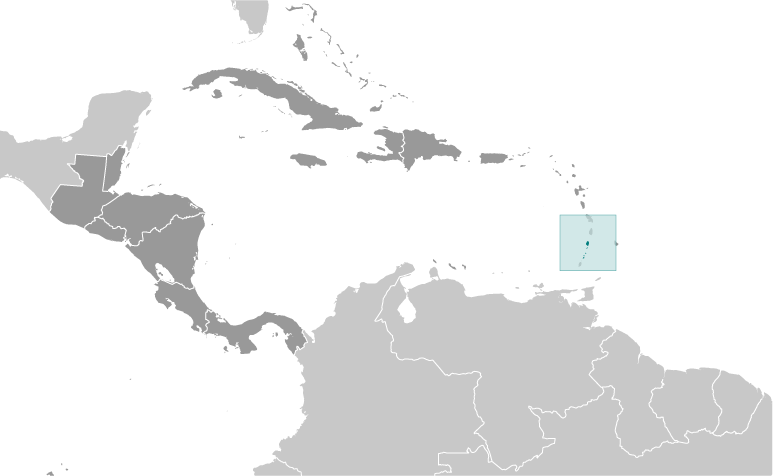
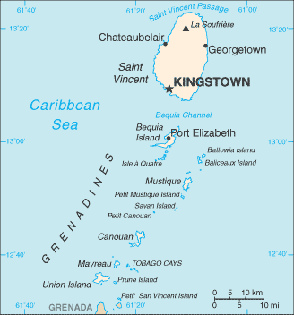

# Saint Vincent and the Grenadines

## Introduction

**_Background:_**   
Resistance by native Caribs prevented colonization on Saint Vincent until 1719. Disputed between France and the United Kingdom for most of the 18th century, the island was ceded to the latter in 1783. Between 1960 and 1962, Saint Vincent and the Grenadines was a separate administrative unit of the Federation of the West Indies. Autonomy was granted in 1969 and independence in 1979.

## Geography

**_Location:_**   
Caribbean, islands between the Caribbean Sea and North Atlantic Ocean, north of Trinidad and Tobago

**_Geographic coordinates:_**   
13 15 N, 61 12 W

**_Map references:_**   
Central America and the Caribbean

**_Area:_**   
**total:** 389 sq km (Saint Vincent 344 sq km)   
**land:** 389 sq km   
**water:** 0 sq km

**_Area - comparative:_**   
twice the size of Washington, DC

**_Land boundaries:_**   
0 km

**_Coastline:_**   
84 km

**_Maritime claims:_**   
**territorial sea:** 12 nm   
**contiguous zone:** 24 nm   
**exclusive economic zone:** 200 nm   
**continental shelf:** 200 nm

**_Climate:_**   
tropical; little seasonal temperature variation; rainy season (May to November)

**_Terrain:_**   
volcanic, mountainous

**_Elevation extremes:_**   
**lowest point:** Caribbean Sea 0 m   
**highest point:** La Soufriere 1,234 m

**_Natural resources:_**   
hydropower, cropland

**_Land use:_**   
**arable land:** 12.82%   
**permanent crops:** 7.69%   
**other:** 79.49% (2011)

**_Irrigated land:_**   
10 sq km (2003)

**_Freshwater withdrawal (domestic/industrial/agricultural):_**   
**total:** 0.01 cu km/yr (NA)   
**per capita:** 92.59 cu m/yr (1995)

**_Natural hazards:_**   
hurricanes; Soufriere volcano on the island of Saint Vincent is a constant threat

**_Environment - current issues:_**   
pollution of coastal waters and shorelines from discharges by pleasure yachts and other effluents; in some areas, pollution is severe enough to make swimming prohibitive

**_Environment - international agreements:_**   
**party to:** Biodiversity, Climate Change, Climate Change-Kyoto Protocol, Desertification, Endangered Species, Environmental Modification, Hazardous Wastes, Law of the Sea, Marine Dumping, Ozone Layer Protection, Ship Pollution, Whaling   
**signed, but not ratified:** none of the selected agreements

**_Geography - note:_**   
the administration of the islands of the Grenadines group is divided between Saint Vincent and the Grenadines and Grenada; Saint Vincent and the Grenadines is comprised of 32 islands and cays

## People and Society

**_Nationality:_**   
**noun:** Saint Vincentian(s) or Vincentian(s)   
**adjective:** Saint Vincentian or Vincentian

**_Ethnic groups:_**   
black 66%, mixed 19%, East Indian 6%, European 4%, Carib Amerindian 2%, other 3%

**_Languages:_**   
English, French patois

**_Religions:_**   
Protestant 75% (Anglican 47%, Methodist 28%), Roman Catholic 13%, other (includes Hindu, Seventh-Day Adventist, other Protestant) 12%

**_Population:_**   
102,918 (July 2014 est.)

**_Age structure:_**   
**0-14 years:** 22.9% (male 11,858/female 11,661)   
**15-24 years:** 16.7% (male 8,687/female 8,528)   
**25-54 years:** 42.6% (male 22,781/female 21,065)   
**55-64 years:** 9.2% (male 4,873/female 4,634)   
**65 years and over:** 8.4% (male 4,083/female 4,748) (2014 est.)

**_Dependency ratios:_**   
**total dependency ratio:** 47.1 %   
**youth dependency ratio:** 36.6 %   
**elderly dependency ratio:** 10.5 %   
**potential support ratio:** 9.5 (2014 est.)

**_Median age:_**   
**total:** 31.9 years   
**male:** 32 years   
**female:** 31.7 years (2014 est.)

**_Population growth rate:_**   
-0.29% (2014 est.)

**_Birth rate:_**   
13.85 births/1,000 population (2014 est.)

**_Death rate:_**   
7.12 deaths/1,000 population (2014 est.)

**_Net migration rate:_**   
-9.6 migrant(s)/1,000 population (2014 est.)

**_Urbanization:_**   
**urban population:** 49.3% of total population (2011)   
**rate of urbanization:** 0.78% annual rate of change (2010-15 est.)

**_Major urban areas - population:_**   
KINGSTOWN (capital) 31,000 (2011)

**_Sex ratio:_**   
**at birth:** 1.03 male(s)/female   
**0-14 years:** 1.02 male(s)/female   
**15-24 years:** 1.02 male(s)/female   
**25-54 years:** 1.08 male(s)/female   
**55-64 years:** 1.03 male(s)/female   
**65 years and over:** 0.84 male(s)/female   
**total population:** 1.03 male(s)/female (2014 est.)

**_Maternal mortality rate:_**   
48 deaths/100,000 live births (2010)

**_Infant mortality rate:_**   
**total:** 13.07 deaths/1,000 live births   
**male:** 14.24 deaths/1,000 live births   
**female:** 11.87 deaths/1,000 live births (2014 est.)

**_Life expectancy at birth:_**   
**total population:** 74.86 years   
**male:** 72.9 years   
**female:** 76.88 years (2014 est.)

**_Total fertility rate:_**   
1.84 children born/woman (2014 est.)

**_Health expenditures:_**   
4.9% of GDP (2011)

**_Physicians density:_**   
0.53 physicians/1,000 population (2001)

**_Hospital bed density:_**   
2.7 beds/1,000 population (2011)

**_Drinking water source:_**   
**improved:** urban: 95.1% of population; rural: 95.1% of population; total: 95.1% of population   
**unimproved:** urban: 4.9% of population; rural: 4.9% of population; total: 4.9% of population (2012 est.)

**_Sanitation facility access:_**   
**improved:** urban: 76.1% of population; rural: 76.1% of population; 76.1% of population   
**unimproved:** urban: 23.9% of population; rural: 23.9% of population; total: 23.9% of population (2007 est.)

**_HIV/AIDS - adult prevalence rate:_**   
NA

**_HIV/AIDS - people living with HIV/AIDS:_**   
NA

**_HIV/AIDS - deaths:_**   
NA

**_Obesity - adult prevalence rate:_**   
23.4% (2008)

**_Education expenditures:_**   
5.1% of GDP (2010)

**_Literacy:_**   
**definition:** age 15 and over has ever attended school   
**total population:** 96%   
**male:** 96%   
**female:** 96% (1970 est.)

**_School life expectancy (primary to tertiary education):_**   
**total:** 13 years   
**male:** 13 years   
**female:** 13 years (2004)

## Government

**_Country name:_**   
**conventional long form:** none   
**conventional short form:** Saint Vincent and the Grenadines

**_Government type:_**   
parliamentary democracy and a Commonwealth realm

**_Capital:_**   
**name:** Kingstown   
**geographic coordinates:** 13 08 N, 61 13 W   
**time difference:** UTC-4 (1 hour ahead of Washington, DC, during Standard Time)

**_Administrative divisions:_**   
6 parishes; Charlotte, Grenadines, Saint Andrew, Saint David, Saint George, Saint Patrick

**_Independence:_**   
27 October 1979 (from the UK)

**_National holiday:_**   
Independence Day, 27 October (1979)

**_Constitution:_**   
several previous; latest presented 26 July 1979, effective 27 October 1979 (2009)

**_Legal system:_**   
English common law

**_International law organization participation:_**   
has not submitted an ICJ jurisdiction declaration; accepts ICCt jurisdiction

**_Suffrage:_**   
18 years of age; universal

**_Executive branch:_**   
**chief of state:** Queen ELIZABETH II (since 6 February 1952); represented by Governor General Sir Fredrick Nathaniel BALLANTYNE (since 2 September 2002)   
**head of government:** Prime Minister Ralph E. GONSALVES (since 29 March 2001)   
**cabinet:** Cabinet appointed by the governor general on the advice of the prime minister   
**elections:** the monarchy is hereditary; the governor general appointed by the monarch; following legislative elections, the leader of the majority party usually appointed prime minister by the governor general; deputy prime minister appointed by the governor general on the advice of the prime minister

**_Legislative branch:_**   
unicameral House of Assembly (21 seats, 15 elected representatives and 6 appointed senators; representatives elected by popular vote to serve five-year terms)   
**elections:** last held on 13 December 2010 (next to be held in 2015)   
**election results:** percent of vote by party - ULP 51.6%, NDP 47.8%, other 0.6%; seats by party - ULP 8, NDP 7

**_Judicial branch:_**   
**highest court(s):** the Eastern Caribbean Supreme Court (ECSC) is the itinerant superior court of record for the 9-member Organization of Eastern Caribbean States to include Saint Vincent and the Grenadines; the ECSC - with its headquarters on Saint Lucia - is headed by the chief justice and is comprised of the Court of Appeal with 3 justices and the High Court with 16 judges; sittings of the Court of Appeal and High Court rotate among the member states; 2 High Court judges reside on Saint Vincent and the Grenadines; note - Saint Vincent and the Grenadines is a member of the Caribbean Court of Justice   
**judge selection and term of office:** Eastern Caribbean Supreme Court chief justice appointed by Her Majesty, Queen ELIZABETH II; other justices and judges appointed by the Judicial and Legal Services Commission; Court of Appeal justices appointed for life with mandatory retirement at age 65; High Court judges appointed for life with mandatory retirement at age 62   
**subordinate courts:** magistrates' courts

**_Political parties and leaders:_**   
New Democratic Party or NDP [Arnhim EUSTACE]   
Unity Labor Party or ULP [Ralph GONSALVES] (formed by the coalition of Saint Vincent Labor Party or SVLP and the Movement for National Unity or MNU)

**_Political pressure groups and leaders:_**   
NA

**_International organization participation:_**   
ACP, AOSIS, C, Caricom, CDB, CELAC, FAO, G-77, IBRD, ICAO, ICRM, IDA, IFAD, IFRCS, ILO, IMF, IMO, Interpol, IOC, IOM, ISO (subscriber), ITU, MIGA, NAM, OAS, OECS, OPANAL, OPCW, Petrocaribe, UN, UNCTAD, UNESCO, UNIDO, UPU, WFTU (NGOs), WHO, WIPO, WTO

**_Diplomatic representation in the US:_**   
**chief of mission:** Ambassador La Celia A. PRINCE (since 30 May 2008)   
**chancery:** 3216 New Mexico Avenue NW, Washington, DC 20016   
**telephone:** [1] (202) 364-6730   
**FAX:** [1] (202) 364-6736   
**consulate(s) general:** New York

**_Diplomatic representation from the US:_**   
the US does not have an embassy in Saint Vincent and the Grenadines; the US Ambassador to Barbados is accredited to Saint Vincent and the Grenadines

**_Flag description:_**   
three vertical bands of blue (hoist side), gold (double width), and green; the gold band bears three green diamonds arranged in a V pattern, which stands for Vincent; the diamonds recall the islands as the "Gems of the Antilles"; blue conveys the colors of a tropical sky and crystal waters, yellow signifies the golden Grenadine sands, and green represents lush vegetation

**_National anthem:_**   
**name:** "St. Vincent! Land So Beautiful!"   
**lyrics/music:** Phyllis Joyce MCCLEAN PUNNETT/Joel Bertram MIGUEL   
**note:** adopted 1967

## Economy

**_Economy - overview:_**   
Success of the economy hinges upon seasonal variations in agriculture, tourism, and construction activity as well as remittance inflows. Much of the workforce is employed in banana production and tourism, but persistent high unemployment has prompted many to leave the islands. This lower-middle-income country is vulnerable to natural disasters - tropical storms wiped out substantial portions of crops in 1994, 1995, and 2002. Floods and mudslides caused by unseasonable 2013 rainfall caused substantial damage to infrastructure, homes, and crops, which the World Bank estimated at US$112 million. In 2013, the islands had more than 200,000 tourist arrivals, mostly to the Grenadines. The arrival numbers represent a marginal increase from 2012 but remain 26% below St. Vincent's 2009 peak. Saint Vincent is home to a small offshore banking sector and has moved to adopt international regulatory standards. The government's ability to invest in social programs and respond to external shocks is constrained by its high public debt burden, which was 67% of GDP at the end of 2013. Weak recovery in the tourism and construction sectors will limit growth prospects in 2014.

**_GDP (purchasing power parity):_**   
$1.335 billion (2013 est.)   
$1.309 billion (2012 est.)   
$1.288 billion (2011 est.)   
**note:** data are in 2013 US dollars

**_GDP (official exchange rate):_**   
$742 million (2013 est.)

**_GDP - real growth rate:_**   
2% (2013 est.)   
1.5% (2012 est.)   
0.4% (2011 est.)

**_GDP - per capita (PPP):_**   
$12,100 (2013 est.)   
$11,900 (2012 est.)   
$11,800 (2011 est.)   
**note:** data are in 2013 US dollars

**_Gross national saving:_**   
-4.7% of GDP (2013 est.)   
-6.7% of GDP (2012 est.)   
-4.2% of GDP (2011 est.)

**_GDP - composition, by end use:_**   
**household consumption:** 92.3%   
**government consumption:** 16.6%   
**investment in fixed capital:** 23.7%   
**investment in inventories:** 0%   
**exports of goods and services:** 21.8%   
**imports of goods and services:** -54.4%; (2013 est.)

**_GDP - composition, by sector of origin:_**   
**agriculture:** 5.4%   
**industry:** 20.3%   
**services:** 74.4% (2013 est.)

**_Agriculture - products:_**   
bananas, coconuts, sweet potatoes, spices; small numbers of cattle, sheep, pigs, goats; fish

**_Industries:_**   
tourism; food processing, cement, furniture, clothing, starch

**_Industrial production growth rate:_**   
3% (2013 est.)

**_Labor force:_**   
57,520 (2007 est.)

**_Labor force - by occupation:_**   
**agriculture:** 26%   
**industry:** 17%   
**services:** 57% (1980 est.)

**_Unemployment rate:_**   
18.8% (2008 est.)

**_Population below poverty line:_**   
NA%

**_Household income or consumption by percentage share:_**   
**lowest 10%:** NA%   
**highest 10%:** NA%

**_Budget:_**   
**revenues:** $185.2 million   
**expenditures:** $185.2 million (2013 est.)

**_Taxes and other revenues:_**   
25% of GDP (2013 est.)

**_Budget surplus (+) or deficit (-):_**   
0% of GDP (2013 est.)

**_Public debt:_**   
68% of GDP (2011 est.)

**_Fiscal year:_**   
calendar year

**_Inflation rate (consumer prices):_**   
2.8% (2013 est.)   
2.6% (2012 est.)

**_Central bank discount rate:_**   
6.5% (31 December 2010 est.)   
6.5% (31 December 2009 est.)

**_Commercial bank prime lending rate:_**   
9.4% (31 December 2013 est.)   
9.43% (31 December 2012 est.)

**_Stock of narrow money:_**   
$142.2 million (31 December 2013 est.)   
$133.7 million (31 December 2012 est.)

**_Stock of broad money:_**   
$460.4 million (31 December 2013 est.)   
$438.5 million (31 December 2012 est.)

**_Stock of domestic credit:_**   
$423.2 million (31 December 2013 est.)   
$404.8 million (31 December 2012 est.)

**_Current account balance:_**   
-$207.7 million (2013 est.)   
-$215.9 million (2012 est.)

**_Exports:_**   
$45.7 million (2013 est.)   
$48.7 million (2012 est.)

**_Exports - commodities:_**   
bananas, eddoes and dasheen (taro), arrowroot starch; tennis racquets

**_Exports - partners:_**   
Trinidad and Tobago 14.5%, St. Lucia 12.9%, Turkey 12.7%, Barbados 10.7%, Dominica 8.5%, Grenada 8.1%, Antigua and Barbuda 7.3% (2012)

**_Imports:_**   
$301.5 million (2013 est.)   
$314.6 million (2012 est.)

**_Imports - commodities:_**   
foodstuffs, machinery and equipment, chemicals and fertilizers, minerals and fuels

**_Imports - partners:_**   
Singapore 28%, Trinidad and Tobago 22.6%, US 19%, China 5.6%, Barbados 5% (2012)

**_Reserves of foreign exchange and gold:_**   
$115 million (31 December 2013 est.)   
$111 million (31 December 2012 est.)

**_Debt - external:_**   
$255.3 million (31 December 2013 est.)   
$265 million (31 December 2012 est.)

**_Exchange rates:_**   
East Caribbean dollars (XCD) per US dollar -   
2.7 (2013 est.)   
2.7 (2012 est.)   
2.7 (2010 est.)   
2.7 (2009)

## Energy

**_Electricity - production:_**   
136 million kWh (2010 est.)

**_Electricity - consumption:_**   
126.5 million kWh (2010 est.)

**_Electricity - exports:_**   
0 kWh (2012 est.)

**_Electricity - imports:_**   
0 kWh (2012 est.)

**_Electricity - installed generating capacity:_**   
47,000 kW (2010 est.)

**_Electricity - from fossil fuels:_**   
85.1% of total installed capacity (2010 est.)

**_Electricity - from nuclear fuels:_**   
0% of total installed capacity (2010 est.)

**_Electricity - from hydroelectric plants:_**   
14.9% of total installed capacity (2010 est.)

**_Electricity - from other renewable sources:_**   
0% of total installed capacity (2010 est.)

**_Crude oil - production:_**   
0 bbl/day (2012 est.)

**_Crude oil - exports:_**   
0 bbl/day (2010 est.)

**_Crude oil - imports:_**   
0 bbl/day (2010 est.)

**_Crude oil - proved reserves:_**   
0 bbl (1 January 2013 est.)

**_Refined petroleum products - production:_**   
0 bbl/day (2010 est.)

**_Refined petroleum products - consumption:_**   
1,948 bbl/day (2011 est.)

**_Refined petroleum products - exports:_**   
0 bbl/day (2010 est.)

**_Refined petroleum products - imports:_**   
1,474 bbl/day (2010 est.)

**_Natural gas - production:_**   
0 cu m (2011 est.)

**_Natural gas - consumption:_**   
0 cu m (2010 est.)

**_Natural gas - exports:_**   
0 cu m (2011 est.)

**_Natural gas - imports:_**   
0 cu m (2011 est.)

**_Natural gas - proved reserves:_**   
0 cu m (1 January 2013 est.)

**_Carbon dioxide emissions from consumption of energy:_**   
198,900 Mt (2011 est.)

## Communications

**_Telephones - main lines in use:_**   
19,400 (2012)

**_Telephones - mobile cellular:_**   
135,500 (2012)

**_Telephone system:_**   
**general assessment:** adequate islandwide, fully automatic telephone system   
**domestic:** fixed-line teledensity exceeds 20 per 100 persons and mobile-cellular teledensity exceeds 125 per 100 persons   
**international:** country code - 1-784; the East Caribbean Fiber Optic System (ECFS) and Southern Caribbean fiber optic system (SCF) submarine cables carry international calls; connectivity also provided by VHF/UHF radiotelephone from Saint Vincent to Barbados; SHF radiotelephone to Grenada and Saint Lucia; access to Intelsat earth station in Martinique through Saint Lucia (2011)

**_Broadcast media:_**   
St. Vincent and the Grenadines Broadcasting Corporation operates 1 TV station and 5 repeater stations that provide near total coverage to the multi-island state; multi-channel cable TV service available; a partially government-funded national radio service broadcasts on 1 station and has 2 repeater stations; about a dozen privately owned radio stations and repeater stations (2007)

**_Internet country code:_**   
.vc

**_Internet hosts:_**   
305 (2012)

**_Internet users:_**   
76,000 (2009)

## Transportation

**_Airports:_**   
6 (2013)

**_Airports - with paved runways:_**   
**total:** 5   
**1,524 to 2,437 m:** 1   
**914 to 1,523 m:** 3   
**under 914 m:** 1 (2013)

**_Airports - with unpaved runways:_**   
**total:** 1   
**under 914 m:** 1 (2013)

**_Roadways:_**   
**total:** 829 km   
**paved:** 580 km   
**unpaved:** 249 km (2003)

**_Merchant marine:_**   
**total:** 412   
**by type:** bulk carrier 64, cargo 263, carrier 14, chemical tanker 4, container 18, liquefied gas 3, passenger 2, passenger/cargo 7, petroleum tanker 9, refrigerated cargo 12, roll on/roll off 15, specialized tanker 1   
**foreign-owned:** 325 (Austria 1, Azerbaijan 1, Bangladesh 1, Belgium 7, Bermuda 1, Bulgaria 9, China 65, Croatia 8, Cyprus 3, Czech Republic 1, Denmark 9, Dominica 1, Egypt 2, Estonia 8, France 2, Germany 3, Greece 42, Guyana 2, Hong Kong 5, Israel 3, Italy 4, Japan 3, Kenya 2, Latvia 15, Lebanon 2, Lithuania 9, Monaco 2, Netherlands 1, Norway 13, Poland 3, Romania 1, Russia 11, Singapore 5, Slovenia 1, Sweden 10, Switzerland 7, Syria 9, Turkey 13, UAE 3, UK 6, Ukraine 12, US 18, Venezuela 1) (2010)

**_Ports and terminals:_**   
**major seaport(s):** Kingstown

## Military

**_Military branches:_**   
no regular military forces; Royal Saint Vincent and the Grenadines Police Force (RSVPF) (2013)

**_Manpower available for military service:_**   
**males age 16-49:** 27,809 (2010 est.)

**_Manpower fit for military service:_**   
**males age 16-49:** 22,875   
**females age 16-49:** 22,015 (2010 est.)

**_Manpower reaching militarily significant age annually:_**   
**male:** 964   
**female:** 953 (2010 est.)

## Transnational Issues

**_Disputes - international:_**   
joins other Caribbean states to counter Venezuela's claim that Aves Island sustains human habitation, a criterion under United Nations Convention on the Law of the Sea, which permits Venezuela to extend its Economic Exclusion Zone/continental shelf over a large portion of the eastern Caribbean Sea

**_Illicit drugs:_**   
transshipment point for South American drugs destined for the US and Europe; small-scale cannabis cultivation

............................................................   
_Page last updated on June 20, 2014_
