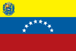
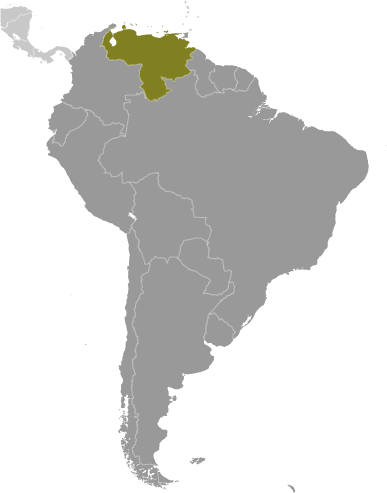
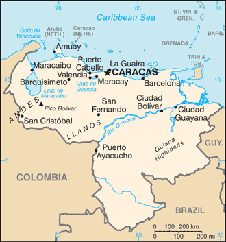

# Venezuela

## Introduction

**_Background:_**   
Venezuela was one of three countries that emerged from the collapse of Gran Colombia in 1830 (the others being Ecuador and New Granada, which became Colombia). For most of the first half of the 20th century, Venezuela was ruled by generally benevolent military strongmen, who promoted the oil industry and allowed for some social reforms. Democratically elected governments have held sway since 1959. Hugo CHAVEZ, president from 1999 to 2013, sought to implement his "21st Century Socialism," which purported to alleviate social ills while at the same time attacking capitalist globalization and existing democratic institutions. His hand-picked successor, President Nicolas MADURO, continues CHAVEZ's socialist programs. Current concerns include: a weakening of democratic institutions, political polarization, a politicized military, rampant violent crime, overdependence on the petroleum industry with its price fluctuations, foreign exchange controls that discourage private-sector investment, high inflation, a decline in the quality of fundamental houman rights, and widespread scarcity of consumer goods.

## Geography

**_Location:_**   
Northern South America, bordering the Caribbean Sea and the North Atlantic Ocean, between Colombia and Guyana

**_Geographic coordinates:_**   
8 00 N, 66 00 W

**_Map references:_**   
South America

**_Area:_**   
**total:** 912,050 sq km   
**land:** 882,050 sq km   
**water:** 30,000 sq km

**_Area - comparative:_**   
almost six times the size of Georgia; slightly more than twice the size of California

**_Land boundaries:_**   
**total:** 4,993 km   
**border countries:** Brazil 2,200 km, Colombia 2,050 km, Guyana 743 km

**_Coastline:_**   
2,800 km

**_Maritime claims:_**   
**territorial sea:** 12 nm   
**contiguous zone:** 15 nm   
**exclusive economic zone:** 200 nm   
**continental shelf:** 200 m depth or to the depth of exploitation

**_Climate:_**   
tropical; hot, humid; more moderate in highlands

**_Terrain:_**   
Andes Mountains and Maracaibo Lowlands in northwest; central plains (llanos); Guiana Highlands in southeast

**_Elevation extremes:_**   
**lowest point:** Caribbean Sea 0 m   
**highest point:** Pico Bolivar 5,007 m

**_Natural resources:_**   
petroleum, natural gas, iron ore, gold, bauxite, other minerals, hydropower, diamonds

**_Land use:_**   
**arable land:** 2.85%   
**permanent crops:** 0.71%   
**other:** 96.44% (2011)

**_Irrigated land:_**   
10,550 sq km (2008)

**_Total renewable water resources:_**   
1,233 cu km (2011)

**_Freshwater withdrawal (domestic/industrial/agricultural):_**   
**total:** 9.06 cu km/yr (23%/4%/74%)   
**per capita:** 358.6 cu m/yr (2008)

**_Natural hazards:_**   
subject to floods, rockslides, mudslides; periodic droughts

**_Environment - current issues:_**   
sewage pollution of Lago de Valencia; oil and urban pollution of Lago de Maracaibo; deforestation; soil degradation; urban and industrial pollution, especially along the Caribbean coast; threat to the rainforest ecosystem from irresponsible mining operations

**_Environment - international agreements:_**   
**party to:** Antarctic Treaty, Biodiversity, Climate Change, Climate Change-Kyoto Protocol, Desertification, Endangered Species, Hazardous Wastes, Marine Life Conservation, Ozone Layer Protection, Ship Pollution, Tropical Timber 83, Tropical Timber 94, Wetlands   
**signed but not ratified:** : none of the selected agreements

**_Geography - note:_**   
on major sea and air routes linking North and South America; Angel Falls in the Guiana Highlands is the world's highest waterfall

## People and Society

**_Nationality:_**   
**noun:** Venezuelan(s)   
**adjective:** Venezuelan

**_Ethnic groups:_**   
Spanish, Italian, Portuguese, Arab, German, African, indigenous people

**_Languages:_**   
Spanish (official), numerous indigenous dialects

**_Religions:_**   
nominally Roman Catholic 96%, Protestant 2%, other 2%

**_Demographic profile:_**   
Social investment in Venezuela during the CHAVEZ administration reduced poverty from nearly 50 % in 1999 to about 27 % in 2011, increased school enrollment, substantially decreased infant and child mortality, and improved access to potable water and sanitation through social investment. "Missions" dedicated to education, nutrition, healthcare, and sanitation were funded through petroleum revenues. The sustainability of this progress remains questionable, however, as the continuation of these social programs depends on the prosperity of Venezuela's oil industry. In the long-term, education and health care spending may increase economic growth and reduce income inequality, but rising costs and the staffing of new health care jobs with foreigners are slowing development.   
Since CHAVEZ came to power in 1999, more than one million predominantly middle- and upper-class Venezuelans are estimated to have emigrated. The brain drain is attributed to a repressive political system, lack of economic opportunities, steep inflation, a high crime rate, and corruption. Thousands of oil engineers emigrated to Canada, Colombia, and the United States following Chavez's firing of over 20,000 employees of the state-owned petroleum company during a 2002-2003 oil strike. Additionally, thousands of Venezuelans of European descent have taken up residence in their ancestral homelands. Nevertheless, Venezuela continues to attract immigrants from South America and southern Europe because of its lenient migration policy and the availability of education and health care. Venezuela also has been a fairly accommodating host to more than 200,000 Colombian refugees.

**_Population:_**   
28,868,486 (July 2014 est.)

**_Age structure:_**   
**0-14 years:** 28.2% (male 4,143,840/female 3,985,489)   
**15-24 years:** 18.8% (male 2,723,856/female 2,697,672)   
**25-54 years:** 39.6% (male 5,614,922/female 5,818,903)   
**55-64 years:** 7.5% (male 1,030,898/female 1,137,894)   
**65 years and over:** 5.8% (male 755,183/female 959,829) (2014 est.)

**_Dependency ratios:_**   
**total dependency ratio:** 52.9 %   
**youth dependency ratio:** 43.2 %   
**elderly dependency ratio:** 9.8 %   
**potential support ratio:** 10.2 (2014 est.)

**_Median age:_**   
**total:** 26.9 years   
**male:** 26.1 years   
**female:** 27.6 years (2014 est.)

**_Population growth rate:_**   
1.42% (2014 est.)

**_Birth rate:_**   
19.42 births/1,000 population (2014 est.)

**_Death rate:_**   
5.27 deaths/1,000 population (2014 est.)

**_Net migration rate:_**   
0 migrant(s)/1,000 population (2014 est.)

**_Urbanization:_**   
**urban population:** 93.5% of total population (2011)   
**rate of urbanization:** 1.7% annual rate of change (2010-15 est.)

**_Major urban areas - population:_**   
CARACAS (capital) 3.242 million; Maracaibo 2.31 million; Valencia 1.866 million; Barquisimeto 1.245 million; Maracay 1.115 million; Ciudad Guayana 799,000 (2011)

**_Sex ratio:_**   
**at birth:** 1.05 male(s)/female   
**0-14 years:** 1.04 male(s)/female   
**15-24 years:** 1.01 male(s)/female   
**25-54 years:** 0.97 male(s)/female   
**55-64 years:** 0.98 male(s)/female   
**65 years and over:** 0.79 male(s)/female   
**total population:** 0.98 male(s)/female (2014 est.)

**_Maternal mortality rate:_**   
92 deaths/100,000 live births (2010)

**_Infant mortality rate:_**   
**total:** 19.33 deaths/1,000 live births   
**male:** 22.73 deaths/1,000 live births   
**female:** 15.75 deaths/1,000 live births (2014 est.)

**_Life expectancy at birth:_**   
**total population:** 74.39 years   
**male:** 71.26 years   
**female:** 77.67 years (2014 est.)

**_Total fertility rate:_**   
2.35 children born/woman (2014 est.)

**_Health expenditures:_**   
5.2% of GDP (2011)

**_Physicians density:_**   
1.94 physicians/1,000 population (2001)

**_Hospital bed density:_**   
0.9 beds/1,000 population (2011)

**_Drinking water source:_**   
**improved:** urban: 94.3% of population; rural: 75.3% of population; total: 92.9% of population   
**unimproved:** urban: 5.7% of population; rural: 24.7% of population; total: 7.1% of population (2007 est.)

**_Sanitation facility access:_**   
**improved:** urban: 93.6% of population; rural: 56.9% of population; total: 90.9% of population   
**unimproved:** urban: 6.4% of population; rural: 43.1% of population; total: 9.1% of population (2007 est.)

**_HIV/AIDS - adult prevalence rate:_**   
0.6% (2012 est.)

**_HIV/AIDS - people living with HIV/AIDS:_**   
107,900 (2012 est.)

**_HIV/AIDS - deaths:_**   
3,800 (2012 est.)

**_Major infectious diseases:_**   
**degree of risk:** high   
**food or waterborne diseases:** bacterial diarrhea and hepatitis A   
**vectorborne diseases:** dengue fever and malaria (2013)

**_Obesity - adult prevalence rate:_**   
30.3% (2008)

**_Children under the age of 5 years underweight:_**   
2.9% (2009)

**_Education expenditures:_**   
6.9% of GDP (2009)

**_Literacy:_**   
**definition:** age 15 and over can read and write   
**total population:** 95.5%   
**male:** 95.7%   
**female:** 95.4% (2009 est.)

**_School life expectancy (primary to tertiary education):_**   
**total:** 14 years; 13 years; 15 years (2008)

**_Child labor - children ages 5-14:_**   
**total number:** 404,092   
**percentage:** 8 % (2000 est.)

**_Unemployment, youth ages 15-24:_**   
**total:** 17.1%   
**male:** 14.3%   
**female:** 22.6% (2012)

## Government

**_Country name:_**   
**conventional long form:** Bolivarian Republic of Venezuela   
**conventional short form:** Venezuela   
**local long form:** Republica Bolivariana de Venezuela   
**local short form:** Venezuela

**_Government type:_**   
federal republic

**_Capital:_**   
**name:** Caracas   
**geographic coordinates:** 10 29 N, 66 52 W   
**time difference:** UTC-4.5 (a half hour ahead of Washington, DC, during Standard Time)

**_Administrative divisions:_**   
23 states (estados, singular - estado), 1 capital district\* (distrito capital), and 1 federal dependency\*\* (dependencia federal); Amazonas, Anzoategui, Apure, Aragua, Barinas, Bolivar, Carabobo, Cojedes, Delta Amacuro, Dependencias Federales (Federal Dependencies)\*\*, Distrito Capital (Capital District)\*, Falcon, Guarico, Lara, Merida, Miranda, Monagas, Nueva Esparta, Portuguesa, Sucre, Tachira, Trujillo, Vargas, Yaracuy, Zulia   
**note:** the federal dependency consists of 11 federally controlled island groups with a total of 72 individual islands

**_Independence:_**   
5 July 1811 (from Spain)

**_National holiday:_**   
Independence Day, 5 July (1811)

**_Constitution:_**   
many previous; latest adopted 15 December 1999, effective 30 December 1999; amended 2009 (2013)

**_Legal system:_**   
civil law system based on the Spanish civil code

**_International law organization participation:_**   
has not submitted an ICJ jurisdiction declaration; state party to the ICCT

**_Suffrage:_**   
18 years of age; universal

**_Executive branch:_**   
**chief of state:** President Nicolas MADURO Moros (since 19 April 2013); Executive Vice President Jorge Alberto ARREAZA Montserrat (since 19 April 2013); note - the president is both chief of state and head of government; former Executive Vice President Nicolas MADURO Moros assumed presidential responsibilities after the death of President Hugo CHAVEZ Frias on 5 March 2013 and became Acting President while preparations for elections took place. He won a national election on 14 April 2013 and started a six-year term   
**head of government:** President Nicolas MADURO Moros (since 19 April 2013); Executive Vice President Jorge Alberto ARREAZA Montserrat (since 19 April 2013)   
**cabinet:** Council of Ministers appointed by the president   
**elections:** president elected by popular vote for a six-year term (eligible for unlimited reelection); election last held on 14 April 2013; note - this was a special election held following the death of President Hugo CHAVEZ Frias on 5 March 2013; the next scheduled election after this is expected to be held in late 2018 or early 2019 pending official convocation by the country's electoral body)   
**note:** in 1999, a National Constituent Assembly drafted a new constitution that increased the presidential term to six years; an election was subsequently held on 30 July 2000 under the terms of this constitution; in 2009, a national referendum approved the elimination of term limits on all elected officials, including the presidency   
**election results:** Nicolas MADURO Moros elected president; percent of vote - Nicolas MADURO Moros 50.61%, Henrique CAPRILES Radonski 49.12%, other 0.24%

**_Legislative branch:_**   
unicameral National Assembly or Asamblea Nacional (165 seats; members elected by popular vote on a proportional basis to serve five-year terms; three seats reserved for the indigenous peoples of Venezuela)   
**elections:** last held on 26 September 2010 (next to be held in 2015)   
**election results:** percent of vote by party - pro-government 48.9%, opposition coalition 47.9%, other 3.2%; seats by party - pro-government 98, opposition 65, other 2

**_Judicial branch:_**   
**highest court(s):** Supreme Tribunal of Justice (consists of 32 judges organized into six divisions - constitutional, political administrative, electoral, civil appeals, criminal appeals, and social (mainly agrarian and labor issues)   
**judge selection and term of office:** judges proposed by the Committee of Judicial Postulation (an independent body of organizations dealing with legal issues and of the organs of citizen power) and appointed by the National Assembly; judges serve non-renewable 12-year terms   
**subordinate courts:** Superior or Appeals Courts (Tribunales Superiores); District Tribunals (Tribunales de Distrito); Courts of First Instance (Tribunales de Primera Instancia); Parish Courts (Tribunales de Parroquia); Justices of the Peace (Justicia de Paz) Network

**_Political parties and leaders:_**   
A New Time or UNT [Omar BARBOZA]   
Brave People's Alliance or ABP [Antonio LEDEZMA]   
Christian Democrats or COPEI [Roberto ENRIQUEZ]   
Coalition of opposition parties -- The Democratic Unity Table or MUD [Ramon Guillermo AVELEDO]   
Communist Party of Venezuela or PCV [Oscar FIGUERA]   
Democratic Action or AD [Henry RAMOS ALLUP]   
Fatherland for All or PPT [Rafael UZCATEGUI]   
For Social Democracy or PODEMOS [Ismael GARCIA]   
Justice First or PJ [Julio BORGES]   
Movement Toward Socialism or MAS [Nicolas SOSA]   
Popular Will or VP [Leopoldo LOPEZ]   
Progressive Wave or AP [Henri FALCON]   
The Radical Cause [Daniel SANTOLO]   
United Socialist Party of Venezuela or PSUV [Nicolas MADURO]   
Venezuelan Progressive Movement or MPV [Simon CALZADILLA]   
Venezuela Project or PV [Henrique SALAS ROMER]

**_Political pressure groups and leaders:_**   
Bolivarian and Socialist Workers' Union (a ruling party labor union)   
Confederacion Venezolana de Industriales or Coindustria (a conservative business group)   
Consejos Comunales (pro-Chavez local cooperatives)   
FEDECAMARAS (a conservative business group)   
Union of Oil Workers of Venezuela or FUTPV   
Venezuelan Confederation of Workers or CTV (opposition-oriented labor organization)   
various civil society groups and human rights organizations

**_International organization participation:_**   
Caricom (observer), CD, CDB, CELAC, FAO, G-15, G-24, G-77, IADB, IAEA, IBRD, ICAO, ICC (NGOs), ICCt, ICRM, IDA, IFAD, IFC, IFRCS, IHO, ILO, IMF, IMO, IMSO, Interpol, IOC, IOM, IPU, ITSO, ITU, ITUC (NGOs), LAES, LAIA, LAS (observer), Mercosur, MIGA, NAM, OAS, OPANAL, OPCW, OPEC, PCA, Petrocaribe, UN, UNASUR, UNCTAD, UNESCO, UNHCR, UNIDO, Union Latina, UNWTO, UPU, WCO, WFTU (NGOs), WHO, WIPO, WMO, WTO

**_Diplomatic representation in the US:_**   
**chief of mission:** Ambassador (vacant)   
**chancery:** 1099 30th Street NW, Washington, DC 20007   
**telephone:** [1] (202) 342-2214   
**FAX:** [1] (202) 342-6820   
**consulate(s) general:** Boston, Chicago, Houston, New Orleans, New York, San Francisco, San Juan (Puerto Rico)

**_Diplomatic representation from the US:_**   
**chief of mission:** Ambassador (vacant); Charge d'Affaires Philip G. LAIDLAW   
**embassy:** Calle F con Calle Suapure, Urbanizacion Colinas de Valle Arriba, Caracas 1080   
**mailing address:** P. O. Box 62291, Caracas 1060-A; APO AA 34037   
**telephone:** [58] (212) 975-6411, 907-8400 (after hours)   
**FAX:** [58] (212) 907-8199

**_Flag description:_**   
three equal horizontal bands of yellow (top), blue, and red with the coat of arms on the hoist side of the yellow band and an arc of eight white five-pointed stars centered in the blue band; the flag retains the three equal horizontal bands and three main colors of the banner of Gran Colombia, the South American republic that broke up in 1830; yellow is interpreted as standing for the riches of the land, blue for the courage of its people, and red for the blood shed in attaining independence; the seven stars on the original flag represented the seven provinces in Venezuela that united in the war of independence; in 2006, then President Hugo CHAVEZ ordered an eighth star added to the star arc - a decision that sparked much controversy - to conform with the flag proclaimed by Simon Bolivar in 1827 and to represent the province of Guayana

**_National symbol(s):_**   
troupial (bird)

**_National anthem:_**   
**name:** "Gloria al bravo pueblo" (Glory to the Brave People)   
**lyrics/music:** Vicente SALIAS/Juan Jose LANDAETA   
**note:** adopted 1881; the lyrics were written in 1810, the music some years later; both SALIAS and LANDAETA were executed in 1814 during Venezuela's struggle for independence

## Economy

**_Economy - overview:_**   
Venezuela remains highly dependent on oil revenues, which account for roughly 96% of export earnings, about 45% of budget revenues, and around 12% of GDP. Fueled by high oil prices, pre-election government spending helped spur GDP growth in 2012 to 5.6%. Government spending, minimum wage hikes, and improved access to domestic credit created an increase in consumption which combined with supply problems to cause higher inflation - roughly 20% in 2012 and rising to more than 56% in 2013. Former President Hugo CHAVEZ's efforts to increase the government's control of the economy by nationalizing firms in the agribusiness, financial, construction, oil, and steel sectors hurt the private investment environment, reduced productive capacity, and slowed non-petroleum exports. In 2013, Venezuela continued to wrestle with housing and electricity crises, and rolling food and goods shortages, resulting from the government's unorthodox economic policies. The budget deficit for the public sector reached 17% of GDP in 2012 and was trimmed to under 10% of GDP in 2013. The Venezuelan government has maintained a regime of strict currency exchange controls since 2003. Venezuelan law now sanctions a three-tiered exchange rate system, with rates based on the government's import priorities.

**_GDP (purchasing power parity):_**   
$407.4 billion (2013 est.)   
$403.3 billion (2012 est.)   
$381.9 billion (2011 est.)   
**note:** data are in 2013 US dollars

**_GDP (official exchange rate):_**   
$367.5 billion (2013 est.)

**_GDP - real growth rate:_**   
1.6% (2013 est.)   
5.6% (2012 est.)   
4.2% (2011 est.)

**_GDP - per capita (PPP):_**   
$13,600 (2013 est.)   
$13,700 (2012 est.)   
$13,100 (2011 est.)   
**note:** data are in 2013 US dollars

**_Gross national saving:_**   
23.8% of GDP (2013 est.)   
28.9% of GDP (2012 est.)   
30.8% of GDP (2011 est.)

**_GDP - composition, by end use:_**   
**household consumption:** 62.3%   
**government consumption:** 13.2%   
**investment in fixed capital:** 17.3%   
**investment in inventories:** 5.7%   
**exports of goods and services:** 25%   
**imports of goods and services:** -23.5%; (2013 est.)

**_GDP - composition, by sector of origin:_**   
**agriculture:** 3.7%   
**industry:** 35.5%   
**services:** 60.8% (2013 est.)

**_Agriculture - products:_**   
corn, sorghum, sugarcane, rice, bananas, vegetables, coffee; beef, pork, milk, eggs; fish

**_Industries:_**   
agricultural products, livestock, raw materials, machinery and equipment, transport equipment, construction materials, medical equipment, pharmaceuticals, chemicals, iron and steel products, crude oil and petroleum products

**_Industrial production growth rate:_**   
1% (2013 est.)

**_Labor force:_**   
14.01 million (2013 est.)

**_Labor force - by occupation:_**   
**agriculture:** 7.3%   
**industry:** 21.8%   
**services:** 70.9% (4th quarter, 2011)

**_Unemployment rate:_**   
7.9% (2013 est.)   
7.8% (2012 est.)

**_Population below poverty line:_**   
31.6% (2011 est.)

**_Household income or consumption by percentage share:_**   
**lowest 10%:** 1.7%   
**highest 10%:** 32.7% (2006)

**_Distribution of family income - Gini index:_**   
39 (2011)   
49.5 (1998)

**_Budget:_**   
**revenues:** $103.4 billion   
**expenditures:** $139.4 billion (2013 est.)

**_Taxes and other revenues:_**   
28.1% of GDP (2013 est.)

**_Budget surplus (+) or deficit (-):_**   
-9.8% of GDP (2013 est.)

**_Public debt:_**   
34.2% of GDP (2013 est.)   
26.8% of GDP (2012 est.)   
**note:** data cover central government debt, as well as the debt of state-owned oil company PDVSA; the data include treasury debt held by foreign entities; the data include some debt issued by subnational entities, as well as intra-governmental debt; intra-governmental debt consists of treasury borrowings from surpluses in the social funds, such as for retirement, medical care, and unemployment; some debt instruments for the social funds are sold at public auctions

**_Fiscal year:_**   
calendar year

**_Inflation rate (consumer prices):_**   
56.2% (2013 est.)   
21.1% (2012 est.)

**_Central bank discount rate:_**   
29.5% (31 December 2010)   
29.5% (31 December 2009)

**_Commercial bank prime lending rate:_**   
18% (31 December 2013 est.)   
16.38% (31 December 2012 est.)

**_Stock of narrow money:_**   
$181.4 billion (31 December 2013 est.)   
$162.7 billion (31 December 2012 est.)

**_Stock of broad money:_**   
$185.6 billion (31 December 2013 est.)   
$166.7 billion (31 December 2012 est.)

**_Stock of domestic credit:_**   
$176.7 billion (31 December 2013 est.)   
$160.1 billion (31 December 2012 est.)

**_Market value of publicly traded shares:_**   
$25.3 billion (31 December 2012 est.)   
$5.143 billion (31 December 2011)   
$3.991 billion (31 December 2011 est.)

**_Current account balance:_**   
$3.195 billion (2013 est.)   
$11.02 billion (2012 est.)

**_Exports:_**   
$91.78 billion (2013 est.)   
$97.34 billion (2012 est.)

**_Exports - commodities:_**   
petroleum and petroleum products, bauxite and aluminum, minerals, chemicals, agricultural products

**_Exports - partners:_**   
US 39.1%, China 14.3%, India 12%, Netherlands Antilles 7.8%, Cuba 4.6% (2012)

**_Imports:_**   
$59.32 billion (2013 est.)   
$59.31 billion (2012 est.)

**_Imports - commodities:_**   
agricultural products, livestock, raw materials, machinery and equipment, transport equipment, construction materials, medical equipment, petroleum products, pharmaceuticals, chemicals, iron and steel products

**_Imports - partners:_**   
US 31.7%, China 16.8%, Brazil 9.1%, Colombia 4.8% (2012)

**_Reserves of foreign exchange and gold:_**   
$21.15 billion (31 December 2013 est.)   
$29.89 billion (31 December 2012 est.)

**_Debt - external:_**   
$74.87 billion (31 December 2013 est.)   
$75.75 billion (31 December 2012 est.)

**_Stock of direct foreign investment - at home:_**   
$49.9 billion (31 December 2013 est.)   
$47.4 billion (31 December 2012 est.)

**_Stock of direct foreign investment - abroad:_**   
$21.94 billion (31 December 2013 est.)   
$21.25 billion (31 December 2012 est.)

**_Exchange rates:_**   
bolivars (VEB) per US dollar -   
6.048 (2013 est.)   
4.289 (2012 est.)   
2.5821 (2010 est.)   
2.147 (2009)   
2.147 (2008)

## Energy

**_Electricity - production:_**   
127.6 billion kWh (2012 est.)

**_Electricity - consumption:_**   
85.05 billion kWh (2011 est.)

**_Electricity - exports:_**   
626 million kWh (2010 est.)

**_Electricity - imports:_**   
0 kWh (2010 est.)

**_Electricity - installed generating capacity:_**   
27.5 million kW (2012 est.)

**_Electricity - from fossil fuels:_**   
35.7% of total installed capacity (2012 est.)

**_Electricity - from nuclear fuels:_**   
0% of total installed capacity (2012 est.)

**_Electricity - from hydroelectric plants:_**   
64.3% of total installed capacity (2012 est.)

**_Electricity - from other renewable sources:_**   
0% of total installed capacity (2012 est.)

**_Crude oil - production:_**   
2.489 million bbl/day (2012 est.)

**_Crude oil - exports:_**   
1.645 million bbl/day (2010 est.)

**_Crude oil - imports:_**   
0 bbl/day (2010 est.)

**_Crude oil - proved reserves:_**   
297.6 billion bbl (1 January 2013 est.)

**_Refined petroleum products - production:_**   
1.11 million bbl/day (2010 est.)

**_Refined petroleum products - consumption:_**   
571,000 bbl/day (2011 est.)

**_Refined petroleum products - exports:_**   
638,000 bbl/day (2010 est.)

**_Refined petroleum products - imports:_**   
16,660 bbl/day (2011 est.)

**_Natural gas - production:_**   
25.28 billion cu m (2012 est.)

**_Natural gas - consumption:_**   
27.11 billion cu m (2010 est.)

**_Natural gas - exports:_**   
0 cu m (2011 est.)

**_Natural gas - imports:_**   
2.11 billion cu m (2011 est.)

**_Natural gas - proved reserves:_**   
5.524 trillion cu m (1 January 2013 est.)

**_Carbon dioxide emissions from consumption of energy:_**   
182.7 million Mt (2011 est.)

## Communications

**_Telephones - main lines in use:_**   
7.65 million (2012)

**_Telephones - mobile cellular:_**   
30.52 million (2012)

**_Telephone system:_**   
**general assessment:** modern and expanding   
**domestic:** 2 domestic satellite systems with 3 earth stations; recent substantial improvement in telephone service in rural areas; substantial increase in digitalization of exchanges and trunk lines; installation of a national interurban fiber-optic network capable of digital multimedia services; combined fixed and mobile-cellular telephone subscribership 130 per 100 persons   
**international:** country code - 58; submarine cable systems provide connectivity to Cuba and the Caribbean, Central and South America, and US; satellite earth stations - 1 Intelsat (Atlantic Ocean) and 1 PanAmSat; participating with Colombia, Ecuador, Peru, and Bolivia in the construction of an international fiber-optic network (2013)

**_Broadcast media:_**   
government supervises a mixture of state-run and private broadcast media; 13 public service networks, 61 privately owned TV networks, a privately owned news channel with limited national coverage, and a government-backed pan-American channel; state-run radio network includes roughly 65 news stations and another 30 stations targeted at specific audiences; state-sponsored community broadcasters include 235 radio stations and 44 TV stations; the number of private broadcast radio stations has been declining, but many still remain in operation (2014)

**_Internet country code:_**   
.ve

**_Internet hosts:_**   
1.016 million (2012)

**_Internet users:_**   
8.918 million (2009)

## Transportation

**_Airports:_**   
444 (2013)

**_Airports - with paved runways:_**   
**total:** 127   
**over 3,047 m:** 6   
**2,438 to 3,047 m:** 9   
**1,524 to 2,437 m:** 33   
**914 to 1,523 m:** 62   
**under 914 m:** 17 (2013)

**_Airports - with unpaved runways:_**   
**total:** 317   
**2,438 to 3,047 m:** 3   
**1,524 to 2,437 m:** 57   
**914 to 1,523 m:** 127   
**under 914 m:** 130 (2013)

**_Heliports:_**   
3 (2013)

**_Pipelines:_**   
extra heavy crude 981 km; gas 5,941 km; oil 7,588 km; refined products 1,778 km (2013)

**_Railways:_**   
**total:** 806 km   
**standard gauge:** 806 km 1.435-m gauge (41 km electrified) (2008)

**_Roadways:_**   
**total:** 96,155 km   
**paved:** 32,308 km   
**unpaved:** 63,847 km (2002)

**_Waterways:_**   
7,100 km (the Orinoco River (400 km) and Lake de Maracaibo are navigable by oceangoing vessels) (2011)

**_Merchant marine:_**   
**total:** 53   
**by type:** bulk carrier 4, cargo 12, chemical tanker 1, liquefied gas 5, passenger 1, passenger/cargo 14, petroleum tanker 16   
**foreign-owned:** 9 (Denmark 1, Estonia 1, Germany 1, Greece 4, Mexico 1, Spain 1)   
**registered in other countries:** 14 (Panama 13, Saint Vincent and the Grenadines 1) (2010)

**_Ports and terminals:_**   
**major seaport(s):** La Guaira, Maracaibo, Puerto Cabello, Punta Cardon   
**oil terminals:** Jose terminal

**_Transportation - note:_**   
the International Maritime Bureau reports the territorial and offshore waters in the Caribbean Sea as a significant risk for piracy and armed robbery against ships; numerous vessels, including commercial shipping and pleasure craft, have been attacked and hijacked both at anchor and while underway; crews have been robbed and stores or cargoes stolen

## Military

**_Military branches:_**   
Bolivarian National Armed Forces (Fuerza Armada Nacional Bolivariana, FANB): Bolivarian Army (Ejercito Bolivariano, EB), Bolivarian Navy (Armada Bolivariana, AB; includes Naval Infantry, Coast Guard, Naval Aviation), Bolivarian Military Aviation (Aviacion Militar Bolivariana, AMB; includes Air National Guard), Bolivarian National Guard (Guardia Nacional Bolivaria, GNB) (2013)

**_Military service age and obligation:_**   
18-30 years of age for compulsory and voluntary military service; 30-month conscript service obligation; Navy requires 6th-grade education for enlisted personnel; all citizens of military service age (18-60 years old) are obligated to register for military service (2012)

**_Manpower available for military service:_**   
**males age 16-49:** 7,013,854   
**females age 16-49:** 7,165,661 (2010 est.)

**_Manpower fit for military service:_**   
**males age 16-49:** 5,614,743   
**females age 16-49:** 6,074,834 (2010 est.)

**_Manpower reaching militarily significant age annually:_**   
**male:** 277,210   
**female:** 273,353 (2010 est.)

**_Military expenditures:_**   
1.05% of GDP (2012)   
0.75% of GDP (2011)   
1.05% of GDP (2010)

## Transnational Issues

**_Disputes - international:_**   
claims all of the area west of the Essequibo River in Guyana, preventing any discussion of a maritime boundary; Guyana has expressed its intention to join Barbados in asserting claims before the United Nations Convention on the Law of the Sea that Trinidad and Tobago's maritime boundary with Venezuela extends into their waters; dispute with Colombia over maritime boundary and Venezuelan administered Los Monjes islands near the Gulf of Venezuela; Colombian organized illegal narcotics and paramilitary activities penetrate Venezuela's shared border region; US, France, and the Netherlands recognize Venezuela's granting full effect to Aves Island, thereby claiming a Venezuelan Economic Exclusion Zone/continental shelf extending over a large portion of the eastern Caribbean Sea; Dominica, Saint Kitts and Nevis, Saint Lucia, and Saint Vincent and the Grenadines protest Venezuela's full effect claim

**_Refugees and internally displaced persons:_**   
**refugees (country of origin):** 204,259 (Colombia) (2013)

**_Trafficking in persons:_**   
**current situation:** Venezuela is a source, transit, and destination country for men, women, and children subjected to sex trafficking and forced labor; Venezuelan women and girls are trafficked within the country for sexual exploitation, lured from the nation's interior to urban and tourist areas; women from Colombia, Peru, Haiti, China, and South Africa are also reported to have been sexually exploited in Venezuela; some Venezuelan women are transported to Caribbean islands, particularly Aruba, Curacao, and Trinidad &amp; Tobago, where they are subjected to forced prostitution; some Venezuelan children are forced to beg on the streets or work as domestic servants, while Ecuadorian children, who are often from indigenous communities, are subjected to forced labor   
**tier rating:** Tier 2 Watch List - Venezuela does not fully comply with the minimum standards for the elimination of trafficking; however, it is making significant efforts to do so; the government has increased the investigation of forced labor crimes but has not publicly document progress on prosecutions and convictions of trafficking offenders or on victim identification or assistance; the government also does not report on the existence of formal procedures for identifying trafficking victims and referring them to victim services; authorities provide limited funding to some NGOs providing victim services; public service announcements and an awareness campaign on human trafficking have continued (2013)

**_Illicit drugs:_**   
small-scale illicit producer of opium and coca for the processing of opiates and coca derivatives; however, large quantities of cocaine, heroin, and marijuana transit the country from Colombia bound for US and Europe; significant narcotics-related money-laundering activity, especially along the border with Colombia and on Margarita Island; active eradication program primarily targeting opium; increasing signs of drug-related activities by Colombian insurgents on border

............................................................   
_Page last updated on June 20, 2014_
