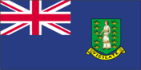
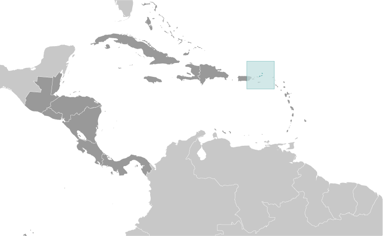
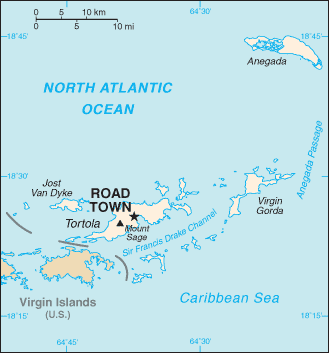

# British Virgin Islands

_overseas territory of the UK_

## Introduction

**_Background:_**   
First inhabited by Arawak and later by Carib Indians, the Virgin Islands were settled by the Dutch in 1648 and then annexed by the English in 1672. The islands were part of the British colony of the Leeward Islands from 1872-1960; they were granted autonomy in 1967. The economy is closely tied to the larger and more populous US Virgin Islands to the west; the US dollar is the legal currency.

## Geography

**_Location:_**   
Caribbean, between the Caribbean Sea and the North Atlantic Ocean, east of Puerto Rico

**_Geographic coordinates:_**   
18 30 N, 64 30 W

**_Map references:_**   
Central America and the Caribbean

**_Area:_**   
**total:** 151 sq km   
**land:** 151 sq km   
**water:** 0 sq km   
**note:** comprised of 16 inhabited and more than 20 uninhabited islands; includes the islands of Tortola, Anegada, Virgin Gorda, Jost van Dyke

**_Area - comparative:_**   
about 0.9 times the size of Washington, DC

**_Land boundaries:_**   
0 km

**_Coastline:_**   
80 km

**_Maritime claims:_**   
**territorial sea:** 3 nm   
**exclusive fishing zone:** 200 nm

**_Climate:_**   
subtropical; humid; temperatures moderated by trade winds

**_Terrain:_**   
coral islands relatively flat; volcanic islands steep, hilly

**_Elevation extremes:_**   
**lowest point:** Caribbean Sea 0 m   
**highest point:** Mount Sage 521 m

**_Natural resources:_**   
NEGL

**_Land use:_**   
**arable land:** 6.67%   
**permanent crops:** 6.67%   
**other:** 86.67% (2011)

**_Irrigated land:_**   
NA

**_Natural hazards:_**   
hurricanes and tropical storms (July to October)

**_Environment - current issues:_**   
limited natural freshwater resources except for a few seasonal streams and springs on Tortola; most of the islands' water supply comes from wells and rainwater catchments

**_Geography - note:_**   
strong ties to nearby US Virgin Islands and Puerto Rico

## People and Society

**_Nationality:_**   
**noun:** British Virgin Islander(s)   
**adjective:** British Virgin Islander

**_Ethnic groups:_**   
black 82%, white 6.8%, other 11.2% (includes Indian and mixed) (2008)

**_Languages:_**   
English (official)

**_Religions:_**   
Protestant 84% (Methodist 33%, Anglican 17%, Church of God 9%, Seventh-Day Adventist 6%, Baptist 4%, other 15%), Roman Catholic 10%, Jehovah's Witnesses 2%, other 2%, none 2% (1991)

**_Population:_**   
32,680 (July 2014 est.)

**_Age structure:_**   
**0-14 years:** 17.2% (male 2,770/female 2,861)   
**15-24 years:** 14.5% (male 2,252/female 2,472)   
**25-54 years:** 49.8% (male 7,697/female 8,574)   
**55-64 years:** 10.6% (male 1,709/female 1,763)   
**65 years and over:** 7.6% (male 1,258/female 1,324) (2014 est.)

**_Median age:_**   
**total:** 35.6 years   
**male:** 35.5 years   
**female:** 35.7 years (2014 est.)

**_Population growth rate:_**   
2.36% (2014 est.)

**_Birth rate:_**   
10.83 births/1,000 population (2014 est.)

**_Death rate:_**   
4.93 deaths/1,000 population (2014 est.)

**_Net migration rate:_**   
17.69 migrant(s)/1,000 population (2014 est.)

**_Urbanization:_**   
**urban population:** 40.6% of total population (2011)   
**rate of urbanization:** 1.48% annual rate of change (2010-15 est.)

**_Major urban areas - population:_**   
ROAD TOWN (capital) 10,000 (2011)

**_Sex ratio:_**   
**at birth:** 1.05 male(s)/female   
**0-14 years:** 0.97 male(s)/female   
**15-24 years:** 0.91 male(s)/female   
**25-54 years:** 0.9 male(s)/female   
**55-64 years:** 0.92 male(s)/female   
**65 years and over:** 0.95 male(s)/female   
**total population:** 0.93 male(s)/female (2014 est.)

**_Infant mortality rate:_**   
**total:** 13.45 deaths/1,000 live births   
**male:** 15.31 deaths/1,000 live births   
**female:** 11.49 deaths/1,000 live births (2014 est.)

**_Life expectancy at birth:_**   
**total population:** 78.29 years   
**male:** 76.99 years   
**female:** 79.66 years (2014 est.)

**_Total fertility rate:_**   
1.25 children born/woman (2014 est.)

**_Drinking water source:_**   
**improved:** urban: 98% of population; rural: 98% of population; total: 98% of population   
**unimproved:** urban: 2% of population; rural: 2% of population; total: 2% of population (2010 est.)

**_Sanitation facility access:_**   
**improved:** urban: 97.5% of population; rural: 97.5% of population; total: 97.5% of population   
**unimproved:** urban: 2.5% of population; rural: 2.5% of population; total: 2.5% of population (2012 est.)

**_HIV/AIDS - adult prevalence rate:_**   
NA

**_HIV/AIDS - people living with HIV/AIDS:_**   
NA

**_HIV/AIDS - deaths:_**   
NA

**_Education expenditures:_**   
4.4% of GDP (2010)

**_Literacy:_**   
**definition:** age 15 and over can read and write   
**total population:** 97.8%   
**male:** NA   
**female:** NA (1991 est.)

**_School life expectancy (primary to tertiary education):_**   
**total:** 15 years   
**male:** 15 years   
**female:** 16 years (2009)

## Government

**_Country name:_**   
**conventional long form:** none   
**conventional short form:** British Virgin Islands   
**abbreviation:** BVI

**_Dependency status:_**   
overseas territory of the UK; internal self-governing

**_Government type:_**   
NA

**_Capital:_**   
**name:** Road Town   
**geographic coordinates:** 18 25 N, 64 37 W   
**time difference:** UTC-4 (1 hour ahead of Washington, DC, during Standard Time)

**_Administrative divisions:_**   
none (overseas territory of the UK)

**_Independence:_**   
none (overseas territory of the UK)

**_National holiday:_**   
Territory Day, 1 July (1956)

**_Constitution:_**   
several previous; latest effective 15 June 2007 (2007)

**_Legal system:_**   
English common law

**_Suffrage:_**   
18 years of age; universal

**_Executive branch:_**   
**chief of state:** Queen ELIZABETH II (since 6 February 1952); represented by Governor Boyd MCCLEARY (since 20 August 2010)   
**head of government:** Premier Orlando SMITH (since 9 November 2011)   
**cabinet:** Executive Council appointed by the governor from members of the House of Assembly   
**elections:** the monarchy is hereditary; governor appointed by the monarch; following legislative elections, the leader of the majority party or the leader of the majority coalition usually appointed premier by the governor

**_Legislative branch:_**   
unicameral House of Assembly (13 elected seats, a speaker elected by the 13 members of the House of Assembly, and 1 non-voting ex officio member in the attorney general; members are elected by direct popular vote, 1 member from each of nine electoral districts, 4 at-large members; members serve four-year terms)   
**elections:** last held on 7 November 2011 (next to be held in 2015)   
**election results:** percent of vote by party - NDP 49.4%, VIP 42%, other 8.6%; seats by party - NDP 9, VIP 4

**_Judicial branch:_**   
**highest court(s):** the Eastern Caribbean Supreme Court (ECSC) is the itinerant superior court of record for the 9-member Organization of Eastern Caribbean States to include the British Virgin Islands; the ECSC - with its headquarters on St. Lucia - is headed by the chief justice and is comprised of the Court of Appeal with 3 justices and the High Court with 16 judges; sittings of the Court of Appeal and High Court rotate among the 9 member states; 3 High Court judges reside in member states; 3 High Court judges reside on the British Virgin Islands   
**judge selection and term of office:** Eastern Caribbean Supreme Court chief justice appointed by Her Majesty, Queen ELIZABETH II; other justices and judges appointed by the Judicial and Legal Services Commission; Court of Appeal justices appointed for life with mandatory retirement at age 65; High Court judges appointed for life with mandatory retirement at age 62   
**subordinate courts:** Magistrates' Courts

**_Political parties and leaders:_**   
Concerned Citizens Movement or CCM [Ethlyn SMITH]; National Democratic Party or NDP [Orlando SMITH]; United Party or UP [Gregory MADURO]; Virgin Islands Party or VIP [Ralph T. O'NEAL]

**_Political pressure groups and leaders:_**   
The Family Support Network; The Women's Desk   
**other:** environmentalists

**_International organization participation:_**   
Caricom (associate), CDB, Interpol (subbureau), IOC, OECS, UNESCO (associate), UPU

**_Diplomatic representation in the US:_**   
none (overseas territory of the UK)

**_Diplomatic representation from the US:_**   
none (overseas territory of the UK)

**_Flag description:_**   
blue, with the flag of the UK in the upper hoist-side quadrant and the Virgin Islander coat of arms centered in the outer half of the flag; the coat of arms depicts a woman flanked on either side by a vertical column of six oil lamps above a scroll bearing the Latin word VIGILATE (Be Watchful); the islands were named by COLUMBUS in 1493 in honor of Saint Ursula and her 11 virgin followers (some sources say 11,000) who reputedly were martyred by the Huns in the 4th or 5th century; the figure on the banner holding a lamp represents the saint, the other lamps symbolize her followers

**_National anthem:_**   
**note:** as a territory of the United Kingdom, "God Save the Queen" is official (see United Kingdom)

## Economy

**_Economy - overview:_**   
The economy, one of the most stable and prosperous in the Caribbean, is highly dependent on tourism generating an estimated 45% of the national income. More than 934,000 tourists, mainly from the US, visited the islands in 2008. In the mid-1980s, the government began offering offshore registration to companies wishing to incorporate in the islands, and incorporation fees now generate substantial revenues. Roughly 400,000 companies were on the offshore registry by yearend 2000. The adoption of a comprehensive insurance law in late 1994, which provides a blanket of confidentiality with regulated statutory gateways for investigation of criminal offenses, made the British Virgin Islands even more attractive to international business. Livestock raising is the most important agricultural activity; poor soils limit the islands' ability to meet domestic food requirements. Because of traditionally close links with the US Virgin Islands, the British Virgin Islands has used the US dollar as its currency since 1959.

**_GDP (purchasing power parity):_**   
$500 million (2010 est.)

**_GDP (official exchange rate):_**   
$1.095 billion (2008)

**_GDP - real growth rate:_**   
1.3% (2010 est.)   
-0.6% (2008 est.)

**_GDP - per capita (PPP):_**   
$42,300 (2010 est.)

**_GDP - composition, by end use:_**   
**household consumption:** 34.1%   
**government consumption:** 8.3%   
**investment in fixed capital:** 23.7%   
**investment in inventories:** 0%   
**exports of goods and services:** 107.8%   
**imports of goods and services:** -73.9%; (2013 est.)

**_GDP - composition, by sector of origin:_**   
**agriculture:** 1.1%   
**industry:** 11.7%   
**services:** 87.2% (2013 est.)

**_Agriculture - products:_**   
fruits, vegetables; livestock, poultry; fish

**_Industries:_**   
tourism, light industry, construction, rum, concrete block, offshore banking center

**_Industrial production growth rate:_**   
3% (2013 est.)

**_Labor force:_**   
12,770 (2004)

**_Labor force - by occupation:_**   
**agriculture:** 0.6%   
**industry:** 40%   
**services:** 59.4% (2005)

**_Unemployment rate:_**   
8.7% (2010 est.)

**_Population below poverty line:_**   
NA%

**_Household income or consumption by percentage share:_**   
**lowest 10%:** NA%   
**highest 10%:** NA%

**_Budget:_**   
**revenues:** $300 million   
**expenditures:** $300 million (2013 est.)

**_Taxes and other revenues:_**   
27.4% of GDP (2013 est.)

**_Budget surplus (+) or deficit (-):_**   
0% of GDP (2013 est.)

**_Fiscal year:_**   
1 April - 31 March

**_Inflation rate (consumer prices):_**   
1.6% (2013 est.)   
2.2% (2012 est.)

**_Current account balance:_**   
$362.6 million (2010 est.)   
$279.8 million (2010 est.)

**_Exports:_**   
$26 million (2012 est.)   
$25 million (2011 est.)

**_Exports - commodities:_**   
rum, fresh fish, fruits, animals; gravel, sand

**_Imports:_**   
$310 million (2012 est.)   
$320 million (2011 est.)

**_Imports - commodities:_**   
building materials, automobiles, foodstuffs, machinery

**_Debt - external:_**   
$36.1 million (1997)

**_Exchange rates:_**   
the US dollar is used

## Energy

**_Electricity - production:_**   
50 million kWh (2010 est.)

**_Electricity - consumption:_**   
46.5 million kWh (2010 est.)

**_Electricity - exports:_**   
0 kWh (2012 est.)

**_Electricity - imports:_**   
0 kWh (2012 est.)

**_Electricity - installed generating capacity:_**   
44,000 kW (2010 est.)

**_Electricity - from fossil fuels:_**   
100% of total installed capacity (2010 est.)

**_Electricity - from nuclear fuels:_**   
0% of total installed capacity (2010 est.)

**_Electricity - from hydroelectric plants:_**   
0% of total installed capacity (2010 est.)

**_Electricity - from other renewable sources:_**   
0% of total installed capacity (2010 est.)

**_Crude oil - production:_**   
0 bbl/day (2012 est.)

**_Crude oil - exports:_**   
0 bbl/day (2010 est.)

**_Crude oil - imports:_**   
0 bbl/day (2010 est.)

**_Crude oil - proved reserves:_**   
0 bbl (1 January 2013 est.)

**_Refined petroleum products - production:_**   
0 bbl/day (2010 est.)

**_Refined petroleum products - consumption:_**   
1,000 bbl/day (2011 est.)

**_Refined petroleum products - exports:_**   
0 bbl/day (2010 est.)

**_Refined petroleum products - imports:_**   
773 bbl/day (2010 est.)

**_Natural gas - production:_**   
0 cu m (2011 est.)

**_Natural gas - consumption:_**   
0 cu m (2010 est.)

**_Natural gas - exports:_**   
0 cu m (2011 est.)

**_Natural gas - imports:_**   
0 cu m (2011 est.)

**_Natural gas - proved reserves:_**   
0 cu m (1 January 2013 est.)

**_Carbon dioxide emissions from consumption of energy:_**   
147,200 Mt (2011 est.)

## Communications

**_Telephones - main lines in use:_**   
12,268 (2012)

**_Telephones - mobile cellular:_**   
48,700 (2012)

**_Telephone system:_**   
**general assessment:** good overall telephone service   
**domestic:** fixed line connections exceed 80 per 100 persons and mobile cellular subscribership is roughly 150 per 100 persons   
**international:** country code - 1-284; connected via submarine cable to Bermuda; the East Caribbean Fiber System (ECFS) submarine cable provides connectivity to 13 other islands in the eastern Caribbean (2011)

**_Broadcast media:_**   
1 private TV station; multi-channel TV is available from cable and satellite subscription services; about a half dozen private radio stations (2007)

**_Internet country code:_**   
.vg

**_Internet hosts:_**   
505 (2012)

**_Internet users:_**   
4,000 (2002)

## Transportation

**_Airports:_**   
4 (2013)

**_Airports - with paved runways:_**   
**total:** 2   
**914 to 1,523 m:** 1   
**under 914 m:** 1 (2013)

**_Airports - with unpaved runways:_**   
**total:** 2   
**914 to 1,523 m:** 2 (2013)

**_Roadways:_**   
**total:** 200 km   
**paved:** 200 km (2007)

**_Ports and terminals:_**   
**seaport(s):** Road Harbor

## Military

**_Manpower available for military service:_**   
**males age 16-49:** 7,266 (2010 est.)

**_Manpower fit for military service:_**   
**males age 16-49:** 6,057   
**females age 16-49:** 5,805 (2010 est.)

**_Manpower reaching militarily significant age annually:_**   
**male:** 168   
**female:** 162 (2010 est.)

**_Military - note:_**   
defense is the responsibility of the UK

## Transnational Issues

**_Disputes - international:_**   
none

**_Illicit drugs:_**   
transshipment point for South American narcotics destined for the US and Europe; large offshore financial center makes it vulnerable to money laundering

............................................................   
_Page last updated on June 20, 2014_
