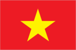
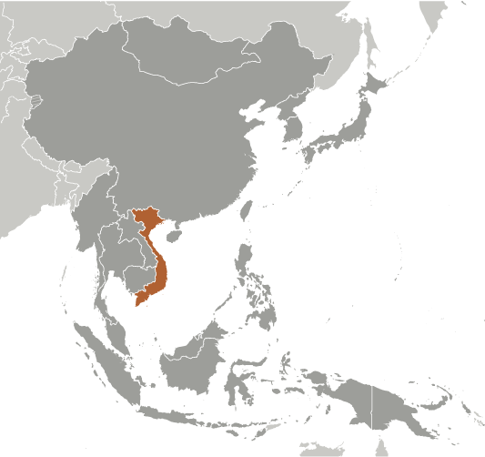
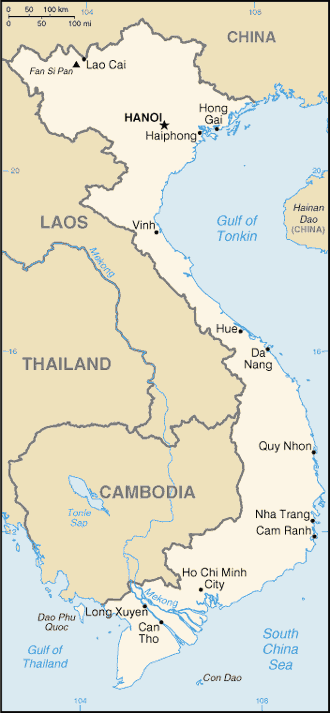

# Vietnam

## Introduction

**_Background:_**   
The conquest of Vietnam by France began in 1858 and was completed by 1884. It became part of French Indochina in 1887. Vietnam declared independence after World War II, but France continued to rule until its 1954 defeat by communist forces under Ho Chi MINH. Under the Geneva Accords of 1954, Vietnam was divided into the communist North and anti-communist South. US economic and military aid to South Vietnam grew through the 1960s in an attempt to bolster the government, but US armed forces were withdrawn following a cease-fire agreement in 1973. Two years later, North Vietnamese forces overran the South reuniting the country under communist rule. Despite the return of peace, for over a decade the country experienced little economic growth because of conservative leadership policies, the persecution and mass exodus of individuals - many of them successful South Vietnamese merchants - and growing international isolation. However, since the enactment of Vietnam's "doi moi" (renovation) policy in 1986, Vietnamese authorities have committed to increased economic liberalization and enacted structural reforms needed to modernize the economy and to produce more competitive, export-driven industries. The communist leaders, however, maintain control on political expression and have resisted outside calls to improve human rights. The country continues to experience small-scale protests from various groups - the vast majority connected to land-use issues, calls for increased political space, and the lack of equitable mechanisms for resolving disputes. Various ethnic minorities, such as the Montagnards of the Central Highlands and the Khmer Krom in the southern delta region, have also held protests.

## Geography

**_Location:_**   
Southeastern Asia, bordering the Gulf of Thailand, Gulf of Tonkin, and South China Sea, as well as China, Laos, and Cambodia

**_Geographic coordinates:_**   
16 10 N, 107 50 E

**_Map references:_**   
Southeast Asia

**_Area:_**   
**total:** 331,210 sq km   
**land:** 310,070 sq km   
**water:** 21,140 sq km

**_Area - comparative:_**   
slightly larger than New Mexico

**_Land boundaries:_**   
**total:** 4,639 km   
**border countries:** Cambodia 1,228 km, China 1,281 km, Laos 2,130 km

**_Coastline:_**   
3,444 km (excludes islands)

**_Maritime claims:_**   
**territorial sea:** 12 nm   
**contiguous zone:** 24 nm   
**exclusive economic zone:** 200 nm   
**continental shelf:** 200 nm or to the edge of the continental margin

**_Climate:_**   
tropical in south; monsoonal in north with hot, rainy season (May to September) and warm, dry season (October to March)

**_Terrain:_**   
low, flat delta in south and north; central highlands; hilly, mountainous in far north and northwest

**_Elevation extremes:_**   
**lowest point:** South China Sea 0 m   
**highest point:** Fan Si Pan 3,144 m

**_Natural resources:_**   
phosphates, coal, manganese, rare earth elements, bauxite, chromate, offshore oil and gas deposits, timber, hydropower

**_Land use:_**   
**arable land:** 19.64%   
**permanent crops:** 11.18%   
**other:** 69.18% (2011)

**_Irrigated land:_**   
45,850 sq km (2005)

**_Total renewable water resources:_**   
884.1 cu km (2011)

**_Freshwater withdrawal (domestic/industrial/agricultural):_**   
**total:** 82.03 cu km/yr (1%/4%/95%)   
**per capita:** 965 cu m/yr (2005)

**_Natural hazards:_**   
occasional typhoons (May to January) with extensive flooding, especially in the Mekong River delta

**_Environment - current issues:_**   
logging and slash-and-burn agricultural practices contribute to deforestation and soil degradation; water pollution and overfishing threaten marine life populations; groundwater contamination limits potable water supply; growing urban industrialization and population migration are rapidly degrading environment in Hanoi and Ho Chi Minh City

**_Environment - international agreements:_**   
**party to:** Biodiversity, Climate Change, Climate Change-Kyoto Protocol, Desertification, Endangered Species, Environmental Modification, Hazardous Wastes, Law of the Sea, Ozone Layer Protection, Ship Pollution, Wetlands   
**signed, but not ratified:** none of the selected agreements

**_Geography - note:_**   
extending 1,650 km north to south, the country is only 50 km across at its narrowest point

## People and Society

**_Nationality:_**   
**noun:** Vietnamese (singular and plural)   
**adjective:** Vietnamese

**_Ethnic groups:_**   
Kinh (Viet) 85.7%, Tay 1.9%, Thai 1.8%, Muong 1.5%, Khmer 1.5%, Mong 1.2%, Nung 1.1%, others 5.3% (1999 census)

**_Languages:_**   
Vietnamese (official), English (increasingly favored as a second language), some French, Chinese, and Khmer, mountain area languages (Mon-Khmer and Malayo-Polynesian)

**_Religions:_**   
Buddhist 9.3%, Catholic 6.7%, Hoa Hao 1.5%, Cao Dai 1.1%, Protestant 0.5%, Muslim 0.1%, none 80.8% (1999 census)

**_Population:_**   
93,421,835 (July 2014 est.)

**_Age structure:_**   
**0-14 years:** 24.3% (male 11,946,656/female 10,800,602)   
**15-24 years:** 17.8% (male 8,598,360/female 8,023,377)   
**25-54 years:** 44.8% (male 20,983,638/female 20,861,243)   
**55-64 years:** 7.4% (male 3,149,494/female 3,763,309)   
**65 years and over:** 5.6% (male 2,034,721/female 3,260,435) (2014 est.)

**_Dependency ratios:_**   
**total dependency ratio:** 41.3 %   
**youth dependency ratio:** 31.9 %   
**elderly dependency ratio:** 9.4 %   
**potential support ratio:** 10.6 (2014 est.)

**_Median age:_**   
**total:** 29.2 years   
**male:** 28.1 years   
**female:** 30.2 years (2014 est.)

**_Population growth rate:_**   
1% (2014 est.)

**_Birth rate:_**   
16.26 births/1,000 population (2014 est.)

**_Death rate:_**   
5.93 deaths/1,000 population (2014 est.)

**_Net migration rate:_**   
-0.32 migrant(s)/1,000 population (2014 est.)

**_Urbanization:_**   
**urban population:** 31% of total population (2011)   
**rate of urbanization:** 3.03% annual rate of change (2010-15 est.)

**_Major urban areas - population:_**   
Ho Chi Minh City 6.405 million; HANOI (capital) 2.955 million; Haiphong 925,000; Da Nang 834,000 (2011)

**_Sex ratio:_**   
**at birth:** 1.12 male(s)/female   
**0-14 years:** 1.11 male(s)/female   
**15-24 years:** 1.07 male(s)/female   
**25-54 years:** 1.01 male(s)/female   
**55-64 years:** 1 male(s)/female   
**65 years and over:** 0.62 male(s)/female   
**total population:** 1 male(s)/female (2014 est.)

**_Mother's mean age at first birth:_**   
22.6   
**note:** median age at first birth among women 25-29 (2002 est.)

**_Maternal mortality rate:_**   
59 deaths/100,000 live births (2010)

**_Infant mortality rate:_**   
**total:** 18.99 deaths/1,000 live births   
**male:** 19.35 deaths/1,000 live births   
**female:** 18.58 deaths/1,000 live births (2014 est.)

**_Life expectancy at birth:_**   
**total population:** 72.91 years   
**male:** 70.44 years   
**female:** 75.65 years (2014 est.)

**_Total fertility rate:_**   
1.85 children born/woman (2014 est.)

**_Contraceptive prevalence rate:_**   
77.8% (2010/11)

**_Health expenditures:_**   
6.8% of GDP (2011)

**_Physicians density:_**   
1.22 physicians/1,000 population (2008)

**_Hospital bed density:_**   
2.2 beds/1,000 population (2010)

**_Drinking water source:_**   
**improved:** urban: 98.2% of population; rural: 93.6% of population; total: 95% of population   
**unimproved:** urban: 1.8% of population; rural: 6.4% of population; total: 5% of population (2012 est.)

**_Sanitation facility access:_**   
**improved:** urban: 93.1% of population; rural: 66.6% of population; total: 75% of population   
**unimproved:** urban: 6.9% of population; rural: 33.4% of population; total: 25% of population (2012 est.)

**_HIV/AIDS - adult prevalence rate:_**   
0.4% (2012 est.)

**_HIV/AIDS - people living with HIV/AIDS:_**   
259,200 (2012 est.)

**_HIV/AIDS - deaths:_**   
11,700 (2012 est.)

**_Major infectious diseases:_**   
**degree of risk:** very high   
**food or waterborne diseases:** bacterial diarrhea, hepatitis A, and typhoid fever   
**vectorborne diseases:** dengue fever, malaria, and Japanese encephalitis   
**note:** highly pathogenic H5N1 avian influenza has been identified in this country; it poses a negligible risk with extremely rare cases possible among US citizens who have close contact with birds (2013)

**_Obesity - adult prevalence rate:_**   
1.7% (2008)

**_Children under the age of 5 years underweight:_**   
12% (2011)

**_Education expenditures:_**   
6.3% of GDP (2010)

**_Literacy:_**   
**definition:** age 15 and over can read and write   
**total population:** 93.4%   
**male:** 95.4%   
**female:** 91.4% (2011 est.)

**_Child labor - children ages 5-14:_**   
**total number:** 2,545,616   
**percentage:** 16 % (2006 est.)

**_Unemployment, youth ages 15-24:_**   
**total:** 5.5%   
**male:** 4.6%   
**female:** 6.5% (2012)

## Government

**_Country name:_**   
**conventional long form:** Socialist Republic of Vietnam   
**conventional short form:** Vietnam   
**local long form:** Cong Hoa Xa Hoi Chu Nghia Viet Nam   
**local short form:** Viet Nam   
**abbreviation:** SRV

**_Government type:_**   
Communist state

**_Capital:_**   
**name:** Hanoi (Ha Noi)   
**geographic coordinates:** 21 02 N, 105 51 E   
**time difference:** UTC+7 (12 hours ahead of Washington, DC, during Standard Time)

**_Administrative divisions:_**   
58 provinces (tinh, singular and plural) and 5 municipalities (thanh pho, singular and plural)   
**provinces:** An Giang, Bac Giang, Bac Kan, Bac Lieu, Bac Ninh, Ba Ria-Vung Tau, Ben Tre, Binh Dinh, Binh Duong, Binh Phuoc, Binh Thuan, Ca Mau, Cao Bang, Dak Lak, Dak Nong, Dien Bien, Dong Nai, Dong Thap, Gia Lai, Ha Giang, Ha Nam, Ha Tinh, Hai Duong, Hau Giang, Hoa Binh, Hung Yen, Khanh Hoa, Kien Giang, Kon Tum, Lai Chau, Lam Dong, Lang Son, Lao Cai, Long An, Nam Dinh, Nghe An, Ninh Binh, Ninh Thuan, Phu Tho, Phu Yen, Quang Binh, Quang Nam, Quang Ngai, Quang Ninh, Quang Tri, Soc Trang, Son La, Tay Ninh, Thai Binh, Thai Nguyen, Thanh Hoa, Thua Thien-Hue, Tien Giang, Tra Vinh, Tuyen Quang, Vinh Long, Vinh Phuc, Yen Bai   
**municipalities:** Can Tho, Da Nang, Ha Noi, Hai Phong, Ho Chi Minh City (Saigon)

**_Independence:_**   
2 September 1945 (from France)

**_National holiday:_**   
Independence Day, 2 September (1945)

**_Constitution:_**   
several previous; latest adopted 15 April 1992, effective 1 January 1995; amended 2001, 2013 (2014)

**_Legal system:_**   
civil law system; note - the civil code of 2005 reflects a European-style civil law

**_International law organization participation:_**   
has not submitted an ICJ jurisdiction declaration; non-party state to the ICCt

**_Suffrage:_**   
18 years of age; universal

**_Executive branch:_**   
**chief of state:** President Truong Tan SANG (since 25 July 2011); Vice President Nguyen Thi DOAN (since 25 July 2007)   
**head of government:** Prime Minister Nguyen Tan DUNG (since 27 June 2006); Deputy Prime Minister Vu Duc DAM (since 13 November 2013), Deputy Prime Minister Hoang Trung HAI (since 2 August 2007), Deputy Prime Minister Pham Binh MINH (since 13 November 2013), Deputy Prime Minister Vu Van NINH (since 3 August 2011), and Deputy Prime Minister Nguyen Xuan PHUC (since 3 August 2011)   
**cabinet:** Cabinet appointed by president based on proposal of prime minister and confirmed by National Assembly   
**elections:** president elected by the National Assembly from among its members for five-year term; last election held 25 July 2011 (next to be held in July 2016); prime minister appointed by the president from among the members of the National Assembly; deputy prime ministers appointed by the prime minister; appointment of prime minister and deputy prime ministers confirmed by National Assembly   
**election results:** Truong Tan SANG elected president, percent of National Assembly vote - 97%; Nguyen Tan DUNG elected prime minister, percent of National Assembly vote - 94%

**_Legislative branch:_**   
unicameral National Assembly or Quoc Hoi (500 seats; members elected by popular vote to serve five-year terms)   
**elections:** last held on 22 May 2011 (next to be held in May 2016)   
**election results:** percent of vote by party - NA; seats by party - CPV 458, non-party CPV-approved 38, self-nominated 4; note - 500 candidates were elected; the 496 CPV and non-party CPV-approved delegates were members of the Vietnamese Fatherland Front and were vetted prior to the election

**_Judicial branch:_**   
**highest court(s):** Supreme People's Court (consists of the chief justice and 13 judges)   
**judge selection and term of office:** chief justice elected by the National Assembly on the recommendation of the president for a 5-year, renewable term; other judges appointed by the president for 5-year terms   
**subordinate courts:** Court of Appeals; administrative, civil, criminal, economic, and labor courts; Central Military Court; People's Special Courts; note - the National Assembly can establish special tribunals

**_Political parties and leaders:_**   
Communist Party of Vietnam or CPV [Nguyen Phu TRONG]   
**note:** other parties proscribed

**_Political pressure groups and leaders:_**   
8406 Bloc   
Democratic Party of Vietnam or DPV   
People's Democratic Party Vietnam or PDP-VN   
Alliance for Democracy   
**note:** these groups advocate democracy but are not recognized by the government

**_International organization participation:_**   
ADB, APEC, ARF, ASEAN, CICA, CP, EAS, FAO, G-77, IAEA, IBRD, ICAO, ICC (NGOs), ICRM, IDA, IFAD, IFC, IFRCS, ILO, IMF, IMO, IMSO, Interpol, IOC, IOM, IPU, ISO, ITSO, ITU, MIGA, NAM, OIF, OPCW, PCA, UN, UNCTAD, UNESCO, UNIDO, UNWTO, UPU, WCO, WFTU (NGOs), WHO, WIPO, WMO, WTO

**_Diplomatic representation in the US:_**   
**chief of mission:** Ambassador Nguyen Quoc CUONG (since 2 May 2011)   
**chancery:** 1233 20th Street NW, Suite 400, Washington, DC 20036   
**telephone:** [1] (202) 861-0737   
**FAX:** [1] (202) 861-0917   
**consulate(s) general:** Houston, New York, San Francisco   
**consulate:** New York

**_Diplomatic representation from the US:_**   
**chief of mission:** Ambassador David B. SHEAR (since 4 August 2011)   
**embassy:** Rose Garden Building, 170 Ngoc Khanh St., Hanoi   
**mailing address:** 7 Lang Ha Street, Ba Dinh District, Hanoi; 4550 Hanoi Place, Washington, DC 20521-4550   
**telephone:** [84] (4) 3850-5000   
**FAX:** [84] (4) 3850-5010   
**consulate(s) general:** Ho Chi Minh City

**_Flag description:_**   
red field with a large yellow five-pointed star in the center; red symbolizes revolution and blood, the five-pointed star represents the five elements of the populace - peasants, workers, intellectuals, traders, and soldiers - that unite to build socialism

**_National symbol(s):_**   
yellow, five-pointed star on red field; lotus blossom

**_National anthem:_**   
**name:** "Tien quan ca" (The Song of the Marching Troops)   
**lyrics/music:** Nguyen Van CAO   
**note:** adopted as the national anthem of the Democratic Republic of Vietnam in 1945; it became the national anthem of the unified Socialist Republic of Vietnam in 1976; although it consists of two verses, only the first is used as the official anthem

## Economy

**_Economy - overview:_**   
Vietnam is a densely-populated developing country that has been transitioning from the rigidities of a centrally-planned economy since 1986. Vietnamese authorities have reaffirmed their commitment to economic modernization in recent years. Vietnam joined the World Trade Organization in January 2007, which has promoted more competitive, export-driven industries. Vietnam became an official negotiating partner in the Trans-Pacific Partnership trade agreement in 2010. Agriculture's share of economic output has continued to shrink from about 25% in 2000 to less than 20% in 2013, while industry's share increased from 36% to more than 42% in the same period. State-owned enterprises account for about 40% of GDP. Poverty has declined significantly, and Vietnam is working to create jobs to meet the challenge of a labor force that is growing by more than one million people every year. The global recession hurt Vietnam's export-oriented economy, with GDP in 2013 growing at 5%, the slowest rate of growth since 1999. In 2013, however, exports increased by more than 12%, year-on-year; several administrative actions brought the trade deficit back into balance. Between 2008 and 2011, Vietnam's managed currency, the dong, was devalued in excess of 20%, but its value remained relatively stable in 2013. Hanoi has oscillated between promoting growth and emphasizing macroeconomic stability in recent years. In February 2011, the government shifted from policies aimed at achieving a high rate of economic growth, which had stoked inflation, to those aimed at stabilizing the economy, through tighter monetary and fiscal control. Although Vietnam unveiled a broad, "three pillar" economic reform program in early 2012, proposing the restructuring of public investment, state-owned enterprises, and the banking sector, little perceptible progress has been made. Vietnam's economy continues to face challenges from an undercapitalized banking sector. Non-performing loans weigh heavily on banks and businesses.

**_GDP (purchasing power parity):_**   
$358.9 billion (2013 est.)   
$340.8 billion (2012 est.)   
$323.8 billion (2011 est.)   
**note:** data are in 2013 US dollars

**_GDP (official exchange rate):_**   
$170 billion (2013 est.)

**_GDP - real growth rate:_**   
5.3% (2013 est.)   
5.2% (2012 est.)   
6.2% (2011 est.)

**_GDP - per capita (PPP):_**   
$4,000 (2013 est.)   
$3,800 (2012 est.)   
$3,700 (2011 est.)   
**note:** data are in 2013 US dollars

**_Gross national saving:_**   
38.4% of GDP (2013 est.)   
39% of GDP (2012 est.)   
32.8% of GDP (2011 est.)

**_GDP - composition, by end use:_**   
**household consumption:** 68.9%   
**government consumption:** 6.8%   
**investment in fixed capital:** 30.4%   
**investment in inventories:** 3.1%   
**exports of goods and services:** 84.7%   
**imports of goods and services:** -93.9%; (2013 est.)

**_GDP - composition, by sector of origin:_**   
**agriculture:** 19.3%   
**industry:** 38.5%   
**services:** 42.2% (2013 est.)

**_Agriculture - products:_**   
rice, coffee, rubber, tea, pepper, soybeans, cashews, sugar cane, peanuts, bananas; poultry; fish, seafood

**_Industries:_**   
food processing, garments, shoes, machine-building; mining, coal, steel; cement, chemical fertilizer, glass, tires, oil, mobile phones

**_Industrial production growth rate:_**   
5% (2013 est.)

**_Labor force:_**   
52.93 million (2013 est.)

**_Labor force - by occupation:_**   
**agriculture:** 48%   
**industry:** 21%   
**services:** 31% (2012)

**_Unemployment rate:_**   
1.3% (2013 est.)   
3.2% (2012 est.)

**_Population below poverty line:_**   
11.3% (2012 est.)

**_Household income or consumption by percentage share:_**   
**lowest 10%:** 3.2%   
**highest 10%:** 30.2% (2008)

**_Distribution of family income - Gini index:_**   
37.6 (2008)   
36.1 (1998)

**_Budget:_**   
**revenues:** $42.82 billion   
**expenditures:** $50 billion (2013 est.)

**_Taxes and other revenues:_**   
25.2% of GDP (2013 est.)

**_Budget surplus (+) or deficit (-):_**   
-4.2% of GDP (2013 est.)

**_Public debt:_**   
48.2% of GDP (2013 est.)   
48.1% of GDP (2012 est.)   
**note:** official data; data cover general government debt, and includes debt instruments issued (or owned) by government entities other than the treasury; the data include treasury debt held by foreign entities; the data include debt issued by subnational entities, as well as intra-governmental debt; intra-governmental debt consists of treasury borrowings from surpluses in the social funds, such as for retirement, medical care, and unemployment; debt instruments for the social funds are not sold at public auctions

**_Fiscal year:_**   
calendar year

**_Inflation rate (consumer prices):_**   
6.8% (2013 est.)   
9.1% (2012 est.)

**_Central bank discount rate:_**   
9% (31 December 2012)   
15% (31 December 2011)

**_Commercial bank prime lending rate:_**   
10.5% (31 December 2013 est.)   
13.47% (31 December 2012 est.)

**_Stock of narrow money:_**   
$43.99 billion (31 December 2013 est.)   
$40.34 billion (31 December 2012 est.)

**_Stock of broad money:_**   
$184.9 billion (31 December 2013 est.)   
$165.9 billion (31 December 2012 est.)

**_Stock of domestic credit:_**   
$173.8 billion (31 December 2013 est.)   
$163.5 billion (31 December 2012 est.)

**_Market value of publicly traded shares:_**   
$38.2 billion (31 December 2011 est.)   
$26 billion (31 December 2011)   
$37 billion (31 December 2010 est.)

**_Current account balance:_**   
$8.162 billion (2013 est.)   
$9.062 billion (2012 est.)

**_Exports:_**   
$128.9 billion (2013 est.)   
$114.6 billion (2012 est.)

**_Exports - commodities:_**   
clothes, shoes, electronics, seafood, crude oil, rice, coffee, wooden products, machinery

**_Exports - partners:_**   
US 17.8%, Japan 11.8%, China 11.2%, South Korea 5%, Malaysia 4.1% (2012)

**_Imports:_**   
$121.4 billion (2013 est.)   
$104.7 billion (2012 est.)

**_Imports - commodities:_**   
machinery and equipment, petroleum products, steel products, raw materials for the clothing and shoe industries, electronics, plastics, automobiles

**_Imports - partners:_**   
China 25.8%, South Korea 13.9%, Japan 10.4%, Singapore 6%, Thailand 5.2%, US 4.3% (2012)

**_Reserves of foreign exchange and gold:_**   
$32.49 billion (31 December 2013 est.)   
$26.11 billion (31 December 2012 est.)

**_Debt - external:_**   
$68.38 billion (31 December 2013 est.)   
$63.95 billion (31 December 2012 est.)

**_Stock of direct foreign investment - at home:_**   
$84.61 billion (31 December 2013 est.)   
$73.71 billion (31 December 2012 est.)

**_Stock of direct foreign investment - abroad:_**   
$NA (31 December 2009 est.)   
$5.3 billion (31 December 2008)

**_Exchange rates:_**   
dong (VND) per US dollar -   
21,118 (2013 est.)   
20,859 (2012 est.)   
18,612.92 (2010 est.)   
17,799.6 (2009)   
16,548.3 (2008)

## Energy

**_Electricity - production:_**   
117 billion kWh (2012 est.)

**_Electricity - consumption:_**   
104 billion kWh (2012 est.)

**_Electricity - exports:_**   
964 million kWh (2010 est.)

**_Electricity - imports:_**   
2.7 billion kWh (2012 est.)

**_Electricity - installed generating capacity:_**   
26.3 million kW (2012 est.)

**_Electricity - from fossil fuels:_**   
55% of total installed capacity (2012 est.)

**_Electricity - from nuclear fuels:_**   
0% of total installed capacity (2012 est.)

**_Electricity - from hydroelectric plants:_**   
45% of total installed capacity (2012 est.)

**_Electricity - from other renewable sources:_**   
0.1% of total installed capacity (2012 est.)

**_Crude oil - production:_**   
363,500 bbl/day (2012 est.)

**_Crude oil - exports:_**   
188,000 bbl/day (2012 est.)

**_Crude oil - imports:_**   
0 bbl/day (2012 est.)

**_Crude oil - proved reserves:_**   
4.4 billion bbl (1 January 2013 est.)

**_Refined petroleum products - production:_**   
112,000 bbl/day (2012 est.)

**_Refined petroleum products - consumption:_**   
259,900 bbl/day (2012 est.)

**_Refined petroleum products - exports:_**   
37,050 bbl/day (2012 est.)

**_Refined petroleum products - imports:_**   
184,900 bbl/day (2012 est.)

**_Natural gas - production:_**   
9.3 billion cu m (2012 est.)

**_Natural gas - consumption:_**   
10.2 billion cu m (2012 est.)

**_Natural gas - exports:_**   
0 cu m (2012 est.)

**_Natural gas - imports:_**   
890 million cu m (2012 est.)

**_Natural gas - proved reserves:_**   
699.4 billion cu m (1 January 2013 est.)

**_Carbon dioxide emissions from consumption of energy:_**   
112.7 million Mt (2011 est.)

## Communications

**_Telephones - main lines in use:_**   
10.191 million (2012)

**_Telephones - mobile cellular:_**   
134.066 million (2012)

**_Telephone system:_**   
**general assessment:** Vietnam is putting considerable effort into modernization and expansion of its telecommunication system   
**domestic:** all provincial exchanges are digitalized and connected to Hanoi, Da Nang, and Ho Chi Minh City by fiber-optic cable or microwave radio relay networks; main lines have been increased, and the use of mobile telephones is growing rapidly   
**international:** country code - 84; a landing point for the SEA-ME-WE-3, the C2C, and Thailand-Vietnam-Hong Kong submarine cable systems; the Asia-America Gateway submarine cable system, completed in 2009, provided new access links to Asia and the US; satellite earth stations - 2 Intersputnik (Indian Ocean region) (2011)

**_Broadcast media:_**   
government controls all broadcast media exercising oversight through the Ministry of Information and Communication (MIC); government-controlled national TV provider, Vietnam Television (VTV), operates a network of 9 channels with several regional broadcasting centers; programming is relayed nationwide via a network of provincial and municipal TV stations; law limits access to satellite TV but many households are able to access foreign programming via home satellite equipment; government-controlled Voice of Vietnam, the national radio broadcaster, broadcasts on 6 channels and is repeated on AM, FM, and shortwave stations throughout Vietnam (2008)

**_Internet country code:_**   
.vn

**_Internet hosts:_**   
189,553 (2012)

**_Internet users:_**   
23.382 million (2009)

## Transportation

**_Airports:_**   
45 (2013)

**_Airports - with paved runways:_**   
**total:** 38   
**over 3,047 m:** 10   
**2,438 to 3,047 m:** 6   
**1,524 to 2,437 m:** 13   
**914 to 1,523 m:** 9 (2013)

**_Airports - with unpaved runways:_**   
**total:** 7   
**1,524 to 2,437 m:** 1   
**914 to 1,523 m:** 3   
**under 914 m:** 3 (2013)

**_Heliports:_**   
1 (2013)

**_Pipelines:_**   
condensate 72 km; condensate/gas 398 km; gas 955 km; oil 128 km; oil/gas/water 33 km; refined products 206 km; water 13 km (2013)

**_Railways:_**   
**total:** 2,632 km   
**standard gauge:** 527 km 1.435-m gauge   
**narrow gauge:** 2,105 km 1.000-m gauge (2008)

**_Roadways:_**   
**total:** 206,633 km   
**paved:** 148,338 km   
**unpaved:** 47,130 km (2013)

**_Waterways:_**   
47,130 km (30,831 km weight under 50 tons) (2011)

**_Merchant marine:_**   
**total:** 579   
**by type:** barge carrier 1, bulk carrier 142, cargo 335, chemical tanker 23, container 19, liquefied gas 7, passenger/cargo 1, petroleum tanker 48, refrigerated cargo 1, roll on/roll off 1, specialized tanker 1   
**registered in other countries:** 86 (Cambodia 1, Kiribati 2, Mongolia 33, Panama 43, Taiwan 1, Tuvalu 6) (2010)

**_Ports and terminals:_**   
**major seaport(s):** Cam Pha Port, Da Nang, Haiphong, Phu My, Quy Nhon   
**river port(s):** Ho Chi Minh (Mekong)   
**container port(s) (TEUs):** Haiphong (1,018,794), Saigon New Port (3,071,777)

**_Transportation - note:_**   
the International Maritime Bureau reports the territorial and offshore waters in the South China Sea as high risk for piracy and armed robbery against ships; numerous commercial vessels have been attacked and hijacked both at anchor and while underway; hijacked vessels are often disguised and cargo diverted to ports in East Asia; crews have been murdered or cast adrift

## Military

**_Military branches:_**   
People's Armed Forces: People's Army of Vietnam (PAVN; includes Vietnam People's Navy (with Naval Infantry), Vietnam People's Air and Air Defense Force, Border Defense Command, Coast Guard) (2013)

**_Military service age and obligation:_**   
18-25 years of age for male compulsory and voluntary military service; females may volunteer for active duty military service; conscription typically takes place twice annually and service obligation is 18 months (Army, Air Defense), 2 years (Navy and Air Force); 18-45 years of age (male) or 18-40 years of age (female) for Militia Force or Self Defense Force service; males may enroll in military schools at age 17 (2013)

**_Manpower available for military service:_**   
**males age 16-49:** 25,649,738   
**females age 16-49:** 24,995,692 (2010 est.)

**_Manpower fit for military service:_**   
**males age 16-49:** 20,405,847   
**females age 16-49:** 21,098,102 (2010 est.)

**_Manpower reaching militarily significant age annually:_**   
**male:** 847,743   
**female:** 787,341 (2010 est.)

**_Military expenditures:_**   
2.37% of GDP (2012)   
2.17% of GDP (2011)   
2.37% of GDP (2010)

## Transnational Issues

**_Disputes - international:_**   
southeast Asian states have enhanced border surveillance to check the spread of avian flu; Cambodia and Laos protest Vietnamese squatters and armed encroachments along border; Cambodia accuses Vietnam of a wide variety of illicit cross-border activities; progress on a joint development area with Cambodia is hampered by an unresolved dispute over sovereignty of offshore islands; an estimated 300,000 Vietnamese refugees reside in China; establishment of a maritime boundary with Cambodia is hampered by unresolved dispute over the sovereignty of offshore islands; the decade-long demarcation of the China-Vietnam land boundary was completed in 2009; China occupies the Paracel Islands also claimed by Vietnam and Taiwan; Brunei claims a maritime boundary extending beyond as far as a median with Vietnam, thus asserting an implicit claim to Lousia Reef; the 2002 "Declaration on the Conduct of Parties in the South China Sea" has eased tensions but falls short of a legally binding "code of conduct" desired by several of the disputants; Vietnam continues to expand construction of facilities in the Spratly Islands; in March 2005, the national oil companies of China, the Philippines, and Vietnam signed a joint accord to conduct marine seismic activities in the Spratly Islands; Economic Exclusion Zone negotiations with Indonesia are ongoing, and the two countries in Fall 2011 agreed to work together to reduce illegal fishing along their maritime boundary

**_Refugees and internally displaced persons:_**   
**stateless persons:** 11,500 (2012); note - Vietnam's stateless ethnic Chinese Cambodian population dates to the 1970s when thousands of Cambodians fled to Vietnam to escape the Khmer Rouge and were no longer recognized as Cambodian citizens; Vietnamese women who gave up their citizenship to marry foreign men have found themselves stateless after divorcing and returning home to Vietnam; the government addressed this problem in 2009, and Vietnamese women are beginning to reclaim their citizenship

**_Illicit drugs:_**   
minor producer of opium poppy; probable minor transit point for Southeast Asian heroin; government continues to face domestic opium/heroin/methamphetamine addiction problems despite longstanding crackdowns

............................................................   
_Page last updated on June 20, 2014_
