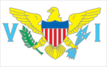
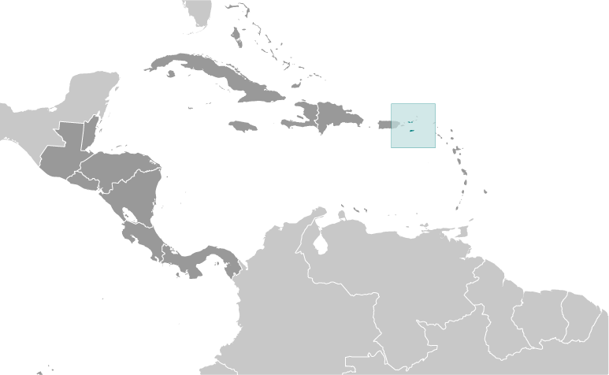
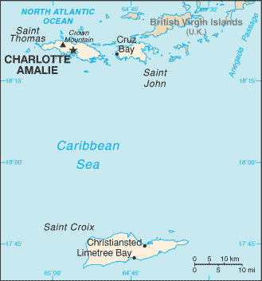

# Virgin Islands

_territory of the US_

## Introduction

**_Background:_**   
The Danes secured control over the southern Virgin Islands of Saint Thomas, Saint John, and Saint Croix during the 17th and early 18th centuries. Sugarcane, produced by African slave labor, drove the islands' economy during the 18th and early 19th centuries. In 1917, the US purchased the Danish holdings, which had been in economic decline since the abolition of slavery in 1848.

## Geography

**_Location:_**   
Caribbean, islands between the Caribbean Sea and the North Atlantic Ocean, east of Puerto Rico

**_Geographic coordinates:_**   
18 20 N, 64 50 W

**_Map references:_**   
Central America and the Caribbean

**_Area:_**   
**total:** 1,910 sq km   
**land:** 346 sq km   
**water:** 1,564 sq km

**_Area - comparative:_**   
twice the size of Washington, DC

**_Land boundaries:_**   
0 km

**_Coastline:_**   
188 km

**_Maritime claims:_**   
**territorial sea:** 12 nm   
**exclusive economic zone:** 200 nm

**_Climate:_**   
subtropical, tempered by easterly trade winds, relatively low humidity, little seasonal temperature variation; rainy season September to November

**_Terrain:_**   
mostly hilly to rugged and mountainous with little level land

**_Elevation extremes:_**   
**lowest point:** Caribbean Sea 0 m   
**highest point:** Crown Mountain 474 m

**_Natural resources:_**   
sun, sand, sea, surf

**_Land use:_**   
**arable land:** 2.86%   
**permanent crops:** 2.86%   
**other:** 94.29% (2011)

**_Irrigated land:_**   
1 sq km (2011)

**_Natural hazards:_**   
several hurricanes in recent years; frequent and severe droughts and floods; occasional earthquakes

**_Environment - current issues:_**   
lack of natural freshwater resources

**_Geography - note:_**   
important location along the Anegada Passage - a key shipping lane for the Panama Canal; Saint Thomas has one of the best natural deepwater harbors in the Caribbean

## People and Society

**_Nationality:_**   
**noun:** Virgin Islander(s) (US citizens)   
**adjective:** Virgin Islander

**_Ethnic groups:_**   
black 76.2%, white 13.1%, Asian 1.1%, other 6.1%, mixed 3.5% (2000 census)

**_Languages:_**   
English 74.7%, Spanish or Spanish Creole 16.8%, French or French Creole 6.6%, other 1.9% (2000 census)

**_Religions:_**   
Protestant 59% (Baptist 42%, Episcopalian 17%), Roman Catholic 34%, other 7%

**_Population:_**   
104,170 (July 2014 est.)

**_Age structure:_**   
**0-14 years:** 17.8% (male 9,386/female 9,207)   
**15-24 years:** 10.3% (male 4,931/female 5,801)   
**25-54 years:** 39% (male 18,350/female 22,231)   
**55-64 years:** 14.3% (male 7,123/female 7,796)   
**65 years and over:** 17.8% (male 8,758/female 10,587) (2014 est.)

**_Dependency ratios:_**   
**total dependency ratio:** 60.2 %   
**youth dependency ratio:** 33.3 %   
**elderly dependency ratio:** 26.9 %   
**potential support ratio:** 3.7 (2014 est.)

**_Median age:_**   
**total:** 44.2 years   
**male:** 44.5 years   
**female:** 44 years (2014 est.)

**_Population growth rate:_**   
-0.56% (2014 est.)

**_Birth rate:_**   
10.49 births/1,000 population (2014 est.)

**_Death rate:_**   
8.24 deaths/1,000 population (2014 est.)

**_Net migration rate:_**   
-7.84 migrant(s)/1,000 population (2014 est.)

**_Urbanization:_**   
**urban population:** 95.5% of total population (2011)   
**rate of urbanization:** -0.1% annual rate of change (2010-15 est.)

**_Major urban areas - population:_**   
CHARLOTTE AMALIE (capital) 60,000 (2011)

**_Sex ratio:_**   
**at birth:** 1.06 male(s)/female   
**0-14 years:** 1.02 male(s)/female   
**15-24 years:** 0.85 male(s)/female   
**25-54 years:** 0.83 male(s)/female   
**55-64 years:** 0.87 male(s)/female   
**65 years and over:** 0.83 male(s)/female   
**total population:** 0.88 male(s)/female (2014 est.)

**_Infant mortality rate:_**   
**total:** 6.79 deaths/1,000 live births   
**male:** 7.5 deaths/1,000 live births   
**female:** 6.03 deaths/1,000 live births (2014 est.)

**_Life expectancy at birth:_**   
**total population:** 79.75 years   
**male:** 76.7 years   
**female:** 82.97 years (2014 est.)

**_Total fertility rate:_**   
1.75 children born/woman (2014 est.)

**_Contraceptive prevalence rate:_**   
78.4%   
**note:** percent of women aged 18-44 (2002)

**_Drinking water source:_**   
**improved:** urban: 100% of population; rural: 100% of population; total: 100% of population   
**unimproved:** urban: 0% of population; rural: 0% of population; total: 0% of population (2012 est.)

**_Sanitation facility access:_**   
**improved:** urban: 96.4% of population; rural: 96.4% of population; total: 96.4% of population   
**unimproved:** urban: 3.6% of population; rural: 3.6% of population; total: 3.6% of population (2012 est.)

**_HIV/AIDS - adult prevalence rate:_**   
NA

**_HIV/AIDS - people living with HIV/AIDS:_**   
NA

**_HIV/AIDS - deaths:_**   
NA

**_Literacy:_**   
**definition:** age 15 and over can read and write   
**total population:** 90-95% est.   
**male:** NA   
**female:** NA (2005 est.)

## Government

**_Country name:_**   
**conventional long form:** United States Virgin Islands   
**conventional short form:** Virgin Islands   
**former:** Danish West Indies   
**abbreviation:** USVI

**_Dependency status:_**   
organized, unincorporated territory of the US with policy relations between the Virgin Islands and the US under the jurisdiction of the Office of Insular Affairs, US Department of the Interior

**_Government type:_**   
NA

**_Capital:_**   
**name:** Charlotte Amalie   
**geographic coordinates:** 18 21 N, 64 56 W   
**time difference:** UTC-4 (1 hour ahead of Washington, DC, during Standard Time)

**_Administrative divisions:_**   
none (territory of the US); there are no first-order administrative divisions as defined by the US Government, but there are three islands at the second order; Saint Croix, Saint John, Saint Thomas

**_Independence:_**   
none (territory of the US)

**_National holiday:_**   
Transfer Day (from Denmark to the US), 31 March (1917)

**_Constitution:_**   
22 July 1954 - the Revised Organic Act of the Virgin Islands functions as a constitution for this territory of the US (2013)

**_Legal system:_**   
US common law

**_Suffrage:_**   
18 years of age; universal; note - island residents are US citizens but do not vote in US presidential elections

**_Executive branch:_**   
**chief of state:** President Barack H. OBAMA (since 20 January 2009); Vice President Joseph R. BIDEN (since 20 January 2009)   
**head of government:** Governor John DeJONGH (since 1 January 2007)   
**cabinet:** NA   
**elections:** under the US Constitution, residents of unincorporated territories, such as the Virgin Islands, do not vote in elections for US president and vice president; however, they may vote in the Democratic and Republican presidential primary elections; governor and lieutenant governor elected on the same ticket by popular vote for four-year terms (eligible for a second term); election last held on 2 November 2010 (next to be held in November 2014)   
**election results:** John DeJONGH reelected governor; percent of vote - John DeJONGH 56.3%, Kenneth MAPP 43.6%

**_Legislative branch:_**   
unicameral Senate (15 seats; members are elected by popular vote to serve two-year terms)   
**elections:** last held on 6 November 2012 (next to be held in November 2014)   
**election results:** percent of vote by party - NA; seats by party - Democratic Party 10, ICM 2, independent 3   
**note:** the Virgin Islands elects one non-voting representative to the US House of Representatives; election last held 6 November 2012 (next to be held on November 2014)

**_Judicial branch:_**   
**highest court(s):** Supreme Court of the Virgin Islands (consists of the chief justice and 2 associate justices); note - court established by US Congress in 2004 and assumed appellate jurisdiction in 2007   
**judge selection and term of office:** justices appointed by the governor and confirmed by the Virgin Islands Senate; justices initially serve renewable 10-year terms; chief justice elected to position by peers for a 3-year term   
**subordinate courts:** Superior Court (renamed in 2004 vice the Territorial Court); US Court of Appeals for the Third Circuit (has appellate jurisdiction over the District Court of the Virgin Islands; it is a territorial court and is not associated with a US federal judicial district); District Court of the Virgin Islands

**_Political parties and leaders:_**   
Democratic Party [Arturo WATLINGTON]   
Independent Citizens' Movement or ICM [Usie RICHARDS]   
Republican Party [Gary SPRAUVE]

**_Political pressure groups and leaders:_**   
NA

**_International organization participation:_**   
IOC, UPU, WFTU (NGOs)

**_Diplomatic representation in the US:_**   
none (territory of the US)

**_Diplomatic representation from the US:_**   
none (territory of the US)

**_Flag description:_**   
white field with a modified US coat of arms in the center between the large blue initials V and I; the coat of arms shows a yellow eagle holding an olive branch in its right talon and three arrows in the left with a superimposed shield of seven red and six white vertical stripes below a blue panel; white is a symbol of purity, the letters stand for the Virgin Islands

**_National anthem:_**   
**name:** "Virgin Islands March"   
**lyrics/music:** multiple/Alton Augustus ADAMS, Sr.   
**note:** adopted 1963; serves as a local anthem; as a territory of the United States, "The Star-Spangled Banner" is official (see United States)

## Economy

**_Economy - overview:_**   
Tourism, trade, and other services are the primary economic activities, accounting for roughly 57% of GDP and about half of total civilian employment in 2010. The islands hosted nearly 2.74 million visitors - 2.2 million cruise ship and 536,000 air passengers - in 2011. Industry and government each account for about one-fifth of GDP. The manufacturing sector consists of rum distilling, electronics, pharmaceuticals, and watch assembly. The agriculture sector is small, with most food being imported. The islands are vulnerable to damage from storms. The government is working to improve fiscal discipline, to support construction projects in the private sector, to expand tourist facilities, to reduce crime, and to protect the environment.

**_GDP (purchasing power parity):_**   
$1.577 billion (2004 est.)

**_GDP (official exchange rate):_**   
$NA

**_GDP - real growth rate:_**   
2% (2002 est.)

**_GDP - per capita (PPP):_**   
$14,500 (2004 est.)

**_GDP - composition, by sector of origin:_**   
**agriculture:** 1%   
**industry:** 19%   
**services:** 80% (2003 est.)

**_Agriculture - products:_**   
fruit, vegetables, sorghum; Senepol cattle

**_Industries:_**   
tourism, watch assembly, rum distilling, construction, pharmaceuticals, electronics

**_Industrial production growth rate:_**   
NA%

**_Labor force:_**   
49,820 (2007 est.)

**_Labor force - by occupation:_**   
**agriculture:** 1%   
**industry:** 19%   
**services:** 80% (2003 est.)

**_Unemployment rate:_**   
6.2% (2004)

**_Population below poverty line:_**   
28.9% (2002)

**_Household income or consumption by percentage share:_**   
**lowest 10%:** NA%   
**highest 10%:** NA%

**_Budget:_**   
**revenues:** $837 million   
**expenditures:** $837 million (FY08/09)

**_Fiscal year:_**   
1 October - 30 September

**_Inflation rate (consumer prices):_**   
2.2% (2003)

**_Exports:_**   
$4.234 billion (2001)

**_Exports - commodities:_**   
refined petroleum products

**_Imports:_**   
$4.609 billion (2001)

**_Imports - commodities:_**   
crude oil, foodstuffs, consumer goods, building materials

**_Debt - external:_**   
$NA

**_Exchange rates:_**   
the US dollar is used

## Energy

**_Electricity - production:_**   
794 million kWh (2011 est.)

**_Electricity - consumption:_**   
767.3 million kWh (2010 est.)

**_Electricity - exports:_**   
0 kWh (2012 est.)

**_Electricity - imports:_**   
0 kWh (2012 est.)

**_Electricity - installed generating capacity:_**   
323,000 kW (2010 est.)

**_Electricity - from fossil fuels:_**   
100% of total installed capacity (2010 est.)

**_Electricity - from nuclear fuels:_**   
0% of total installed capacity (2010 est.)

**_Electricity - from hydroelectric plants:_**   
0% of total installed capacity (2010 est.)

**_Electricity - from other renewable sources:_**   
0% of total installed capacity (2010 est.)

**_Crude oil - production:_**   
14,880 bbl/day (2012 est.)

**_Crude oil - exports:_**   
0 bbl/day (2010 est.)

**_Crude oil - imports:_**   
402,000 bbl/day (2010 est.)

**_Crude oil - proved reserves:_**   
0 bbl (1 January 2013 est.)

**_Refined petroleum products - production:_**   
423,900 bbl/day (2010 est.)

**_Refined petroleum products - consumption:_**   
106,100 bbl/day (2011 est.)

**_Refined petroleum products - exports:_**   
316,100 bbl/day (2010 est.)

**_Refined petroleum products - imports:_**   
5,732 bbl/day (2010 est.)

**_Natural gas - production:_**   
0 cu m (2011 est.)

**_Natural gas - consumption:_**   
0 cu m (2010 est.)

**_Natural gas - exports:_**   
0 cu m (2011 est.)

**_Natural gas - imports:_**   
0 cu m (2011 est.)

**_Natural gas - proved reserves:_**   
0 cu m (1 January 2013 est.)

**_Carbon dioxide emissions from consumption of energy:_**   
18.59 million Mt (2011 est.)

## Communications

**_Telephones - main lines in use:_**   
75,800 (2010)

**_Telephones - mobile cellular:_**   
80,300 (2005)

**_Telephone system:_**   
**general assessment:** modern system with total digital switching, uses fiber-optic cable and microwave radio relay   
**domestic:** full range of services available   
**international:** country code - 1-340; submarine cable connections to US, the Caribbean, Central and South America; satellite earth stations - NA (2010)

**_Broadcast media:_**   
about a dozen TV broadcast stations including 1 public TV station; multi-channel cable and satellite TV services are available; 24 radio stations (2009)

**_Internet country code:_**   
.vi

**_Internet hosts:_**   
4,790 (2012)

**_Internet users:_**   
30,000 (2009)

## Transportation

**_Airports:_**   
2 (2013)

**_Airports - with paved runways:_**   
**total:** 2   
**over 3,047 m:** 1   
**1,524 to 2,437 m:** 1 (2013)

**_Roadways:_**   
**total:** 1,260 km (2008)

**_Ports and terminals:_**   
**major seaport(s):** Charlotte Amalie, Christiansted, Cruz Bay, Frederiksted, Limetree Bay

## Military

**_Manpower fit for military service:_**   
**males age 16-49:** 17,542   
**females age 16-49:** 20,946 (2010 est.)

**_Manpower reaching militarily significant age annually:_**   
**male:** 744   
**female:** 788 (2010 est.)

**_Military - note:_**   
defense is the responsibility of the US

## Transnational Issues

**_Disputes - international:_**   
none

............................................................   
_Page last updated on June 20, 2014_
