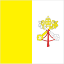
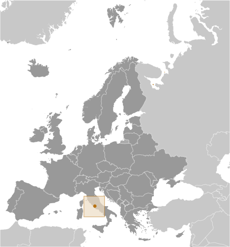
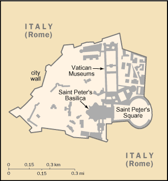

# Holy See (Vatican City)

## Introduction

**_Background:_**   
Popes in their secular role ruled portions of the Italian peninsula for more than a thousand years until the mid 19th century, when many of the Papal States were seized by the newly united Kingdom of Italy. In 1870, the pope's holdings were further circumscribed when Rome itself was annexed. Disputes between a series of "prisoner" popes and Italy were resolved in 1929 by three Lateran Treaties, which established the independent state of Vatican City and granted Roman Catholicism special status in Italy. In 1984, a concordat between the Holy See and Italy modified certain of the earlier treaty provisions, including the primacy of Roman Catholicism as the Italian state religion. Present concerns of the Holy See include religious freedom, threats against minority Christian communities in Africa and the Middle East, sexual misconduct by clergy, international development, interreligious dialogue and reconciliation, and the application of church doctrine in an era of rapid change and globalization. About 1.2 billion people worldwide profess Catholicism - the world's largest Christian faith.

## Geography

**_Location:_**   
Southern Europe, an enclave of Rome (Italy)

**_Geographic coordinates:_**   
41 54 N, 12 27 E

**_Map references:_**   
Europe

**_Area:_**   
**total:** 0.44 sq km   
**land:** 0.44 sq km   
**water:** 0 sq km

**_Area - comparative:_**   
about 0.7 times the size of The National Mall in Washington, DC

**_Land boundaries:_**   
**total:** 3.4 km   
**border countries:** Italy 3.4 km

**_Coastline:_**   
0 km (landlocked)

**_Maritime claims:_**   
none (landlocked)

**_Climate:_**   
temperate; mild, rainy winters (September to May) with hot, dry summers (May to September)

**_Terrain:_**   
urban; low hill

**_Elevation extremes:_**   
**lowest point:** unnamed location 19 m   
**highest point:** unnamed elevation 75 m

**_Natural resources:_**   
none

**_Land use:_**   
**arable land:**    
**permanent crops:** 0%   
**other:** 100% (urban area) (2011)

**_Irrigated land:_**   
0 sq km (2011)

**_Natural hazards:_**   
NA

**_Environment - current issues:_**   
NA

**_Environment - international agreements:_**   
**party to:** Ozone Layer Protection   
**signed, but not ratified:** Air Pollution, Environmental Modification

**_Geography - note:_**   
landlocked; enclave in Rome, Italy; world's smallest state; beyond the territorial boundary of Vatican City, the Lateran Treaty of 1929 grants the Holy See extraterritorial authority over 23 sites in Rome and five outside of Rome, including the Pontifical Palace at Castel Gandolfo (the Pope's summer residence)

## People and Society

**_Nationality:_**   
**noun:** none   
**adjective:** none

**_Ethnic groups:_**   
Italians, Swiss, other

**_Languages:_**   
Italian, Latin, French, various other languages

**_Religions:_**   
Roman Catholic

**_Population:_**   
842 (July 2014 est.)

**_Population growth rate:_**   
0% (2014 est.)

**_Urbanization:_**   
**urban population:** 100% of total population (2011)   
**rate of urbanization:** 0.09% annual rate of change (2010-15 est.)

**_HIV/AIDS - adult prevalence rate:_**   
NA

**_HIV/AIDS - people living with HIV/AIDS:_**   
NA

**_HIV/AIDS - deaths:_**   
NA

**_Education expenditures:_**   
NA

**_Literacy:_**   
**definition:** age 15 and over can read and write   
**total population:** 100%   
**male:** 100%   
**female:** 100%

## Government

**_Country name:_**   
**conventional long form:** The Holy See (Vatican City State)   
**conventional short form:** Holy See (Vatican City)   
**local long form:** La Santa Sede (Stato della Citta del Vaticano)   
**local short form:** Santa Sede (Citta del Vaticano)

**_Government type:_**   
ecclesiastical

**_Capital:_**   
**name:** Vatican City   
**geographic coordinates:** 41 54 N, 12 27 E   
**time difference:** UTC+1 (6 hours ahead of Washington, DC, during Standard Time)   
**daylight saving time:** +1hr, begins last Sunday in March; ends last Sunday in October

**_Administrative divisions:_**   
none

**_Independence:_**   
11 February 1929 (from Italy); note - the three treaties signed with Italy on 11 February 1929 acknowledged, among other things, the full sovereignty of the Holy See and established its territorial extent; however, the origin of the Papal States, which over centuries varied considerably in extent, may be traced back to 754

**_National holiday:_**   
Election Day of Pope FRANCIS, 13 March (2013)

**_Constitution:_**   
previous 1929, 1963; latest adopted 26 November 2000, effective 22 February 2001 (Fundamental Law by Pope JOHN PAUL II); note - Pope Francis in October 2013 appointed a group of cardinals to revise the constitution (2013)

**_Legal system:_**   
religious legal system based on canon (religious) law

**_International law organization participation:_**   
has not submitted an ICJ jurisdiction declaration; non-party state to the ICCt

**_Suffrage:_**   
election of the pope is limited to cardinals less than 80 years old

**_Executive branch:_**   
**chief of state:** Pope FRANCIS (since 13 March 2013)   
**head of government:** Secretary of State Archbishop Pietro PAROLIN (since 15 October 2013); note - previous Secretary of State Cardinal Tarcisio BERTONE will remain as Camerlengo, a position he has held since 4 April 2007   
**cabinet:** Pontifical Commission for the State of Vatican City appointed by the pope   
**elections:** pope elected for life, or until voluntary resignation, by the College of Cardinals; election last held on 13 March 2013 (next to be held after the death or resignation of the current pope); Secretary of State appointed by the pope   
**election results:** Jorge Mario BERGOGLIO elected Pope FRANCIS

**_Legislative branch:_**   
unicameral Pontifical Commission for Vatican City State

**_Judicial branch:_**   
**highest court(s):** Supreme Court or Supreme Tribunal of the Apostolic Signatura (consists of the cardinal prefect, who serves as ex-officio president of the court, and 2 other cardinals of the Prefect Signatura); note - judicial duties were established by the Motu Proprio, papal directive, of Pope PIUS XII on 1 May 1946; note 2: most Vatican City criminal matters are handled by the Republic of Italy courts   
**judge selection and term of office:** cardinal prefect appointed by the Pope; the other 2 cardinals of the court appointed by the cardinal prefect on a yearly basis   
**subordinate courts:** Appellate Court of Vatican City; Tribunal of Vatican City

**_Political parties and leaders:_**   
none

**_Political pressure groups and leaders:_**   
none (exclusive of influence exercised by church officers)

**_International organization participation:_**   
CE (observer), IAEA, Interpol, IOM, ITSO, ITU, ITUC (NGOs), OAS (observer), OPCW, OSCE, Schengen Convention (de facto member), UN (observer), UNCTAD, UNHCR, Union Latina (observer), UNWTO (observer), UPU, WIPO, WTO (observer)

**_Diplomatic representation in the US:_**   
**chief of mission:** Apostolic Nuncio Carlo Maria VIGANO (since 16 November 2011)   
**chancery:** 3339 Massachusetts Avenue NW, Washington, DC 20008   
**telephone:** [1] (202) 333-7121   
**FAX:** [1] (202) 337-4036

**_Diplomatic representation from the US:_**   
**chief of mission:** Ambassador Kenneth F. HACKETT (since 20 August 2013)   
**embassy:** Villa Domiziana, Via delle Terme Deciane 26, 00153 Rome   
**mailing address:** Unit 5660, Box 66, DPO AE 09624-0066   
**telephone:** [39] (06) 4674-3428   
**FAX:** [39] (06) 575-8346

**_Flag description:_**   
two vertical bands of yellow (hoist side) and white with the arms of the Holy See, consisting of the crossed keys of Saint Peter surmounted by the three-tiered papal tiara, centered in the white band; the yellow color represents the pope's spiritual power, the white his worldly power

**_National symbol(s):_**   
crossed keys

**_National anthem:_**   
**name:** "Inno e Marcia Pontificale" (Hymn and Pontifical March); often called The Pontifical Hymn   
**lyrics/music:** Raffaello LAVAGNA/Charles-Francois GOUNOD   
**note:** adopted 1950

## Economy

**_Economy - overview:_**   
The Holy See is supported financially by a variety of sources, including investments, real estate income, and donations from Catholic individuals, dioceses, and institutions; these help fund the Roman Curia (Vatican bureaucracy), diplomatic missions, and media outlets. Moreover, an annual collection taken up in dioceses and from direct donations go to a non-budgetary fund, known as Peter's Pence, which is used directly by the Pope for charity, disaster relief, and aid to churches in developing nations. Donations increased between 2010 and 2011. The separate Vatican City State budget includes the Vatican museums and post office and is supported financially by the sale of stamps, coins, medals, and tourist mementos; by fees for admission to museums; and by publication sales. Its revenues increased between 2010 and 2011 because of expanded opening hours and a growing number of visitors. However, the Holy See has not escaped the financial difficulties engulfing other European countries; in 2012 it started a spending review to determine where to cut costs to reverse its 2011 budget deficit of 15 million euros. Most public expenditures go to wages and other personnel costs; the incomes and living standards of lay workers are comparable to those of counterparts who work in the city of Rome.

**_GDP (purchasing power parity):_**   
$NA

**_Industries:_**   
printing; production of coins, medals, postage stamps; mosaics, staff uniforms; worldwide banking and financial activities

**_Labor force:_**   
2,832 (December 2011)

**_Labor force - by occupation:_**   
**note:** essentially services with a small amount of industry; nearly all dignitaries, priests, nuns, guards, and the approximately 3,000 lay workers live outside the Vatican

**_Population below poverty line:_**   
NA%

**_Budget:_**   
**revenues:** $308 million   
**expenditures:** $326.4 million (2011)

**_Fiscal year:_**   
calendar year

**_Exchange rates:_**   
euros (EUR) per US dollar -   
0.7634 (2013 est.)   
0.7752 (2012 est.)   
0.755 (2010 est.)   
0.7198 (2009 est.)   
0.6827 (2008 est.)

## Communications

**_Telephone system:_**   
**general assessment:** automatic digital exchange   
**domestic:** connected via fiber optic cable to Telecom Italia network   
**international:** country code - 39; uses Italian system (2012)

**_Broadcast media:_**   
the Vatican Television Center (CTV) transmits live broadcasts of the Pope's Sunday and Wednesday audiences, as well as the Pope's public celebrations; CTV also produces documentaries; Vatican Radio is the Holy See's official broadcasting service broadcasting via shortwave, AM and FM frequencies, and via satellite and Internet connections (2008)

**_Internet country code:_**   
.va

**_Internet hosts:_**   
107 (2012)

## Military

**_Military branches:_**   
Pontifical Swiss Guard Corps (Corpo della Guardia Svizzera Pontificia) (2013)

**_Military service age and obligation:_**   
Pontifical Swiss Guard Corps (Corpo della Guardia Svizzera Pontificia): 19-30 years of age for voluntary military service; no conscription; must be Roman Catholic, a Swiss citizen, with a secondary education (2013)

**_Military - note:_**   
defense is the responsibility of Italy; ceremonial and limited security duties performed by Pontifical Swiss Guard

## Transnational Issues

**_Disputes - international:_**   
none

............................................................   
_Page last updated on June 17, 2014_
