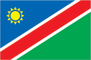
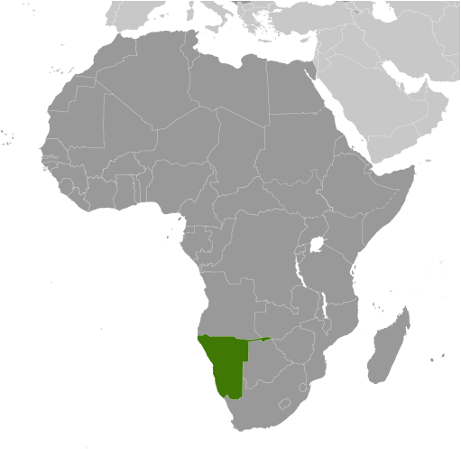
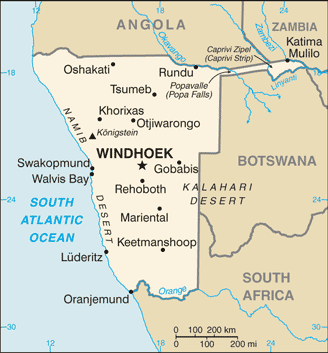

# Namibia

## Introduction

**_Background:_**   
South Africa occupied the German colony of South-West Africa during World War I and administered it as a mandate until after World War II, when it annexed the territory. In 1966 the Marxist South-West Africa People's Organization (SWAPO) guerrilla group launched a war of independence for the area that became Namibia, but it was not until 1988 that South Africa agreed to end its administration in accordance with a UN peace plan for the entire region. Namibia has been governed by SWAPO since the country won independence in 1990. Hifikepunye POHAMBA was elected president in November 2004 in a landslide victory replacing Sam NUJOMA who led the country during its first 14 years of self rule. POHAMBA was reelected in November 2009.

## Geography

**_Location:_**   
Southern Africa, bordering the South Atlantic Ocean, between Angola and South Africa

**_Geographic coordinates:_**   
22 00 S, 17 00 E

**_Map references:_**   
Africa

**_Area:_**   
**total:** 824,292 sq km   
**land:** 823,290 sq km   
**water:** 1,002 sq km

**_Area - comparative:_**   
slightly more than half the size of Alaska

**_Land boundaries:_**   
**total:** 3,936 km   
**border countries:** Angola 1,376 km, Botswana 1,360 km, South Africa 967 km, Zambia 233 km

**_Coastline:_**   
1,572 km

**_Maritime claims:_**   
**territorial sea:** 12 nm   
**contiguous zone:** 24 nm   
**exclusive economic zone:** 200 nm

**_Climate:_**   
desert; hot, dry; rainfall sparse and erratic

**_Terrain:_**   
mostly high plateau; Namib Desert along coast; Kalahari Desert in east

**_Elevation extremes:_**   
**lowest point:** Atlantic Ocean 0 m   
**highest point:** Konigstein 2,606 m

**_Natural resources:_**   
diamonds, copper, uranium, gold, silver, lead, tin, lithium, cadmium, tungsten, zinc, salt, hydropower, fish   
**note:** suspected deposits of oil, coal, and iron ore

**_Land use:_**   
**arable land:** 0.97%   
**permanent crops:** 0.01%   
**other:** 99.02% (2011)

**_Irrigated land:_**   
75.73 sq km (2003)

**_Total renewable water resources:_**   
17.72 cu km (2011)

**_Freshwater withdrawal (domestic/industrial/agricultural):_**   
**total:** 0.29 cu km/yr (25%/5%/70%)   
**per capita:** 146 cu m/yr (2002)

**_Natural hazards:_**   
prolonged periods of drought

**_Environment - current issues:_**   
limited natural freshwater resources; desertification; wildlife poaching; land degradation has led to few conservation areas

**_Environment - international agreements:_**   
**party to:** Antarctic-Marine Living Resources, Biodiversity, Climate Change, Climate Change-Kyoto Protocol, Desertification, Endangered Species, Hazardous Wastes, Law of the Sea, Ozone Layer Protection, Wetlands   
**signed, but not ratified:** none of the selected agreements

**_Geography - note:_**   
first country in the world to incorporate the protection of the environment into its constitution; some 14% of the land is protected, including virtually the entire Namib Desert coastal strip

## People and Society

**_Nationality:_**   
**noun:** Namibian(s)   
**adjective:** Namibian

**_Ethnic groups:_**   
black 87.5%, white 6%, mixed 6.5%   
**note:** about 50% of the population belong to the Ovambo tribe and 9% to the Kavangos tribe; other ethnic groups include Herero 7%, Damara 7%, Nama 5%, Caprivian 4%, Bushmen 3%, Baster 2%, Tswana 0.5%

**_Languages:_**   
Oshiwambo languages 48.9%, Nama/Damara 11.3%, Afrikaans 10.4% (common language of most of the population and about 60% of the white population), Otjiherero languages 8.6%, Kavango languages 8.5%, Caprivi languages 4.8%, English (official) 3.4%, other African languages 2.3%, other 1.7%   
**note:** Namibia has 13 recognized national languages, including 10 indigenous African languages and 3 Indo-European languages (2011 est.)

**_Religions:_**   
Christian 80% to 90% (at least 50% Lutheran), indigenous beliefs 10% to 20%

**_Population:_**   
2,198,406   
**note:** estimates for this country explicitly take into account the effects of excess mortality due to AIDS; this can result in lower life expectancy, higher infant mortality, higher death rates, lower population growth rates, and changes in the distribution of population by age and sex than would otherwise be expected (July 2014 est.)

**_Age structure:_**   
**0-14 years:** 31.7% (male 352,368/female 345,593)   
**15-24 years:** 23.1% (male 256,965/female 251,276)   
**25-54 years:** 35.9% (male 410,736/female 378,678)   
**55-64 years:** 4.8% (male 47,832/female 58,602)   
**65 years and over:** 4.3% (male 41,697/female 54,659) (2014 est.)

**_Dependency ratios:_**   
**total dependency ratio:** 64.2 %   
**youth dependency ratio:** 58.3 %   
**elderly dependency ratio:** 5.9 %   
**potential support ratio:** 17 (2014 est.)

**_Median age:_**   
**total:** 22.8 years   
**male:** 22.8 years   
**female:** 22.8 years (2014 est.)

**_Population growth rate:_**   
0.67% (2014 est.)

**_Birth rate:_**   
20.28 births/1,000 population (2014 est.)

**_Death rate:_**   
13.6 deaths/1,000 population (2014 est.)

**_Net migration rate:_**   
0.05 migrant(s)/1,000 population (2014 est.)

**_Urbanization:_**   
**urban population:** 38.4% of total population (2011)   
**rate of urbanization:** 3.14% annual rate of change (2010-15 est.)

**_Major urban areas - population:_**   
WINDHOEK (capital) 380,000 (2011)

**_Sex ratio:_**   
**at birth:** 1.03 male(s)/female   
**0-14 years:** 1.02 male(s)/female   
**15-24 years:** 1.02 male(s)/female   
**25-54 years:** 1.09 male(s)/female   
**55-64 years:** 1.02 male(s)/female   
**65 years and over:** 0.78 male(s)/female   
**total population:** 1.02 male(s)/female (2014 est.)

**_Mother's mean age at first birth:_**   
21.4   
**note:** median age at first birth among women 25-29 (2006-07 est.)

**_Maternal mortality rate:_**   
200 deaths/100,000 live births (2010)

**_Infant mortality rate:_**   
**total:** 45.64 deaths/1,000 live births   
**male:** 48.6 deaths/1,000 live births   
**female:** 42.59 deaths/1,000 live births (2014 est.)

**_Life expectancy at birth:_**   
**total population:** 51.85 years   
**male:** 52.22 years   
**female:** 51.46 years (2014 est.)

**_Total fertility rate:_**   
2.25 children born/woman (2014 est.)

**_Contraceptive prevalence rate:_**   
55.1% (2006/07)

**_Health expenditures:_**   
5.3% of GDP (2011)

**_Physicians density:_**   
0.37 physicians/1,000 population (2007)

**_Hospital bed density:_**   
2.7 beds/1,000 population (2009)

**_Drinking water source:_**   
**improved:** urban: 98.4% of population; rural: 87.4% of population; total: 91.7% of population   
**unimproved:** urban: 1.6% of population; rural: 12.6% of population; total: 8.3% of population (2012 est.)

**_Sanitation facility access:_**   
**improved:** urban: 56.1% of population; rural: 16.9% of population; total: 32.2% of population   
**unimproved:** urban: 43.9% of population; rural: 83.1% of population; total: 67.8% of population (2012 est.)

**_HIV/AIDS - adult prevalence rate:_**   
13.3% (2012 est.)

**_HIV/AIDS - people living with HIV/AIDS:_**   
220,100 (2012 est.)

**_HIV/AIDS - deaths:_**   
5,000 (2012 est.)

**_Major infectious diseases:_**   
**degree of risk:** high   
**food or waterborne diseases:** bacterial diarrhea, hepatitis A, and typhoid fever   
**vectorborne disease:** malaria   
**water contact disease:** schistosomiasis (2013)

**_Obesity - adult prevalence rate:_**   
9.5% (2008)

**_Children under the age of 5 years underweight:_**   
17.5% (2007)

**_Education expenditures:_**   
8.4% of GDP (2010)

**_Literacy:_**   
**definition:** age 15 and over can read and write   
**total population:** 88.8%   
**male:** 89%   
**female:** 88.5% (2010 est.)

**_School life expectancy (primary to tertiary education):_**   
**total:** 11 years   
**male:** 11 years   
**female:** 11 years (2006)

**_Unemployment, youth ages 15-24:_**   
**total:** 40.1%   
**male:** 29.4%   
**female:** 34.3% (2012)

## Government

**_Country name:_**   
**conventional long form:** Republic of Namibia   
**conventional short form:** Namibia   
**local long form:** Republic of Namibia   
**local short form:** Namibia   
**former:** German South-West Africa (Sued-West Afrika), South-West Africa

**_Government type:_**   
republic

**_Capital:_**   
**name:** Windhoek   
**geographic coordinates:** 22 34 S, 17 05 E   
**time difference:** UTC+1 (6 hours ahead of Washington, DC, during Standard Time)   
**daylight saving time:** +1hr, begins first Sunday in September; ends first Sunday in April

**_Administrative divisions:_**   
14 regions; Erongo, Hardap,    
Karas, Kavango East, Kavango West, Khomas, Kunene, Ohangwena, Omaheke, Omusati, Oshana, Oshikoto, Otjozondjupa, Zambezi; note - the Karas Region was renamed    
Karas in September 2013 to include the alveolar lateral click of the Khoekhoegowab language

**_Independence:_**   
21 March 1990 (from South African mandate)

**_National holiday:_**   
Independence Day, 21 March (1990)

**_Constitution:_**   
drafted 9 February 1990, signed 16 March 1990, entered into force 21 March 1990; amended 1998, 2010 (2010)

**_Legal system:_**   
mixed legal system of uncodified civil law based on Roman-Dutch law and customary law

**_International law organization participation:_**   
has not submitted an ICJ jurisdiction declaration; accepts ICCt jurisdiction

**_Suffrage:_**   
18 years of age; universal

**_Executive branch:_**   
**chief of state:** President Hifikepunye POHAMBA (since 21 March 2005); note - the president is both chief of state and head of government   
**head of government:** President Hifikepunye POHAMBA (since 21 March 2005); Prime Minister Hage GEINGOB (since 4 December 2012)   
**cabinet:** Cabinet appointed by the president from among the members of the National Assembly   
**elections:** president elected by popular vote for a five-year term (eligible for a second term); if no single candidate receives a majority of the vote in the first round of voting, a run-off election is scheduled between the two candidates with the greatest vote count; election last held on 27-28 November 2009 (next to be held in 2014)   
**election results:** Hifikepunye POHAMBA reelected president; percent of vote - Hifikepunye POHAMBA 76.4%, Hidipo HAMUTENYA 11.0%, Katuutire KAURA 3.0%, Kuaima RIRUAKO 2.9%, Justus GAROEB 2.4%, Ignatius SHIXWAMENI 1.3%, Hendrick MUDGE 1.2%, other 1.8%

**_Legislative branch:_**   
bicameral legislature consists of the National Council, primarily an advisory body (26 seats; two members chosen from each regional council to serve six-year terms), and the National Assembly (72 seats; members elected by popular vote to serve five-year terms, an additonal six nonvoting members are appointed by the president)   
**elections:** National Council - elections for regional councils to determine members of the National Council held on 26-27 November 2010 (next to be held in 2016); National Assembly - last held on 26-27 November 2009 (next to be held in November 2014)   
**election results:** National Council - percent of vote by party - NA; seats by party - SWAPO 24, UDF 1, DTA 1; National Assembly - percent of vote by party - SWAPO 75.3%, RDP 11.3%, DTA 3.1%, NUDO 3.0%, UDF 2.4%, APP 1.4%, RP 0.8%, COD 0.7%, SWANU 0.6%, other 1.3%; seats by party - SWAPO 54, RDP 8, DTA 2, NUDO 2, UDF 2, APP 1, COD 1, RP 1, SWANU 1

**_Judicial branch:_**   
**highest court(s):** Supreme Court (consists of the chief justice and at least 3 judges in quorum sessions)   
**judge selection and term of office:** judges appointed by the president of Namibia upon the recommendation of the Judicial Service Commission; judges serve until age 65 but can be extended by the president until age 70   
**subordinate courts:** High Court; Labor Court; regional and district magistrates' courts; community courts

**_Political parties and leaders:_**   
All People's Party or APP [Ignatius SHIXWAMENI]   
Congress of Democrats or COD [Benjamin ULENGA]   
Democratic Turnhalle Alliance of Namibia or DTA [McHenry VENAANI]   
Monitor Action Group or MAG [Jurgie VILJOEN]   
National Unity Democratic Organization or NUDO [Kuaima RIRUAKO]   
Rally for Democracy and Progress or RDP [Hidipo HAMUTENYA]   
Republican Party or RP [Henk MUDGE]   
South West Africa National Union or SWANU [Usutuaije MAAMBERUA]   
South West Africa People's Organization or SWAPO [Hifikepunye POHAMBA]   
United Democratic Front or UDF [Justus    
GAROEB]

**_Political pressure groups and leaders:_**   
National Society for Human Rights or NSHR (NAMRIGHTS as of 2010)   
various labor unions

**_International organization participation:_**   
ACP, AfDB, AU, C, CD, FAO, G-77, IAEA, IBRD, ICAO, ICRM, IDA, IFAD, IFC, IFRCS, ILO, IMF, IMO, Interpol, IOC, IOM, IPU, ISO, ITSO, ITU, ITUC (NGOs), MIGA, NAM, OPCW, SACU, SADC, UN, UNAMID, UNCTAD, UNESCO, UNHCR, UNIDO, UNISFA, UNMIL, UNMISS, UNOCI, UNWTO, UPU, WCO, WHO, WIPO, WMO, WTO

**_Diplomatic representation in the US:_**   
**chief of mission:** Ambassador Martin ANDJABA (since 3 September 2010)   
**chancery:** 1605 New Hampshire Avenue NW, Washington, DC 20009   
**telephone:** [1] (202) 986-0540   
**FAX:** [1] (202) 986-0443

**_Diplomatic representation from the US:_**   
**chief of mission:** Ambassador Wanda L. NESBITT (since 20 July 2010)   
**embassy:** 14 Lossen Street, Windhoek   
**mailing address:** Private Bag 12029 Ausspannplatz, Windhoek   
**telephone:** [264] (61) 295-8500   
**FAX:** [264] (61) 295-8603

**_Flag description:_**   
a wide red stripe edged by narrow white stripes divides the flag diagonally from lower hoist corner to upper fly corner; the upper hoist-side triangle is blue and charged with a yellow, 12-rayed sunburst; the lower fly-side triangle is green; red signifies the heroism of the people and their determination to build a future of equal opportunity for all; white stands for peace, unity, tranquility, and harmony; blue represents the Namibian sky and the Atlantic Ocean, the country's precious water resources and rain; the yellow sun denotes power and existence; green symbolizes vegetation and agricultural resources

**_National anthem:_**   
**name:** "Namibia, Land of the Brave"   
**lyrics/music:** Axali DOESEB   
**note:** adopted 1991

## Economy

**_Economy - overview:_**   
The economy is heavily dependent on the extraction and processing of minerals for export. Mining accounts for 11.5% of GDP, but provides more than 50% of foreign exchange earnings. Rich alluvial diamond deposits make Namibia a primary source for gem-quality diamonds. Marine diamond mining is becoming increasingly important as the terrestrial diamond supply has dwindled. Namibia is the world's fourth-largest producer of uranium. It also produces large quantities of zinc and is a small producer of gold and other minerals. The mining and quarrying sectors employs only about 1.8% of the population. Namibia normally imports about 50% of its cereal requirements; in drought years food shortages are a major problem in rural areas. A high per capita GDP, relative to the region, hides one of the world's most unequal income distributions, as shown by Namibia's 59.7 GINI coefficient. The Namibian economy is closely linked to South Africa with the Namibian dollar pegged one-to-one to the South African rand. Namibia receives 30%-40% of its revenues from the Southern African Customs Union (SACU). Volatility in the size of Namibia's annual SACU allotment complicates budget planning. Namibia's economy remains vulnerable to volatility in the price of uranium and other commodities. The rising cost of mining diamonds, increasingly from the sea, has reduced profit margins. Namibian authorities recognize these issues and have emphasized the need to increase higher value raw materials, manufacturing, and services, especially in the logistics and transportation sectors.

**_GDP (purchasing power parity):_**   
$17.79 billion (2013 est.)   
$17.05 billion (2012 est.)   
$16.23 billion (2011 est.)   
**note:** data are in 2013 US dollars

**_GDP (official exchange rate):_**   
$12.3 billion (2013 est.)

**_GDP - real growth rate:_**   
4.4% (2013 est.)   
5% (2012 est.)   
5.7% (2011 est.)

**_GDP - per capita (PPP):_**   
$8,200 (2013 est.)   
$7,900 (2012 est.)   
$7,600 (2011 est.)   
**note:** data are in 2013 US dollars

**_Gross national saving:_**   
NA% (2013 est.)   
30.4% of GDP (2012 est.)   
27% of GDP (2011 est.)

**_GDP - composition, by end use:_**   
**household consumption:** 59.9%   
**government consumption:** 26.2%   
**investment in fixed capital:** 22.8%   
**investment in inventories:** 0.5%   
**exports of goods and services:** 41.4%   
**imports of goods and services:** -50.9%; (2013 est.)

**_GDP - composition, by sector of origin:_**   
**agriculture:** 7.7%   
**industry:** 29.6%   
**services:** 62.6% (2013 est.)

**_Agriculture - products:_**   
millet, sorghum, peanuts, grapes; livestock; fish

**_Industries:_**   
meatpacking, fish processing, dairy products, pasta, beverages; mining (diamonds, lead, zinc, tin, silver, tungsten, uranium, copper)

**_Industrial production growth rate:_**   
5.6% (2013 est.)

**_Labor force:_**   
880,400 (2013 est.)

**_Labor force - by occupation:_**   
**agriculture:** 16.3%   
**industry:** 22.4%   
**services:** 61.3%   
**note:** about half of Namibia's people are unemployed while about two-thirds live in rural areas; roughly two-thirds of rural dwellers rely on subsistence agriculture (2008 est.)

**_Unemployment rate:_**   
27.4% (2012 est.)   
51.2% (2008 est.)

**_Population below poverty line:_**   
28.7%   
**note:** the UNDP's 2005 Human Development Report indicated that 34.9% of the population live on $1 per day and 55.8% live on $2 per day (2010 est.)

**_Household income or consumption by percentage share:_**   
**lowest 10%:** 2.4%   
**highest 10%:** 42% (2010)

**_Distribution of family income - Gini index:_**   
59.7 (2010)   
70.7 (2003)

**_Budget:_**   
**revenues:** $4.325 billion   
**expenditures:** $5.126 billion (2013 est.)

**_Taxes and other revenues:_**   
35.2% of GDP (2013 est.)

**_Budget surplus (+) or deficit (-):_**   
-6.5% of GDP (2013 est.)

**_Public debt:_**   
27.2% of GDP (2013 est.)   
25.8% of GDP (2012 est.)

**_Fiscal year:_**   
1 April - 31 March

**_Inflation rate (consumer prices):_**   
5.5% (2013 est.)   
6.5% (2012 est.)

**_Central bank discount rate:_**   
5.5% (31 December 2013 est.)   
12% (31 December 2010 est.)

**_Commercial bank prime lending rate:_**   
9.25% (31 December 2013 est.)   
8.7% (31 December 2012 est.)

**_Stock of narrow money:_**   
$2.723 billion (31 December 2013 est.)   
$2.941 billion (31 December 2012 est.)

**_Stock of broad money:_**   
$7.22 billion (31 December 2013 est.)   
$7.228 billion (31 December 2012 est.)

**_Stock of domestic credit:_**   
$5.942 billion (31 December 2013 est.)   
$6.266 billion (31 December 2012 est.)

**_Market value of publicly traded shares:_**   
$1.305 billion (31 December 2012 est.)   
$1.152 billion (31 December 2011)   
$1.176 billion (31 December 2010 est.)

**_Current account balance:_**   
-$658.4 million (2013 est.)   
-$414 million (2012 est.)

**_Exports:_**   
$5.124 billion (2013 est.)   
$4.883 billion (2012 est.)

**_Exports - commodities:_**   
diamonds, copper, gold, zinc, lead, uranium; cattle, white fish and mollusks

**_Imports:_**   
$7.084 billion (2013 est.)   
$6.44 billion (2012 est.)

**_Imports - commodities:_**   
foodstuffs; petroleum products and fuel, machinery and equipment, chemicals

**_Reserves of foreign exchange and gold:_**   
$2.267 billion (31 December 2013 est.)   
$1.738 billion (31 December 2012 est.)

**_Debt - external:_**   
$4.312 billion (31 December 2013 est.)   
$4.292 billion (31 December 2012 est.)

**_Stock of direct foreign investment - at home:_**   
$NA

**_Stock of direct foreign investment - abroad:_**   
$NA

**_Exchange rates:_**   
Namibian dollars (NAD) per US dollar -   
9.282 (2013 est.)   
8.2031 (2012 est.)   
7.3212 (2010 est.)   
8.42 (2009)   
7.75 (2008)

## Energy

**_Electricity - production:_**   
1.331 billion kWh (2013 est.)

**_Electricity - consumption:_**   
4.238 billion kWh (2013 est.)

**_Electricity - exports:_**   
89 million kWh (2013 est.)

**_Electricity - imports:_**   
2.907 billion kWh (2013 est.)

**_Electricity - installed generating capacity:_**   
487,000 kW (2013 est.)

**_Electricity - from fossil fuels:_**   
31.8% of total installed capacity (2013 est.)

**_Electricity - from nuclear fuels:_**   
0% of total installed capacity (2013 est.)

**_Electricity - from hydroelectric plants:_**   
68.2% of total installed capacity (2013 est.)

**_Electricity - from other renewable sources:_**   
0% of total installed capacity (2013 est.)

**_Crude oil - production:_**   
0 bbl/day (2012 est.)

**_Crude oil - exports:_**   
0 bbl/day (2010 est.)

**_Crude oil - imports:_**   
0 bbl/day (2010 est.)

**_Crude oil - proved reserves:_**   
0 bbl (1 January 2013 est.)

**_Refined petroleum products - production:_**   
0 bbl/day (2012 est.)

**_Refined petroleum products - consumption:_**   
22,990 bbl/day (2011 est.)

**_Refined petroleum products - exports:_**   
0 bbl/day (2010 est.)

**_Refined petroleum products - imports:_**   
20,810 bbl/day (2012 est.)

**_Natural gas - production:_**   
0 cu m (2012 est.)

**_Natural gas - consumption:_**   
0 cu m (2012 est.)

**_Natural gas - exports:_**   
0 cu m (2012 est.)

**_Natural gas - imports:_**   
0 cu m (2012 est.)

**_Natural gas - proved reserves:_**   
62.29 billion cu m (1 January 2013 est.)

**_Carbon dioxide emissions from consumption of energy:_**   
3.217 million Mt (2011 est.)

## Communications

**_Telephones - main lines in use:_**   
171,000 (2012)

**_Telephones - mobile cellular:_**   
2.435 million (2012)

**_Telephone system:_**   
**general assessment:** good system; core fiber-optic network links most centers and connections are now digital   
**domestic:** multiple mobile-cellular providers with a combined subscribership of more than 100 telephones per 100 persons   
**international:** country code - 264; fiber-optic cable to South Africa, microwave radio relay link to Botswana, direct links to other neighboring countries; connected to the South African Far East (SAFE) submarine cable through South Africa; satellite earth stations - 4 Intelsat (2010)

**_Broadcast media:_**   
1 private and 1 state-run TV station; satellite and cable TV service is available; state-run radio service broadcasts in multiple languages; about a dozen private radio stations; transmissions of multiple international broadcasters are available (2007)

**_Internet country code:_**   
.na

**_Internet hosts:_**   
78,280 (2012)

**_Internet users:_**   
127,500 (2009)

## Transportation

**_Airports:_**   
112 (2013)

**_Airports - with paved runways:_**   
**total:** 19   
**over 3,047 m:** 4   
**2,438 to 3,047 m:** 2   
**1,524 to 2,437 m:** 12   
**914 to 1,523 m:** 1 (2013)

**_Airports - with unpaved runways:_**   
**total:** 93   
**1,524 to 2,437 m:** 25   
**914 to 1,523 m:** 52   
**under 914 m:** 16 (2013)

**_Railways:_**   
**total:** 2,626 km   
**narrow gauge:** 2,626 km 1.067-m gauge (2008)

**_Roadways:_**   
**total:** 44,138 km   
**paved:** 6,387 km   
**unpaved:** 37,751 km (2010)

**_Merchant marine:_**   
**total:** 1   
**by type:** cargo 1 (2010)

**_Ports and terminals:_**   
**major seaport(s):** Luderitz, Walvis Bay

## Military

**_Military branches:_**   
Namibian Defense Force (NDF): Army, Navy, Air Force (2013)

**_Military service age and obligation:_**   
18 years of age for voluntary military service; no conscription (2012)

**_Manpower available for military service:_**   
**males age 16-49:** 568,231 (2010 est.)

**_Manpower fit for military service:_**   
**males age 16-49:** 351,431   
**females age 16-49:** 311,513 (2010 est.)

**_Manpower reaching militarily significant age annually:_**   
**male:** 26,413   
**female:** 26,038 (2010 est.)

**_Military expenditures:_**   
3.11% of GDP (2012)   
3.38% of GDP (2011)   
3.11% of GDP (2010)

## Transnational Issues

**_Disputes - international:_**   
concerns from international experts and local populations over the Okavango Delta ecology in Botswana and human displacement scuttled Namibian plans to construct a hydroelectric dam on Popa Falls along the Angola-Namibia border; the governments of South Africa and Namibia have not signed or ratified the text of the 1994 Surveyor's General agreement placing the boundary in the middle of the Orange River; Namibia has supported, and in 2004 Zimbabwe dropped objections to, plans between Botswana and Zambia to build a bridge over the Zambezi River, thereby de facto recognizing a short, but not clearly delimited, Botswana-Zambia boundary in the river

**_Trafficking in persons:_**   
**current situation:** Namibia is predominantly a country of origin and destination for children and, to a lesser extent, women subjected to forced labor and sex trafficking; victims lured by promises of legitimate jobs are forced to work in hazardous condition in urban centers and on commercial farms; traffickers exploit Namibian children, as well as children from Angola, Zambia, and Zimbabwe, for forced labor in agriculture, cattle herding, domestic service, and criminal activities; children are also forced into prostitution, often catering to tourists from southern Africa and Europe; girls of the San tribe are particularly vulnerable

............................................................   
_Page last updated on June 20, 2014_
