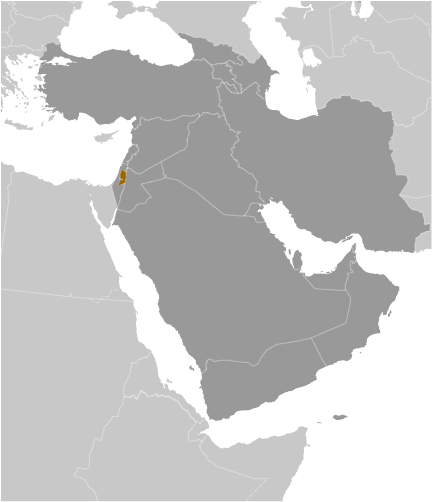
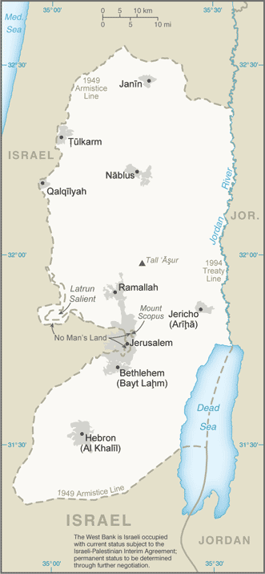

# West Bank

## Introduction

**_Background:_**   
From the early 16th century through 1917, the area now known as the West Bank fell under Ottoman rule. Following World War I, the Allied powers (France, UK, Russia) allocated the area to the British Mandate of Palestine. After World War II, the UN passed a resolution to establish two states within the Mandate, and designated a territory including what is now known as the West Bank as part of the proposed Arab state. Following the 1948 Arab-Israeli War the area was captured by Transjordan (later renamed Jordan). Jordan annexed the West Bank in 1950. In June 1967, Israel captured the West Bank and East Jerusalem during the 1967 Six-Day War. With the exception of East Jerusalem and the former Israeli-Jordanian border zone, the West Bank has remained under Israeli military control. Under a series of agreements signed between 1994 and 1999, Israel transferred to the Palestinian Authority (PA) security and civilian responsibility for many Palestinian-populated areas of the West Bank as well as the Gaza Strip. Negotiations to determine the permanent status of the West Bank and Gaza Strip stalled after the outbreak of an intifada in mid- 2000. In early 2003, the "Quartet" of the US, EU, UN, and Russia, presented a roadmap to a final peace settlement by 2005, calling for two states - Israel and a democratic Palestine. Following Palestinian leader Yasir ARAFAT's death in late 2004 and the subsequent election of Mahmud ABBAS (head of the Fatah political party) as the PLO Executive Committee Chairman and PA president, Israel and the PA agreed to move the peace process forward. Israel in late 2005 unilaterally withdrew all of its settlers and soldiers and dismantled its military facilities in the Gaza Strip and redeployed its military from several West Bank settlements but continues to control maritime, airspace, and other access. In early 2006, the Islamic Resistance Movement, HAMAS, won the Palestinian Legislative Council election and took control of the PA government. Attempts to form a unity government failed, and violent clashes between Fatah and HAMAS supporters ensued, culminating in HAMAS's violent seizure of all military and governmental institutions in the Gaza Strip. Fatah and HAMAS in early 2011 agreed to reunify the Gaza Strip and West Bank, but the factions have struggled to implement details on governance and security. The status quo remains with HAMAS in control of the Gaza Strip and the PA governing the West Bank. In late 2010, direct peace talks between the Israelis and Palestinians collapsed. In November 2012, the UN General Assembly upgraded the Palestinian status at the UN to that of an observer "state." The Israeli government and ABBAS returned to formal peace negotiations in July 2013.

## Geography

**_Location:_**   
Middle East, west of Jordan, east of Israel

**_Geographic coordinates:_**   
32 00 N, 35 15 E

**_Map references:_**   
Middle East

**_Area:_**   
**total:** 5,860 sq km   
**land:** 5,640 sq km   
**water:** 220 sq km   
**note:** includes West Bank, Latrun Salient, and the northwest quarter of the Dead Sea, but excludes Mt. Scopus; East Jerusalem and Jerusalem No Man's Land are also included only as a means of depicting the entire area occupied by Israel in 1967

**_Area - comparative:_**   
slightly smaller than Delaware

**_Land boundaries:_**   
**total:** 404 km   
**border countries:** Israel 307 km, Jordan 97 km

**_Coastline:_**   
0 km (landlocked)

**_Maritime claims:_**   
none (landlocked)

**_Climate:_**   
temperate; temperature and precipitation vary with altitude, warm to hot summers, cool to mild winters

**_Terrain:_**   
mostly rugged dissected upland, some vegetation in west, but barren in east

**_Elevation extremes:_**   
**lowest point:** Dead Sea -408 m   
**highest point:** Tall Asur 1,022 m

**_Natural resources:_**   
arable land

**_Land use:_**   
**arable land:** 7.39%   
**permanent crops:** 10.96%   
**other:** 81.64% (2011)

**_Irrigated land:_**   
240 sq km; note - includes Gaza Strip (2003)

**_Natural hazards:_**   
droughts

**_Environment - current issues:_**   
adequacy of freshwater supply; sewage treatment

**_Geography - note:_**   
landlocked; highlands are main recharge area for Israel's coastal aquifers; there are about 355 Israeli civilian sites including about 145 small outpost communities in the West Bank and 32 sites in East Jerusalem (2010 est.)

## People and Society

**_Nationality:_**   
**noun:** NA   
**adjective:** NA

**_Ethnic groups:_**   
Palestinian Arab and other 83%, Jewish 17%

**_Languages:_**   
Arabic, Hebrew (spoken by Israeli settlers and many Palestinians), English (widely understood)

**_Religions:_**   
Muslim 80.0 - 85.0% (predominantly Sunni), Jewish 12.0 - 14.0%, Christian 1.0 - 2.5% (mainly Greek Orthodox), other, unaffiliated, unspecified note: the proportion of Christians continues to fall mainly as a result of the growth of the Muslim population but also because of the migration and a declining birth rate of the Christian population (2012 est.)   
**note:** the proportion of Christians continues to fall mainly as a result of the growth of the Muslim population but also because of the migration and a declining birth rate of the Christian population (2012 est.)

**_Population:_**   
2,731,052   
**note:** approximately 341,400 Israeli settlers live in the West Bank (2012); approximately 196,400 Israeli settlers live in East Jerusalem (2011) (July 2014 est.)

**_Age structure:_**   
**0-14 years:** 33.7% (male 472,480/female 448,078)   
**15-24 years:** 21.7% (male 303,578/female 289,119)   
**25-54 years:** 36.4% (male 511,443/female 483,276)   
**55-64 years:** 4.4% (male 59,762/female 59,372)   
**65 years and over:** 3.8% (male 43,629/female 60,315) (2014 est.)

**_Dependency ratios:_**   
**total dependency ratio:** 74.1 %   
**youth dependency ratio:** 68.8 %   
**elderly dependency ratio:** 5.3 %   
**potential support ratio:** 19   
**note:** data represents the Palestinian Territories (2014 est.)

**_Median age:_**   
**total:** 22.4 years   
**male:** 22.2 years   
**female:** 22.5 years (2014 est.)

**_Population growth rate:_**   
1.99% (2014 est.)

**_Birth rate:_**   
23.41 births/1,000 population (2014 est.)

**_Death rate:_**   
3.51 deaths/1,000 population (2014 est.)

**_Net migration rate:_**   
0 migrant(s)/1,000 population (2014 est.)

**_Urbanization:_**   
**urban population:** 74.3% of total population (2011)   
**rate of urbanization:** 3.1% annual rate of change (2005-10 est.)

**_Sex ratio:_**   
**at birth:** 1.06 male(s)/female   
**0-14 years:** 1.05 male(s)/female   
**15-24 years:** 1.05 male(s)/female   
**25-54 years:** 1.06 male(s)/female   
**55-64 years:** 1.04 male(s)/female   
**65 years and over:** 0.71 male(s)/female   
**total population:** 1.04 male(s)/female (2014 est.)

**_Mother's mean age at first birth:_**   
20   
**note:** median age at first birth among women 25-29 (2004 est.)

**_Maternal mortality rate:_**   
64 deaths/100,000 live births (2010)

**_Infant mortality rate:_**   
**total:** 13.49 deaths/1,000 live births   
**male:** 15.13 deaths/1,000 live births   
**female:** 11.75 deaths/1,000 live births (2014 est.)

**_Life expectancy at birth:_**   
**total population:** 75.69 years   
**male:** 73.58 years   
**female:** 77.92 years (2014 est.)

**_Total fertility rate:_**   
2.83 children born/woman (2014 est.)

**_Drinking water source:_**   
**improved:** urban: 81.6% of population; rural: 82.3% of population; total: 81.8% of population   
**unimproved:** urban: 18.4% of population; rural: 17.7% of population; total: 18.2% of population;   
**note:** includes Gaza and the West Bank (2012 est.)

**_Sanitation facility access:_**   
**improved:** urban: 94.8% of population; rural: 92.8% of population; total: 94.3% of population   
**unimproved:** urban: 5.2% of population; rural: 7.2% of population; total: 5.7% of population;   
**note:** includes Gaza and the West Bank (2012 est.)

**_HIV/AIDS - adult prevalence rate:_**   
NA

**_HIV/AIDS - people living with HIV/AIDS:_**   
NA

**_HIV/AIDS - deaths:_**   
NA

**_Children under the age of 5 years underweight:_**   
2.2% (2007)

**_Literacy:_**   
**definition:** age 15 and over can read and write   
**total population:** 95.3%   
**male:** 97.9%   
**female:** 92.6%   
**notes:** estimates are for the Palestinian Territories (2011 est.)

**_Unemployment, youth ages 15-24:_**   
**total:** 38.8%   
**male:** 34.5%   
**female:** 62.2%   
**note:** includes Gaza (2012)

## Government

**_Country name:_**   
**conventional long form:** none   
**conventional short form:** West Bank

## Economy

**_Economy - overview:_**   
The West Bank - the larger of the two areas comprising the Palestinian territories - has sustained a moderate rate of economic growth since 2008. Inflows of donor aid and government spending have driven most of the gains, however. Private sector development has been weak. After a multiyear downturn following the start of the second intifada in 2000, overall standard-of-living measures have recovered and now exceed levels seen in the late 1990s. Despite the Palestinian Authority's (PA) successful implementation of economic and security reforms and the easing of some movement and access restrictions by the Israeli Government, Israeli closure policies continue to disrupt labor and trade flows, industrial capacity, and basic commerce, eroding the productive capacity of the West Bank economy. The biggest impediments to economic improvements in the West Bank remain Palestinians' inability to access land and resources in Israeli-controlled areas, import and export restrictions, and a high-cost capital structure. The PA for the foreseeable future will continue to rely heavily on donor aid for its budgetary needs, and West Bank economic activity will depend largely on the PA's ability to attract such aid.

**_GDP (purchasing power parity):_**   
$8.022 billion (2011 est.)   
$7.589 billion (2010 est.)   
$7.106 billion (2009 est.)   
**note:** data are in 2011 US dollars; includes Gaza Strip

**_GDP (official exchange rate):_**   
$6.641 billion   
**note:** includes Gaza Strip (2008 est.)

**_GDP - real growth rate:_**   
5.7% (2011 est.)   
6.8% (2010 est.)   
7% (2009 est.)   
**note:** includes Gaza Strip

**_GDP - per capita (PPP):_**   
$2,900 (2008 est.)   
**note:** includes Gaza Strip

**_GDP - composition, by end use:_**   
**household consumption:** 99.5%   
**government consumption:** 29.5%   
**investment in fixed capital:** 18%   
**investment in inventories:** 0%   
**exports of goods and services:** 14.9%   
**imports of goods and services:** -62%; (2013 est.)

**_GDP - composition, by sector of origin:_**   
**agriculture:** 4.2%   
**industry:** 17.9%   
**services:** 77.9%   
**note:** includes Gaza Strip (2012 est.)

**_Agriculture - products:_**   
olives, citrus fruit, vegetables; beef, dairy products

**_Industries:_**   
small-scale manufacturing, quarrying, textiles, soap, olive-wood carvings, and mother-of-pearl souvenirs

**_Industrial production growth rate:_**   
3% (2013 est.)

**_Labor force:_**   
1.025 million (2013 est.)

**_Labor force - by occupation:_**   
**agriculture:** 16.1%   
**industry:** 28.4%   
**services:** 55.5%   
**note:** includes Gaza Strip (2010 est.)

**_Unemployment rate:_**   
22.5% (2013 est.)   
23% (2012 est.)

**_Population below poverty line:_**   
18.3% (2010 est.)

**_Household income or consumption by percentage share:_**   
**lowest 10%:** 3.2%   
**highest 10%:** 28.2% (2009 est.)

**_Budget:_**   
**revenues:** $2.1 billion   
**expenditures:** $3.2 billion   
**note:** includes Palestinian Authority expenditures in the Gaza Strip (2011 est.)

**_Taxes and other revenues:_**   
31.6% of GDP (2011 est.)

**_Budget surplus (+) or deficit (-):_**   
-16.6% of GDP (2011 est.)

**_Fiscal year:_**   
calendar year

**_Inflation rate (consumer prices):_**   
1.7% (2013 est.)   
2.8% (2012 est.)   
**note:** includes Gaza Strip

**_Commercial bank prime lending rate:_**   
6.8% (31 December 2013 est.)   
6.97% (31 December 2012 est.)

**_Stock of narrow money:_**   
$232.2 million (31 December 2013 est.)   
$180.2 million (31 December 2012 est.)

**_Stock of broad money:_**   
$9.301 billion (31 December 2013 est.)   
$8.143 billion (31 December 2012 est.)

**_Stock of domestic credit:_**   
$1.248 billion (31 December 2013 est.)   
$1.042 billion (31 December 2012 est.)

**_Market value of publicly traded shares:_**   
$2.634 billion (31 December 2012 est.)   
$2.532 billion (31 December 2011)   
$2.45 billion (31 December 2010 est.)

**_Current account balance:_**   
-$2.1 billion (2011 est.)   
-$690.7 million (2010 est.)

**_Exports:_**   
$666.1 million (2010 est.)   
$846.1 million (2011 est.)   
**note:** includes Gaza Strip

**_Exports - commodities:_**   
stone, olives, fruit, vegetables, limestone

**_Imports:_**   
$5.474 billion (2011 est.)   
$4.319 billion (2010 est.)   
**note:** data include the Gaza Strip

**_Imports - commodities:_**   
food, consumer goods, construction materials, petroleum, chemicals

**_Debt - external:_**   
$NA (2010 est.)   
$1.3 billion (2007 est.)   
**note:** data include the Gaza Strip

**_Exchange rates:_**   
new Israeli shekels (ILS) per US dollar -   
3.621 (2013 est.)   
3.856 (2012 est.)   
3.73 (2010)   
3.932 (2009)   
3.588 (2008)

## Energy

**_Electricity - production:_**   
445 million kWh (2010 est.)

**_Electricity - consumption:_**   
4.573 billion kWh (2010 est.)

**_Electricity - exports:_**   
0 kWh (2012)

**_Electricity - imports:_**   
550 million kWh (2011 est.)

**_Electricity - installed generating capacity:_**   
140,000 kW   
**note:** includes Gaza Strip (2010 est.)

**_Electricity - from fossil fuels:_**   
100% of total installed capacity (2010 est.)

**_Electricity - from nuclear fuels:_**   
0% of total installed capacity (2010 est.)

**_Electricity - from hydroelectric plants:_**   
0% of total installed capacity (2010 est.)

**_Electricity - from other renewable sources:_**   
0% of total installed capacity (2010 est.)

**_Crude oil - production:_**   
0 bbl/day (2012 est.)

**_Crude oil - exports:_**   
0 bbl/day (2010 est.)

**_Crude oil - imports:_**   
0 bbl/day (2010 est.)

**_Crude oil - proved reserves:_**   
0 bbl (1 January 2009 est.)

**_Refined petroleum products - production:_**   
0 bbl/day (2010 est.)

**_Refined petroleum products - consumption:_**   
29,310 bbl/day (2011 est.)

**_Refined petroleum products - exports:_**   
515 bbl/day (2010 est.)

**_Refined petroleum products - imports:_**   
16,330 bbl/day (2010 est.)

**_Natural gas - production:_**   
0 cu m (2011 est.)

**_Natural gas - consumption:_**   
0 cu m (2010 est.)

**_Natural gas - exports:_**   
0 cu m (2011 est.)

**_Natural gas - imports:_**   
0 cu m (2011 est.)

**_Natural gas - proved reserves:_**   
0 cu m (1 January 2013 est.)

**_Carbon dioxide emissions from consumption of energy:_**   
2.502 million Mt (2011 est.)

## Communications

**_Telephones - main lines in use:_**   
406,000 (includes Gaza Strip) (2012)

**_Telephones - mobile cellular:_**   
3.041 million (includes Gaza Strip) (2012)

**_Telephone system:_**   
**general assessment:** continuing political and economic instability has impeded significant liberalization of the telecommunications industry   
**domestic:** Israeli company BEZEK and the Palestinian company PALTEL are responsible for fixed line services; PALTEL plans to establish a fiber-optic connection to Jordan to route domestic mobile calls; the Palestinian JAWWAL company and WATANIYA PALESTINE provide cellular services   
**international:** country code - 970; 1 international switch in Ramallah (2009)

**_Broadcast media:_**   
the Palestinian Authority operates 1 TV and 1 radio station; about 30 independent TV and 25 radio stations; both Jordanian TV and satellite TV are accessible (2008)

**_Internet country code:_**   
.ps; note - same as Gaza Strip

**_Internet users:_**   
1.379 million (includes Gaza Strip) (2009)

## Transportation

**_Airports:_**   
2 (2013)

**_Airports - with paved runways:_**   
**total:** 2   
**1,524 to 2,437 m:** 1   
**under 914 m:** 1 (2013)

**_Heliports:_**   
1 (2013)

**_Roadways:_**   
**total:** 4,686 km   
**paved:** 4,686 km   
**note:** includes Gaza Strip (2010)

## Military

**_Manpower fit for military service:_**   
**males age 16-49:** 579,248   
**females age 16-49:** 547,782 (2010 est.)

**_Manpower reaching militarily significant age annually:_**   
**male:** 30,925   
**female:** 29,440 (2010 est.)

## Transnational Issues

**_Disputes - international:_**   
the current status of the West Bank is subject to the Israeli-Palestinian Interim Agreement - permanent status to be determined through further negotiation; Israel continues construction of a "seam line" separation barrier along parts of the Green Line and within the West Bank; Israel withdrew from Gaza and four settlements in the northern West Bank in August 2005; since 1948, about 350 peacekeepers from the UN Truce Supervision Organization (UNTSO), headquartered in Jerusalem, monitor ceasefires, supervise armistice agreements, prevent isolated incidents from escalating, and assist other UN personnel in the region

**_Refugees and internally displaced persons:_**   
**refugees (country of origin):** 754,411 (Palestinian refugees (UNRWA)) (2014)

............................................................   
_Page last updated on June 20, 2014_
