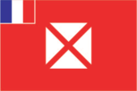
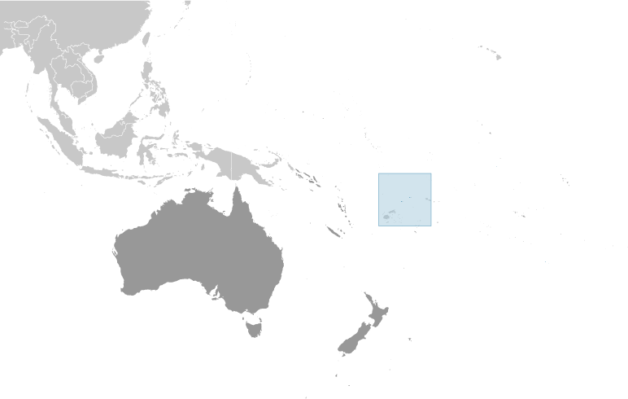
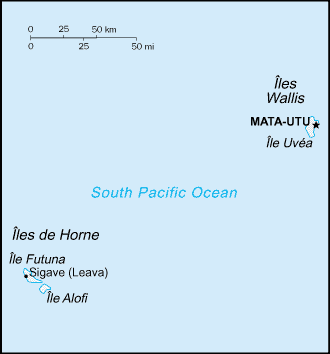

# Wallis and Futuna

_overseas collectivity of France_

## Introduction

**_Background:_**   
The Futuna island group was discovered by the Dutch in 1616 and Wallis by the British in 1767, but it was the French who declared a protectorate over the islands in 1842, and took official control of them between 1886 and 1888. Notably, Wallis and Futuna was the only French colony to side with the Vichy regime during World War II, a phase that ended in May of 1942 with the arrival of 2,000 American troops. In 1959, the inhabitants of the islands voted to become a French overseas territory and officially assumed this status in July 1961.

## Geography

**_Location:_**   
Oceania, islands in the South Pacific Ocean, about two-thirds of the way from Hawaii to New Zealand

**_Geographic coordinates:_**   
13 18 S, 176 12 W

**_Map references:_**   
Oceania

**_Area:_**   
**total:** 142 sq km   
**land:** 142 sq km   
**water:** 0 sq km   
**note:** includes Ile Uvea (Wallis Island), Ile Futuna (Futuna Island), Ile Alofi, and 20 islets

**_Area - comparative:_**   
1.5 times the size of Washington, DC

**_Land boundaries:_**   
0 km

**_Coastline:_**   
129 km

**_Maritime claims:_**   
**territorial sea:** 12 nm   
**exclusive economic zone:** 200 nm

**_Climate:_**   
tropical; hot, rainy season (November to April); cool, dry season (May to October); rains 2,500-3,000 mm per year (80% humidity); average temperature 26.6 degrees C

**_Terrain:_**   
volcanic origin; low hills

**_Elevation extremes:_**   
**lowest point:** Pacific Ocean 0 m   
**highest point:** Mont Singavi (on Futuna) 765 m

**_Natural resources:_**   
NEGL

**_Land use:_**   
**arable land:** 7.14%   
**permanent crops:** 35.71%   
**other:** 57.15% (2011)

**_Irrigated land:_**   
NA

**_Natural hazards:_**   
NA

**_Environment - current issues:_**   
deforestation (only small portions of the original forests remain) largely as a result of the continued use of wood as the main fuel source; as a consequence of cutting down the forests, the mountainous terrain of Futuna is particularly prone to erosion; there are no permanent settlements on Alofi because of the lack of natural freshwater resources

**_Geography - note:_**   
both island groups have fringing reefs

## People and Society

**_Nationality:_**   
**noun:** Wallisian(s), Futunan(s), or Wallis and Futuna Islanders   
**adjective:** Wallisian, Futunan, or Wallis and Futuna Islander

**_Ethnic groups:_**   
Polynesian

**_Languages:_**   
Wallisian (indigenous Polynesian language) 58.9%, Futunian 30.1%, French (official) 10.8%, other 0.2% (2003 census)

**_Religions:_**   
Roman Catholic 99%, other 1%

**_Population:_**   
15,561 (July 2014 est.)

**_Age structure:_**   
**0-14 years:** 23.4% (male 1,902/female 1,741)   
**15-24 years:** 17.8% (male 1,449/female 1,320)   
**25-54 years:** 40.7% (male 3,147/female 3,183)   
**55-64 years:** 9.2% (male 719/female 709)   
**65 years and over:** 8.6% (male 663/female 728) (2014 est.)

**_Median age:_**   
**total:** 30.3 years   
**male:** 29.3 years   
**female:** 31.5 years (2014 est.)

**_Population growth rate:_**   
0.33% (2014 est.)

**_Birth rate:_**   
13.56 births/1,000 population (2014 est.)

**_Death rate:_**   
4.95 deaths/1,000 population (2014 est.)

**_Net migration rate:_**   
-5.27 migrant(s)/1,000 population   
**note:** there has been steady emigration from Wallis and Futuna to New Caledonia (2014 est.)

**_Major urban areas - population:_**   
MATA-UTU (capital) 1,000 (2011)

**_Sex ratio:_**   
**at birth:** 1.05 male(s)/female   
**0-14 years:** 1.09 male(s)/female   
**15-24 years:** 1.1 male(s)/female   
**25-54 years:** 0.99 male(s)/female   
**55-64 years:** 1.03 male(s)/female   
**65 years and over:** 0.89 male(s)/female   
**total population:** 1.02 male(s)/female (2014 est.)

**_Infant mortality rate:_**   
**total:** 4.49 deaths/1,000 live births   
**male:** 4.72 deaths/1,000 live births   
**female:** 4.24 deaths/1,000 live births (2014 est.)

**_Life expectancy at birth:_**   
**total population:** 79.42 years   
**male:** 76.43 years   
**female:** 82.55 years (2014 est.)

**_Total fertility rate:_**   
1.76 children born/woman (2014 est.)

**_Sanitation facility access:_**   
**improved:** rural: 96% of population; total: 96% of population   
**unimproved:** rural: 4% of population; total: 4% of population (2008 est.)

**_HIV/AIDS - adult prevalence rate:_**   
NA

**_HIV/AIDS - people living with HIV/AIDS:_**   
NA

**_HIV/AIDS - deaths:_**   
NA

**_Literacy:_**   
**definition:** age 15 and over can read and write   
**total population:** 50%   
**male:** 50%   
**female:** 50% (1969 est.)

## Government

**_Country name:_**   
**conventional long form:** Territory of the Wallis and Futuna Islands   
**conventional short form:** Wallis and Futuna   
**local long form:** Territoire des Iles Wallis et Futuna   
**local short form:** Wallis et Futuna

**_Dependency status:_**   
overseas territory of France

**_Government type:_**   
parliamentary representive democratic French overseas collectivity

**_Capital:_**   
**name:** Mata-Utu (on Ile Uvea)   
**geographic coordinates:** 13 57 S, 171 56 W   
**time difference:** UTC+12 (17 hours ahead of Washington, DC, during Standard Time)

**_Administrative divisions:_**   
none (overseas territory of France); there are no first-order administrative divisions as defined by the US Government, but there are three kingdoms at the second order named Alo, Sigave, Wallis

**_Independence:_**   
none (overseas territory of France)

**_National holiday:_**   
Bastille Day, 14 July (1789)

**_Constitution:_**   
4 October 1958 (French Constitution) (2013)

**_Legal system:_**   
French civil law

**_Suffrage:_**   
18 years of age; universal

**_Executive branch:_**   
**chief of state:** President Francois HOLLANDE (since 15 May 2012); represented by High Administrator Michel JEANJEAN (since 10 June 2010)   
**head of government:** President of the Territorial Assembly Vetelino NAU (since 4 April 2012)   
**cabinet:** Council of the Territory consists of 3 kings and 3 members appointed by the high administrator on the advice of the Territorial Assembly   
**note:** there are 3 traditional kings with limited powers   
**elections:** French president elected by popular vote for a five-year term; high administrator appointed by the French president on the advice of the French Ministry of the Interior; the presidents of the Territorial Government and the Territorial Assembly elected by the members of the assembly

**_Legislative branch:_**   
unicameral Territorial Assembly or Assemblee Territoriale (20 seats; members elected by popular vote to serve five-year terms)   
**elections:** last held on 22 March 2012 (next to be held in March 2017)   
**election results:** percent of vote by party - NA; seats by party - PS 4, UMP 4, centrists, 3, other 9   
**note:** Wallis and Futuna elects one senator to the French Senate and one deputy to the French National Assembly; French Senate - elections last held on 21 September 2008 (next to be held by September 2014); results - percent of vote by party - NA; seats - UMP 1; French National Assembly - elections last held on 17 June 2012 (next to be held by 2017); results - percent of vote by party - NA; seats - UMP 1

**_Judicial branch:_**   
**highest court(s):** Court of Appeal or Cour d'Appel, located in Noumea, New Caledonia   
**judge selection and term of office:** NA   
**subordinate courts:** note: justice generally administered under French law by the high administrator, but the three traditional kings administer customary law and there is a magistrate in Mata-Utu

**_Political parties and leaders:_**   
Lua Kae Tahi (Giscardians)   
Mouvement des Radicaux de Gauche or MRG   
Rally for the Republic or RPR (UMP)   
Socialist Party or PS   
Taumu'a Lelei   
Union Populaire Locale or UPL   
Union Pour la Democratie Francaise or UDF

**_Political pressure groups and leaders:_**   
NA

**_International organization participation:_**   
PIF (observer), SPC, UPU

**_Diplomatic representation in the US:_**   
none (overseas territory of France)

**_Diplomatic representation from the US:_**   
none (overseas territory of France)

**_Flag description:_**   
unofficial, local flag has a red field with four white isosceles triangles in the middle, representing the three native kings of the islands and the French administrator; the apexes of the triangles are oriented inward and at right angles to each other; the flag of France, outlined in white on two sides, is in the upper hoist quadrant   
**note:** the design is derived from an original red banner with a white cross pattee that was introduced in the 19th century by French missionaries; the flag of France is used for official occasions

**_National symbol(s):_**   
red saltire (Saint Andrew's Cross) on a white square on a red field

**_National anthem:_**   
**note:** as a territory of France, "La Marseillaise" is official (see France)

## Economy

**_Economy - overview:_**   
The economy is limited to traditional subsistence agriculture, with 80% of labor force earnings from agriculture (coconuts and vegetables), livestock (mostly pigs), and fishing. About 4% of the population is employed in government. Revenues come from French Government subsidies, licensing of fishing rights to Japan and South Korea, import taxes, and remittances from expatriate workers in New Caledonia.

**_GDP (purchasing power parity):_**   
$60 million (2004 est.)

**_GDP (official exchange rate):_**   
$NA

**_GDP - real growth rate:_**   
NA%

**_GDP - per capita (PPP):_**   
$3,800 (2004 est.)

**_GDP - composition, by sector of origin:_**   
**agriculture:** NA%   
**industry:** NA%   
**services:** NA%

**_Agriculture - products:_**   
coconuts, breadfruit, yams, taro, bananas; pigs, goats; fish

**_Industries:_**   
copra, handicrafts, fishing, lumber

**_Industrial production growth rate:_**   
NA%

**_Labor force:_**   
3,104 (2003)

**_Labor force - by occupation:_**   
**agriculture:** 80%   
**industry:** 4%   
**services:** 16% (2001 est.)

**_Unemployment rate:_**   
12.2% (2008)

**_Population below poverty line:_**   
NA%

**_Household income or consumption by percentage share:_**   
**lowest 10%:** NA%   
**highest 10%:** NA%

**_Budget:_**   
**revenues:** $29,730   
**expenditures:** $31,330 (2004)

**_Public debt:_**   
5.6% of GDP (2004 est.)   
**note:** offical data; data cover general government debt, and includes debt instruments issued (or owned) by government entities other than the treasury; the data include treasury debt held by foreign entities; the data include debt issued by subnational entities, as well as intra-governmental debt; intra-governmental debt consists of treasury borrowings from surpluses in the social funds, such as for retirement, medical care, and unemployment; debt instruments for the social funds are not sold at public auctions

**_Fiscal year:_**   
calendar year

**_Inflation rate (consumer prices):_**   
2.8% (2005)

**_Exports:_**   
$47,450 (2004)

**_Exports - commodities:_**   
copra, chemicals, construction materials

**_Imports:_**   
$61.17 million (2004)

**_Imports - commodities:_**   
chemicals, machinery, consumer goods

**_Debt - external:_**   
$3.67 million (2004)

**_Exchange rates:_**   
Comptoirs Francais du Pacifique francs (XPF) per US dollar -   
90.01 (February 2012)   
87.59 (2007)

## Communications

**_Telephone system:_**   
**international:** country code - 681

**_Broadcast media:_**   
the publicly owned French Overseas Network (RFO), which broadcasts to France's overseas departments and territories, is carried on the RFO Wallis and Fortuna TV and radio stations (2008)

**_Internet country code:_**   
.wf

**_Internet hosts:_**   
2,760 (2012)

**_Internet users:_**   
1,300 (2009)

## Transportation

**_Airports:_**   
2 (2013)

**_Airports - with paved runways:_**   
**total:** 2   
**1,524 to 2,437 m:** 1   
**914 to 1,523 m:** 1 (2013)

**_Ports and terminals:_**   
**major seaport(s):** Leava, Mata-Utu

## Military

**_Manpower fit for military service:_**   
**males age 16-49:** 3,376   
**females age 16-49:** 3,314 (2010 est.)

**_Manpower reaching militarily significant age annually:_**   
**male:** 168   
**female:** 139 (2010 est.)

**_Military - note:_**   
defense is the responsibility of France

## Transnational Issues

**_Disputes - international:_**   
none

............................................................   
_Page last updated on June 20, 2014_
