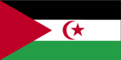
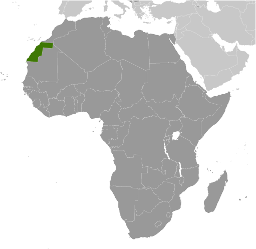
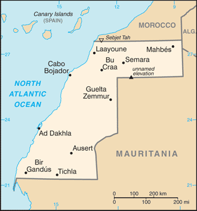

# Western Sahara

## Introduction

**_Background:_**   
Western Sahara is a disputed territory on the northwest coast of Africa bordered by Morocco, Mauritania, and Algeria. After Spain withdrew from its former colony of Spanish Sahara in 1976, Morocco annexed the northern two-thirds of Western Sahara and claimed the rest of the territory in 1979, following Mauritania's withdrawal. A guerrilla war with the Polisario Front contesting Morocco's sovereignty ended in a 1991 cease-fire and the establishment of a UN peacekeeping operation. As part of this effort, the UN sought to offer a choice to the peoples of the Western Sahara between independence (favored by the Polisario Front) or integration into Morocco. A proposed referendum never took place due to lack of agreement on voter eligibility. The 2,700 km- (1,700 mi-) long defensive sand berm, built by the Moroccans from 1980 to 1987 and running the length of the territory, continues to separate the opposing forces with Morocco controlling the roughly 80 percent of the territory west of the berm. Local demonstrations criticizing the Moroccan authorities occur regularly, and there are periodic ethnic tensions between the native Sahrawi population and Moroccan immigrants. Morocco maintains a heavy security presence in the territory.

## Geography

**_Location:_**   
Northern Africa, bordering the North Atlantic Ocean, between Mauritania and Morocco

**_Geographic coordinates:_**   
24 30 N, 13 00 W

**_Map references:_**   
Africa

**_Area:_**   
**total:** 266,000 sq km   
**land:** 266,000 sq km   
**water:** 0 sq km

**_Area - comparative:_**   
about the size of Colorado

**_Land boundaries:_**   
**total:** 2,046 km   
**border countries:** Algeria 42 km, Mauritania 1,561 km, Morocco 443 km

**_Coastline:_**   
1,110 km

**_Maritime claims:_**   
contingent upon resolution of sovereignty issue

**_Climate:_**   
hot, dry desert; rain is rare; cold offshore air currents produce fog and heavy dew

**_Terrain:_**   
mostly low, flat desert with large areas of rocky or sandy surfaces rising to small mountains in south and northeast

**_Elevation extremes:_**   
**lowest point:** Sebjet Tah -55 m   
**highest point:** unnamed elevation 805 m

**_Natural resources:_**   
phosphates, iron ore

**_Land use:_**   
**arable land:** 0.02%   
**permanent crops:** 0%   
**other:** 99.98% (2011)

**_Irrigated land:_**   
NA

**_Natural hazards:_**   
hot, dry, dust/sand-laden sirocco wind can occur during winter and spring; widespread harmattan haze exists 60% of time, often severely restricting visibility

**_Environment - current issues:_**   
sparse water and lack of arable land

**_Environment - international agreements:_**   
**party to:** none of the selected agreements

**_Geography - note:_**   
the waters off the coast are particularly rich fishing areas

## People and Society

**_Nationality:_**   
**noun:** Sahrawi(s), Sahraoui(s)   
**adjective:** Sahrawi, Sahrawian, Sahraouian

**_Ethnic groups:_**   
Arab, Berber

**_Languages:_**   
Standard Arabic (national), Hassaniya Arabic, Moroccan Arabic

**_Religions:_**   
Muslim

**_Population:_**   
554,795 (July 2013 est.)   
**note:** estimate is based on projections by age, sex, fertility, mortality, and migration; fertility and mortality are based on data from neighboring countries (July 2014 est.)

**_Age structure:_**   
**0-14 years:** 38.1% (male 106,868/female 104,574)   
**15-24 years:** 19.7% (male 54,970/female 54,217)   
**25-54 years:** 33.7% (male 91,986/female 95,114)   
**55-64 years:** 4.8% (male 12,408/female 14,159)   
**65 years and over:** 3.6% (male 9,002/female 11,497) (2014 est.)

**_Dependency ratios:_**   
**total dependency ratio:** 41 %   
**youth dependency ratio:** 37.1 %   
**elderly dependency ratio:** 3.8 %   
**potential support ratio:** 26.1 (2014 est.)

**_Median age:_**   
**total:** 20.8 years   
**male:** 20.3 years   
**female:** 21.3 years (2014 est.)

**_Population growth rate:_**   
2.89% (2014 est.)

**_Birth rate:_**   
30.71 births/1,000 population (2014 est.)

**_Death rate:_**   
8.49 deaths/1,000 population (2014 est.)

**_Urbanization:_**   
**urban population:** 82% of total population (2011)   
**rate of urbanization:** 3.49% annual rate of change (2010-15 est.)

**_Major urban areas - population:_**   
Laayoune 237,000 (2011)

**_Sex ratio:_**   
**at birth:** 1.04 male(s)/female   
**0-14 years:** 1.02 male(s)/female   
**15-24 years:** 1.01 male(s)/female   
**25-54 years:** 0.97 male(s)/female   
**55-64 years:** 0.99 male(s)/female   
**65 years and over:** 0.78 male(s)/female   
**total population:** 0.98 male(s)/female (2014 est.)

**_Infant mortality rate:_**   
**total:** 56.09 deaths/1,000 live births   
**male:** 61.04 deaths/1,000 live births   
**female:** 50.93 deaths/1,000 live births (2014 est.)

**_Life expectancy at birth:_**   
**total population:** 62.27 years   
**male:** 60 years   
**female:** 64.63 years (2014 est.)

**_Total fertility rate:_**   
4.07 children born/woman (2014 est.)

**_HIV/AIDS - adult prevalence rate:_**   
NA

**_HIV/AIDS - people living with HIV/AIDS:_**   
NA

**_HIV/AIDS - deaths:_**   
NA

**_Literacy:_**   
NA

## Government

**_Country name:_**   
**conventional long form:** none   
**conventional short form:** Western Sahara   
**former:** Rio de Oro, Saguia el Hamra, Spanish Sahara

**_Government type:_**   
legal status of territory and issue of sovereignty unresolved; territory contested by Morocco and Polisario Front (Popular Front for the Liberation of the Saguia el Hamra and Rio de Oro), which in February 1976 formally proclaimed a government-in-exile, the Sahrawi Arab Democratic Republic (SADR), based out of refugee camps near Tindouf, Algeria, led by President Mohamed ABDELAZIZ

**_Capital:_**   
Laayoune (administrative center)   
**time difference:** UTC 0 (5 hours ahead of Washington, DC, during Standard Time)   
**daylight saving time:** +1hr, begins last Sunday in April; ends last Sunday in September

**_Administrative divisions:_**   
none (territory west of the berm under de facto Moroccan control)

**_Suffrage:_**   
none; (residents of Moroccan-controlled Western Sahara participate in Moroccan elections)

**_Executive branch:_**   
none

**_Political pressure groups and leaders:_**   
none

**_International organization participation:_**   
AU, CAN (observer), WFTU (NGOs)

**_Diplomatic representation in the US:_**   
none

**_Diplomatic representation from the US:_**   
none

## Economy

**_Economy - overview:_**   
Western Sahara has a small market-based economy whose main industries are fishing, phosphate mining, and pastoral nomadism. The territory's arid desert climate makes sedentary agriculture difficult, and Western Sahara imports much of its food. The Moroccan Government administers Western Sahara's economy and is a key source of employment, infrastructure development, and social spending in the territory. Western Sahara's unresolved legal status makes the exploitation of its natural resources a contentious issue between Morocco and the Polisario. Morocco and the EU in December 2013 finalized a four-year agreement allowing European vessels to fish off the coast of Morocco, including disputed waters off the coast of Western Sahara. Oil has never been found in Western Sahara in commercially significant quantities, but Morocco and the Polisario have quarreled over who has the right to authorize and benefit from oil exploration in the territory. Western Sahara's main long-term economic challenge is the development of a more diverse set of industries capable of providing greater employment and income to the territory.

**_GDP (purchasing power parity):_**   
$906.5 million (2007 est.)

**_GDP (official exchange rate):_**   
$NA

**_GDP - real growth rate:_**   
NA%

**_GDP - per capita (PPP):_**   
$2,500 (2007 est.)

**_GDP - composition, by sector of origin:_**   
**agriculture:** NA%   
**industry:** NA%   
**services:** 40% (2007 est.)

**_Agriculture - products:_**   
fruits and vegetables (grown in the few oases); camels, sheep, goats (kept by nomads); fish

**_Industries:_**   
phosphate mining, handicrafts

**_Industrial production growth rate:_**   
NA%

**_Labor force:_**   
144,000 (2010 est.)

**_Labor force - by occupation:_**   
**agriculture:** 50%   
**industry and services:** 50% (2005 est.)

**_Unemployment rate:_**   
NA%

**_Population below poverty line:_**   
NA%

**_Household income or consumption by percentage share:_**   
**lowest 10%:** NA%   
**highest 10%:** NA%

**_Budget:_**   
**revenues:** $NA   
**expenditures:** $NA

**_Fiscal year:_**   
calendar year

**_Inflation rate (consumer prices):_**   
NA%

**_Exports:_**   
$NA

**_Exports - commodities:_**   
phosphates 62%

**_Imports:_**   
$NA

**_Imports - commodities:_**   
fuel for fishing fleet, foodstuffs

**_Debt - external:_**   
$NA

**_Exchange rates:_**   
Moroccan dirhams (MAD) per US dollar -   
8.439 (2013)   
8.6026 (2012)   
8.4172 (2010)   
8.0571 (2009)   
7.526 (2008)

## Energy

**_Electricity - production:_**   
90 million kWh (2010 est.)

**_Electricity - consumption:_**   
83.7 million kWh (2010 est.)

**_Electricity - exports:_**   
0 kWh (2012 est.)

**_Electricity - imports:_**   
0 kWh (2012 est.)

**_Electricity - installed generating capacity:_**   
58,000 kW (2010 est.)

**_Electricity - from fossil fuels:_**   
100% of total installed capacity (2010 est.)

**_Electricity - from nuclear fuels:_**   
0% of total installed capacity (2010 est.)

**_Electricity - from hydroelectric plants:_**   
0% of total installed capacity (2010 est.)

**_Electricity - from other renewable sources:_**   
0% of total installed capacity (2010 est.)

**_Crude oil - production:_**   
0 bbl/day (2012 est.)

**_Crude oil - exports:_**   
0 bbl/day (2010 est.)

**_Crude oil - imports:_**   
0 bbl/day (2010 est.)

**_Crude oil - proved reserves:_**   
0 bbl (1 January 2013 est.)

**_Refined petroleum products - production:_**   
0 bbl/day (2010 est.)

**_Refined petroleum products - consumption:_**   
1,948 bbl/day (2011 est.)

**_Refined petroleum products - exports:_**   
0 bbl/day (2010 est.)

**_Refined petroleum products - imports:_**   
1,702 bbl/day (2010 est.)

**_Natural gas - production:_**   
0 cu m (2011 est.)

**_Natural gas - consumption:_**   
0 cu m (2010 est.)

**_Natural gas - exports:_**   
0 cu m (2011 est.)

**_Natural gas - imports:_**   
0 cu m (2011 est.)

**_Natural gas - proved reserves:_**   
0 cu m (1 January 2013 est.)

**_Carbon dioxide emissions from consumption of energy:_**   
316,700 Mt (2011 est.)

## Communications

**_Telephone system:_**   
**general assessment:** sparse and limited system   
**domestic:** NA   
**international:** country code - 212; tied into Morocco's system by microwave radio relay, tropospheric scatter, and satellite; satellite earth stations - 2 Intelsat (Atlantic Ocean) linked to Rabat, Morocco (2008)

**_Broadcast media:_**   
Morocco's state-owned broadcaster, Radio-Television Marocaine (RTM), operates a radio service from Laayoune and relays TV service; a Polisario-backed radio station also broadcasts (2008)

**_Internet country code:_**   
.eh

## Transportation

**_Airports:_**   
6 (2013)

**_Airports - with paved runways:_**   
**total:** 3   
**2,438 to 3,047 m:** 3 (2013)

**_Airports - with unpaved runways:_**   
**total:** 3   
**1,524 to 2,437 m:** 1   
**914 to 1,523 m:** 1   
**under 914 m:** 1 (2013)

**_Ports and terminals:_**   
**major seaport(s):** Ad Dakhla, Laayoune (El Aaiun)

## Military

**_Manpower fit for military service:_**   
**males age 16-49:** 79,489   
**females age 16-49:** 87,362 (2010 est.)

**_Manpower reaching militarily significant age annually:_**   
**male:** 5,523   
**female:** 5,429 (2010 est.)

## Transnational Issues

**_Disputes - international:_**   
many neighboring states reject Moroccan administration of Western Sahara; several states have extended diplomatic relations to the "Sahrawi Arab Democratic Republic" represented by the Polisario Front in exile in Algeria, while others recognize Moroccan sovereignty over Western Sahara; approximately 90,000 Sahrawi refugees continue to be sheltered in camps in Tindouf, Algeria, which has hosted Sahrawi refugees since the 1980s

............................................................   
_Page last updated on June 19, 2014_
