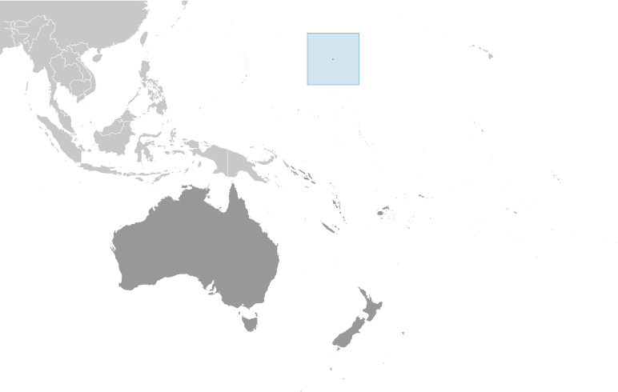
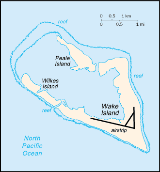

# Wake Island

_territory of the US_

## Introduction

**_Background:_**   
The US annexed Wake Island in 1899 for a cable station. An important air and naval base was constructed in 1940-41. In December 1941, the island was captured by the Japanese and held until the end of World War II. In subsequent years, Wake became a stopover and refueling site for military and commercial aircraft transiting the Pacific. Since 1974, the island's airstrip has been used by the US military, as well as for emergency landings. Operations on the island were suspended and all personnel evacuated in 2006 with the approach of super typhoon IOKE (category 5), but resultant damage was comparatively minor. A US Air Force repair team restored full capability to the airfield and facilities, and the island remains a vital strategic link in the Pacific region.

## Geography

**_Location:_**   
Oceania, atoll in the North Pacific Ocean, about two-thirds of the way from Hawaii to the Northern Mariana Islands

**_Geographic coordinates:_**   
19 17 N, 166 39 E

**_Map references:_**   
Oceania

**_Area:_**   
**total:** 6.5 sq km   
**land:** 6.5 sq km   
**water:** 0 sq km

**_Area - comparative:_**   
about 11 times the size of The Mall in Washington, DC

**_Land boundaries:_**   
0 km

**_Coastline:_**   
19.3 km

**_Maritime claims:_**   
**territorial sea:** 12 nm   
**exclusive economic zone:** 200 nm

**_Climate:_**   
tropical

**_Terrain:_**   
atoll of three low coral islands, Peale, Wake, and Wilkes, built up on an underwater volcano; central lagoon is former crater, islands are part of the rim

**_Elevation extremes:_**   
**lowest point:** Pacific Ocean 0 m   
**highest point:** unnamed location 6 m

**_Natural resources:_**   
none

**_Land use:_**   
**arable land:** 0%   
**permanent crops:** 0%   
**other:** 100% (2011)

**_Irrigated land:_**   
0 sq km (2011)

**_Natural hazards:_**   
occasional typhoons

**_Environment - current issues:_**   
NA

**_Geography - note:_**   
strategic location in the North Pacific Ocean; emergency landing location for transpacific flights

## People and Society

**_Population:_**   
no indigenous inhabitants   
**note:** approximately 150 military personnel and civilian contractors maintain and operate the airfield and communications facilities (2009)

## Government

**_Country name:_**   
**conventional long form:** none   
**conventional short form:** Wake Island

**_Dependency status:_**   
unorganized, unincorporated territory of the US; administered from Washington, DC, by the Department of the Interior; activities in the atoll are currently conducted by the US Air Force

**_Legal system:_**   
US common law

**_Flag description:_**   
the flag of the US is used

## Economy

**_Economy - overview:_**   
Economic activity is limited to providing services to military personnel and contractors located on the island. All food and manufactured goods must be imported.

## Communications

**_Telephone system:_**   
**general assessment:** satellite communications; 2 Defense Switched Network circuits off the Overseas Telephone System (OTS); located in the Hawaii area code - 808

**_Broadcast media:_**   
American Armed Forces Radio and Television Service (AFRTS) provides satellite radio/TV broadcasts (2009)

## Transportation

**_Airports:_**   
1 (2013)

**_Airports - with paved runways:_**   
**total:** 1   
**2,438 to 3,047 m:** 1 (2013)

**_Ports and terminals:_**   
none; two offshore anchorages for large ships

**_Transportation - note:_**   
there are no commercial or civilian flights to and from Wake Island, except in direct support of island missions; emergency landing is available

## Military

**_Military - note:_**   
defense is the responsibility of the US; the US Air Force is responsible for overall administration and operation of the island facilities; the launch support facility is administered by the US Missile Defense Agency (MDA)

## Transnational Issues

**_Disputes - international:_**   
claimed by Marshall Islands

............................................................   
_Page last updated on May 27, 2014_
