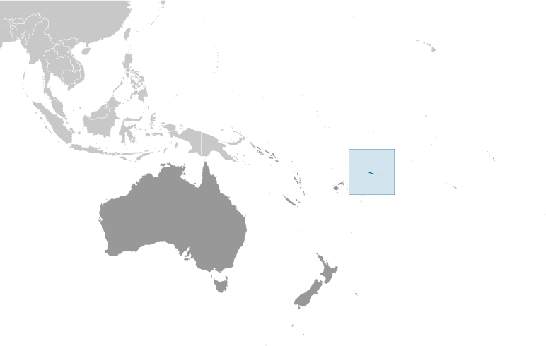
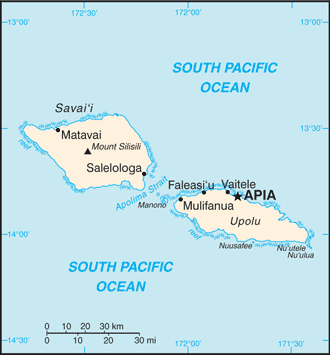

# Samoa

## Introduction

**_Background:_**   
New Zealand occupied the German protectorate of Western Samoa at the outbreak of World War I in 1914. It continued to administer the islands as a mandate and then as a trust territory until 1962, when the islands became the first Polynesian nation to reestablish independence in the 20th century. The country dropped the "Western" from its name in 1997.

## Geography

**_Location:_**   
Oceania, group of islands in the South Pacific Ocean, about half way between Hawaii and New Zealand

**_Geographic coordinates:_**   
13 35 S, 172 20 W

**_Map references:_**   
Oceania

**_Area:_**   
**total:** 2,831 sq km   
**land:** 2,821 sq km   
**water:** 10 sq km

**_Area - comparative:_**   
slightly smaller than Rhode Island

**_Land boundaries:_**   
0 km

**_Coastline:_**   
403 km

**_Maritime claims:_**   
**territorial sea:** 12 nm   
**contiguous zone:** 24 nm   
**exclusive economic zone:** 200 nm

**_Climate:_**   
tropical; rainy season (November to April), dry season (May to October)

**_Terrain:_**   
two main islands (Savaii, Upolu) and several smaller islands and uninhabited islets; narrow coastal plain with volcanic, rocky, rugged mountains in interior

**_Elevation extremes:_**   
**lowest point:** Pacific Ocean 0 m   
**highest point:** Mount Silisili 1,857 m

**_Natural resources:_**   
hardwood forests, fish, hydropower

**_Land use:_**   
**arable land:** 2.82%   
**permanent crops:** 7.75%   
**other:** 89.44% (2011)

**_Irrigated land:_**   
NA

**_Natural hazards:_**   
occasional typhoons; active volcanism   
**volcanism:** Savai'I Island (elev. 1,858 m), which last erupted in 1911, is historically active

**_Environment - current issues:_**   
soil erosion, deforestation, invasive species, overfishing

**_Environment - international agreements:_**   
**party to:** Biodiversity, Climate Change, Climate Change-Kyoto Protocol, Desertification, Hazardous Wastes, Law of the Sea, Ozone Layer Protection, Ship Pollution, Wetlands   
**signed, but not ratified:** none of the selected agreements

**_Geography - note:_**   
occupies an almost central position within Polynesia

## People and Society

**_Nationality:_**   
**noun:** Samoan(s)   
**adjective:** Samoan

**_Ethnic groups:_**   
Samoan 92.6%, Euronesians (persons of European and Polynesian blood) 7%, Europeans 0.4% (2001 census)

**_Languages:_**   
Samoan (Polynesian) (official), English

**_Religions:_**   
Protestant 57.4% (Congregationalist 31.8%, Methodist 13.7%, Assembly of God 8%, Seventh-Day Adventist 3.9%), Roman Catholic 19.4%, Mormon 15.2%, Worship Centre 1.7%, other Christian 5.5%, other 0.7%, none 0.1%, unspecified 0.1% (2011 est.)

**_Population:_**   
196,628   
**note:** prior estimates used official net migration data by sex, but a highly unusual pattern for 1993 lead to a significant imbalance in the sex ratios (more men and fewer women) and a seeming reduction in the female population; the revised total was calculated using a 1993 number that was an average of the 1992 and 1994 migration figures (July 2014 est.)

**_Age structure:_**   
**0-14 years:** 33.4% (male 33,842/female 31,749)   
**15-24 years:** 20.1% (male 20,227/female 19,200)   
**25-54 years:** 35.2% (male 35,872/female 33,355)   
**55-64 years:** 6% (male 5,955/female 5,770)   
**65 years and over:** 5.4% (male 4,647/female 6,011) (2014 est.)

**_Dependency ratios:_**   
**total dependency ratio:** 74.4 %   
**youth dependency ratio:** 65.4 %   
**elderly dependency ratio:** 9 %   
**potential support ratio:** 11.1 (2014 est.)

**_Median age:_**   
**total:** 23.1 years   
**male:** 22.9 years   
**female:** 23.4 years (2014 est.)

**_Population growth rate:_**   
0.59% (2014 est.)

**_Birth rate:_**   
21.29 births/1,000 population (2014 est.)

**_Death rate:_**   
5.32 deaths/1,000 population (2014 est.)

**_Net migration rate:_**   
-10.12 migrant(s)/1,000 population (2014 est.)

**_Urbanization:_**   
**urban population:** 19.9% of total population (2011)   
**rate of urbanization:** -0.5% annual rate of change (2010-15 est.)

**_Major urban areas - population:_**   
APIA (capital) 37,000 (2011)

**_Sex ratio:_**   
**at birth:** 1.05 male(s)/female   
**0-14 years:** 1.07 male(s)/female   
**15-24 years:** 1.05 male(s)/female   
**25-54 years:** 1.08 male(s)/female   
**55-64 years:** 1.05 male(s)/female   
**65 years and over:** 0.78 male(s)/female   
**total population:** 1.05 male(s)/female (2014 est.)

**_Mother's mean age at first birth:_**   
23.6   
**note:** median age at first birth among women 25-29 (2009 est.)

**_Maternal mortality rate:_**   
100 deaths/100,000 live births (2010)

**_Infant mortality rate:_**   
**total:** 20.5 deaths/1,000 live births   
**male:** 24.18 deaths/1,000 live births   
**female:** 16.63 deaths/1,000 live births (2014 est.)

**_Life expectancy at birth:_**   
**total population:** 73.21 years   
**male:** 70.32 years   
**female:** 76.24 years (2014 est.)

**_Total fertility rate:_**   
2.94 children born/woman (2014 est.)

**_Contraceptive prevalence rate:_**   
28.7% (2009)

**_Health expenditures:_**   
7% of GDP (2011)

**_Physicians density:_**   
0.48 physicians/1,000 population (2008)

**_Hospital bed density:_**   
1 beds/1,000 population (2005)

**_Drinking water source:_**   
**improved:** urban: 97.4% of population; rural: 98.8% of population; total: 98.5% of population   
**unimproved:** urban: 2.6% of population; rural: 1.2% of population; total: 1.5% of population (2012 est.)

**_Sanitation facility access:_**   
**improved:** urban: 93.3% of population; rural: 91.1% of population; total: 91.6% of population   
**unimproved:** urban: 6.7% of population; rural: 8.9% of population; total: 8.4% of population (2012 est.)

**_HIV/AIDS - adult prevalence rate:_**   
NA

**_HIV/AIDS - people living with HIV/AIDS:_**   
NA

**_HIV/AIDS - deaths:_**   
NA

**_Obesity - adult prevalence rate:_**   
54.1% (2008)

**_Education expenditures:_**   
5.8% of GDP (2008)

**_Literacy:_**   
**definition:** age 15 and over can read and write   
**total population:** 98.8%   
**male:** 99%   
**female:** 98.6% (2003 est.)

**_School life expectancy (primary to tertiary education):_**   
**total:** 12 years   
**male:** 12 years   
**female:** 12 years (2000)

**_Unemployment, youth ages 15-24:_**   
**total:** 16.1%   
**male:** 13.8%   
**female:** 22.2% (2011)

## Government

**_Country name:_**   
**conventional long form:** Independent State of Samoa   
**conventional short form:** Samoa   
**local long form:** Malo Sa'oloto Tuto'atasi o Samoa   
**local short form:** Samoa   
**former:** Western Samoa

**_Government type:_**   
parliamentary democracy

**_Capital:_**   
**name:** Apia   
**geographic coordinates:** 13 49 S, 171 46 W   
**time difference:** UTC+13 (18 hours ahead of Washington, DC, during Standard Time); +1hr, begins last Sunday in September; ends first Sunday in April

**_Administrative divisions:_**   
11 districts; A'ana, Aiga-i-le-Tai, Atua, Fa'asaleleaga, Gaga'emauga, Gagaifomauga, Palauli, Satupa'itea, Tuamasaga, Va'a-o-Fonoti, Vaisigano

**_Independence:_**   
1 January 1962 (from New Zealand-administered UN trusteeship)

**_National holiday:_**   
Independence Day Celebration, 1 June (1962); note - 1 January 1962 is the date of independence from the New Zealand-administered UN trusteeship; it is observed in June

**_Constitution:_**   
several previous (preindependence); latest 1 January 1962; amended several times, last in 2013 (2013)

**_Legal system:_**   
mixed legal system of English common law and customary law; judicial review of legislative acts with respect to fundamental rights of the citizen

**_International law organization participation:_**   
has not submitted an ICJ jurisdiction declaration; accepts ICCt jurisdiction

**_Suffrage:_**   
21 years of age; universal

**_Executive branch:_**   
**chief of state:** TUI ATUA Tupua Tamasese Efi (since 20 June 2007)   
**head of government:** Prime Minister TUILA'EPA Lupesoliai Sailele Malielegaoi (since 1998); Deputy Prime Minister FONOTOE Pierre Lauofo (since 2011)   
**cabinet:** Cabinet consists of 12 members appointed by the chief of state on the prime minister's advice   
**elections:** chief of state elected by the Legislative Assembly to serve a five-year term (no term limits); election last held on 20 July 2012 (next to be held in 2017); following legislative elections, the leader of the majority party usually appointed prime minister by the chief of state with the approval of the Legislative Assembly   
**election results:** TUI ATUA Tupua Tamasese Efi unanimously elected by the Legislative Assembly

**_Legislative branch:_**   
unicameral Legislative Assembly or Fono (49 seats, 47 members elected by voters affiliated with traditional village-based electoral districts, 2 elected by independent, mostly non-Samoan or part-Samoan, voters who cannot (or choose not to) establish a village affiliation; only chiefs (matai) may stand for election to the Fono from the 47 village-based electorates; members serve five-year terms)   
**elections:** election last held on 4 March 2011 (next election to be held not later than March 2016)   
**election results:** percent of vote by party - NA; seats by party - HRPP 29, Tautua Samoa 13, independents 7

**_Judicial branch:_**   
**highest court(s):** Court of Appeal (consists of the chief justice and 2 Supreme Court judges and meets once or twice a year); Supreme Court (consists of the chief justice and several judges)   
**judge selection and term of office:** chief justice appointed by the head of state upon the advice of the prime minister; other Supreme Court judges appointed by the Judicial Service Commission, a 3-member body chaired by the chief justice and includes the attorney general and an appointee of the Minister of Justice; judges normally appointed until retirement at age 68   
**subordinate courts:** District Court; Magistrates' Courts; Land and Titles Courts; village fono or village chief councils

**_Political parties and leaders:_**   
Human Rights Protection Party or HRPP [Sailele Malielegaoi TUILA'EPA]   
Samoa Christian Party or TCP [Tuala Tiresa MALIETOA]   
Samoa Progressive Political Party or SPPP   
Tautua Samoa [Palusalue FA'APO II]

**_Political pressure groups and leaders:_**   
NA

**_International organization participation:_**   
ACP, ADB, AOSIS, C, FAO, G-77, IBRD, ICAO, ICRM, IDA, IFAD, IFC, IFRCS, ILO, IMF, IMO, Interpol, IOC, IPU, ITU, ITUC (NGOs), MIGA, OPCW, PIF, Sparteca, SPC, UN, UNCTAD, UNESCO, UNIDO, UPU, WCO, WHO, WIPO, WMO, WTO

**_Diplomatic representation in the US:_**   
**chief of mission:** Ambassador Aliioaiga Feturi ELISAIA (since 4 December 2003)   
**chancery:** 800 Second Avenue, Suite 400J, New York, NY 10017   
**telephone:** [1] (212) 599-6196 through 6197   
**FAX:** [1] (212) 599-0797   
**consulate(s) general:** Pago Pago (American Samoa)

**_Diplomatic representation from the US:_**   
**chief of mission:** the US does not have an embassy in Samoa; the US Ambassador to New Zealand, currently Ambassador David HUEBNER, is accredited to Samoa   
**embassy:** Accident Corporation Building, 5th Floor, Matafele, Apia   
**mailing address:** P. O. Box 3430, Matafele, Apia   
**telephone:** [685] 21436/21631/21452/22696   
**FAX:** [685] 22030

**_Flag description:_**   
red with a blue rectangle in the upper hoist-side quadrant bearing five white five-pointed stars representing the Southern Cross constellation; red stands for courage, blue represents freedom, and white signifies purity

**_National symbol(s):_**   
Southern Cross constellation (five, five-pointed stars)

**_National anthem:_**   
**name:** "O le Fu'a o le Sa'olotoga o Samoa" (The Banner of Freedom)   
**lyrics/music:** Sauni Liga KURESA   
**note:** adopted 1962; the anthem is also known as "Samoa Tula'i" (Samoa Arise)

## Economy

**_Economy - overview:_**   
The economy of Samoa has traditionally been dependent on development aid, family remittances from overseas, agriculture, and fishing. The country is vulnerable to devastating storms. Agriculture employs roughly two-thirds of the labor force and furnishes 90% of exports, featuring coconut cream, coconut oil, and copra. The manufacturing sector mainly processes agricultural products. One factory in the Foreign Trade Zone employs 3,000 people to make automobile electrical harnesses for an assembly plant in Australia. Tourism is an expanding sector accounting for 25% of GDP; 122,000 tourists visited the islands in 2007. In late September 2009, an earthquake and the resulting tsunami severely damaged Samoa, and nearby American Samoa, disrupting transportation and power generation, and resulting in about 200 deaths. In December 2012, extensive flooding and wind damage from Tropical Cyclone Evan killed four people, displaced over 6,000, and damaged or destroyed an estimated 1,500 homes in Samoa's Upolu island. The Samoan Government has called for deregulation of the financial sector, encouragement of investment, and continued fiscal discipline, while at the same time protecting the environment. Observers point to the flexibility of the labor market as a basic strength for future economic advances. Foreign reserves are in a relatively healthy state, the external debt is stable, and inflation is low.

**_GDP (purchasing power parity):_**   
$1.145 billion (2013 est.)   
$1.144 billion (2012 est.)   
$1.11 billion (2011 est.)   
**note:** data are in 2013 US dollars

**_GDP (official exchange rate):_**   
$705 million (2013 est.)

**_GDP - real growth rate:_**   
0.1% (2013 est.)   
3.1% (2012 est.)   
1.3% (2011 est.)

**_GDP - per capita (PPP):_**   
$6,200 (2013 est.)   
$6,200 (2012 est.)   
$6,100 (2011 est.)   
**note:** data are in 2013 US dollars

**_GDP - composition, by sector of origin:_**   
**agriculture:** 10.2%   
**industry:** 25.9%   
**services:** 64% (2013 est.)

**_Agriculture - products:_**   
coconuts, bananas, taro, yams, coffee, cocoa

**_Industries:_**   
food processing, building materials, auto parts

**_Industrial production growth rate:_**   
-4.8% (2013 est.)

**_Labor force:_**   
47,930 (2011 est.)

**_Labor force - by occupation:_**   
**agriculture:** 65%   
**industry:** NA%   
**services:** NA%

**_Unemployment rate:_**   
NA%

**_Population below poverty line:_**   
NA%

**_Household income or consumption by percentage share:_**   
**lowest 10%:** NA%   
**highest 10%:** NA%

**_Budget:_**   
**revenues:** $215.6 million   
**expenditures:** $258.7 million (2013 est.)

**_Taxes and other revenues:_**   
30.6% of GDP (2013 est.)

**_Budget surplus (+) or deficit (-):_**   
-6.1% of GDP (2013 est.)

**_Fiscal year:_**   
June 1 - May 31

**_Inflation rate (consumer prices):_**   
2.7% (2013 est.)   
2.1% (2012 est.)

**_Commercial bank prime lending rate:_**   
10.2% (31 December 2013 est.)   
9.86% (31 December 2012 est.)

**_Stock of narrow money:_**   
$97.8 million (31 December 2013 est.)   
$97.71 million (31 December 2012 est.)

**_Stock of broad money:_**   
$305.8 million (31 December 2013 est.)   
$307.8 million (31 December 2012 est.)

**_Stock of domestic credit:_**   
$301.9 million (31 December 2013 est.)   
$312.1 million (31 December 2012 est.)

**_Market value of publicly traded shares:_**   
$NA

**_Current account balance:_**   
-$76.11 million (2011 est.)   
-$58.66 million (2010 est.)

**_Exports:_**   
$11.4 million (2011 est.)

**_Exports - commodities:_**   
fish, coconut oil and cream, copra, taro, automotive parts, garments, beer

**_Exports - partners:_**   
American Samoa 48.4%, Australia 24% (2012)

**_Imports:_**   
$318.7 million (2011 est.)   
$280 million (2010 est.)

**_Imports - commodities:_**   
machinery and equipment, industrial supplies, foodstuffs

**_Imports - partners:_**   
NZ 19.2%, Singapore 18.6%, Fiji 17.6%, China 15.8%, Australia 5.9%, US 5.4% (2012)

**_Reserves of foreign exchange and gold:_**   
$168.7 million (31 December 2012 est.)   
$168.7 million (31 December 2012 est.)

**_Debt - external:_**   
$368.3 million (31 December 2011 est.)   
$368.3 million (31 December 2011 est.)

**_Exchange rates:_**   
tala (SAT) per US dollar -   
2.319 (2013 est.)   
2.2923 (2012 est.)   
2.4847 (2010 est.)

## Energy

**_Electricity - production:_**   
120.2 million kWh (2010 est.)

**_Electricity - consumption:_**   
111.8 million kWh (2010 est.)

**_Electricity - exports:_**   
0 kWh (2012 est.)

**_Electricity - imports:_**   
0 kWh (2012 est.)

**_Electricity - installed generating capacity:_**   
41,100 kW (2010 est.)

**_Electricity - from fossil fuels:_**   
70.6% of total installed capacity (2010 est.)

**_Electricity - from nuclear fuels:_**   
0% of total installed capacity (2010 est.)

**_Electricity - from hydroelectric plants:_**   
29.2% of total installed capacity (2010 est.)

**_Electricity - from other renewable sources:_**   
0.2% of total installed capacity (2010 est.)

**_Crude oil - production:_**   
0 bbl/day (2012 est.)

**_Crude oil - exports:_**   
0 bbl/day (2010 est.)

**_Crude oil - imports:_**   
0 bbl/day (2010 est.)

**_Crude oil - proved reserves:_**   
0 bbl (1 January 2013 est.)

**_Refined petroleum products - production:_**   
0 bbl/day (2010 est.)

**_Refined petroleum products - consumption:_**   
1,070 bbl/day (2011 est.)

**_Refined petroleum products - exports:_**   
0 bbl/day (2010 est.)

**_Refined petroleum products - imports:_**   
1,149 bbl/day (2010 est.)

**_Natural gas - production:_**   
0 cu m (2011 est.)

**_Natural gas - consumption:_**   
0 cu m (2010 est.)

**_Natural gas - exports:_**   
0 cu m (2011 est.)

**_Natural gas - imports:_**   
0 cu m (2011 est.)

**_Natural gas - proved reserves:_**   
0 cu m (1 January 2013 est.)

**_Carbon dioxide emissions from consumption of energy:_**   
146,600 Mt (2011 est.)

## Communications

**_Telephones - main lines in use:_**   
35,300 (2010)

**_Telephones - mobile cellular:_**   
167,400 (2010)

**_Telephone system:_**   
**general assessment:** adequate   
**domestic:** combined fixed-line and mobile-cellular teledensity roughly 100 telephones per 100 persons   
**international:** country code - 685; satellite earth station - 1 Intelsat (Pacific Ocean) (2007)

**_Broadcast media:_**   
state-owned TV station privatized in 2008; 4 privately-owned television broadcast stations; about a half dozen privately owned radio stations and one state-owned radio station; TV and radio broadcasts of several stations from American Samoa are available (2009)

**_Internet country code:_**   
.ws

**_Internet hosts:_**   
18,013 (2012)

**_Internet users:_**   
9,000 (2009)

## Transportation

**_Airports:_**   
4 (2013)

**_Airports - with paved runways:_**   
**total:** 1   
**2,438 to 3,047 m:** 1 (2013)

**_Airports - with unpaved runways:_**   
**total:** 3   
**under 914 m:** 3 (2013)

**_Roadways:_**   
**total:** 2,337 km   
**paved:** 332 km   
**unpaved:** 2,005 km (2001)

**_Merchant marine:_**   
**total:** 2   
**by type:** cargo 1, passenger/cargo 1   
**foreign-owned:** 1 (NZ 1) (2010)

**_Ports and terminals:_**   
**major seaport(s):** Apia

## Military

**_Military branches:_**   
no regular military forces; Samoa Police Force (2008)

**_Manpower available for military service:_**   
**males age 16-49:** 47,906 (2010 est.)

**_Manpower fit for military service:_**   
**males age 16-49:** 38,260   
**females age 16-49:** 38,032 (2010 est.)

**_Manpower reaching militarily significant age annually:_**   
**male:** 2,221   
**female:** 2,062 (2010 est.)

**_Military - note:_**   
Samoa has no formal defense structure or regular armed forces; informal defense ties exist with NZ, which is required to consider any Samoan request for assistance under the 1962 Treaty of Friendship

## Transnational Issues

**_Disputes - international:_**   
none

............................................................   
_Page last updated on June 20, 2014_
