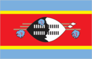
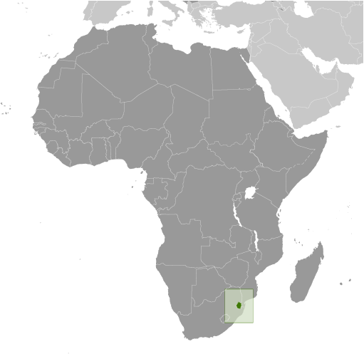
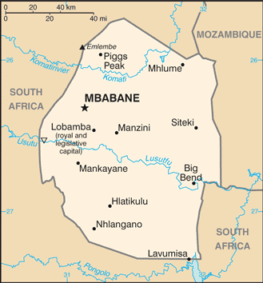

# Swaziland

## Introduction

**_Background:_**   
Autonomy for the Swazis of southern Africa was guaranteed by the British in the late 19th century; independence was granted in 1968. Student and labor unrest during the 1990s pressured King MSWATI III, Africa's last absolute monarch, to grudgingly allow political reform and greater democracy, although he has backslid on these promises in recent years. A constitution came into effect in 2006, but the legal status of political parties remains unclear. The African United Democratic Party tried unsuccessfully to register as an official political party in mid 2006. Talks over the constitution broke down between the government and progressive groups in 2007. Swaziland recently surpassed Botswana as the country with the world's highest known HIV/AIDS prevalence rate.

## Geography

**_Location:_**   
Southern Africa, between Mozambique and South Africa

**_Geographic coordinates:_**   
26 30 S, 31 30 E

**_Map references:_**   
Africa

**_Area:_**   
**total:** 17,364 sq km   
**land:** 17,204 sq km   
**water:** 160 sq km

**_Area - comparative:_**   
slightly smaller than New Jersey

**_Land boundaries:_**   
**total:** 535 km   
**border countries:** Mozambique 105 km, South Africa 430 km

**_Coastline:_**   
0 km (landlocked)

**_Maritime claims:_**   
none (landlocked)

**_Climate:_**   
varies from tropical to near temperate

**_Terrain:_**   
mostly mountains and hills; some moderately sloping plains

**_Elevation extremes:_**   
**lowest point:** Great Usutu River 21 m   
**highest point:** Emlembe 1,862 m

**_Natural resources:_**   
asbestos, coal, clay, cassiterite, hydropower, forests, small gold and diamond deposits, quarry stone, and talc

**_Land use:_**   
**arable land:** 10.08%   
**permanent crops:** 0.86%   
**other:** 89.06% (2011)

**_Irrigated land:_**   
498.5 sq km (2003)

**_Total renewable water resources:_**   
4.51 cu km (2011)

**_Freshwater withdrawal (domestic/industrial/agricultural):_**   
**total:** 1.04 cu km/yr (4%/2%/94%)   
**per capita:** 962.1 cu m/yr (2005)

**_Natural hazards:_**   
drought

**_Environment - current issues:_**   
limited supplies of potable water; wildlife populations being depleted because of excessive hunting; overgrazing; soil degradation; soil erosion

**_Environment - international agreements:_**   
**party to:** Biodiversity, Climate Change, Climate Change-Kyoto Protocol, Desertification, Endangered Species, Hazardous Wastes, Ozone Layer Protection   
**signed, but not ratified:** Law of the Sea

**_Geography - note:_**   
landlocked; almost completely surrounded by South Africa

## People and Society

**_Nationality:_**   
**noun:** Swazi(s)   
**adjective:** Swazi

**_Ethnic groups:_**   
African 97%, European 3%

**_Languages:_**   
English (official, used for government business), siSwati (official)

**_Religions:_**   
Zionist 40% (a blend of Christianity and indigenous ancestral worship), Roman Catholic 20%, Muslim 10%, other (includes Anglican, Baha'i, Methodist, Mormon, Jewish) 30%

**_Population:_**   
1,419,623   
**note:** estimates for this country explicitly take into account the effects of excess mortality due to AIDS; this can result in lower life expectancy, higher infant mortality, higher death rates, lower population growth rates, and changes in the distribution of population by age and sex than would otherwise be expected (July 2014 est.)

**_Age structure:_**   
**0-14 years:** 36.5% (male 261,715/female 255,949)   
**15-24 years:** 22.3% (male 160,283/female 156,685)   
**25-54 years:** 33.2% (male 241,958/female 229,140)   
**55-64 years:** 4.2% (male 23,739/female 36,469)   
**65 years and over:** 3.7% (male 21,321/female 32,364) (2014 est.)

**_Dependency ratios:_**   
**total dependency ratio:** 69.7 %   
**youth dependency ratio:** 63.7 %   
**elderly dependency ratio:** 6 %   
**potential support ratio:** 16.7 (2014 est.)

**_Median age:_**   
**total:** 21 years   
**male:** 20.7 years   
**female:** 21.3 years (2014 est.)

**_Population growth rate:_**   
1.14% (2014 est.)

**_Birth rate:_**   
25.18 births/1,000 population (2014 est.)

**_Death rate:_**   
13.75 deaths/1,000 population (2014 est.)

**_Net migration rate:_**   
0 migrant(s)/1,000 population (2014 est.)

**_Urbanization:_**   
**urban population:** 21.2% of total population (2011)   
**rate of urbanization:** 1.19% annual rate of change (2010-15 est.)

**_Major urban areas - population:_**   
MBABANE (capital) 66,000 (2011)

**_Sex ratio:_**   
**at birth:** 1.03 male(s)/female   
**0-14 years:** 1.02 male(s)/female   
**15-24 years:** 1.02 male(s)/female   
**25-54 years:** 1.06 male(s)/female   
**55-64 years:** 1 male(s)/female   
**65 years and over:** 0.69 male(s)/female   
**total population:** 0.99 male(s)/female (2014 est.)

**_Mother's mean age at first birth:_**   
19.5   
**note:** median age at first birth among women 25-29 (2006-07 est.)

**_Maternal mortality rate:_**   
320 deaths/100,000 live births (2010)

**_Infant mortality rate:_**   
**total:** 54.82 deaths/1,000 live births   
**male:** 58.8 deaths/1,000 live births   
**female:** 50.72 deaths/1,000 live births (2014 est.)

**_Life expectancy at birth:_**   
**total population:** 50.54 years   
**male:** 51.04 years   
**female:** 50.04 years (2014 est.)

**_Total fertility rate:_**   
2.88 children born/woman (2014 est.)

**_Contraceptive prevalence rate:_**   
65.2% (2010)

**_Health expenditures:_**   
8% of GDP (2011)

**_Physicians density:_**   
0.17 physicians/1,000 population (2009)

**_Hospital bed density:_**   
2.1 beds/1,000 population (2011)

**_Drinking water source:_**   
**improved:** urban: 93.6% of population; rural: 68.9% of population; total: 74.1% of population   
**unimproved:** urban: 6.4% of population; rural: 31.1% of population; total: 25.9% of population (2012 est.)

**_Sanitation facility access:_**   
**improved:** urban: 63.1% of population; rural: 56% of population; total: 57.5% of population   
**unimproved:** urban: 36.9% of population; rural: 44% of population; total: 42.5% of population (2012 est.)

**_HIV/AIDS - adult prevalence rate:_**   
26.5% (2012 est.)

**_HIV/AIDS - people living with HIV/AIDS:_**   
212,900 (2012 est.)

**_HIV/AIDS - deaths:_**   
5,500 (2012 est.)

**_Major infectious diseases:_**   
**degree of risk:** intermediate   
**food or waterborne diseases:** bacterial diarrhea, hepatitis A, and typhoid fever   
**vectorborne disease:** malaria   
**water contact disease:** schistosomiasis (2013)

**_Obesity - adult prevalence rate:_**   
19.7% (2008)

**_Children under the age of 5 years underweight:_**   
5.8% (2010)

**_Education expenditures:_**   
8.3% of GDP (2011)

**_Literacy:_**   
**definition:** age 15 and over can read and write   
**total population:** 87.8%   
**male:** 88.4%   
**female:** 87.3% (2011 est.)

**_School life expectancy (primary to tertiary education):_**   
**total:** 11 years   
**male:** 12 years   
**female:** 11 years (2011)

**_Child labor - children ages 5-14:_**   
**total number:** 28,043   
**percentage:** 9 % (2000 est.)

## Government

**_Country name:_**   
**conventional long form:** Kingdom of Swaziland   
**conventional short form:** Swaziland   
**local long form:** Umbuso weSwatini   
**local short form:** eSwatini

**_Government type:_**   
monarchy

**_Capital:_**   
**name:** Mbabane; note - Lobamba is the royal and legislative capital   
**geographic coordinates:** 26 19 S, 31 08 E   
**time difference:** UTC+2 (7 hours ahead of Washington, DC, during Standard Time)

**_Administrative divisions:_**   
4 districts; Hhohho, Lubombo, Manzini, Shiselweni

**_Independence:_**   
6 September 1968 (from the UK)

**_National holiday:_**   
Independence Day, 6 September (1968)

**_Constitution:_**   
previous 1968, 1978; latest signed by the king 26 July 2005, effective 8 February 2006 (2013)

**_Legal system:_**   
mixed legal system of civil, common, and customary law

**_International law organization participation:_**   
accepts compulsory ICJ jurisdiction with reservations; non-party state to the ICCt

**_Suffrage:_**   
18 years of age

**_Executive branch:_**   
**chief of state:** King MSWATI III (since 25 April 1986)   
**head of government:** Prime Minister Barnabas Sibusiso DLAMINI (since 23 October 2008); Deputy Prime Minister Themba Nhlanganiso MASUKU (since 2008)   
**cabinet:** Cabinet recommended by the prime minister and confirmed by the monarch   
**elections:** none; the monarchy is hereditary; prime minister appointed by the monarch from among the elected members of the House of Assembly

**_Legislative branch:_**   
bicameral Parliament or Libandla consists of the Senate (30 seats; 10 members elected by the House of Assembly and 20 appointed by the monarch; members to serve five-year terms) and the House of Assembly (65 seats; 10 members appointed by the monarch and 55 elected by popular vote; members to serve five-year terms)   
**elections:** House of Assembly - last held on 20 September 2013 (next scheduled for September 2018)   
**election results:** House of Assembly - balloting is done on a nonparty basis; candidates for election nominated by the local council of each constituency and for each constituency the three candidates with the most votes in the first round of voting are narrowed to a single winner by a second round

**_Judicial branch:_**   
**highest court(s):** the Supreme Court of the Judicature comprising the Supreme Court (consists of the chief justice and at least 5 justices) and the High Court (consists of the chief justice - ex officio - and at least 4 justices); note - the Supreme Court has jurisdiction in all constitutional matters; note - the national constitution as amended in 2006 shifted judicial power from the monarch and vested it exclusively in the judiciary   
**judge selection and term of office:** justices of the Supreme Court of the Judicature are appointed by the monarch on the advice of the Judicial Service Commission or JCS, a judicial advisory body consisting of the Supreme Court Chief Justice, 4 members appointed by the monarch, and the JCS head; justices of both courts eligible for retirement at age 65 with mandatory retirement at age 75 for Supreme Court justices and at age 70 for High Court justices   
**subordinate courts:** magistrates' courts; National Swazi Courts for administering customary/traditional law (jurisdiction restricted to customary law for Swazi citizens)

**_Political parties and leaders:_**   
the status of political parties, previously banned, is unclear under the 2006 Constitution and currently being debated; the following are considered political associations   
African United Democratic Party or AUDP [Stanley MAUNDZISA, president]   
Imbokodvo National Movement or INM {headed by the Royal Family]   
Ngwane National Liberatory Congress or NNLC [Obed DLAMINI, president]   
People's United Democratic Movement or PUDEMO [Mario MASUKU, president]

**_Political pressure groups and leaders:_**   
Swaziland Democracy Campaign   
Swaziland Federation of Trade Unions   
Swaziland Solidarity Network or SSN

**_International organization participation:_**   
ACP, AfDB, AU, C, COMESA, FAO, G-77, IAEA, IBRD, ICAO, ICRM, IDA, IFAD, IFC, IFRCS, ILO, IMF, IMO, Interpol, IOC, IOM, ISO (correspondent), ITSO, ITU, ITUC (NGOs), MIGA, NAM, OPCW, PCA, SACU, SADC, UN, UNCTAD, UNESCO, UNIDO, UNWTO, UPU, WCO, WHO, WIPO, WMO, WTO

**_Diplomatic representation in the US:_**   
**chief of mission:** Ambassador Abednigo Mandla NTSHANGASE (since 19 July 2010)   
**chancery:** 1712 New Hampshire Avenue, NW, Washington, DC 20009   
**telephone:** [1] (202) 234-5002   
**FAX:** [1] (202) 234-8254

**_Diplomatic representation from the US:_**   
**chief of mission:** Ambassador Makila JAMES (since 27 August 2012)   
**embassy:** 7th Floor, Central Bank Building, Mahlokohla St., Mbabane   
**mailing address:** P. O. Box 199, Mbabane   
**telephone:** [268] 404-6441   
**FAX:** [268] 404-5959

**_Flag description:_**   
three horizontal bands of blue (top), red (triple width), and blue; the red band is edged in yellow; centered in the red band is a large black and white shield covering two spears and a staff decorated with feather tassels, all placed horizontally; blue stands for peace and stability, red represents past struggles, and yellow the mineral resources of the country; the shield, spears, and staff symbolize protection from the country's enemies, while the black and white of the shield are meant to portray black and white people living in peaceful coexistence

**_National symbol(s):_**   
lion; elephant

**_National anthem:_**   
**name:** "Nkulunkulu Mnikati wetibusiso temaSwati" (Oh God, Bestower of the Blessings of the Swazi)   
**lyrics/music:** Andrease Enoke Fanyana SIMELANE/David Kenneth RYCROFT   
**note:** adopted 1968; the anthem uses elements of both ethnic Swazi and Western music styles

## Economy

**_Economy - overview:_**   
Surrounded by South Africa, except for a short border with Mozambique, Swaziland depends heavily on South Africa from which it receives more than 90% of its imports and to which it sends 60% of its exports. Swaziland's currency is pegged to the South African rand, effectively subsuming Swaziland's monetary policy to South Africa. The government is heavily dependent on customs duties from the Southern African Customs Union (SACU), and worker remittances from South Africa supplement domestically earned income. Subsistence agriculture employs approximately 70% of the population. The manufacturing sector has diversified since the mid-1980s. Sugar and wood pulp were major foreign exchange earners; however, the wood pulp producer closed in January 2010, and sugar is now the main export earner. Mining has declined in importance in recent years with only coal and quarry stone mines remaining active. Customs revenues plummeted due to the global economic crisis and a drop in South African imports. The resulting decline in revenue has pushed the country into a fiscal crisis. Swaziland is looking to other countries, including South Africa, for assistance, but continues to struggle to meet its monthly payroll and fund government programs. With an estimated 40% unemployment rate, Swaziland's need to increase the number and size of small and medium enterprises and attract foreign direct investment is acute. Overgrazing, soil depletion, drought, and floods persist as problems for the future. More than one-fourth of the population needed emergency food aid in 2006-07 because of drought, and more than one-quarter of the adult population has been infected by HIV/AIDS, as of 2013.

**_GDP (purchasing power parity):_**   
$6.259 billion (2013 est.)   
$6.259 billion (2012 est.)   
$6.354 billion (2011 est.)   
**note:** data are in 2013 US dollars

**_GDP (official exchange rate):_**   
$3.807 billion (2013 est.)

**_GDP - real growth rate:_**   
0% (2013 est.)   
-1.5% (2012 est.)   
0.3% (2011 est.)

**_GDP - per capita (PPP):_**   
$5,700 (2013 est.)   
$5,800 (2012 est.)   
$6,000 (2011 est.)   
**note:** data are in 2013 US dollars

**_Gross national saving:_**   
10.1% of GDP (2013 est.)   
13.4% of GDP (2012 est.)   
4.5% of GDP (2011 est.)

**_GDP - composition, by end use:_**   
**household consumption:** 86.2%   
**government consumption:** 21.5%   
**investment in fixed capital:** 10.1%   
**investment in inventories:** 0%   
**exports of goods and services:** 57.4%   
**imports of goods and services:** -75.3%; (2013 est.)

**_GDP - composition, by sector of origin:_**   
**agriculture:** 7.6%   
**industry:** 47.8%   
**services:** 44.6% (2013 est.)

**_Agriculture - products:_**   
sugarcane, cotton, corn, tobacco, rice, citrus, pineapples, sorghum, peanuts; cattle, goats, sheep

**_Industries:_**   
coal, wood pulp, sugar, soft drink concentrates, textiles and apparel

**_Industrial production growth rate:_**   
0.4% (2013 est.)

**_Labor force:_**   
424,100 (2011 est.)

**_Labor force - by occupation:_**   
**agriculture:** 70%   
**industry:** NA%   
**services:** NA%

**_Unemployment rate:_**   
40% (2006 est.)

**_Population below poverty line:_**   
69% (2006)

**_Household income or consumption by percentage share:_**   
**lowest 10%:** 1.7%   
**highest 10%:** 40.1% (2010 est.)

**_Distribution of family income - Gini index:_**   
50.4 (2001)

**_Budget:_**   
**revenues:** $1.274 billion   
**expenditures:** $1.316 billion (2013 est.)

**_Taxes and other revenues:_**   
33.5% of GDP (2013 est.)

**_Budget surplus (+) or deficit (-):_**   
-1.1% of GDP (2013 est.)

**_Fiscal year:_**   
1 April - 31 March

**_Inflation rate (consumer prices):_**   
6.1% (2013 est.)   
8.9% (2012 est.)

**_Central bank discount rate:_**   
6.5% (31 December 2010 est.)   
6.5% (31 December 2009 est.)

**_Commercial bank prime lending rate:_**   
8.5% (31 December 2013 est.)   
8.75% (31 December 2012 est.)

**_Stock of narrow money:_**   
$421.6 million (31 December 2013 est.)   
$403.3 million (31 December 2012 est.)

**_Stock of broad money:_**   
$1.142 billion (31 December 2013 est.)   
$1.138 billion (31 December 2012 est.)

**_Stock of domestic credit:_**   
$763.3 million (31 December 2013 est.)   
$762.9 million (31 December 2012 est.)

**_Market value of publicly traded shares:_**   
$203.1 million (31 December 2007)   
$203.1 million (31 December 2007)   
$199.9 million

**_Current account balance:_**   
-$1.5 million (2013 est.)   
$53 million (2012 est.)

**_Exports:_**   
$1.603 billion (2013 est.)   
$1.681 billion (2012 est.)

**_Exports - commodities:_**   
soft drink concentrates, sugar, wood pulp, cotton yarn, refrigerators, citrus and canned fruit

**_Imports:_**   
$1.545 billion (2013 est.)   
$1.578 billion (2012 est.)

**_Imports - commodities:_**   
motor vehicles, machinery, transport equipment, foodstuffs, petroleum products, chemicals

**_Reserves of foreign exchange and gold:_**   
$801.4 million (31 December 2013 est.)   
$741 million (31 December 2012 est.)

**_Debt - external:_**   
$609.5 million (31 December 2013 est.)   
$604.8 million (31 December 2012 est.)

**_Stock of direct foreign investment - at home:_**   
$NA

**_Stock of direct foreign investment - abroad:_**   
$NA

**_Exchange rates:_**   
emalangeni per US dollar -   
9.575 (2013 est.)   
8.2031 (2012 est.)   
7.3212 (2010 est.)   
8.42 (2009)   
7.75 (2008)

## Energy

**_Electricity - production:_**   
496 million kWh (2010 est.)

**_Electricity - consumption:_**   
1.058 billion kWh (2010 est.)

**_Electricity - exports:_**   
0 kWh (2012)

**_Electricity - imports:_**   
564 million kWh (2011 est.)

**_Electricity - installed generating capacity:_**   
149,000 kW (2010 est.)

**_Electricity - from fossil fuels:_**   
59.7% of total installed capacity (2010 est.)

**_Electricity - from nuclear fuels:_**   
0% of total installed capacity (2010 est.)

**_Electricity - from hydroelectric plants:_**   
40.3% of total installed capacity (2010 est.)

**_Electricity - from other renewable sources:_**   
0% of total installed capacity (2010 est.)

**_Crude oil - production:_**   
0 bbl/day (2012 est.)

**_Crude oil - exports:_**   
0 bbl/day (2010 est.)

**_Crude oil - imports:_**   
0 bbl/day (2010 est.)

**_Crude oil - proved reserves:_**   
0 bbl (1 January 2010 est.)

**_Refined petroleum products - production:_**   
0 bbl/day (2010 est.)

**_Refined petroleum products - consumption:_**   
4,567 bbl/day (2011 est.)

**_Refined petroleum products - exports:_**   
0 bbl/day (2010 est.)

**_Refined petroleum products - imports:_**   
4,761 bbl/day (2010 est.)

**_Natural gas - production:_**   
0 cu m (2011 est.)

**_Natural gas - consumption:_**   
0 cu m (2010 est.)

**_Natural gas - exports:_**   
0 cu m (2011 est.)

**_Natural gas - imports:_**   
0 cu m (2011 est.)

**_Natural gas - proved reserves:_**   
0 cu m (1 January 2013 est.)

**_Carbon dioxide emissions from consumption of energy:_**   
1.024 million Mt (2011 est.)

## Communications

**_Telephones - main lines in use:_**   
48,600 (2012)

**_Telephones - mobile cellular:_**   
805,000 (2012)

**_Telephone system:_**   
**general assessment:** a somewhat modern but not an advanced system   
**domestic:** single source for mobile-cellular service with a geographic coverage of about 90% and a rising subscribership base; combined fixed-line and mobile cellular teledensity roughly 60 telephones per 100 persons in 2011; telephone system consists of carrier-equipped, open-wire lines and low-capacity, microwave radio relay   
**international:** country code - 268; satellite earth station - 1 Intelsat (Atlantic Ocean) (2009)

**_Broadcast media:_**   
state-owned TV station; satellite dishes are able to access South African providers; state-owned radio network with 3 channels; 1 private radio station (2007)

**_Internet country code:_**   
.sz

**_Internet hosts:_**   
2,744 (2012)

**_Internet users:_**   
90,100 (2009)

## Transportation

**_Airports:_**   
14 (2013)

**_Airports - with paved runways:_**   
**total:** 2   
**over 3,047 m:** 1   
**2,438 to 3,047 m:** 1 (2013)

**_Airports - with unpaved runways:_**   
**total:** 12   
**914 to 1,523 m:** 5   
**under 914 m:** 7 (2013)

**_Railways:_**   
**total:** 301 km   
**narrow gauge:** 301 km 1.067-m gauge (2008)

**_Roadways:_**   
**total:** 3,594 km   
**paved:** 1,078 km   
**unpaved:** 2,516 km (2002)

## Military

**_Military branches:_**   
Umbutfo Swaziland Defense Force (USDF): Ground Force (includes Air Wing (no operational aircraft)) (2013)

**_Military service age and obligation:_**   
18-30 years of age for male and female voluntary military service; no conscription; compulsory HIV testing required, only HIV-negative applicants accepted (2012)

**_Manpower available for military service:_**   
**males age 16-49:** 344,038 (2010 est.)

**_Manpower fit for military service:_**   
**males age 16-49:** 201,853   
**females age 16-49:** 175,477 (2010 est.)

**_Manpower reaching militarily significant age annually:_**   
**male:** 16,168   
**female:** 15,763 (2010 est.)

**_Military expenditures:_**   
3.17% of GDP (2012)   
3.11% of GDP (2011)   
3.17% of GDP (2010)

## Transnational Issues

**_Disputes - international:_**   
in 2006, Swazi king advocated resorting to ICJ to claim parts of Mpumalanga and KwaZulu-Natal from South Africa

............................................................   
_Page last updated on June 20, 2014_
