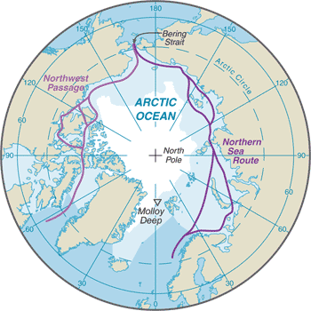

# Arctic Ocean

## Introduction

**_Background:_**   
The Arctic Ocean is the smallest of the world's five oceans (after the Pacific Ocean, Atlantic Ocean, Indian Ocean, and the recently delimited Southern Ocean). The Northwest Passage (US and Canada) and Northern Sea Route (Norway and Russia) are two important seasonal waterways. In recent years the polar ice pack has receded in the summer allowing for increased navigation and raising the possibility of future sovereignty and shipping disputes among countries bordering the Arctic Ocean.

## Geography

**_Location:_**   
body of water between Europe, Asia, and North America, mostly north of the Arctic Circle

**_Geographic coordinates:_**   
90 00 N, 0 00 E

**_Map references:_**   
Arctic

**_Area:_**   
**total:** 14.056 million sq km   
**note:** includes Baffin Bay, Barents Sea, Beaufort Sea, Chukchi Sea, East Siberian Sea, Greenland Sea, Hudson Bay, Hudson Strait, Kara Sea, Laptev Sea, Northwest Passage, and other tributary water bodies

**_Area - comparative:_**   
slightly less than 1.5 times the size of the US

**_Coastline:_**   
45,389 km

**_Climate:_**   
polar climate characterized by persistent cold and relatively narrow annual temperature ranges; winters characterized by continuous darkness, cold and stable weather conditions, and clear skies; summers characterized by continuous daylight, damp and foggy weather, and weak cyclones with rain or snow

**_Terrain:_**   
central surface covered by a perennial drifting polar icepack that, on average, is about 3 meters thick, although pressure ridges may be three times that thickness; clockwise drift pattern in the Beaufort Gyral Stream, but nearly straight-line movement from the New Siberian Islands (Russia) to Denmark Strait (between Greenland and Iceland); the icepack is surrounded by open seas during the summer, but more than doubles in size during the winter and extends to the encircling landmasses; the ocean floor is about 50% continental shelf (highest percentage of any ocean) with the remainder a central basin interrupted by three submarine ridges (Alpha Cordillera, Nansen Cordillera, and Lomonosov Ridge)

**_Elevation extremes:_**   
**lowest point:** Fram Basin -4,665 m   
**highest point:** sea level 0 m

**_Natural resources:_**   
sand and gravel aggregates, placer deposits, polymetallic nodules, oil and gas fields, fish, marine mammals (seals and whales)

**_Natural hazards:_**   
ice islands occasionally break away from northern Ellesmere Island; icebergs calved from glaciers in western Greenland and extreme northeastern Canada; permafrost in islands; virtually ice locked from October to June; ships subject to superstructure icing from October to May

**_Environment - current issues:_**   
endangered marine species include walruses and whales; fragile ecosystem slow to change and slow to recover from disruptions or damage; thinning polar icepack

**_Geography - note:_**   
major chokepoint is the southern Chukchi Sea (northern access to the Pacific Ocean via the Bering Strait); strategic location between North America and Russia; shortest marine link between the extremes of eastern and western Russia; floating research stations operated by the US and Russia; maximum snow cover in March or April about 20 to 50 centimeters over the frozen ocean; snow cover lasts about 10 months

## Economy

**_Economy - overview:_**   
Economic activity is limited to the exploitation of natural resources, including petroleum, natural gas, fish, and seals.

## Transportation

**_Ports and terminals:_**   
**major seaport(s):** Churchill (Canada), Murmansk (Russia), Prudhoe Bay (US)

**_Transportation - note:_**   
sparse network of air, ocean, river, and land routes; the Northwest Passage (North America) and Northern Sea Route (Eurasia) are important seasonal waterways

## Transnational Issues

**_Disputes - international:_**   
Canada and the United States dispute how to divide the Beaufort Sea and the status of the Northwest Passage but continue to work cooperatively to survey the Arctic continental shelf; Denmark (Greenland) and Norway have made submissions to the Commission on the Limits of the Continental shelf (CLCS) and Russia is collecting additional data to augment its 2001 CLCS submission; record summer melting of sea ice in the Arctic has renewed interest in maritime shipping lanes and sea floor exploration; Norway and Russia signed a comprehensive maritime boundary agreement in 2010

