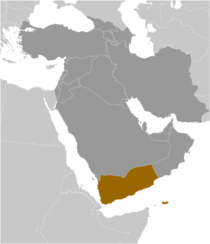
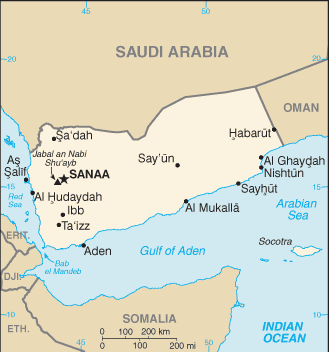

# Yemen

## Introduction

**_Background:_**   
North Yemen became independent of the Ottoman Empire in 1918. The British, who had set up a protectorate area around the southern port of Aden in the 19th century, withdrew in 1967 from what became South Yemen. Three years later, the southern government adopted a Marxist orientation. The massive exodus of hundreds of thousands of Yemenis from the south to the north contributed to two decades of hostility between the states. The two countries were formally unified as the Republic of Yemen in 1990. A southern secessionist movement and brief civil war in 1994 was quickly subdued. In 2000, Saudi Arabia and Yemen agreed to a delimitation of their border. Fighting in the northwest between the government and the Huthis, a Zaydi Shia minority, began in 2004 and has since resulted in six rounds of fighting - the last ended in early 2010 with a cease-fire that continues to hold. The southern secessionist movement was revitalized in 2008 when a popular socioeconomic protest movement initiated the prior year took on political goals including secession. Public rallies in Sana'a against then President SALIH - inspired by similar demonstrations in Tunisia and Egypt - slowly built momentum starting in late January 2011 fueled by complaints over high unemployment, poor economic conditions, and corruption. By the following month, some protests had resulted in violence, and the demonstrations had spread to other major cities. By March the opposition had hardened its demands and was unifying behind calls for SALIH's immediate ouster, and prominent military and tribal leaders began defecting from SALIH's camp. The Gulf Cooperation Council (GCC) in late April 2011, in an attempt to mediate the crisis in Yemen, proposed an agreement in which the president would step down in exchange for immunity from prosecution. SALIH's refusal to sign an agreement led to heavy street fighting and his injury in an explosion in June 2011. The UN Security Council passed Resolution 2014 in October 2011 calling on both sides to end the violence and complete a power transfer deal. In late November 2011, SALIH signed the GCC-brokered agreement to step down and to transfer some of his powers to Vice President Abd Rabuh Mansur HADI. Following elections in February 2012, won by HADI, SALIH formally transferred his powers. In accordance with the GCC initiative, Yemen launched a National Dialogue in March 2013 to discuss key constitutional, political, and social issues. HADI concluded the National Dialogue in January 2014. Subsequent steps in the transition process include constitutional drafting, a constitutional referendum, and national elections.

## Geography

**_Location:_**   
Middle East, bordering the Arabian Sea, Gulf of Aden, and Red Sea, between Oman and Saudi Arabia

**_Geographic coordinates:_**   
15 00 N, 48 00 E

**_Map references:_**   
Middle East

**_Area:_**   
**total:** 527,968 sq km   
**land:** 527,968 sq km   
**water:** 0 sq km   
**note:** includes Perim, Socotra, the former Yemen Arab Republic (YAR or North Yemen), and the former People's Democratic Republic of Yemen (PDRY or South Yemen)

**_Area - comparative:_**   
almost four times the size of Alabama; slightly larger than twice the size of Wyoming

**_Land boundaries:_**   
**total:** 1,746 km   
**border countries:** Oman 288 km, Saudi Arabia 1,458 km

**_Coastline:_**   
1,906 km

**_Maritime claims:_**   
**territorial sea:** 12 nm   
**contiguous zone:** 24 nm   
**exclusive economic zone:** 200 nm   
**continental shelf:** 200 nm or to the edge of the continental margin

**_Climate:_**   
mostly desert; hot and humid along west coast; temperate in western mountains affected by seasonal monsoon; extraordinarily hot, dry, harsh desert in east

**_Terrain:_**   
narrow coastal plain backed by flat-topped hills and rugged mountains; dissected upland desert plains in center slope into the desert interior of the Arabian Peninsula

**_Elevation extremes:_**   
**lowest point:** Arabian Sea 0 m   
**highest point:** Jabal an Nabi Shu'ayb 3,760 m

**_Natural resources:_**   
petroleum, fish, rock salt, marble; small deposits of coal, gold, lead, nickel, and copper; fertile soil in west

**_Land use:_**   
**arable land:** 2.2%   
**permanent crops:** 0.55%   
**other:** 97.25% (2011)

**_Irrigated land:_**   
6,801 sq km (2004)

**_Total renewable water resources:_**   
2.1 cu km (2011)

**_Freshwater withdrawal (domestic/industrial/agricultural):_**   
**total:** 3.57 cu km/yr (7%/2%/91%)   
**per capita:** 162.4 cu m/yr (2005)

**_Natural hazards:_**   
sandstorms and dust storms in summer   
**volcanism:** limited volcanic activity; Jebel at Tair (Jabal al-Tair, Jebel Teir, Jabal al-Tayr, Jazirat at-Tair) (elev. 244 m), which forms an island in the Red Sea, erupted in 2007 after awakening from dormancy; other historically active volcanoes include Harra of Arhab, Harras of Dhamar, Harra es-Sawad, and Jebel Zubair, although many of these have not erupted in over a century

**_Environment - current issues:_**   
limited natural freshwater resources; inadequate supplies of potable water; overgrazing; soil erosion; desertification

**_Environment - international agreements:_**   
**party to:** Biodiversity, Climate Change, Climate Change-Kyoto Protocol, Desertification, Endangered Species, Environmental Modification, Hazardous Wastes, Law of the Sea, Ozone Layer Protection   
**signed, but not ratified:** none of the selected agreements

**_Geography - note:_**   
strategic location on Bab el Mandeb, the strait linking the Red Sea and the Gulf of Aden, one of world's most active shipping lanes

## People and Society

**_Nationality:_**   
**noun:** Yemeni(s)   
**adjective:** Yemeni

**_Ethnic groups:_**   
predominantly Arab; but also Afro-Arab, South Asians, Europeans

**_Languages:_**   
Arabic (official)

**_Religions:_**   
Muslim 99.1% (official; virtually all are citizens, an estimated 65% are Sunni and 35% are Shia), other 0.9% (includes Jewish, Baha'i, Hindu, and Christian; many are refugees or temporary foreign residents) (2010 est.)

**_Population:_**   
26,052,966 (July 2014 est.)

**_Age structure:_**   
**0-14 years:** 41.7% (male 5,523,744/female 5,336,795)   
**15-24 years:** 21.1% (male 2,789,510/female 2,709,263)   
**25-54 years:** 30.9% (male 4,106,917/female 3,933,852)   
**55-64 years:** 3.7% (male 450,185/female 515,255)   
**65 years and over:** 2.6% (male 320,426/female 367,019) (2014 est.)

**_Dependency ratios:_**   
**total dependency ratio:** 74.1 %   
**youth dependency ratio:** 69 %   
**elderly dependency ratio:** 5.1 %   
**potential support ratio:** 19.7 (2014 est.)

**_Median age:_**   
**total:** 18.6 years   
**male:** 18.5 years   
**female:** 18.7 years (2014 est.)

**_Population growth rate:_**   
2.72% (2014 est.)

**_Birth rate:_**   
31.02 births/1,000 population (2014 est.)

**_Death rate:_**   
6.45 deaths/1,000 population (2014 est.)

**_Net migration rate:_**   
2.61 migrant(s)/1,000 population (2014 est.)

**_Urbanization:_**   
**urban population:** 32.3% of total population (2011)   
**rate of urbanization:** 4.78% annual rate of change (2010-15 est.)

**_Major urban areas - population:_**   
SANAA (capital) 2.419 million; Aden 784,000 (2011)

**_Sex ratio:_**   
**at birth:** 1.05 male(s)/female   
**0-14 years:** 1.04 male(s)/female   
**15-24 years:** 1.03 male(s)/female   
**25-54 years:** 1.04 male(s)/female   
**55-64 years:** 1.03 male(s)/female   
**65 years and over:** 0.9 male(s)/female   
**total population:** 1.03 male(s)/female (2014 est.)

**_Maternal mortality rate:_**   
200 deaths/100,000 live births (2010)

**_Infant mortality rate:_**   
**total:** 50.41 deaths/1,000 live births   
**male:** 54.71 deaths/1,000 live births   
**female:** 45.88 deaths/1,000 live births (2014 est.)

**_Life expectancy at birth:_**   
**total population:** 64.83 years   
**male:** 62.72 years   
**female:** 67.04 years (2014 est.)

**_Total fertility rate:_**   
4.09 children born/woman (2014 est.)

**_Contraceptive prevalence rate:_**   
27.7% (2006)

**_Health expenditures:_**   
5.5% of GDP (2011)

**_Physicians density:_**   
0.2 physicians/1,000 population (2010)

**_Hospital bed density:_**   
0.7 beds/1,000 population (2010)

**_Drinking water source:_**   
**improved:** urban: 72% of population; rural: 46.5% of population; total: 54.9% of population   
**unimproved:** urban: 28% of population; rural: 53.5% of population; total: 45.1% of population (2012 est.)

**_Sanitation facility access:_**   
**improved:** urban: 92.5% of population; rural: 34.1% of population; total: 53.3% of population   
**unimproved:** urban: 7.5% of population; rural: 65.9% of population; total: 46.7% of population (2012 est.)

**_HIV/AIDS - adult prevalence rate:_**   
0.1% (2012 est.)

**_HIV/AIDS - people living with HIV/AIDS:_**   
18,800 (2012 est.)

**_HIV/AIDS - deaths:_**   
800 (2012 est.)

**_Major infectious diseases:_**   
**degree of risk:** high   
**food or waterborne diseases:** bacterial diarrhea, hepatitis A, and typhoid fever   
**vectorborne diseases:** dengue fever and malaria   
**water contact disease:** schistosomiasis (2013)

**_Obesity - adult prevalence rate:_**   
14.5% (2008)

**_Children under the age of 5 years underweight:_**   
43.1% (2003)

**_Education expenditures:_**   
5.2% of GDP (2008)

**_Literacy:_**   
**definition:** age 15 and over can read and write   
**total population:** 65.3%   
**male:** 82.1%   
**female:** 48.5% (2011 est.)

**_School life expectancy (primary to tertiary education):_**   
**total:** 9 years   
**male:** 11 years   
**female:** 8 years (2011)

**_Child labor - children ages 5-14:_**   
**total number:** 1,334,288   
**percentage:** 23 % (2006 est.)

**_Unemployment, youth ages 15-24:_**   
**total:** 33.7%   
**male:** 26%   
**female:** 74% (2010)

## Government

**_Country name:_**   
**conventional long form:** Republic of Yemen   
**conventional short form:** Yemen   
**local long form:** Al Jumhuriyah al Yamaniyah   
**local short form:** Al Yaman   
**former:** Yemen Arab Republic [Yemen (Sanaa) or North Yemen] and People's Democratic Republic of Yemen [Yemen (Aden) or South Yemen]

**_Government type:_**   
republic

**_Capital:_**   
**name:** Sanaa   
**geographic coordinates:** 15 21 N, 44 12 E   
**time difference:** UTC+3 (8 hours ahead of Washington, DC, during Standard Time)

**_Administrative divisions:_**   
20 governorates (muhafazat, singular - muhafazah) and 1 municipality\*; Abyan, 'Adan (Aden), Ad Dali', Al Bayda', Al Hudaydah, Al Jawf, Al Mahrah, Al Mahwit, Amanat al 'Asimah (Sanaa City)\*, 'Amran, Dhamar, Hadramawt, Hajjah, Ibb, Lahij, Ma'rib, Raymah, Sa'dah, San'a' (Sanaa), Shabwah, Ta'izz

**_Independence:_**   
22 May 1990 (Republic of Yemen was established with the merger of the Yemen Arab Republic [Yemen (Sanaa) or North Yemen] and the Marxist-dominated People's Democratic Republic of Yemen [Yemen (Aden) or South Yemen]); note - previously North Yemen became independent in November 1918 (from the Ottoman Empire) and became a republic with the overthrow of the theocratic Imamate in 1962; South Yemen became independent on 30 November 1967 (from the UK)

**_National holiday:_**   
Unification Day, 22 May (1990)

**_Constitution:_**   
adopted by referendum 16 May 1991 (following unification); amended several times, last in 2009; note - in early 2013, the Yemeni Government launched a National Dialogue to seek reforms and recommendations for a new constitution (2013)

**_Legal system:_**   
mixed legal system of Islamic law, Napoleonic law, English common law, and customary law

**_International law organization participation:_**   
has not submitted an ICJ jurisdiction declaration; non-party state to the ICCt

**_Suffrage:_**   
18 years of age; universal

**_Executive branch:_**   
**chief of state:** President Abd Rabuh Mansur HADI (Field Marshal) (since 25 February 2012)   
**head of government:** Prime Minister Muhammad Salim BA SINDWAH (since 27 November 2011); Deputy Prime Ministers Abdallah Muhsin al-AKWA and Ahmad Ubayd BIN DAGHIR   
**cabinet:** on 27 November 2011, Vice President HADI requested Interim Prime Minister Muhammad Salim BA SINDWAH to form a new government following the resignation of President SALIH on 24 November 2011   
**elections:** president elected by popular vote for a seven-year term based on constitution; however a special election was held on 21 February 2012 to remove Ali Abdallah SALIH based on a GCC-mediated deal during the political crisis of 2011 (next election expected in 2014); vice president appointed by the president but position is vacant; prime minister appointed by the president   
**election results:** Abd Rabuh Mansur HADI elected as a consensus president with about 50% popular participation; no other candidates

**_Legislative branch:_**   
bicameral legislature consisting of a Shura Council (111 seats; members appointed by the president) and House of Representatives (301 seats; members elected by popular vote in single-member constituencies to serve six-year terms)   
**elections:** last held on 27 April 2003 (scheduled April 2009 election postponed)   
**election results:** House of Representatives percent of vote by party - NA; seats by party - GPC 238, Islah 47, YSP 6, Nasserite Unionist Party 3, National Arab Socialist Ba'th Party 2, independents 5

**_Judicial branch:_**   
**highest court(s):** Supreme Court (consists of the president of the Court, 2 deputies, and nearly 50 judges; court organized into constitutional, civil, commercial, family, administrative, criminal, military, and appeals scrutiny divisions)   
**judge selection and term of office:** judges appointed by the Supreme Judicial Council, chaired by the president of the republic and consisting of 10 high-ranking judicial officers; judges appointed for life with mandatory retirement at age 65   
**subordinate courts:** appeal courts; district or first instance courts; commercial courts

**_Political parties and leaders:_**   
General People's Congress or GPC [Ali Abdallah SALIH, Abd Rabuh Mansur HADI]   
Islamic Reform Grouping or Islah [Muhammed Abdallah al-YADUMI, Abdul Wahab al-ANSI]   
Nasserite Unionist Party [Sultan al-ATWANI]   
Yemeni Socialist Party or YSP [Yasin Said NU'MAN]   
**note:** there are at least seven more active political parties

**_Political pressure groups and leaders:_**   
Muslim Brotherhood   
Women National Committee   
**other:** conservative tribal groups; Huthis, southern secessionist groups; al-Qa'ida in the Arabian Peninsula (AQAP)

**_International organization participation:_**   
AFESD, AMF, CAEU, CD, EITI (compliant country), FAO, G-77, IAEA, IBRD, ICAO, ICRM, IDA, IDB, IFAD, IFC, IFRCS, ILO, IMF, IMO, IMSO, Interpol, IOC, IOM, IPU, ISO, ITSO, ITU, ITUC (NGOs), LAS, MIGA, MINURSO, MINUSMA, MONUSCO, NAM, OAS (observer), OIC, OPCW, UN, UNAMID, UNCTAD, UNESCO, UNHCR, UNIDO, UNISFA, UNMIL, UNMIS, UNOCI, UNWTO, UPU, WCO, WFTU (NGOs), WHO, WIPO, WMO, WTO (observer)

**_Diplomatic representation in the US:_**   
**chief of mission:** Ambassador (vacant); Charge d'Affaires Adel Ali Ahmed AL-SUNAINI   
**chancery:** 2319 Wyoming Avenue NW, Washington, DC 20008   
**telephone:** [1] (202) 965-4760   
**FAX:** [1] (202) 337-2017

**_Diplomatic representation from the US:_**   
**chief of mission:** Ambassador (vacant); Charge d'Affaires Karen H. SASAHARA (since July 2013)   
**embassy:** Sa'awan Street, Sanaa   
**mailing address:** P. O. Box 22347, Sanaa   
**telephone:** [967] (1) 755-2000 ext. 2153 or 2266   
**FAX:** [967] (1) 303-182

**_Flag description:_**   
three equal horizontal bands of red (top), white, and black; the band colors derive from the Arab Liberation flag and represent oppression (black), overcome through bloody struggle (red), to be replaced by a bright future (white)   
**note:** similar to the flag of Syria, which has two green stars in the white band, and of Iraq, which has an Arabic inscription centered in the white band; also similar to the flag of Egypt, which has a heraldic eagle centered in the white band

**_National symbol(s):_**   
golden eagle

**_National anthem:_**   
**name:** "al-qumhuriyatu l-muttahida" (United Republic)   
**lyrics/music:** Abdullah Abdulwahab NOA'MAN/Ayyoab Tarish ABSI   
**note:** adopted 1990; the music first served as the anthem for South Yemen before unification with North Yemen in 1990

## Economy

**_Economy - overview:_**   
Yemen is a low income country that is highly dependent on declining oil resources for revenue. Petroleum accounts for roughly 25% of GDP and 63% of government revenue. Yemen has tried to counter the effects of its declining oil resources and continuing attacks on its oil pipelines by diversifying its economy through an economic reform program initiated in 2006 that is designed to bolster non-oil sectors of the economy and foreign investment. In October 2009, Yemen exported its first liquefied natural gas as part of this diversification effort. In January 2010, the international community established the Friends of Yemen group that aims to support Yemen's efforts toward economic and political reform. In 2012, the Friends of Yemen pledged nearly $7 billion in assistance to Yemen. The Yemeni Government also endorsed a Mutual Accountability Framework to facilitate the efficient implementation of donor aid. The unrest that began in early 2011 caused GDP to plunge almost 11% in 2011. Availability of basic services, including electricity, water, and fuel, has improved since the transition, but progress toward achieving more sustainable economic stability has been slow and uneven. Yemen continues to face difficult long-term challenges, including declining water resources, high unemployment, severe food scarcity, and a high population growth rate.

**_GDP (purchasing power parity):_**   
$61.63 billion (2013 est.)   
$58.45 billion (2012 est.)   
$57.36 billion (2011 est.)   
**note:** data are in 2013 US dollars

**_GDP (official exchange rate):_**   
$43.89 billion (2013 est.)

**_GDP - real growth rate:_**   
3.8% (2013 est.)   
0.1% (2012 est.)   
-10.5% (2011 est.)

**_GDP - per capita (PPP):_**   
$2,500 (2013 est.)   
$2,500 (2012 est.)   
$2,500 (2011 est.)   
**note:** data are in 2013 US dollars

**_Gross national saving:_**   
4.2% of GDP (2013 est.)   
9.6% of GDP (2012 est.)   
6.3% of GDP (2011 est.)

**_GDP - composition, by end use:_**   
**household consumption:** 80.3%   
**government consumption:** 12.5%   
**investment in fixed capital:** 18.4%   
**investment in inventories:** -4%   
**exports of goods and services:** 17.8%   
**imports of goods and services:** -24.9%; (2013 est.)

**_GDP - composition, by sector of origin:_**   
**agriculture:** 7.7%   
**industry:** 30.9%   
**services:** 61.4% (2013 est.)

**_Agriculture - products:_**   
grain, fruits, vegetables, pulses, qat, coffee, cotton; dairy products, livestock (sheep, goats, cattle, camels), poultry; fish

**_Industries:_**   
crude oil production and petroleum refining; small-scale production of cotton textiles, leather goods; food processing; handicrafts; aluminum products; cement; commercial ship repair; natural gas production

**_Industrial production growth rate:_**   
4.8% (2013 est.)

**_Labor force:_**   
7.1 million (2013 est.)

**_Labor force - by occupation:_**   
**note:** most people are employed in agriculture and herding; services, construction, industry, and commerce account for less than one-fourth of the labor force

**_Unemployment rate:_**   
35% (2003 est.)

**_Population below poverty line:_**   
45.2% (2003)

**_Household income or consumption by percentage share:_**   
**lowest 10%:** 2.9%   
**highest 10%:** 30.8% (2005)

**_Distribution of family income - Gini index:_**   
37.7 (2005)   
33.4 (1998)

**_Budget:_**   
**revenues:** $7.769 billion   
**expenditures:** $12.31 billion (2013 est.)

**_Taxes and other revenues:_**   
17.7% of GDP (2013 est.)

**_Budget surplus (+) or deficit (-):_**   
-10.3% of GDP (2013 est.)

**_Public debt:_**   
47.1% of GDP (2013 est.)   
45.4% of GDP (2012 est.)

**_Fiscal year:_**   
calendar year

**_Inflation rate (consumer prices):_**   
11.8% (2013 est.)   
9.9% (2012 est.)

**_Central bank discount rate:_**   
NA%

**_Commercial bank prime lending rate:_**   
22% (31 December 2013 est.)   
23% (31 December 2012 est.)

**_Stock of narrow money:_**   
$5.753 billion (31 December 2013 est.)   
$5.142 billion (31 December 2012 est.)

**_Stock of broad money:_**   
$14.2 billion (31 December 2013 est.)   
$12.35 billion (31 December 2012 est.)

**_Stock of domestic credit:_**   
$11.2 billion (31 December 2013 est.)   
$9.576 billion (31 December 2012 est.)

**_Market value of publicly traded shares:_**   
$NA

**_Current account balance:_**   
-$3.312 billion (2013 est.)   
-$985 million (2012 est.)

**_Exports:_**   
$6.694 billion (2013 est.)   
$7.57 billion (2012 est.)

**_Exports - commodities:_**   
crude oil, coffee, dried and salted fish, liquefied natural gas

**_Exports - partners:_**   
China 41%, Thailand 19.2%, India 11.4%, South Korea 4.4% (2013 est.)

**_Imports:_**   
$10.97 billion (2013 est.)   
$12.49 billion (2012 est.)

**_Imports - commodities:_**   
food and live animals, machinery and equipment, chemicals

**_Imports - partners:_**   
EU 48.8%, UAE 9.8%, Switzerland 8.8%, China 7.4%, India 5.8% (2013 est.)

**_Reserves of foreign exchange and gold:_**   
$5.538 billion (31 December 2013 est.)   
$6.158 billion (31 December 2012 est.)

**_Debt - external:_**   
$7.806 billion (31 December 2013 est.)   
$7.419 billion (31 December 2012 est.)

**_Stock of direct foreign investment - at home:_**   
$NA

**_Exchange rates:_**   
Yemeni rials (YER) per US dollar -   
214.9 (2013 est.)   
214.35 (2012 est.)   
219.59 (2010 est.)   
202.85 (2009)   
199.76 (2008)

## Energy

**_Electricity - production:_**   
7.292 billion kWh (2010 est.)

**_Electricity - consumption:_**   
5.515 billion kWh (2010 est.)

**_Electricity - exports:_**   
0 kWh (2012 est.)

**_Electricity - imports:_**   
0 kWh (2012 est.)

**_Electricity - installed generating capacity:_**   
1.53 million kW (2011 est.)

**_Electricity - from fossil fuels:_**   
100% of total installed capacity (2010 est.)

**_Electricity - from nuclear fuels:_**   
0% of total installed capacity (2010 est.)

**_Electricity - from hydroelectric plants:_**   
0% of total installed capacity (2010 est.)

**_Electricity - from other renewable sources:_**   
0% of total installed capacity (2010 est.)

**_Crude oil - production:_**   
156,500 bbl/day (2012 est.)

**_Crude oil - exports:_**   
175,200 bbl/day (2010 est.)

**_Crude oil - imports:_**   
0 bbl/day (2010 est.)

**_Crude oil - proved reserves:_**   
3 billion bbl (1 January 2013 est.)

**_Refined petroleum products - production:_**   
86,330 bbl/day (2010 est.)

**_Refined petroleum products - consumption:_**   
177,000 bbl/day (2011 est.)

**_Refined petroleum products - exports:_**   
14,330 bbl/day (2010 est.)

**_Refined petroleum products - imports:_**   
59,050 bbl/day (2010 est.)

**_Natural gas - production:_**   
9.62 billion cu m (2011 est.)

**_Natural gas - consumption:_**   
869.9 million cu m (2011 est.)

**_Natural gas - exports:_**   
8.75 billion cu m (2011 est.)

**_Natural gas - imports:_**   
0 cu m (2011 est.)

**_Natural gas - proved reserves:_**   
478.5 billion cu m (1 January 2013 est.)

**_Carbon dioxide emissions from consumption of energy:_**   
23.75 million Mt (2011 est.)

## Communications

**_Telephones - main lines in use:_**   
1.1 million (2012)

**_Telephones - mobile cellular:_**   
13.9 million (2012)

**_Telephone system:_**   
**general assessment:** since unification in 1990, efforts have been made to create a national telecommunications network   
**domestic:** the national network consists of microwave radio relay, cable, tropospheric scatter, GSM and CDMA mobile-cellular telephone systems; fixed-line and mobile-cellular teledensity remains low by regional standards   
**international:** country code - 967; landing point for the international submarine cable Fiber-Optic Link Around the Globe (FLAG); satellite earth stations - 3 Intelsat (2 Indian Ocean and 1 Atlantic Ocean), 1 Intersputnik (Atlantic Ocean region), and 2 Arabsat; microwave radio relay to Saudi Arabia and Djibouti (2006)

**_Broadcast media:_**   
state-run TV with 2 stations; state-run radio with 2 national radio stations and 5 local stations; stations from Oman and Saudi Arabia can be accessed (2007)

**_Internet country code:_**   
.ye

**_Internet hosts:_**   
33,206 (2012)

**_Internet users:_**   
2.349 million (2009)

## Transportation

**_Airports:_**   
57 (2013)

**_Airports - with paved runways:_**   
**total:** 17   
**over 3,047 m:** 4   
**2,438 to 3,047 m:** 9   
**1,524 to 2,437 m:** 3   
**914 to 1,523 m:** 1 (2013)

**_Airports - with unpaved runways:_**   
**total:** 40   
**over 3,047 m:** 3   
**2,438 to 3,047 m:** 5   
**1,524 to 2,437 m:** 7   
**914 to 1,523 m:** 16   
**under 914 m:** 9 (2013)

**_Pipelines:_**   
gas 641 km; liquid petroleum gas 22 km; oil 1,370 km (2013)

**_Roadways:_**   
**total:** 71,300 km   
**paved:** 6,200 km   
**unpaved:** 65,100 km (2005)

**_Merchant marine:_**   
**total:** 5   
**by type:** chemical tanker 2, petroleum tanker 2, roll on/roll off 1   
**registered in other countries:** 14 (Moldova 4, Panama 4, Sierra Leone 2, Togo 1, unknown 3) (2010)

**_Ports and terminals:_**   
**major seaport(s):** Aden, Al Hudaydah, Al Mukalla

**_Transportation - note:_**   
the International Maritime Bureau reports offshore waters in the Gulf of Aden are high risk for piracy; numerous vessels, including commercial shipping and pleasure craft, have been attacked and hijacked both at anchor and while underway; crew, passengers, and cargo are held for ransom; the presence of several naval task forces in the Gulf of Aden and additional anti-piracy measures on the part of ship operators reduced the incidence of piracy in that body of water by more than half in 2010

## Military

**_Military branches:_**   
Land Forces; Naval and Coastal Defense Forces (includes Marines); Air and Air Defense Force (al-Quwwat al-Jawwiya al-Yemeniya); Border Guards; Strategic Reserve Forces (2013)

**_Military service age and obligation:_**   
18 is the legal minimum age for voluntary military service; no conscription; 2-year service obligation (2012)

**_Manpower available for military service:_**   
**males age 16-49:** 5,652,256   
**females age 16-49:** 5,387,160 (2010 est.)

**_Manpower fit for military service:_**   
**males age 16-49:** 4,056,944   
**females age 16-49:** 4,116,895 (2010 est.)

**_Manpower reaching militarily significant age annually:_**   
**male:** 287,141   
**female:** 277,612 (2010 est.)

**_Military expenditures:_**   
4.02% of GDP (2012)   
3.48% of GDP (2011)   
4.02% of GDP (2010)

**_Military - note:_**   
a Coast Guard was established in 2002

## Transnational Issues

**_Disputes - international:_**   
Saudi Arabia has reinforced its concrete-filled security barrier along sections of the fully demarcated border with Yemen to stem illegal cross-border activities

**_Refugees and internally displaced persons:_**   
**refugees (country of origin):** 5,740 (Ethiopia) (2013); 233,723 (Somalia) (2014)   
**IDPs:** 309,823 (conflict in Sa'ada governorate; clashes between AQAP and government forces) (2014)

**_Trafficking in persons:_**   
**current situation:** Yemen is a source and, to a much lesser extent, transit and destination country for men, women, and children subjected to forced labor and sex trafficking; some Yemeni children, mostly boys, migrate to Yemeni cities or across the border to Saudi Arabia and, less frequently Oman, where they end up as forced laborers in domestic service or small shops, beggars, or prostitutes; some of the large number of child workers in Yemen also face conditions of forced labor; other Yemeni children are conscripted into the government's armed forces or tribal or rebel militias; to a lesser degree, Yemen is a country of origin for girls trafficked within country or to Saudi Arabia to work as prostitutes in hotels and clubs; additionally, Yemen is a destination and transit country for women and children from the Horn of Africa who are looking for work or have received false job offers in the Gulf states but are subjected to sexual exploitation or forced labor upon arrival; reports indicate that adults and children are still sold or inherited as slaves in Yemen

............................................................   
_Page last updated on June 23, 2014_
