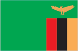
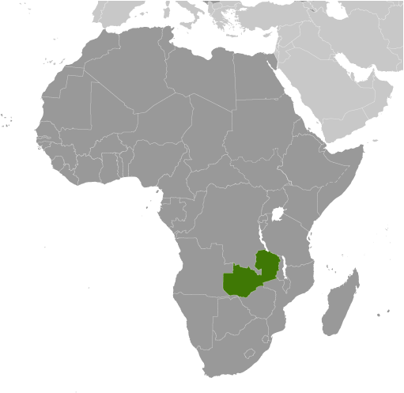
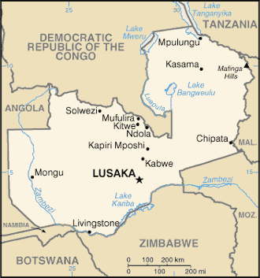

# Zambia

## Introduction

**_Background:_**   
The territory of Northern Rhodesia was administered by the [British] South Africa Company from 1891 until it was taken over by the UK in 1923. During the 1920s and 1930s, advances in mining spurred development and immigration. The name was changed to Zambia upon independence in 1964. In the 1980s and 1990s, declining copper prices, economic mismanagement and a prolonged drought hurt the economy. Elections in 1991 brought an end to one-party rule, but the subsequent vote in 1996 saw blatant harassment of opposition parties. The election in 2001 was marked by administrative problems with three parties filing a legal petition challenging the election of ruling party candidate Levy MWANAWASA. MWANAWASA was reelected in 2006 in an election that was deemed free and fair. Upon his abrupt death in August 2008, he was succeeded by his vice president, Rupiah BANDA, who subsequently won a special presidential by-election in October 2008. Michael SATA was elected president in September 2011.

## Geography

**_Location:_**   
Southern Africa, east of Angola, south of the Democratic Republic of the Congo

**_Geographic coordinates:_**   
15 00 S, 30 00 E

**_Map references:_**   
Africa

**_Area:_**   
**total:** 752,618 sq km   
**land:** 743,398 sq km   
**water:** 9,220 sq km

**_Area - comparative:_**   
slightly larger than Texas

**_Land boundaries:_**   
**total:** 5,664.1 km   
**border countries:** Angola 1,110 km, Botswana 0.1 km, Democratic Republic of the Congo 1,930 km, Malawi 837 km, Mozambique 419 km, Namibia 233 km, Tanzania 338 km, Zimbabwe 797 km

**_Coastline:_**   
0 km (landlocked)

**_Maritime claims:_**   
none (landlocked)

**_Climate:_**   
tropical; modified by altitude; rainy season (October to April)

**_Terrain:_**   
mostly high plateau with some hills and mountains

**_Elevation extremes:_**   
**lowest point:** Zambezi river 329 m   
**highest point:** unnamed elevation in Mafinga Hills 2,301 m

**_Natural resources:_**   
copper, cobalt, zinc, lead, coal, emeralds, gold, silver, uranium, hydropower

**_Land use:_**   
**arable land:** 4.52%   
**permanent crops:** 0.05%   
**other:** 95.44% (2011)

**_Irrigated land:_**   
1,559 sq km (2003)

**_Total renewable water resources:_**   
105.2 cu km (2011)

**_Freshwater withdrawal (domestic/industrial/agricultural):_**   
**total:** 1.57 cu km/yr (18%/8%/73%)   
**per capita:** 147 cu m/yr (2002)

**_Natural hazards:_**   
periodic drought; tropical storms (November to April)

**_Environment - current issues:_**   
air pollution and resulting acid rain in the mineral extraction and refining region; chemical runoff into watersheds; poaching seriously threatens rhinoceros, elephant, antelope, and large cat populations; deforestation; soil erosion; desertification; lack of adequate water treatment presents human health risks

**_Environment - international agreements:_**   
**party to:** Biodiversity, Climate Change, Climate Change-Kyoto Protocol, Desertification, Endangered Species, Hazardous Wastes, Law of the Sea, Ozone Layer Protection, Wetlands   
**signed, but not ratified:** none of the selected agreements

**_Geography - note:_**   
landlocked; the Zambezi forms a natural riverine boundary with Zimbabwe; Lake Kariba on the Zambia-Zimbabwe border forms the world's largest reservoir by volume (180 cu km; 43 cu mi)

## People and Society

**_Nationality:_**   
**noun:** Zambian(s)   
**adjective:** Zambian

**_Ethnic groups:_**   
Bemba 21%, Tonga 13.6%, Chewa 7.4%, Lozi 5.7%, Nsenga 5.3%, Tumbuka 4.4%, Ngoni 4%, Lala 3.1%, Kaonde 2.9%, Namwanga 2.8%, Lunda (north Western) 2.6%, Mambwe 2.5%, Luvale 2.2%, Lamba 2.1%, Ushi 1.9%, Lenje 1.6%, Bisa 1.6%, Mbunda 1.2%, other 13.8%, unspecified 0.4% (2010 est.)

**_Languages:_**   
Bembe 33.4%, Nyanja 14.7%, Tonga 11.4%, Chewa 4.5%, Lozi 5.5%, Nsenga 2.9%, Tumbuka 2.5%, Lunda (North Western) 1.9%, Kaonde 1.8%, Lala 1.8%, Lamba 1.8%, English (official) 1.7%, Luvale 1.5%, Mambwe 1.3%, Namwanga 1.2%, Lenje 1.1%, Bisa 1%, other 9.4%, unspecified 0.4%   
**note:** Zambia is said to have over 70 languages, although man of these may be considered dialects; all of Zambia's major languages are members of the Bantu family (2010 est.)

**_Religions:_**   
Protestant 75.3%, Roman Catholic 20.2%, other 2.7% (includes Muslim Buddhist, Hindu, and Baha'i), none 1.8% (2010 est.)

**_Population:_**   
14,638,505   
**note:** estimates for this country explicitly take into account the effects of excess mortality due to AIDS; this can result in lower life expectancy, higher infant mortality, higher death rates, lower population growth rates, and changes in the distribution of population by age and sex than would otherwise be expected (July 2014 est.)

**_Age structure:_**   
**0-14 years:** 46.2% (male 3,393,388/female 3,362,850)   
**15-24 years:** 20% (male 1,465,009/female 1,467,555)   
**25-54 years:** 28.5% (male 2,105,768/female 2,072,314)   
**55-64 years:** 2.9% (male 199,098/female 222,214)   
**65 years and over:** 2.4% (male 151,471/female 198,838) (2014 est.)

**_Dependency ratios:_**   
**total dependency ratio:** 96.4 %   
**youth dependency ratio:** 91.3 %   
**elderly dependency ratio:** 5.1 %   
**potential support ratio:** 19.6 (2014 est.)

**_Median age:_**   
**total:** 16.7 years   
**male:** 16.6 years   
**female:** 16.8 years (2014 est.)

**_Population growth rate:_**   
2.88% (2014 est.)

**_Birth rate:_**   
42.46 births/1,000 population (2014 est.)

**_Death rate:_**   
12.92 deaths/1,000 population (2014 est.)

**_Net migration rate:_**   
-0.72 migrant(s)/1,000 population (2014 est.)

**_Urbanization:_**   
**urban population:** 39.2% of total population (2011)   
**rate of urbanization:** 4.15% annual rate of change (2010-15 est.)

**_Major urban areas - population:_**   
LUSAKA (capital) 1.802 million (2011)

**_Sex ratio:_**   
**at birth:** 1.03 male(s)/female   
**0-14 years:** 1.01 male(s)/female   
**15-24 years:** 1 male(s)/female   
**25-54 years:** 1.02 male(s)/female   
**55-64 years:** 1 male(s)/female   
**65 years and over:** 0.75 male(s)/female   
**total population:** 1 male(s)/female (2014 est.)

**_Mother's mean age at first birth:_**   
19.2   
**note:** median age at first birth among women 25-29 (2007 est.)

**_Maternal mortality rate:_**   
440 deaths/100,000 live births (2010)

**_Infant mortality rate:_**   
**total:** 66.62 deaths/1,000 live births   
**male:** 72.15 deaths/1,000 live births   
**female:** 60.94 deaths/1,000 live births (2014 est.)

**_Life expectancy at birth:_**   
**total population:** 51.83 years   
**male:** 50.24 years   
**female:** 53.48 years (2014 est.)

**_Total fertility rate:_**   
5.76 children born/woman (2014 est.)

**_Contraceptive prevalence rate:_**   
40.8% (2007)

**_Health expenditures:_**   
6.1% of GDP (2011)

**_Physicians density:_**   
0.07 physicians/1,000 population (2010)

**_Hospital bed density:_**   
2 beds/1,000 population (2010)

**_Drinking water source:_**   
**improved:** urban: 84.8% of population; rural: 49.2% of population; total: 63.3% of population   
**unimproved:** urban: 15.2% of population; rural: 50.8% of population; total: 36.7% of population (2012 est.)

**_Sanitation facility access:_**   
**improved:** urban: 56.4% of population; rural: 33.9% of population; total: 42.8% of population   
**unimproved:** urban: 43.6% of population; rural: 66.1% of population; total: 57.2% of population (2012 est.)

**_HIV/AIDS - adult prevalence rate:_**   
12.7% (2012 est.)

**_HIV/AIDS - people living with HIV/AIDS:_**   
1,106,400 (2012 est.)

**_HIV/AIDS - deaths:_**   
30,300 (2012 est.)

**_Major infectious diseases:_**   
**degree of risk:** very high   
**food or waterborne diseases:** bacterial and protozoal diarrhea, hepatitis A, and typhoid fever   
**vectorborne diseases:** malaria and dengue fever   
**water contact disease:** schistosomiasis   
**animal contact disease:** rabies (2013)

**_Obesity - adult prevalence rate:_**   
3.6% (2008)

**_Children under the age of 5 years underweight:_**   
14.9% (2007)

**_Education expenditures:_**   
1.3% of GDP (2008)

**_Literacy:_**   
**definition:** age 15 and over can read and write English   
**total population:** 61.4%   
**male:** 71.9%   
**female:** 51.8% (2007 est.)

**_School life expectancy (primary to tertiary education):_**   
**total:** 14 years   
**male:** 14 years   
**female:** 13 years (2012)

**_Child labor - children ages 5-14:_**   
**total number:** 1,000,850   
**percentage:** 41 %   
**note:** data represents children ages 7-14 (2005 est.)

**_Unemployment, youth ages 15-24:_**   
**total:** 23.4% (2005)

## Government

**_Country name:_**   
**conventional long form:** Republic of Zambia   
**conventional short form:** Zambia   
**former:** Northern Rhodesia

**_Government type:_**   
republic

**_Capital:_**   
**name:** Lusaka   
**geographic coordinates:** 15 25 S, 28 17 E   
**time difference:** UTC+2 (7 hours ahead of Washington, DC, during Standard Time)

**_Administrative divisions:_**   
10 provinces; Central, Copperbelt, Eastern, Luapula, Lusaka, Muchinga, Northern, North-Western, Southern, Western

**_Independence:_**   
24 October 1964 (from the UK)

**_National holiday:_**   
Independence Day, 24 October (1964)

**_Constitution:_**   
several previous; latest adopted 24 August 1991, promulgated 30 August 1991; amended 1996; note - in late 2013, a constitution committee submitted a draft constitution to the government, but the government has not yet publicly released the final copy or presented a plan to adopt the document (2013)

**_Legal system:_**   
mixed legal system of English common law and customary law; judicial review of legislative acts in an ad hoc constitutional council

**_International law organization participation:_**   
has not submitted an ICJ jurisdiction declaration; accepts ICCt jurisdiction

**_Suffrage:_**   
18 years of age; universal

**_Executive branch:_**   
**chief of state:** President Michael Chilufya SATA (since 23 September 2011); Vice President Guy SCOTT (since 30 September 2011); the president is both the chief of state and head of government   
**head of government:** President Michael Chilufya SATA (since 23 September 2011); Vice President Guy SCOTT (since 30 September 2011)   
**cabinet:** Cabinet appointed by the president from among the members of the National Assembly, along with eight unelected members   
**elections:** president elected by popular vote for a five-year term (eligible for a second term); election last held on 20 September 2011 (next to be held in 2016); vice president appointed by the president   
**election results:** Michael Chilufya SATA elected president; percent of vote - Michael SATA 43.3%, Rupiah BANDA 36.2%, Hakainde HICHILEMA 18.5%, other 2.0%

**_Legislative branch:_**   
unicameral National Assembly (158 seats; 150 members are elected by popular vote, 8 members appointed by the president, to serve five-year terms)   
**elections:** last held on 20 September 2011 (next to be held in 2016); note - over 25 by-elections, prompted by resignation, death, change of party or legal nullification have taken place since September 2011   
**election results:** percent of vote by party - NA; seats by party - PF 60, MMD 55, UPND 28, ADD 1, FDD 1, independents 3; seats not determined 2; note - seats as of 4 March 2014 - PF 69, MMD 41, UPND 31, ADD 1, FDD 1, independents 2, pending court decision 7, other 6

**_Judicial branch:_**   
**highest court(s):** Supreme Court (consists of 9 judges)   
**judge selection and term of office:** Supreme Court judges appointed by the president and ratified by the National Assembly; judge tenure NA   
**subordinate courts:** High Court; magistrate's courts and local courts

**_Political parties and leaders:_**   
Alliance for Democracy and Development or ADD [Charles MILUPI]   
Alliance for a Better Zambia or ABZ [Frank BWALYA]   
Christian Democratic Party or CDP [Daniel PULE]   
Forum for Democracy and Development or FDD [Edith NAWAKWI]   
Heritage Party or HP [Godfrey MIYANDA]   
Movement for Multiparty Democracy or MMD [Nevers MUMBA]   
National Restoration Party or NAREP [Elias CHIPIMO]   
National Revolution Party or NRP [Cosmo MUMBA]   
Party of Unity for Democracy and Development or PUDD [Dan PULE]   
Patriotic Front or PF [Michael SATA]   
Republican Progressive Party or RPP [James LUKUKU]   
United National Independence Party or UNIP [Tilyenji KAUNDA]   
United Party for National Development or UPND [Hakainde HICHILEMA]

**_Political pressure groups and leaders:_**   
NA

**_International organization participation:_**   
ACP, AfDB, AU, C, COMESA, EITI (compliant country), FAO, G-77, IAEA, IBRD, ICAO, ICRM, IDA, IFAD, IFC, IFRCS, ILO, IMF, Interpol, IOC, IOM, IPU, ISO (correspondent), ITSO, ITU, ITUC (NGOs), MIGA, MONUSCO, NAM, OPCW, PCA, SADC, UN, UNAMID, UNCTAD, UNESCO, UNHCR, UNIDO, UNISFA, UNMIL, UNMISS, UNWTO, UPU, WCO, WHO, WIPO, WMO, WTO

**_Diplomatic representation in the US:_**   
**chief of mission:** Ambassador Palan MULONDA (since 8 January 2013)   
**chancery:** 2419 Massachusetts Avenue NW, Washington, DC 20008   
**telephone:** [1] (202) 265-9717 through 9719   
**FAX:** [1] (202) 332-0826

**_Diplomatic representation from the US:_**   
**chief of mission:** Ambassador (vacant); Charge d'Affaires David J. YOUNG   
**embassy:** Ibex Hill, Lusaka   
**mailing address:** P. O. Box 31617, Lusaka   
**telephone:** [260] (211) 357-000   
**FAX:** [260] ) (211) 357-224

**_Flag description:_**   
green field with a panel of three vertical bands of red (hoist side), black, and orange below a soaring orange eagle, on the outer edge of the flag; green stands for the country's natural resources and vegetation, red symbolizes the struggle for freedom, black the people of Zambia, and orange the country's mineral wealth; the eagle represents the people's ability to rise above the nation's problems

**_National symbol(s):_**   
African fish eagle

**_National anthem:_**   
**name:** "Lumbanyeni Zambia" (Stand and Sing of Zambia, Proud and Free)   
**lyrics/music:** multiple/Enoch Mankayi SONTONGA   
**note:** adopted 1964; the melody, from the popular song "God Bless Africa," is the same as that of Tanzania but with different lyrics; the melody is also incorporated into South Africa's anthem

## Economy

**_Economy - overview:_**   
Zambia's economy has experienced strong growth in recent years, with real GDP growth in 2005-13 more than 6% per year. Privatization of government-owned copper mines in the 1990s relieved the government from covering mammoth losses generated by the industry and greatly increased copper mining output and profitability to spur economic growth. Copper output has increased steadily since 2004, due to higher copper prices and foreign investment. Zambia's dependency on copper makes it vulnerable to depressed commodity prices, but record high copper prices and a bumper maize crop in 2010 helped Zambia rebound quickly from the world economic slowdown that began in 2008. Zambia has made some strides to improve the ease of doing business. Regulatory changes by the current government in 2012-2013 included Statutory Instruments (SI) Number 33 (mandating use of the kwacha for domestic transactions) and SI Number 55 (monitoring foreign exchange transactions). Along with problems of fiscal management and weakening global copper prices, these SI's were perceived as undermining confidence in Zambia's economy and currency, leading to sharp depreciation of the kwacha in March 2014. In response, the Minister of Finance revoked SI 33 and 55 in late March 2014. Despite a strong economy, poverty remains a significant problem in Zambia, made worse by a high birth rate, relatively high HIV/AIDS burden, and by market distorting agricultural policies.

**_GDP (purchasing power parity):_**   
$25.47 billion (2013 est.)   
$24.01 billion (2012 est.)   
$22.39 billion (2011 est.)   
**note:** data are in 2013 US dollars

**_GDP (official exchange rate):_**   
$22.24 billion (2013 est.)

**_GDP - real growth rate:_**   
6% (2013 est.)   
7.2% (2012 est.)   
6.8% (2011 est.)

**_GDP - per capita (PPP):_**   
$1,800 (2013 est.)   
$1,700 (2012 est.)   
$1,600 (2011 est.)   
**note:** data are in 2013 US dollars

**_Gross national saving:_**   
14.5% of GDP (2013 est.)   
19.4% of GDP (2012 est.)   
23.7% of GDP (2011 est.)

**_GDP - composition, by end use:_**   
**household consumption:** 60%   
**government consumption:** 26.5%   
**investment in fixed capital:** 19.1%   
**investment in inventories:** 1%   
**exports of goods and services:** 36.2%   
**imports of goods and services:** -42.9%; (2013 est.)

**_GDP - composition, by sector of origin:_**   
**agriculture:** 19.8%   
**industry:** 33.8%   
**services:** 46.5% (2013 est.)

**_Agriculture - products:_**   
corn, sorghum, rice, peanuts, sunflower seeds, vegetables, flowers, tobacco, cotton, sugarcane, cassava (manioc, tapioca), coffee; cattle, goats, pigs, poultry, milk, eggs, hides

**_Industries:_**   
copper mining and processing, emerald mining, construction, foodstuffs, beverages, chemicals, textiles, fertilizer, horticulture

**_Industrial production growth rate:_**   
8% (2013 est.)

**_Labor force:_**   
6.275 million (2013 est.)

**_Labor force - by occupation:_**   
**agriculture:** 85%   
**industry:** 6%   
**services:** 9% (2004)

**_Unemployment rate:_**   
15% (2008 est.)   
50% (2000 est.)

**_Population below poverty line:_**   
60.5% (2010)

**_Household income or consumption by percentage share:_**   
**lowest 10%:** 1.5%   
**highest 10%:** 47.4% (2010)

**_Distribution of family income - Gini index:_**   
57.5 (2010)   
50.8 (2004)

**_Budget:_**   
**revenues:** $4.814 billion   
**expenditures:** $6.687 billion (2013 est.)

**_Taxes and other revenues:_**   
21.6% of GDP (2013 est.)

**_Budget surplus (+) or deficit (-):_**   
-8.4% of GDP (2013 est.)

**_Public debt:_**   
31.8% of GDP (2013 est.)   
29.5% of GDP (2012 est.)

**_Fiscal year:_**   
calendar year

**_Inflation rate (consumer prices):_**   
7.1% (2013 est.)   
6.6% (2012 est.)

**_Central bank discount rate:_**   
8.39% (31 December 2009)   
14.49% (31 December 2008)

**_Commercial bank prime lending rate:_**   
10.4% (31 December 2013 est.)   
12.15% (31 December 2012 est.)

**_Stock of narrow money:_**   
$2.299 billion (31 December 2013 est.)   
$2.185 billion (31 December 2012 est.)

**_Stock of broad money:_**   
$5.047 billion (31 December 2013 est.)   
$4.86 billion (31 December 2012 est.)

**_Stock of domestic credit:_**   
$5.458 billion (31 December 2013 est.)   
$3.833 billion (31 December 2012 est.)

**_Market value of publicly traded shares:_**   
$3.004 billion (31 December 2012 est.)   
$4.009 billion (31 December 2011)   
$NA (31 December 2010 est.)

**_Current account balance:_**   
-$1.25 billion (2013 est.)   
-$189.9 million (2012 est.)

**_Exports:_**   
$8.547 billion (2013 est.)   
$9.414 billion (2012 est.)

**_Exports - commodities:_**   
copper/cobalt, cobalt, electricity; tobacco, flowers, cotton

**_Exports - partners:_**   
China 43.4%, South Africa 7.2%, Democratic Republic of the Congo 6.7%, South Korea 5.4%, India 4.7%, UAE 4.3%, Egypt 4.1% (2012)

**_Imports:_**   
$8.216 billion (2013 est.)   
$7.961 billion (2012 est.)

**_Imports - commodities:_**   
machinery, transportation equipment, petroleum products, electricity, fertilizer, foodstuffs, clothing

**_Imports - partners:_**   
South Africa 36.7%, Democratic Republic of the Congo 19.8%, China 10.4%, Kuwait 6% (2012)

**_Reserves of foreign exchange and gold:_**   
$2.833 billion (31 December 2013 est.)   
$3.042 billion (31 December 2012 est.)

**_Debt - external:_**   
$5.985 billion (31 December 2013 est.)   
$5.618 billion (31 December 2012 est.)

**_Stock of direct foreign investment - at home:_**   
$NA

**_Stock of direct foreign investment - abroad:_**   
$NA

**_Exchange rates:_**   
Zambian kwacha (ZMK) per US dollar -   
5.3 (2013 est.)   
5.1 (2012 est.)   
4,797.1 (2010 est.)   
5,046.1 (2009)   
3,512.9 (2008)

## Energy

**_Electricity - production:_**   
11.19 billion kWh (2010 est.)

**_Electricity - consumption:_**   
7.96 billion kWh (2010 est.)

**_Electricity - exports:_**   
578 million kWh (2010)

**_Electricity - imports:_**   
23 million kWh (2011 est.)

**_Electricity - installed generating capacity:_**   
1.679 million kW (2010 est.)

**_Electricity - from fossil fuels:_**   
0.4% of total installed capacity (2010 est.)

**_Electricity - from nuclear fuels:_**   
0% of total installed capacity (2010 est.)

**_Electricity - from hydroelectric plants:_**   
99.6% of total installed capacity (2010 est.)

**_Electricity - from other renewable sources:_**   
0% of total installed capacity (2010 est.)

**_Crude oil - production:_**   
174.6 bbl/day (2012 est.)

**_Crude oil - exports:_**   
0 bbl/day (2010 est.)

**_Crude oil - imports:_**   
12,500 bbl/day (2010 est.)

**_Crude oil - proved reserves:_**   
0 bbl (1 January 2013 est.)

**_Refined petroleum products - production:_**   
12,900 bbl/day (2010 est.)

**_Refined petroleum products - consumption:_**   
19,260 bbl/day (2011 est.)

**_Refined petroleum products - exports:_**   
254 bbl/day (2010 est.)

**_Refined petroleum products - imports:_**   
1,272 bbl/day (2010 est.)

**_Natural gas - production:_**   
0 cu m (2011 est.)

**_Natural gas - consumption:_**   
0 cu m (2010 est.)

**_Natural gas - exports:_**   
0 cu m (2011 est.)

**_Natural gas - imports:_**   
0 cu m (2011 est.)

**_Natural gas - proved reserves:_**   
0 cu m (1 January 2013 est.)

**_Carbon dioxide emissions from consumption of energy:_**   
2.434 million Mt (2011 est.)

## Communications

**_Telephones - main lines in use:_**   
82,500 (2012)

**_Telephones - mobile cellular:_**   
10.525 million (2012)

**_Telephone system:_**   
**general assessment:** among the best in sub-Saharan Africa   
**domestic:** high-capacity microwave radio relay connects most larger towns and cities; several cellular telephone services in operation and network coverage is improving; domestic satellite system being installed to improve telephone service in rural areas; Internet service is widely available; very small aperture terminal (VSAT) networks are operated by private firms   
**international:** country code - 260; satellite earth stations - 2 Intelsat (1 Indian Ocean and 1 Atlantic Ocean), 3 owned by Zamtel (2010)

**_Broadcast media:_**   
state-owned Zambia National Broadcasting Corporation (ZNBC) operates 1 TV station and is the principal local-content provider; several private TV stations; multi-channel subscription TV services are available; ZNBC operates 3 radio networks; about 2 dozen private radio stations; relays of at least 2 international broadcasters are accessible in Lusaka and Kitwe (2007)

**_Internet country code:_**   
.zm

**_Internet hosts:_**   
16,571 (2012)

**_Internet users:_**   
816,200 (2009)

## Transportation

**_Airports:_**   
88 (2013)

**_Airports - with paved runways:_**   
**total:** 8   
**over 3,047 m:** 1   
**2,438 to 3,047 m:** 3   
**1,524 to 2,437 m:** 3   
**914 to 1,523 m:** 1 (2013)

**_Airports - with unpaved runways:_**   
**total:** 80   
**2,438 to 3,047 m:** 1   
**1,524 to 2,437 m:** 5   
**914 to 1,523 m:** 53   
**under 914 m:** 21 (2013)

**_Pipelines:_**   
oil 771 km (2013)

**_Railways:_**   
**total:** 2,922 km   
**narrow gauge:** 2,157 km 1.067-m gauge   
**note:** includes 1,860 km of the Tanzania-Zambia Railway Authority (TAZARA) (2013)

**_Roadways:_**   
**total:** 67,671 km   
**paved:** 9,403 km   
**unpaved:** 31,051 km

**_Waterways:_**   
2,250 km (includes Lake Tanganyika and the Zambezi and Luapula rivers) (2010)

**_Ports and terminals:_**   
**river port(s):** Mpulungu (Zambezi)

## Military

**_Military branches:_**   
Zambian National Defense Force (ZNDF): Zambia Army, Zambia Air Force, National Service (paramilitary youth organization) (2012)

**_Military service age and obligation:_**   
national registration required at age 16; 18-25 years of age for male and female voluntary military service (16 years of age with parental consent); no conscription; Zambian citizenship required; grade 12 certification required; mandatory HIV testing on enlistment; mandatory retirement for officers at age 65 (Army, Air Force) (2012)

**_Manpower available for military service:_**   
**males age 16-49:** 3,041,069   
**females age 16-49:** 2,948,291 (2010 est.)

**_Manpower fit for military service:_**   
**males age 16-49:** 1,745,656   
**females age 16-49:** 1,688,670 (2010 est.)

**_Manpower reaching militarily significant age annually:_**   
**male:** 158,592   
**female:** 158,805 (2010 est.)

**_Military expenditures:_**   
1.55% of GDP (2012)   
1.59% of GDP (2011)   
1.55% of GDP (2010)

## Transnational Issues

**_Disputes - international:_**   
in 2004, Zimbabwe dropped objections to plans between Botswana and Zambia to build a bridge over the Zambezi River, thereby de facto recognizing a short, but not clearly delimited, Botswana-Zambia boundary in the river

**_Refugees and internally displaced persons:_**   
**refugees (country of origin):** 16,684 (Democratic Republic of the Congo) (2013)

**_Illicit drugs:_**   
transshipment point for moderate amounts of methaqualone, small amounts of heroin, and cocaine bound for southern Africa and possibly Europe; a poorly developed financial infrastructure coupled with a government commitment to combating money laundering make it an unattractive venue for money launderers; major consumer of cannabis

............................................................   
_Page last updated on June 20, 2014_
