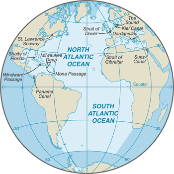

# Atlantic Ocean

## Introduction

**_Background:_**   
The Atlantic Ocean is the second largest of the world's five oceans (after the Pacific Ocean, but larger than the Indian Ocean, Southern Ocean, and Arctic Ocean). The Kiel Canal (Germany), Oresund (Denmark-Sweden), Bosporus (Turkey), Strait of Gibraltar (Morocco-Spain), and the Saint Lawrence Seaway (Canada-US) are important strategic access waterways. The decision by the International Hydrographic Organization in the spring of 2000 to delimit a fifth world ocean, the Southern Ocean, removed the portion of the Atlantic Ocean south of 60 degrees south latitude.

## Geography

**_Location:_**   
body of water between Africa, Europe, the Arctic Ocean, the Americas, and the Southern Ocean

**_Geographic coordinates:_**   
0 00 N, 25 00 W

**_Map references:_**   
Political Map of the World

**_Area:_**   
**total:** 76.762 million sq km   
**note:** includes Baltic Sea, Black Sea, Caribbean Sea, Davis Strait, Denmark Strait, part of the Drake Passage, Gulf of Mexico, Labrador Sea, Mediterranean Sea, North Sea, Norwegian Sea, almost all of the Scotia Sea, and other tributary water bodies

**_Area - comparative:_**   
slightly less than 6.5 times the size of the US

**_Coastline:_**   
111,866 km

**_Climate:_**   
tropical cyclones (hurricanes) develop off the coast of Africa near Cabo Verde and move westward into the Caribbean Sea; hurricanes can occur from May to December but are most frequent from August to November

**_Terrain:_**   
surface usually covered with sea ice in Labrador Sea, Denmark Strait, and coastal portions of the Baltic Sea from October to June; clockwise warm-water gyre (broad, circular system of currents) in the northern Atlantic, counterclockwise warm-water gyre in the southern Atlantic; the ocean floor is dominated by the Mid-Atlantic Ridge, a rugged north-south centerline for the entire Atlantic basin

**_Elevation extremes:_**   
**lowest point:** Milwaukee Deep in the Puerto Rico Trench -8,605 m   
**highest point:** sea level 0 m

**_Natural resources:_**   
oil and gas fields, fish, marine mammals (seals and whales), sand and gravel aggregates, placer deposits, polymetallic nodules, precious stones

**_Natural hazards:_**   
icebergs common in Davis Strait, Denmark Strait, and the northwestern Atlantic Ocean from February to August and have been spotted as far south as Bermuda and the Madeira Islands; ships subject to superstructure icing in extreme northern Atlantic from October to May; persistent fog can be a maritime hazard from May to September; hurricanes (May to December)

**_Environment - current issues:_**   
endangered marine species include the manatee, seals, sea lions, turtles, and whales; drift net fishing is hastening the decline of fish stocks and contributing to international disputes; municipal sludge pollution off eastern US, southern Brazil, and eastern Argentina; oil pollution in Caribbean Sea, Gulf of Mexico, Lake Maracaibo, Mediterranean Sea, and North Sea; industrial waste and municipal sewage pollution in Baltic Sea, North Sea, and Mediterranean Sea

**_Geography - note:_**   
major chokepoints include the Dardanelles, Strait of Gibraltar, access to the Panama and Suez Canals; strategic straits include the Strait of Dover, Straits of Florida, Mona Passage, The Sound (Oresund), and Windward Passage; the Equator divides the Atlantic Ocean into the North Atlantic Ocean and South Atlantic Ocean

## Economy

**_Economy - overview:_**   
The Atlantic Ocean provides some of the world's most heavily trafficked sea routes, between and within the Eastern and Western Hemispheres. Other economic activity includes the exploitation of natural resources, e.g., fishing, dredging of aragonite sands (The Bahamas), and production of crude oil and natural gas (Caribbean Sea, Gulf of Mexico, and North Sea).

## Transportation

**_Ports and terminals:_**   
**major seaport(s):** Alexandria (Egypt), Algiers (Algeria), Antwerp (Belgium), Barcelona (Spain), Buenos Aires (Argentina), Casablanca (Morocco), Colon (Panama), Copenhagen (Denmark), Dakar (Senegal), Gdansk (Poland), Hamburg (Germany), Helsinki (Finland), Las Palmas (Canary Islands, Spain), Le Havre (France), Lisbon (Portugal), London (UK), Marseille (France), Montevideo (Uruguay), Montreal (Canada), Naples (Italy), New Orleans (US), New York (US), Oran (Algeria), Oslo (Norway), Peiraiefs or Piraeus (Greece), Rio de Janeiro (Brazil), Rotterdam (Netherlands), Saint Petersburg (Russia), Stockholm (Sweden)

**_Transportation - note:_**   
Kiel Canal and Saint Lawrence Seaway are two important waterways; significant domestic commercial and recreational use of Intracoastal Waterway on central and south Atlantic seaboard and Gulf of Mexico coast of US; the International Maritime Bureau reports the territorial waters of littoral states and offshore Atlantic waters as high risk for piracy and armed robbery against ships, particularly in the Gulf of Guinea off West Africa; in 2012, 58 commercial vessels were attacked in the Gulf of Guinea with 10 hijacked and 207 crew members taken hostage; hijacked vessels are often disguised and cargoes stolen; crews have been robbed and stores or cargoes stolen

## Transnational Issues

**_Disputes - international:_**   
some maritime disputes (see littoral states)

