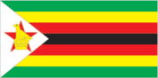
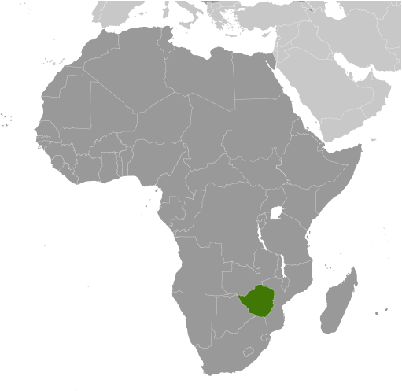
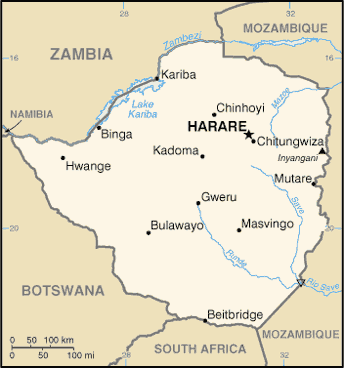

# Zimbabwe

## Introduction

**_Background:_**   
The UK annexed Southern Rhodesia from the [British] South Africa Company in 1923. A 1961 constitution was formulated that favored whites in power. In 1965 the government unilaterally declared its independence, but the UK did not recognize the act and demanded more complete voting rights for the black African majority in the country (then called Rhodesia). UN sanctions and a guerrilla uprising finally led to free elections in 1979 and independence (as Zimbabwe) in 1980. Robert MUGABE, the nation's first prime minister, has been the country's only ruler (as president since 1987) and has dominated the country's political system since independence. His chaotic land redistribution campaign, which began in 1997 and intensified after 2000, caused an exodus of white farmers, crippled the economy, and ushered in widespread shortages of basic commodities. Ignoring international condemnation, MUGABE rigged the 2002 presidential election to ensure his reelection. In April 2005, the capital city of Harare embarked on Operation Restore Order, ostensibly an urban rationalization program, which resulted in the destruction of the homes or businesses of 700,000 mostly poor supporters of the opposition. President MUGABE in June 2007 instituted price controls on all basic commodities causing panic buying and leaving store shelves empty for months; a period of increasing hyperinflation ensued. General elections held in March 2008 contained irregularities but still amounted to a censure of the ZANU-PF-led government with the opposition winning a majority of seats in parliament. MDC-T opposition leader Morgan TSVANGIRAI won the most votes in the presidential polls, but not enough to win outright. In the lead up to a run-off election in late June 2008, considerable violence enacted against opposition party members led to the withdrawal of TSVANGIRAI from the ballot. Extensive evidence of violence and intimidation resulted in international condemnation of the process. Difficult negotiations over a power-sharing "government of national unity," in which MUGABE remained president and TSVANGIRAI became prime minister, were finally settled in February 2009, although the leaders failed to agree upon many key outstanding governmental issues. MUGABE was reelected president in June 2013 in balloting that was severely flawed and internationally condemned. As a prerequisite to holding the elections, Zimbabwe enacted a new constitution by referendum, although many provisions in the new constitution have yet to be codified in law.

## Geography

**_Location:_**   
Southern Africa, between South Africa and Zambia

**_Geographic coordinates:_**   
20 00 S, 30 00 E

**_Map references:_**   
Africa

**_Area:_**   
**total:** 390,757 sq km   
**land:** 386,847 sq km   
**water:** 3,910 sq km

**_Area - comparative:_**   
slightly larger than Montana

**_Land boundaries:_**   
**total:** 3,066 km   
**border countries:** Botswana 813 km, Mozambique 1,231 km, South Africa 225 km, Zambia 797 km

**_Coastline:_**   
0 km (landlocked)

**_Maritime claims:_**   
none (landlocked)

**_Climate:_**   
tropical; moderated by altitude; rainy season (November to March)

**_Terrain:_**   
mostly high plateau with higher central plateau (high veld); mountains in east

**_Elevation extremes:_**   
**lowest point:** junction of the Runde and Save Rivers 162 m   
**highest point:** Inyangani 2,592 m

**_Natural resources:_**   
coal, chromium ore, asbestos, gold, nickel, copper, iron ore, vanadium, lithium, tin, platinum group metals

**_Land use:_**   
**arable land:** 10.49%   
**permanent crops:** 0.31%   
**other:** 89.2% (2011)

**_Irrigated land:_**   
1,735 sq km (2003)

**_Total renewable water resources:_**   
20 cu km (2011)

**_Freshwater withdrawal (domestic/industrial/agricultural):_**   
**total:** 4.21 cu km/yr (14%/7%/79%)   
**per capita:** 333.5 cu m/yr (2002)

**_Natural hazards:_**   
recurring droughts; floods and severe storms are rare

**_Environment - current issues:_**   
deforestation; soil erosion; land degradation; air and water pollution; the black rhinoceros herd - once the largest concentration of the species in the world - has been significantly reduced by poaching; poor mining practices have led to toxic waste and heavy metal pollution

**_Environment - international agreements:_**   
**party to:** Biodiversity, Climate Change, Desertification, Endangered Species, Law of the Sea, Ozone Layer Protection   
**signed, but not ratified:** none of the selected agreements

**_Geography - note:_**   
landlocked; the Zambezi forms a natural riverine boundary with Zambia; in full flood (February-April) the massive Victoria Falls on the river forms the world's largest curtain of falling water; Lake Kariba on the Zambia-Zimbabwe border forms the world's largest reservoir by volume (180 cu km; 43 cu mi)

## People and Society

**_Nationality:_**   
**noun:** Zimbabwean(s)   
**adjective:** Zimbabwean

**_Ethnic groups:_**   
African 98% (Shona 82%, Ndebele 14%, other 2%), mixed and Asian 1%, white less than 1%

**_Languages:_**   
English (official), Shona, Sindebele (the language of the Ndebele, sometimes called Ndebele), numerous but minor tribal dialects

**_Religions:_**   
syncretic (part Christian, part indigenous beliefs) 50%, Christian 25%, indigenous beliefs 24%, Muslim and other 1%

**_Population:_**   
13,771,721   
**note:** estimates for this country explicitly take into account the effects of excess mortality due to AIDS; this can result in lower life expectancy, higher infant mortality, higher death rates, lower population growth rates, and changes in the distribution of population by age and sex than would otherwise be expected (July 2014 est.)

**_Age structure:_**   
**0-14 years:** 38.4% (male 2,670,642/female 2,615,440)   
**15-24 years:** 22.1% (male 1,527,964/female 1,520,255)   
**25-54 years:** 32.3% (male 2,298,355/female 2,153,659)   
**55-64 years:** 3.6% (male 180,554/female 318,410)   
**65 years and over:** 3.6% (male 193,385/female 293,057) (2014 est.)

**_Dependency ratios:_**   
**total dependency ratio:** 74.8 %   
**youth dependency ratio:** 68.1 %   
**elderly dependency ratio:** 6.7 %   
**potential support ratio:** 14.9 (2014 est.)

**_Median age:_**   
**total:** 20.2 years   
**male:** 19.9 years   
**female:** 20.4 years (2014 est.)

**_Population growth rate:_**   
4.36% (2014 est.)

**_Birth rate:_**   
32.47 births/1,000 population (2014 est.)

**_Death rate:_**   
10.62 deaths/1,000 population (2014 est.)

**_Net migration rate:_**   
21.78 migrant(s)/1,000 population   
**note:** there is an increasing flow of Zimbabweans into South Africa and Botswana in search of better economic opportunities (2014 est.)

**_Urbanization:_**   
**urban population:** 38.6% of total population (2011)   
**rate of urbanization:** 3.4% annual rate of change (2010-15 est.)

**_Major urban areas - population:_**   
HARARE (capital) 1.542 million (2011)

**_Sex ratio:_**   
**at birth:** 1.03 male(s)/female   
**0-14 years:** 1.02 male(s)/female   
**15-24 years:** 1.01 male(s)/female   
**25-54 years:** 1.07 male(s)/female   
**55-64 years:** 1 male(s)/female   
**65 years and over:** 0.7 male(s)/female   
**total population:** 0.95 male(s)/female (2014 est.)

**_Mother's mean age at first birth:_**   
20.5   
**note:** median age at first birth among women 25-29 (2010-11 est.)

**_Maternal mortality rate:_**   
570 deaths/100,000 live births (2010)

**_Infant mortality rate:_**   
**total:** 26.55 deaths/1,000 live births   
**male:** 28.88 deaths/1,000 live births   
**female:** 24.15 deaths/1,000 live births (2014 est.)

**_Life expectancy at birth:_**   
**total population:** 55.68 years   
**male:** 55.4 years   
**female:** 55.97 years (2014 est.)

**_Total fertility rate:_**   
3.56 children born/woman (2014 est.)

**_Contraceptive prevalence rate:_**   
58.5% (2010/11)

**_Physicians density:_**   
0.06 physicians/1,000 population (2009)

**_Hospital bed density:_**   
1.7 beds/1,000 population (2011)

**_Drinking water source:_**   
**improved:** urban: 97.3% of population; rural: 68.7% of population; total: 79.9% of population   
**unimproved:** urban: 2.7% of population; rural: 31.3% of population; total: 20.1% of population (2012 est.)

**_Sanitation facility access:_**   
**improved:** urban: 51.6% of population; rural: 32.4% of population; total: 39.9% of population   
**unimproved:** urban: 48.4% of population; rural: 67.6% of population; total: 60.1% of population (2012 est.)

**_HIV/AIDS - adult prevalence rate:_**   
14.7% (2012 est.)

**_HIV/AIDS - people living with HIV/AIDS:_**   
1,368,100 (2012 est.)

**_HIV/AIDS - deaths:_**   
39,500 (2012 est.)

**_Major infectious diseases:_**   
**degree of risk:** very high   
**food or waterborne diseases:** bacterial and protozoal diarrhea, hepatitis A, and typhoid fever   
**vectorborne diseases:** malaria and dengue fever   
**water contact disease:** schistosomiasis   
**animal contact disease:** rabies (2013)

**_Obesity - adult prevalence rate:_**   
7% (2008)

**_Children under the age of 5 years underweight:_**   
10.1% (2011)

**_Education expenditures:_**   
2.5% of GDP (2010)

**_Literacy:_**   
**definition:** age 15 and over can read and write English   
**total population:** 83.6%   
**male:** 87.8%   
**female:** 80.1% (2011 est.)

**_School life expectancy (primary to tertiary education):_**   
**total:** 9 years   
**male:** 10 years   
**female:** 9 years (2003)

**_Unemployment, youth ages 15-24:_**   
**total:** 7.6%   
**male:** 7.6%   
**female:** 7.6% (2004)

## Government

**_Country name:_**   
**conventional long form:** Republic of Zimbabwe   
**conventional short form:** Zimbabwe   
**former:** Southern Rhodesia, Rhodesia

**_Government type:_**   
parliamentary democracy

**_Capital:_**   
**name:** Harare   
**geographic coordinates:** 17 49 S, 31 02 E   
**time difference:** UTC+2 (7 hours ahead of Washington, DC, during Standard Time)

**_Administrative divisions:_**   
8 provinces and 2 cities\* with provincial status; Bulawayo\*, Harare\*, Manicaland, Mashonaland Central, Mashonaland East, Mashonaland West, Masvingo, Matabeleland North, Matabeleland South, Midlands

**_Independence:_**   
18 April 1980 (from the UK)

**_National holiday:_**   
Independence Day, 18 April (1980)

**_Constitution:_**   
previous 1979; latest approved by referendum 16 March 2013, approved by Parliament 9 May 2013 (2013)

**_Legal system:_**   
mixed legal system of English common law, Roman-Dutch civil law, and customary law

**_International law organization participation:_**   
has not submitted an ICJ jurisdiction declaration; non-party state to the ICCt

**_Suffrage:_**   
18 years of age; universal

**_Executive branch:_**   
**chief of state:** Executive President Robert Gabriel MUGABE (since 31 December 1987); Vice President Joice MUJURU (since 6 December 2004)   
**head of government:** Executive President Robert Gabriel MUGABE (since 31 December 1987) note - according to the new constitution, following the 31 July 2013 presidential elections the position of Prime Minister was abolished   
**cabinet:** Cabinet appointed by the president; responsible to the House of Assembly   
**elections:** presidential candidates nominated with a nomination paper signed by at least 10 registered voters (at least one from each province) and elected by popular vote for a five-year term (no term limits); elections last held on 31 July 2013 (next to be held in 2018); co-vice presidents drawn from party leadership   
**election results:** Robert Gabriel MUGABE reelected president; percent of vote - Robert Gabriel MUGABE 61.1%, Morgan TSVANGIRAI 34.4%, Welshman NCUBE 2.7% other 1.8%; note - the election process was considered flawed and roundly criticised by election monitors and international bodies; both the AU and the SADC endoresed the results of the election with some concerns

**_Legislative branch:_**   
bicameral Parliament consists of a Senate (80 seats - 60 members elected by popular vote for a five-year term, 18 traditional chiefs elected by the Council of Chiefs and 2 seats reserved for people with disabilities) and a House of Assembly (270 seats - members elected by popular vote for five-year terms and 60 seats reserved for women who are identified by their parties and nominated by proportional representation)   
**elections:** last held on 31 July 2013 (next to be held in 2018)   
**election results:** Senate - percent of vote by party - NA; seats by party - ZANU-PF 37 MD-T 21, MDC-N 2, chiefs 18, people with disabilities 2; House of Assembly - percent of vote by party - NA; seats by party - ZANU-PF 197, MDC-T 70, MDC-N 2, independent 1

**_Judicial branch:_**   
**highest court(s):** Supreme Court (consists of the chief justice and 4 judges)   
**judge selection and term of office:** Supreme Court judges appointed by the president upon recommendation of the Judicial Service Commission, an independent body consisting of the chief justice, Public Service Commission chairman, attorney general, and 2-3 members appointed by the president; judges normally serve until age 65, but can elect to serve until age 70   
**subordinate courts:** High Court, regional magistrate courts, and special courts

**_Political parties and leaders:_**   
African National Party or ANP [Egypt DZINEMUNHENZVA]   
Movement for Democratic Change - Tsvangirai or MDC-T [Morgan TSVANGIRAI]   
Movement for Democratic Change - Ncube or MDC-N [Welshman NCUBE]   
Peace Action is Freedom for All or PAFA   
United Parties [Abel MUZOREWA]   
United People's Party or UPP [Daniel SHUMBA]   
Zimbabwe African National Union-Ndonga or ZANU-Ndonga [Wilson KUMBULA]   
Zimbabwe African National Union-Patriotic Front or ZANU-PF [Robert Gabriel MUGABE]   
Zimbabwe African Peoples Union or ZAPU [Dumiso DABENGWA]   
Zimbabwe Youth in Alliance or ZIYA

**_Political pressure groups and leaders:_**   
Crisis in Zimbabwe Coalition   
National Constitutional Assembly or NCA [Lovemore MADHUKU]   
Women of Zimbabwe Arise or WOZA [Jenni WILLIAMS]   
Zimbabwe Congress of Trade Unions or ZCTU [Wellington CHIBEBE]

**_International organization participation:_**   
ACP, AfDB, AU, COMESA, FAO, G-15, G-77, IAEA, IBRD, ICAO, ICRM, IDA, IFAD, IFC, IFRCS, ILO, IMF, IMO, Interpol, IOC, IOM, IPU, ISO, ITSO, ITU, ITUC (NGOs), MIGA, NAM, OPCW, PCA, SADC, UN, UNAMID, UNCTAD, UNESCO, UNIDO, UNISFA, UNMIL, UNMISS, UNOCI, UNWTO, UPU, WCO, WFTU (NGOs), WHO, WIPO, WMO, WTO

**_Diplomatic representation in the US:_**   
**chief of mission:** Ambassador (vacant); Charge d'Affaires Richard CHIBUWE (since April 2014)   
**chancery:** 1608 New Hampshire Avenue NW, Washington, DC 20009   
**telephone:** [1] (202) 332-7100   
**FAX:** [1] (202) 483-9326

**_Diplomatic representation from the US:_**   
**chief of mission:** Ambassador David Bruce WHARTON (since 15 November 2012)   
**embassy:** 172 Herbert Chitepo Avenue, Harare   
**mailing address:** P. O. Box 3340, Harare   
**telephone:** [263] (4) 250-593 through 250-594   
**FAX:** [263] (4) 796-488, or 722-618

**_Flag description:_**   
seven equal horizontal bands of green, yellow, red, black, red, yellow, and green with a white isosceles triangle edged in black with its base on the hoist side; a yellow Zimbabwe bird representing the long history of the country is superimposed on a red five-pointed star in the center of the triangle, which symbolizes peace; green represents agriculture, yellow mineral wealth, red the blood shed to achieve independence, and black stands for the native people

**_National symbol(s):_**   
Zimbabwe bird symbol, African fish eagle, flame lily

**_National anthem:_**   
**name:** "Kalibusiswe Ilizwe leZimbabwe" [Northern Ndebele language] "Simudzai Mureza WeZimbabwe" [Shona] (Blessed Be the Land of Zimbabwe)   
**lyrics/music:** Solomon MUTSWAIRO/Fred Lecture CHANGUNDEGA   
**note:** adopted 1994

## Economy

**_Economy - overview:_**   
Zimbabwe's economy is growing despite continuing political uncertainty. Following a decade of contraction from 1998 to 2008, Zimbabwe's economy recorded real growth of roughly 10% per year in 2010-11, before slowing in 2012-13 due poor harvests and low diamond revenues. The government of Zimbabwe faces a number of difficult economic problems, including infrastructure and regulatory deficiencies, ongoing indigenization pressure, policy uncertainty, a large external debt burden, and insufficient formal employment. Until early 2009, the Reserve Bank of Zimbabwe routinely printed money to fund the budget deficit, causing hyperinflation. Dollarization in early 2009 - which allowed currencies such as the Botswana pula, the South Africa rand, and the US dollar to be used locally - ended hyperinflation and reduced inflation below 10% per year, but exposed structural weaknesses that continue to inhibit broad-based growth.

**_GDP (purchasing power parity):_**   
$7.496 billion (2013 est.)   
$7.265 billion (2012 est.)   
$6.957 billion (2011 est.)   
**note:** data are in 2013 US dollars

**_GDP (official exchange rate):_**   
$10.48 billion (2013 est.)

**_GDP - real growth rate:_**   
3.2% (2013 est.)   
4.4% (2012 est.)   
10.6% (2011 est.)

**_GDP - per capita (PPP):_**   
$600 (2013 est.)   
$600 (2012 est.)   
$500 (2011 est.)   
**note:** data are in 2013 US dollars

**_GDP - composition, by end use:_**   
**household consumption:** 68.5%   
**government consumption:** 30.4%   
**investment in fixed capital:** 22.2%   
**exports of goods and services:** 68.4%   
**imports of goods and services:** -89.4%; (2013 est.)

**_GDP - composition, by sector of origin:_**   
**agriculture:** 20.1%   
**industry:** 25.4%   
**services:** 54.5% (2013 est.)

**_Agriculture - products:_**   
corn, cotton, tobacco, wheat, coffee, sugarcane, peanuts; sheep, goats, pigs

**_Industries:_**   
mining (coal, gold, platinum, copper, nickel, tin, diamonds, clay, numerous metallic and nonmetallic ores), steel; wood products, cement, chemicals, fertilizer, clothing and footwear, foodstuffs, beverages

**_Industrial production growth rate:_**   
3.7% (2013 est.)

**_Labor force:_**   
3.939 million (2013 est.)

**_Labor force - by occupation:_**   
**agriculture:** 66%   
**industry:** 10%   
**services:** 24% (1996)

**_Unemployment rate:_**   
95% (2009 est.)   
80% (2005 est.)   
**note:** figures include unemployment and underemployment; true unemployment is unknown and, under current economic conditions, unknowable

**_Population below poverty line:_**   
68% (2004)

**_Household income or consumption by percentage share:_**   
**lowest 10%:** 2%   
**highest 10%:** 40.4% (1995)

**_Distribution of family income - Gini index:_**   
50.1 (2006)   
50.1 (1995)

**_Budget:_**   
**revenues:** $NA   
**expenditures:** $NA (2013 est.)

**_Taxes and other revenues:_**   
NA% of GDP

**_Budget surplus (+) or deficit (-):_**   
NA% of GDP

**_Public debt:_**   
202.4% of GDP (2013 est.)   
244.2% of GDP (2012 est.)

**_Fiscal year:_**   
calendar year

**_Inflation rate (consumer prices):_**   
8.5% (2013 est.)   
8.2% (2012 est.)

**_Central bank discount rate:_**   
7.17% (31 December 2010 est.)   
975% (31 December 2007)

**_Commercial bank prime lending rate:_**   
28% (31 December 2013 est.)   
30% (31 December 2012 est.)

**_Stock of narrow money:_**   
$23.03 billion (31 December 2013 est.)   
$12.27 billion (31 December 2012 est.)   
**note:** Zimbabwe's central bank no longer publishes data on monetary aggregates, except for bank deposits, which amounted to $2.1 billion in November 2010; the Zimbabwe dollar stopped circulating in early 2009; since then, the US dollar and South African rand have been the most frequently used currencies; there are no reliable estimates of the amount of foreign currency circulating in Zimbabwe

**_Stock of broad money:_**   
$22.7 billion (31 December 2012 est.)   
$47.61 billion (31 December 2013 est.)

**_Stock of domestic credit:_**   
$14.06 billion (31 December 2013 est.)   
$9.844 billion (31 December 2012 est.)

**_Market value of publicly traded shares:_**   
$NA (31 December 2012 est.)   
$10.9 billion (31 December 2011)   
$11.48 billion (31 December 2010 est.)

**_Current account balance:_**   
-$576 million (2013 est.)   
-$416.5 million (2012 est.)

**_Exports:_**   
$3.144 billion (2013 est.)   
$3.314 billion (2012 est.)

**_Exports - commodities:_**   
platinum, cotton, tobacco, gold, ferroalloys, textiles/clothing

**_Exports - partners:_**   
China 21.1%, South Africa 15.1%, Democratic Republic of the Congo 12.1%, Botswana 10.8%, Italy 4.6% (2012)

**_Imports:_**   
$4.571 billion (2013 est.)   
$4.569 billion (2012 est.)

**_Imports - commodities:_**   
machinery and transport equipment, other manufactures, chemicals, fuels, food products

**_Imports - partners:_**   
South Africa 51.9%, China 10% (2012)

**_Reserves of foreign exchange and gold:_**   
$437 million (31 December 2013 est.)   
$575.6 million (31 December 2012 est.)

**_Debt - external:_**   
$8.445 billion (31 December 2013 est.)   
$8.765 billion (31 December 2012 est.)

**_Stock of direct foreign investment - at home:_**   
$NA

**_Stock of direct foreign investment - abroad:_**   
$NA

**_Exchange rates:_**   
Zimbabwean dollars (ZWD) per US dollar -   
234.25 (2010)   
234.25 (2009)   
9,686.8 (2007)   
**note:** the dollar was adopted as a legal currency in 2009; since then the Zimbabwean dollar has experienced hyperinflation and is essentially worthless

## Energy

**_Electricity - production:_**   
7.808 billion kWh (2010 est.)

**_Electricity - consumption:_**   
12.57 billion kWh (2010 est.)

**_Electricity - exports:_**   
56 million kWh (2010 est.)

**_Electricity - imports:_**   
5.338 billion kWh (2010 est.)

**_Electricity - installed generating capacity:_**   
2.035 million kW (2010 est.)

**_Electricity - from fossil fuels:_**   
66.6% of total installed capacity (2010 est.)

**_Electricity - from nuclear fuels:_**   
0% of total installed capacity (2010 est.)

**_Electricity - from hydroelectric plants:_**   
33.4% of total installed capacity (2010 est.)

**_Electricity - from other renewable sources:_**   
0% of total installed capacity (2010 est.)

**_Crude oil - production:_**   
120 bbl/day (2012 est.)

**_Crude oil - exports:_**   
0 bbl/day (2010 est.)

**_Crude oil - imports:_**   
0 bbl/day (2010 est.)

**_Crude oil - proved reserves:_**   
0 bbl (1 January 2013 est.)

**_Refined petroleum products - production:_**   
0 bbl/day (2010 est.)

**_Refined petroleum products - consumption:_**   
19,030 bbl/day (2011 est.)

**_Refined petroleum products - exports:_**   
0 bbl/day (2010 est.)

**_Refined petroleum products - imports:_**   
13,290 bbl/day (2010 est.)

**_Natural gas - production:_**   
0 cu m (2011 est.)

**_Natural gas - consumption:_**   
0 cu m (2010 est.)

**_Natural gas - exports:_**   
0 cu m (2011 est.)

**_Natural gas - imports:_**   
0 cu m (2011 est.)

**_Natural gas - proved reserves:_**   
0 cu m (1 January 2013 est.)

**_Carbon dioxide emissions from consumption of energy:_**   
8.875 million Mt (2011 est.)

## Communications

**_Telephones - main lines in use:_**   
301,600 (2012)

**_Telephones - mobile cellular:_**   
12.614 million (2012)

**_Telephone system:_**   
**general assessment:** system was once one of the best in Africa, but now suffers from poor maintenance   
**domestic:** consists of microwave radio relay links, open-wire lines, radiotelephone communication stations, fixed wireless local loop installations, and a substantial mobile-cellular network; Internet connection is available in Harare and planned for all major towns and for some of the smaller ones   
**international:** country code - 263; satellite earth stations - 2 Intelsat; 2 international digital gateway exchanges (in Harare and Gweru) (2010)

**_Broadcast media:_**   
government owns all local radio and TV stations; foreign shortwave broadcasts and satellite TV are available to those who can afford antennas and receivers; in rural areas, access to TV broadcasts is extremely limited (2007)

**_Internet country code:_**   
.zw

**_Internet hosts:_**   
30,615 (2012)

**_Internet users:_**   
1.423 million (2009)

## Transportation

**_Airports:_**   
196 (2013)

**_Airports - with paved runways:_**   
**total:** 17   
**over 3,047 m:** 3   
**2,438 to 3,047 m:** 2   
**1,524 to 2,437 m:** 5   
**914 to 1,523 m:** 7 (2013)

**_Airports - with unpaved runways:_**   
**total:** 179   
**1,524 to 2,437 m:** 3   
**914 to 1,523 m:** 104   
**under 914 m:** 72 (2013)

**_Pipelines:_**   
refined products 270 km (2013)

**_Railways:_**   
**total:** 3,427 km   
**narrow gauge:** 3,427 km 1.067-m gauge (313 km electrified) (2008)

**_Roadways:_**   
**total:** 97,267 km   
**paved:** 18,481 km   
**unpaved:** 78,786 km (2002)

**_Waterways:_**   
(some navigation possible on Lake Kariba) (2011)

**_Ports and terminals:_**   
**river port(s):** Binga, Kariba (Zambezi)

## Military

**_Military branches:_**   
Zimbabwe Defense Forces (ZDF): Zimbabwe National Army (ZNA), Air Force of Zimbabwe (AFZ) (2012)

**_Military service age and obligation:_**   
18-24 years of age for voluntary military service; no conscription; women are eligible to serve (2012)

**_Manpower available for military service:_**   
**males age 16-49:** 2,616,051   
**females age 16-49:** 2,868,376 (2010 est.)

**_Manpower fit for military service:_**   
**males age 16-49:** 1,528,166   
**females age 16-49:** 1,646,041 (2010 est.)

**_Manpower reaching militarily significant age annually:_**   
**male:** 154,870   
**female:** 152,550 (2010 est.)

**_Military expenditures:_**   
2.94% of GDP (2012)   
2.05% of GDP (2011)   
2.94% of GDP (2010)

## Transnational Issues

**_Disputes - international:_**   
Namibia has supported, and in 2004 Zimbabwe dropped objections to, plans between Botswana and Zambia to build a bridge over the Zambezi River, thereby de facto recognizing a short, but not clearly delimited, Botswana-Zambia boundary in the river; South Africa has placed military units to assist police operations along the border of Lesotho, Zimbabwe, and Mozambique to control smuggling, poaching, and illegal migration

**_Refugees and internally displaced persons:_**   
**IDPs:** (political violence, human rights violations, land reform, and economic collapse) (2013)

**_Trafficking in persons:_**   
**current situation:** Zimbabwe is a source, transit, and destination country for men, women, and children subjected to forced labor and sex trafficking; Zimbabwean women and girls from towns bordering South Africa, Mozambique, and Zambia are subjected to prostitution, sometimes being sold by their parents; Zimbabwean men, women, and children are subjected to forced labor in agriculture and domestic service in rural areas, as well as domestic servitude and sex trafficking in cities and towns; Zimbabwean women and men are lured into exploitative labor situations in Angola, Botswana, Mozambique, the United Arab Emirates, Malaysia, Nigeria, and South Africa with false job offers, while women and girls are lured to China, Egypt, the UK, and Canada and forced into prostitution; adults and children from Bangladesh, Somalia, India, Pakistan, the Democratic Republic of the Congo, Malawi, Mozambique, and Zambia are trafficked through Zimbabwe en route to South Africa   
**tier rating:** Tier 3 - Zimbabwe does not fully comply with the minimum standards for the elimination of trafficking and is not making significant efforts to do so; tangible efforts to investigate and prosecute trafficking offenses, including those allegedly involving government officials, and to protect victims remain minimal; the government continues to rely on an international organization to provide law enforcement training and on NGOs to identify and assist victims without government support for such work; a national trafficking awareness campaign was launched in November 2012 (2013)

**_Illicit drugs:_**   
transit point for cannabis and South Asian heroin, mandrax, and methamphetamines en route to South Africa

............................................................   
_Page last updated on June 20, 2014_
